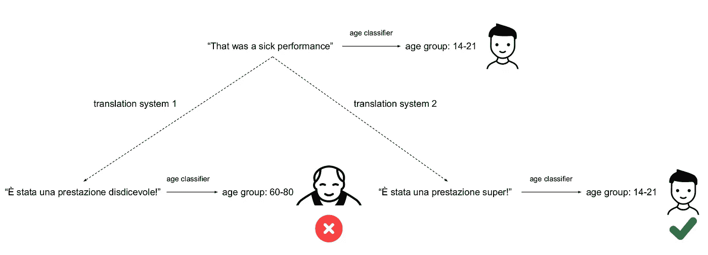
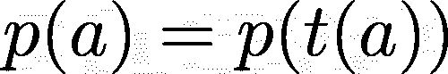
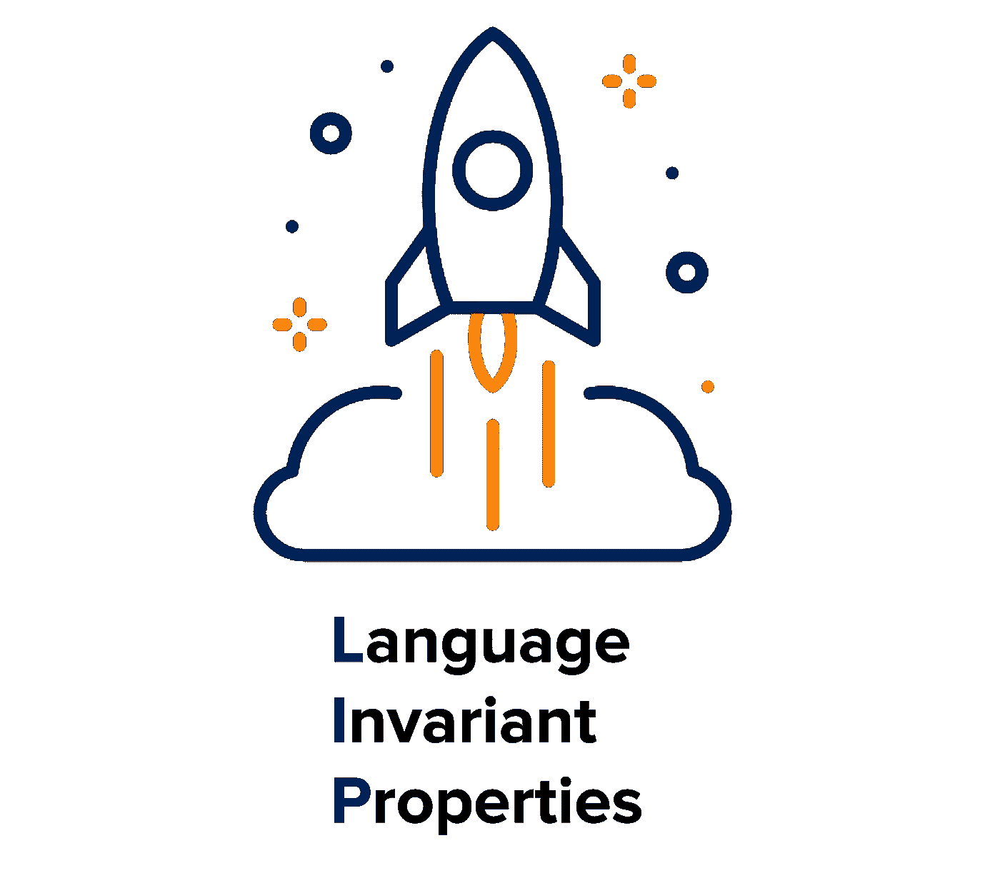
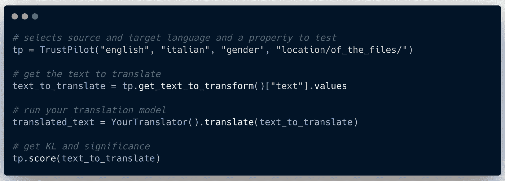
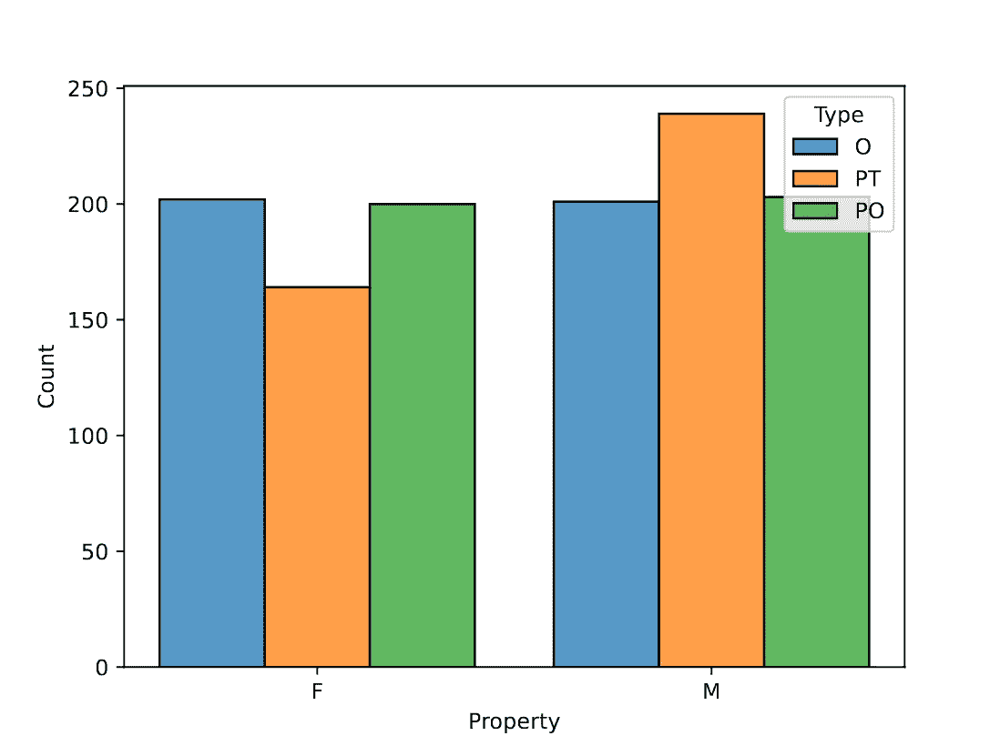

# 自然语言处理中的语言不变性

> 原文：<https://towardsdatascience.com/language-invariant-properties-in-natural-language-processing-561e04b5fa0d?source=collection_archive---------15----------------------->

## [思想和理论](https://towardsdatascience.com/tagged/thoughts-and-theory)

## 将消息转换(例如翻译)为另一种语言时，文本属性会保留吗？

当你转换一个文本(例如，翻译，解释，总结)时，你希望你的信息的一般属性在输入和输出之间保持不变。例如，你希望你的信息即使被翻译成另一种语言也能让人感到愉快。

如果不这样做，就会出现问题。例如，一名巴勒斯坦男子[被逮捕](https://www.theguardian.com/technology/2017/oct/24/facebook-palestine-israel-translates-good-morning-attack-them-arrest)，因为他在脸书上的帖子被错误地从“早上好！”去“攻击他们”。

这篇博文描述了我们的[新论文](https://arxiv.org/abs/2109.13037)的主题:

费德里科·比安奇，德博拉·诺扎，德克·霍维(2022)。**自然语言处理中的语言不变性。**NLP 中高效标杆管理的第一次研讨会记录。

语言不变属性(简称 LIPs)是不应受转换影响的语言属性。作为另一个例子，解释文本应该产生具有相同情感效价的文本:我们不想让一个**快乐的**信息**悲伤的**。因此，在开发文本转换算法时，我们需要考虑和控制这个属性。
我们引入了不应受任何转换影响的属性的概念，以及可用于评估该问题的 [python 包](https://github.com/MilaNLProc/language-invariant-properties)。

# 语言不变属性

## 翻译让你听起来更老，更男性化

让我们从我们最近的一篇论文中的一个实际例子开始:[“你听起来就像你的父亲”商业机器翻译系统包括文体偏见。](https://aclanthology.org/2020.acl-main.154/) (ACL 2020)。

我们发现，在翻译(例如，从德语到英语)后，大量消息被预测为男性(比我们在原始数据中看到的更多)。我们发现年龄也有类似的影响:信息听起来更老。

翻译不应该改变说话者的人口统计。翻译系统 1 让你听起来更老。图片作者。

## 语言不变属性

说话者人口统计数据**不应该**受到翻译的影响。那么现在我们来谈谈我们[的新论文](https://arxiv.org/abs/2109.13037):《自然语言中的语言不变性》。

上面的讨论使我们认识到，有必要更好地定义那些改变文本表面形式的转换方法(例如，转述、摘要)不应该影响什么。

我们称那些在转换后不应该改变的属性为语言不变属性( **LIPs** )(如前所述，这可以是翻译、释义或摘要)。

可能有许多嘴唇，但重要的是**意味着**和**说话者人口统计。转变不应该影响信息，如果你 26 岁，你不希望你的信息听起来像是 87 岁的人写的。**

## **更正式的定义**

假设存在所有可能说出的句子的集合。让我们将 **A** 和 **B** 定义为 **S** 的子集。出于我们的目的，这两个集合可以使用相同或不同的语言。现在让我们介绍下面的映射函数:

也就是说，我们可以认为 *t* 是将文本 A 的表面形式转换成 B 的转换(如果转换是翻译，该函数会将一种语言的句子翻译成另一种语言)。

一个**语言属性** *p* 是一个将 S 的元素映射到一组 P 属性值的函数。p 是不变的当且仅当

这意味着对 a 应用函数 *t* 不会改变属性 *p.* 的值

## 评估嘴唇

我们如何评价这一点？嗯，这比你想象的要简单:

让我们再从上面的例子开始。我们从一个数据集开始，用户用英语、荷兰语、意大利语、法语、德语用男女二元性别和年龄自我认同。我们训练了特定语言的年龄和性别分类器，这意味着对于每种语言的每篇文本，我们现在可以预测年龄和性别。

然后，我们可以使用一堆商业机器翻译工具来翻译我们数据集的测试部分(姑且称之为 **O** )(例如，我们将测试文本从荷兰语翻译成英语)。特别是我们用了谷歌翻译，微软翻译和 DeepL。

现在我们已经翻译了数据，我们对原始的 **O** 数据和翻译的数据集使用我们的分类器(荷兰语和英语)。因此，我们获得了对原始数据**P0**和翻译数据 **PT** 的预测。
研究这两个预测集( **PO** 和 **PT** )与原始数据集( **O** )之间的差异，就可以了解年龄和性别在转换后是否被保留。如果 **PO** 具有类似于 **O** 的分布，而 **PT** 没有，我们可能会发现一些偏差。

上述设置可用于评估许多不同的嘴唇。只要有足够的数据来训练特定于语言的分类器，就可以使用内部工具来应用转换并检查分布之间是否有任何显著的差异。

# 嘴唇框架

我们已经建立了一个框架来测试和验证嘴唇是否会受到变形的影响。可以在 [GitHub](https://github.com/MilaNLProc/language-invariant-properties) 上找到。

我们框架的标志。

API，到目前为止，仍然有点不稳定，但是我们正在努力使它变得更加稳定。但是一般的前端 API 应该不会有太大的变化。

我们试图让它尽可能容易使用。只要您有自己的转换方法(例如，翻译模型)，您就可以很容易地从您的模型中获得分数(根据 KL 散度和显著性效应)。

测试性别唇所需的代码。图片来自 Carbon，作者制作。

该框架还为您提供了原始的预测分布图。这是我们在一个数据集上运行的一个实验，这个数据集有自我注释的性别值。

o 是原始测试数据，PO 是分类器对原始数据的预测。PT 是分类器对转换数据的预测。我们可以看到，在转换之后，许多消息被识别为来自男性用户，这表明转换在分布中引入了偏差。

尝试一种解释算法。o 是原始测试数据，PO 是分类器对原始数据的预测。PT 是分类器对转换数据的预测。我们可以看到，在转换之后，许多消息被识别为来自男性用户，这表明转换在分布中引入了偏差。图片作者。

# 限制

LIPs 是一个有趣的理论概念，但是它们可能并不总是推广到任务。例如，从西班牙语翻译到日语必须考虑两个国家的文化差异，这可能无法简化为一套嘴唇。

我们实现的工具有一些限制。我们不能完全消除分类器中习得的偏见。我们总是假设当有两个分类器时，这两个分类器在两种语言上都可靠地运行良好，以比较输出。这同样适用于释义:我们假设 LIP 分类器在原始文本和转换后的文本上表现得一样好。

# 结论

我们相信 LIPs 有助于更好地理解转化方法的工作原理。在这个领域中，我们已经达到了这样一个点，即这些方法足以可靠地转换一般信息(例如，Google Translate 对于许多用例来说已经足够好了)；然而，在转换过程中不保持嘴唇固定会产生误解。

感谢您阅读我们的作品！你可以在[论文](https://arxiv.org/abs/2109.13037)中找到更多关于这个的信息！如果您有任何问题，请随时联系我们！请随意在[推特](https://twitter.com/federicobianchy)上联系。

# 承认

感谢德克和黛博拉对此的编辑和评论！