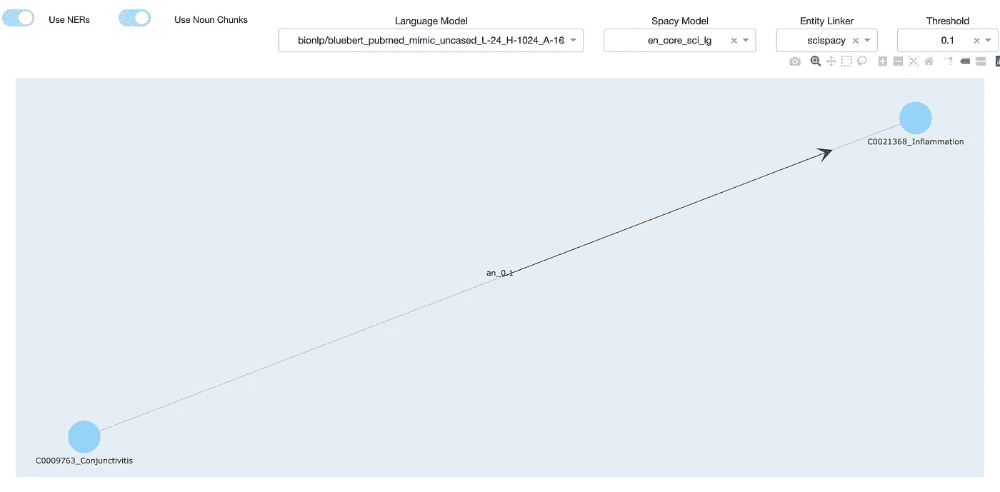

# 语言模型是开放的知识图..但对我来说很难！

> 原文：<https://towardsdatascience.com/language-models-are-open-knowledge-graphs-but-are-hard-to-mine-13e128f3d64d?source=collection_archive---------7----------------------->

## [入门](https://towardsdatascience.com/tagged/getting-started)

## 请和我一起深入研究关于使用基于 transformer 的语言模型创建知识图的最新研究论文

> 在本文中，我们将探讨关于利用基于 transformer 的语言模型从文本构建知识图的最新研究论文。我们将看到的论文名为“[语言模型是开放的知识图](https://arxiv.org/pdf/2010.11967v1.pdf)”，作者声称，“这篇论文展示了如何在没有人类监督的情况下，从预先训练的语言模型(例如，伯特，GPT-2/3)，**构建知识图**。”
> 
> 最后一部分，声称已经将人类从这个过程中移除，让我非常兴奋。话虽如此，我已经学会对这种说法持保留态度。我决定通过试验本文中提出的管道的各种组件来进一步探索这种方法。这个想法是为了理解管道中的每一步对特定领域示例的影响，并判断领域专家或数据科学家是否需要任何监督。

**注意**:我假设你对知识图和基于转换器的语言模型的概念有些熟悉。简而言之，如这里所说的“知识图(KG)表示实体的相互链接的描述的集合——真实世界的对象和事件，或者抽象概念(例如，文档)”。它允许我们将现实世界建模成一个图表，然后可以对其进行推理以断言关于世界的事实。要了解更多关于基于 transformer 的模型，请参考 Jay Alammar 的帖子[这里](http://jalammar.github.io/illustrated-transformer/)和[这里](http://jalammar.github.io/illustrated-bert/)。你也可以参考我的帖子“[超越与变形金刚的分类和拥抱脸](/beyond-classification-with-transformers-and-hugging-face-d38c75f574fb)”，在那里我深入研究了这些模型，尤其是注意机制，这是大部分“知识”的储存地。

***事不宜迟，我们开始吧！:)***

大多数领先的公司已经开始使用知识图(KG)来组织、管理和扩展关于他们业务的知识。虽然大多数企业在用来自各种结构化数据源的实例填充 kg 方面取得了很大进展，但是他们很难用来自文本等非结构化数据源的实例填充 kg。使用基于机器学习(ML)和自然语言处理(NLP)的技术从文本中提取和构建知识已经成为许多领先大学和研究人员关注的领域。让我们从下面的鸟瞰图开始，看看大多数研究人员通常遵循的方法。整个行业的流程非常标准，你可以找到许多出版物和演讲，但是我在这里找到了一个演讲(有点过时，但是非常简单和简洁):[演讲](https://youtu.be/CBvE3BNErgE)


图 1:用于为自动知识图填充生成三元组的典型管道(大部分是从在线谈话中推断出来的，像这样:[链接](https://youtu.be/CBvE3BNErgE)

如上图所示，这个过程从用元数据解析和丰富文本开始，比如 POS 标签、命名实体、依赖解析树等。下一步是识别文本中最有可能作为知识图中的实体的提及(即文本的部分)。这被称为提及检测。这然后通过实体链接器传递，实体链接器从目标 KG 中找到最可能的候选实体，然后通过在上面运行逻辑来消除歧义(这可以是 ML、查找字典、字符串匹配等。)，将每个提及映射到目标 KG 中的特定节点。最后一步是根据第一步完成的丰富和使用 ML、一阶逻辑或原始规则技术的实体，提出精心设计的语言特征，以提出最可能的关系。然后，已消除歧义的实体和关系被生成为输出三元组(例如，主语、谓语和宾语),以链接成图。

> 大多数这些方法的最大难点是它们需要技术专家的时间和精力，这些专家可能是数据科学家、语言学家和知识库开发人员。他们需要与领域专家密切合作，根据丰富的内容提出原始的语言特征，定义特定领域的字典和/或一阶逻辑，根据规模和复杂性，这可能需要几周或几个月的时间，并且由于领域中的大量变化，最终仍可能丢失信息。

# 利用语言模型构建知识图

最近，研究界已经开始探索如何利用深度学习来构建传统上由人类构建的语言特征。让我们来看一篇这样的论文——**语言模型是开放的知识图，作者是、小刘、宋晓。**网上有一些资源更详细地解释了这篇文章，但这篇文章也很容易阅读。我将试着从高层次上阅读这篇论文，然后将我们的注意力转向对他们提出的管道进行实验。

本文的主要思想是在从文本数据创建知识图的过程中尽量减少人类的参与。作者假设像 BERT 或 GPT2 这样的基于 transformer 的模型有能力学习和存储关于领域的知识，这些知识可以转换成结构化的知识图。他们继续在 TAC 知识库人口(KBP)数据集和 Wikidata 上测试这一点，并使用所提出的方法在 KG 人口上发表了令人鼓舞的结果。

提出的方法有两步**匹配&地图(妈妈)**。让我们看看这些是如何修改我们上面讨论的管道的:


图 2:在论文“语言模型是开放的知识图”中提出的高级“MaMa”过程流

这种方法与之前方法不同的地方是**使用注意力机制** **来推断文本中的候选三元组**。预先训练的基于变压器的模型在训练期间学习的注意力权重，为我们提供了对文本中各种术语之间关系的洞察。这些权重应用于标准库中的锚词(名词块)，如 [spaCy](https://spacy.io/) ，提供了可能的候选事实(头、关系、尾)，然后可以使用现成的实体链接器如 [REL](https://github.com/informagi/REL) 来消除歧义。

下面是一张直接取自论文的图表。它显示了匹配过程是如何通过运行 beam 搜索来查找具有最高总得分的三元组的。


来源:[https://arxiv.org/pdf/2010.11967.pdf](https://arxiv.org/pdf/2010.11967.pdf)

让我们更进一步，基于这里提供的代码(本文没有提供一些更小的细节)创建一个建议管道的粒度版本


图 3:详细的流程图，以较低的粒度显示了管道中的步骤

正如我们从上面的流程中看到的，管道不仅仅是通过 LM 运行句子。虽然 LM 可以帮助我们生成候选事实，但是调整管道的其他部分也同样重要。管道的所有其他部分都试图利用来自库的预训练模型，如 [spaCy](https://spacy.io/) 、 [REL](https://github.com/informagi/REL) 和 [Flair](https://github.com/flairNLP/flair) 。

# 实验

现在我们知道了论文作者试图实现的目标，让我们开始试验他们的管道，看看我们是否能在几个小样本上实现预期的结果。

我们将选择一个通用领域和医疗保健领域有重叠的例子:


来源:[https://www . survivor net . com/articles/did-you-know-Robert-de-Niro-is-15-years-cancer-free-now-hes-主演-爱尔兰人-获 2 项艾美奖提名/](https://www.survivornet.com/articles/did-you-know-robert-de-niro-is-15-years-cancer-free-now-hes-starring-in-the-irishman-nominated-for-2-emmys/)

第二个例子是特定于医疗保健的:


来源:[https://www . dph . Illinois . gov/topics-services/diseases-and-conditions/diseases-a-z-list/结膜炎](https://www.dph.illinois.gov/topics-services/diseases-and-conditions/diseases-a-z-list/conjunctivitis)

我们将通过使用他们的默认实现来开始实验，然后继续调整管道中的不同步骤，在进行的过程中可视化输出。

> 论文原码可以在这里找到:[原码](https://github.com/theblackcat102/language-models-are-knowledge-graphs-pytorch)
> 
> 我派生了 repo 并做了一些更改，即——使用 dash 运行和可视化输出的包装器，支持运行 scispaCy 命名的实体识别器(NER)和实体链接器，以及运行通过拥抱脸变形金刚库支持的不同语言模型的能力。这是我的[分叉回购](https://github.com/nidharap/language-models-are-knowledge-graphs-pytorch/tree/feature/UseNERWithNouns)的链接(当我添加更多东西进行实验时，它仍然在一个分支中，最终将被合并到主目录中)

# 1.现成的:

*   使用来自 spaCy 的 en_core_web_md 模型找到锚点术语的名词块
*   语言模型的 Bert-大格模型
*   REL 图书馆，用于链接到维基数据 2019 知识图的实体
*   许多人不知道演员劳勃·狄·尼诺的一件事——他因在电影《盗亦有道》和《出租车司机》中扮演许多臭名昭著的硬汉角色而闻名——那就是他是一名 15 年的癌症幸存者。德尼罗在 2003 年 60 岁时被诊断出患有前列腺癌。但多亏了定期的癌症筛查，他的医生及早发现了这种疾病，这位演员得到了迅速的治疗，并能够继续他多产的表演生涯。


图 4:第一句话(与 Robert Di Nero 相关)上运行的原始回购的默认配置

正如你所看到的，它只找到了一个三元组，并能够将其链接到维基百科实体:

**头**:“罗伯特 _ 德尼罗”，**关系**:“诊断”，**尾**:“前列腺癌”，**置信度** : 0.16

注意——你可以在实体前加上[**https://en.wikipedia.org/wiki**](https://en.wikipedia.org/wiki/Robert_De_Niro)**/**来浏览该实体的维基百科页面。例如:[**https://en.wikipedia.org/wiki/Prostate_cancer**](https://en.wikipedia.org/wiki/Prostate_cancer)

# 2.除了名词块之外，利用命名实体来识别锚文本(图 3 中的步骤 3)

作者使用 spaCy 中的名词块来识别锚词，然后用于查找三元组。我们看到开箱即用的实现只生成了一个三元组。大多数先前的研究在这个步骤中使用命名实体(*参见图 1 中的步骤 1，该步骤讨论了整个方法*)，所以让我们也使用命名实体识别器(NER)来辅助这个过程。让我们利用空间为我们提供命名实体，除了名词块(*我们删除任何重叠部分*)。让我们看看同一个句子会生成什么:


图 5:从 en_core_web_md 模型添加命名实体使我们能够使用相同的语言模型(bert-large-cased)来生成更多的三元组

正如我们所看到的，使用命名实体有相当大的影响，因为它能够生成更多的三元组。

*注意:你还可以看到，实体链接器(REL)尽最大努力识别各种提及的实体，事实上，我们有比需要更多的提及会导致噪音。比如说我们有“* ***【多人】*** *”这样一提，就消歧到了**[***【难忘 _(Nat _ King _ Cole _ song)***](https://en.wikipedia.org/wiki/Unforgettable_(Nat_King_Cole_song))***”，******”虽然我们还没有做出明确的努力从空间中过滤出特定的实体类型，但是我们可以基于用例需求来这样做，这应该会删除许多不需要的提及，从而删除关系。这些是用例必须做出的典型的成本收益权衡。****

**现在，让我们尝试将它用于医疗保健领域的特定示例:**

***结膜炎是覆盖眼白和眼睑内表面的薄而透明的膜(结膜)的炎症。结膜炎，俗称“红眼病”，最常见的是由病毒引起的，但也可能由细菌感染、过敏(如化妆品、花粉)和化学刺激引起。***

**默认模型 en_core_web_md 这次并没有产生太多东西，即使在向流程中添加了命名实体之后也是如此**

****

**图 6:在医疗保健领域的特定示例中使用默认空间模型的 NER**

**让我们切换到一个特定领域的预训练 NER，它是由 allenai 在一个医疗保健数据集上训练的，并在这里发布: [scispaCy](https://github.com/allenai/scispacy)**

****

**图 7:从 [scispaCy](https://github.com/allenai/scispacy) 下载的领域特定模型 en_core_sci_lg 的 NER**

**正如我们上面看到的，领域特定的 NER 生成更多的三元组。也有一些不正确的三联体被提取出来，为什么会发生这种情况有几个原因-**

1.  **用于过滤掉三元组的阈值很低(默认值为 0.005)，这将带回更多的关系。我们将在本文中进一步研究阈值的影响。**
2.  **三元组的置信度(基于关注度生成)也取决于所使用的 LM 的类型。这个模型主要是在维基百科(不是专门的医疗保健)这样的通用数据集上训练的，因此可能没有看到这些术语足够多的次数。**

**切换到不同的科学模型来识别命名实体会给我们带来明显不同的结果:**

****

**图 8:从 [scispaCy](https://github.com/allenai/scispacy) 下载的领域特定模型 en_ner_bc5cdr_md 的 NER**

> ****观察**:很明显，当我们利用一个相关的命名实体模型来选择锚词，而不仅仅是名词块或使用 SpaCy 中的默认 ner 时，同一个语言模型产生了更多的三元组。**这表明即插即用并不容易，数据科学家/NLP 专家需要提前选择正确的方法来识别锚文本，这可能需要一些实验或训练。****

# **3.选择一个相关的实体链接器(图 3 中的步骤 8)**

**让我们通过默认的实体链接器(REL)运行关于结膜炎的领域特定的例子。 [REL](https://github.com/informagi/REL) 可以选择维基百科语料库的年份(我选择了 wiki_2019)，然后将提及映射到 2019 年版本的维基百科中的实体。让我们看看输出:**

****

**图 9:被训练来匹配维基语料库中的实体的 REL 实体链接器。这是工具的链接—[https://github.com/informagi/REL](https://github.com/informagi/REL)**

**我们在上图中看到，它在解析实体方面做得不错。这是因为我们选择了一个具有众所周知的概念的例子，这些概念在 wikipedia KG 中有一些参考。让我们从同一个领域中挑选一个复合句-**

```
**Phenylketonuria (PKU) and mild hyperphenylalaninemia (MHP) are allelic disorders caused by mutations in the gene encoding phenylalanine hydroxylase (PAH).**
```

****

**图 10:通过 bert-large-cased 模型和来自 scispaCy 和 REL 实体链接器的 en_core_sci_lg 模型运行的复杂医疗保健示例**

**上面的图形是通过将句子传递给 bert-large-cased 模型、scispaCy 中用于命名实体的 en_core_sci_lg 模型和 REL 实体链接器生成的。我们可以看到，实体链接器在一些实体上运行良好，但在另一些实体上却失败了。像“突变 _(漫威 _ 漫画)”或“国家 _ 运动 _ 党”这样的实体显然是不正确的。**

**下图是使用除 scispaCy 实体链接器之外的相同配置生成的，scis pacy 实体链接器是为了识别医疗保健领域中的概念而构建的。scispaCy 实体链接器还允许我们将概念映射到医学领域的不同知识图。我选择了 [UMLs](https://www.nlm.nih.gov/research/umls/licensedcontent/umlsknowledgesources.html) KG 作为目标。我们可以看到，这个实体链接器很好地消除了节点的歧义。这里，再次，调整阈值可以删除一些不正确的三元组，这将在下一节讨论。**

****

**图 11:通过 bert-large-cased 模型、en_core_sci_lg 模型和来自 scispaCy 的实体链接器运行的复杂医疗保健示例**

> ****观察**:访问**相关实体链接器**可以**通过识别目标 KG 中的正确实体来节省大量时间和精力**。它在能够自动提取尽可能多的内容方面发挥了关键作用，从而减少了人类纠正实体和关系的工作量**

# **4.选择合适的阈值来过滤三元组(图 3 中的步骤 7)和相关的语言模型(图 3 中的步骤 2)**

**最后，让我们研究一下切换语言模型的影响以及用于过滤掉三元组的阈值。这两个方面是相关的，因为选择语言模型将决定过滤过程的平均阈值。**

**本文提供了一些关于使用伯特类模型与 GPT 风格模型(本质上是自回归模型)之间差异的见解。他们指出，类似 BERT 的模型在识别关系方面更成功，因为它们本质上是双向的，并且在学习预测屏蔽记号时看到两个方向的记号。这在我的实验中是一致的，因此，我决定将重点放在基于 BERT 的模型上进行进一步分析。**

**让我们从讨论结膜炎的同一个例子开始:**

***结膜炎是覆盖眼白和眼睑内表面的薄而透明的膜(结膜)的炎症。结膜炎，俗称“红眼病”，最常见的是由病毒引起的，但也可能由细菌感染、过敏(如化妆品、花粉)和化学刺激引起。***

**我们将使用两种基于变压器的模型进行实验:**

**来自拥抱脸([链接](https://huggingface.co/bionlp/bluebert_pubmed_mimic_uncased_L-24_H-1024_A-16)):" '[bionlp/blue Bert _ PubMed _ mimic _ un cased _ L-24 _ H-1024 _ A-16](https://huggingface.co/bionlp/bluebert_pubmed_mimic_uncased_L-24_H-1024_A-16)' "**

**默认型号:Bert-大型机箱**

**我们还将尝试阈值的三个值:0.005、0.05 和 0.1**

**下面的每个图表都是下面描述中详细描述的一种配置的输出。您还可以查看每个图的顶部，以了解使用的其他参数。每个三元组的置信值用图案<relationname_confidencescore>标记在相应的边缘上:</relationname_confidencescore>**

****

**图 12(上图):**型号**:Bert-大箱，**阈值** : 0.005(默认)**

****

**图 13(上图):**型号**:bionlp/bluebert _ PubMed _ mimic _ un cased _ L-24 _ H-1024 _ A-16，**阈值** : 0.005(默认)**

****

**图 14(上图):**型号**:伯特大箱，**门限** : 0.05**

****

**图 15(上图):**型号**:bionlp/bluebert _ PubMed _ mimic _ un cased _ L-24 _ H-1024 _ A-16、**阈值** : 0.05**

****

**图十六:(上图):**型号**:bionlp/bluebert _ PubMed _ mimic _ un cased _ L-24 _ H-1024 _ A-16，**阈值** : 0.1**

> ****观察**:当阈值设置为 0.005(作者建议)时，两个模型的图形几乎相同。当我们移动到更高的阈值 0.05 时，差异开始显现。当阈值从 0.005 移动到 0.05 *时，域特定模型(bionlp/blue Bert _ PubMed _ mimic _ un cased _ L-24 _ H-1024 _ A-16)在其三元组中显示出更大的总体置信度。*最初*，*我曾假设阈值只会移除一些现有的三元组，并保持其余的原样，但这是一个错误的假设。当阈值从 0.005 变为 0.05 时，大多数三胞胎的分数都有所更新，比以前更高。这意味着为每个三元组分配分数的波束搜索，由于候选人数量较少，为每个三元组累加了更多的值。**
> 
> **总的来说，在阈值和三元组数量之间有一个权衡，由 NLP 专家来选择正确的阈值，这确实会显著地改变提取的三元组。**

# **结论**

**看到语言模型可以用来从文本中提取候选事实是令人鼓舞的，但是正如我们在上面的实验中观察到的，对于数据科学家/NLP 专家来说，让管道的其余部分适应用例同样重要。**

**获取正确的“知识”在很大程度上取决于更多因素，而不仅仅是插入预先训练好的 LM，例如:**

1.  **识别正确的锚定术语(名词块、命名实体等。)**
2.  **配置相关的关系类型(*本文没有讨论这个方面，但是作者也根据预定义的字典设置了关于什么关系是有效的约束***
3.  **能够接触到相关的预先培训的实体联系人**
4.  **调整三胞胎的正确阈值**

# **参考**

*   **原文：<https://arxiv.org/pdf/2010.11967.pdf>**
*   **原码:[链接](https://github.com/theblackcat102/language-models-are-knowledge-graphs-pytorch)**
*   **来自拥抱脸的变形金刚模型:[链接](https://huggingface.co/)**
*   **REL 实体链接器原文：<https://arxiv.org/pdf/2006.01969.pdf>**
*   **REL 实体链接器 Github: [链接](https://github.com/informagi/REL)**
*   **科学:[链接](https://github.com/allenai/scispacy)**
*   **生物医学命名实体识别科学空间(NER): [链接](https://medium.com/@maheshdmahi/scispacy-for-bio-medical-named-entity-recognition-ner-63ed548f1df0#id_token=eyJhbGciOiJSUzI1NiIsImtpZCI6IjI2MTI5YmE1NDNjNTZlOWZiZDUzZGZkY2I3Nzg5ZjhiZjhmMWExYTEiLCJ0eXAiOiJKV1QifQ.eyJpc3MiOiJodHRwczovL2FjY291bnRzLmdvb2dsZS5jb20iLCJuYmYiOjE2MDk3Mzc0OTksImF1ZCI6IjIxNjI5NjAzNTgzNC1rMWs2cWUwNjBzMnRwMmEyamFtNGxqZGNtczAwc3R0Zy5hcHBzLmdvb2dsZXVzZXJjb250ZW50LmNvbSIsInN1YiI6IjExNjQ0OTg2NDgzNjgwNTg5MTM1NiIsImVtYWlsIjoibmRoYXJhcEBnbWFpbC5jb20iLCJlbWFpbF92ZXJpZmllZCI6dHJ1ZSwiYXpwIjoiMjE2Mjk2MDM1ODM0LWsxazZxZTA2MHMydHAyYTJqYW00bGpkY21zMDBzdHRnLmFwcHMuZ29vZ2xldXNlcmNvbnRlbnQuY29tIiwibmFtZSI6Im5pa2hpbCBkaGFyYXAiLCJwaWN0dXJlIjoiaHR0cHM6Ly9saDMuZ29vZ2xldXNlcmNvbnRlbnQuY29tL2EtL0FPaDE0R2o5REM1MXdhRDdvZENqZ091YUZHbzRjOVZRMWlSMG53ZmRQTmFqWVE9czk2LWMiLCJnaXZlbl9uYW1lIjoibmlraGlsIiwiZmFtaWx5X25hbWUiOiJkaGFyYXAiLCJpYXQiOjE2MDk3Mzc3OTksImV4cCI6MTYwOTc0MTM5OSwianRpIjoiN2JlZjcxYThmMjBjZWVhMzUzNjRmYmVhMDAwNzg0NGJmM2U5ZGQwOCJ9.fQgklLhQ_6o5jiUO20nnBrMZ9a0a58dN0P_g42ZJVwot6qxSd9RGN-M1FDbkdC9jABxYIDbfJbFsW--a2FD-BN5ZrAFdQBDIzHScaXM6bVHlC86Nw4zfhZ_y8RFgMPgqZlxHJdh4tDQpDwseOgDVwxpY9oMd4JWIWYIDNiEwU3eqhe7s8YxfK56hpzwg-TlqGHldKRMyS3pdWfXE_zc0k_G1MvyDSxE9KKmS7MUKG1bEyz2NKGtdpBmPFZBWH661ZNnBt4u-gjqjlus1Ddnw20izWIg3FNndlCKFIK_qiSzG_XXzHQc3kcaXH_ETKWdKPyO7SLmkp03eqesjzpzAhw)**
*   **来自 Plotly 的破折号:[链接](https://plotly.com/dash/)**
*   **Dash + Plotly 进行网络可视化:[链接](/python-interactive-network-visualization-using-networkx-plotly-and-dash-e44749161ed7)**
*   **数据来自:**

**[](https://www.ijddr.in/drug-development/diabetes-mechanism-pathophysiology-and-managementa-review.php?aid=6713) [## 糖尿病:机制、病理生理学和治疗

### 关键词糖尿病；患病率；糖尿病酸中毒；病理生理学。引言糖尿病不是单一的…

www.ijddr.in](https://www.ijddr.in/drug-development/diabetes-mechanism-pathophysiology-and-managementa-review.php?aid=6713)  [## 结膜炎

### 什么是结膜炎？结膜炎是一种覆盖在眼睑上的薄而透明的膜(结膜)的炎症

www.dph.illinois.gov](https://www.dph.illinois.gov/topics-services/diseases-and-conditions/diseases-a-z-list/conjunctivitis)  [## UMLS 知识来源:文件下载

### 注意:UMLS 术语服务(UTS)登录流程正在发生变化，需要采取措施。UTS 正从一个…

www.nlm.nih.gov](https://www.nlm.nih.gov/research/umls/licensedcontent/umlsknowledgesources.html) 

```
[https://www.kaggle.com/tboyle10/medicaltranscriptions](https://www.kaggle.com/tboyle10/medicaltranscriptions)
```