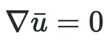
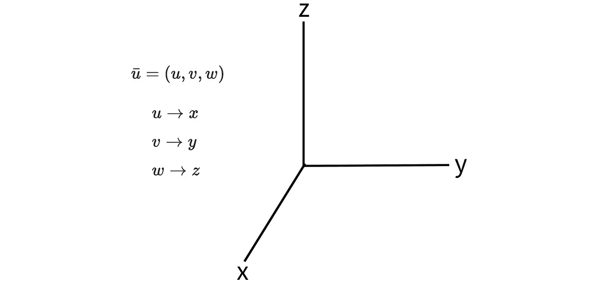
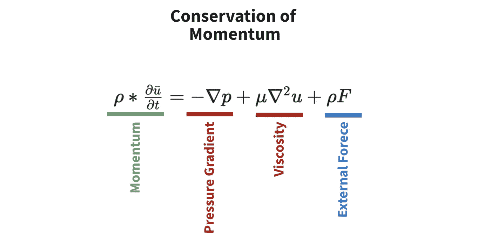
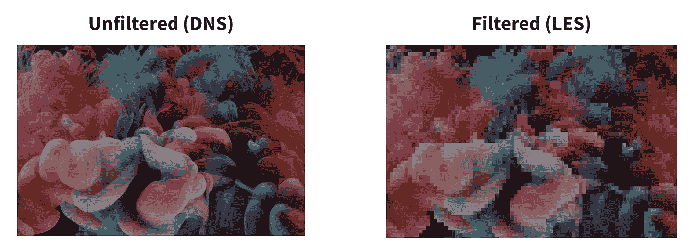
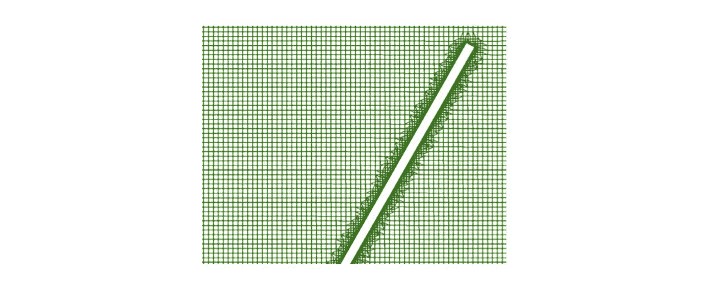

# 大涡模拟

> 原文：<https://towardsdatascience.com/large-eddy-simulations-e485dd929682?source=collection_archive---------17----------------------->

## LES 背后的理论及其在计算流体动力学中的应用。

你有没有想过模拟物理物体如何与空气和水相互作用？以下是方法。

SpaceX 在 [Unsplash](https://unsplash.com?utm_source=medium&utm_medium=referral) 上拍摄的

大涡模拟(LES)是一种尖端技术，用于模拟硬件如何与流体相互作用。它在计算效率和粒度之间取得了平衡，这使得它在航空航天和汽车行业非常受欢迎。然而，它们还不是灵丹妙药。

在本帖中，我们将讨论 LES 的基础知识。如果你想要代码教程，请留下评论。

事不宜迟，我们开始吧。

# 技术 TLDR

大涡模拟(LES)是在计算上“高效”的模拟，它求解纳维尔-斯托克斯方程。主要的计算优势来自过滤，它将我们的数据分成计算上可行的块。对于每个区块中的信息，我们直接求解方程，对于更小的亚网格尺度(SGS)数据，我们可以开发近似模型。

# 但是实际上是怎么回事呢？

如果你不是有数学背景的物理学家，那可能已经很多了，所以让我们慢一点。

## 1 —纳维尔-斯托克斯方程

我们将从一个具体的例子开始:我们希望设计一个能最大化向前推力的船形推进器。

在发展这种推进器的过程中，将有两条主要的前进道路。第一个是利用我们关于船舶螺旋桨物理学的知识，提出理论设计。不幸的是，我们中没有多少人是流体动力学专家，所以这个选择可能会有问题。

相反，让我们讨论第二种选择:大涡模拟(LES)。

LES 可以结合物理和计算模拟来估计水流的特性，然后将其转化为推力的估计值。LES 的核心依赖于支配所有流体动力学的两个纳维尔-斯托克斯方程。

让我们依次讨论每个方程。

**1.1 —质量守恒**

第一个等式非常直观。它指出，无论我们如何移动我们的流体，流体的质量将保持不变。

图 1:质量守恒方程。作者图片

在图 1 中， *u_bar* (上面带杠的 u)*对应我们流体的速度。速度包括速度和方向，在我们的例子中，我们对推力的所有三维都感兴趣，所以让我们将 *u_bar* 分解成 x、y 和 z 分量。*

**

*图 2:分解了 x、y 和 z 分量的速度。图片作者。*

*如图 2 所示，我们可以将 *u_bar* 分解成它的 *u，v，*和 *w* 分量，它们对应于我们速度的 x，y，z 方向。这三个分量中每一个的大小都对应于那个方向的速度。*

*既然我们理解了速度项，让我们看看纳布拉(∇).∇指出，我们正在寻找速度的梯度。如果你熟悉随机梯度下降，这个梯度是相同的概念——它只是速度对 *x* 、 *y* 和 *z* 的偏导数。*

**

*图 3:扩展的质量守恒方程。图片作者。*

***1.2 —动量守恒***

*两个等式中的第二个也非常直观。它只是简单地陈述了一个系统中所有的动量都会随着时间而保持。这也恰好是牛顿第二定律。*

**

*图 4:动量守恒方程。图片作者。*

*在图 4 中，等号(绿色)左边的值是动量。只是我们的流体密度ρ (rho)乘以 *u_bar* 随时间的变化率。值得注意的是，这个术语只是*质量 x 加速度*的不同表示。*

*红色的两个值是内力——它们对应于流体粒子固有的相互作用。第一项，压力梯度，是将颗粒从高密度区分散到低密度区的压力。举个例子，想想气味在房间里是如何分散和消散的。第二个术语，粘度，是物质的“厚度”,对应于流体中颗粒之间的摩擦力。*

*最后，我们有唯一的外力，显示为蓝色。这通常只是用引力常数来代替。*

*今天有趣的事实是，如果你能证明这些方程的解存在并且是光滑的，你就赢得了一百万美元。*

## *2 —湍流的问题*

*当寻求解决上述方程时，有一个主要的挑战:湍流。*

**

*照片由[帕韦尔·切尔文斯基](https://unsplash.com/@pawel_czerwinski?utm_source=medium&utm_medium=referral)在 [Unsplash](https://unsplash.com?utm_source=medium&utm_medium=referral) 上拍摄*

*上面艺术地展示的湍流是“**以压力和流速的混乱变化为特征的运动**”理论上，我们流体中的每个粒子都可能导致湍流，所以除非我们有非常强大的计算机(如原子计算机)，否则我们无法解决上述方程。*

*因此，为了降低计算的复杂性，我们过滤掉数据的某些部分。纳维尔-斯托克斯方程有三种主要的“版本”,具有不同的粒度水平和计算复杂性。他们是…*

1.  ***直接数值模拟(DNS)** :无滤波器——仅适用于小规模理论模拟。*
2.  ***大涡模拟(LES)** :过滤掉小尺度的“漩涡”并为其建模——这是一种非常精确的方法，但在计算上仍然容易处理。*
3.  ***雷诺平均纳维尔-斯托克斯(RANS)** :通过对低于阈值的值进行平均来过滤它们——这是一种精度较低的方法，但比 LES 计算效率更高。*

*历史上，RANS 一直是最先进的方法，但随着计算能力的增加，LES 在需要精度的应用中的受欢迎程度激增。一个例子是内燃机设计。*

## *3 —大涡流模拟*

*既然我们理解了为什么计算流体动力学模拟可能非常昂贵，那么让我们看看在实践中我们可以做些什么来降低它的复杂性。*

***3.1 —低通滤波***

*LES 中使用的一种简单的显式滤波方法称为低通滤波。正如你所料，我们减少或消除高频信号，让低频信号通过不变。“高”和“低”由阈值δ(delta)确定。*

**

*图 5:卷积滤波的简化示例。来源图片由 Pawel Czerwinski 在 [Unsplash](https://unsplash.com?utm_source=medium&utm_medium=referral) 上拍摄。*

*这个过程的一个简单类比是像素化图像，如图 5 所示。我们通过使用卷积核来实现这种“像素化”。类似于 CNN 中的卷积层，我们使用滑动“窗口”移动数据，并在每个位置执行低通滤波操作。还要注意，我们不只是对 2D 数据这样做，我们还可以将这些数据应用到 3 维以及我们的时间组件。*

*从视觉角度来看，应用于数据中空间成分的过滤器通常由覆盖在数据上的网格来表示。图 6 中的每个网格单元对应于一个卷积核(或一些其他滤波方法)的输出。*

**

*图 6: LES 网格示例— [src](https://www.sciencedirect.com/science/article/abs/pii/S1463500321000469) 。图片作者。*

*正如上面所暗示的，还有很多其他的过滤方法。一些明确地确定应该被允许通过的信号的大小，而另一些利用复杂的数学来动态地减少小湍流过程的数量。还有亚网格尺度(SGS)模型，试图以计算高效的方式封装湍流的相关信息。*

***3.2——求解纳维尔-斯托克斯方程***

*现在我们有了一个计算上易处理的数据集，我们可以应用基于微积分的求解器，从而进行模拟。数学和代码可能会变得非常复杂，所以如果你想了解更多，这里有一些资源:*

*   *[斯坦福高保真 LES](https://hifiles.stanford.edu/) :航天计算实验室设计的研究型 LES*
*   *[dedaLES](https://dedales.readthedocs.io/en/latest/):LES 最流行的 python 库*
*   *ARXIV.org:了解 LES 研究的一个好的(免费的)方法*

*这就是你要的——最荣耀的事！*

# *摘要*

*为了强调一些概念，让我们重申一下我们上面讨论的内容，然后将我们的新知识与一些很酷的应用联系起来。*

*大涡模拟(LES)是一种计算量大但易于处理的流体动力学模拟。他们的成名在于他们使用过滤器来消除小尺度湍流，这导致了大量的计算复杂性。从那里，它利用高效和理想的并行求解器来确定纳维尔-斯托克斯方程的解。*

*LES 在硬件建模领域已经变得非常流行。一些应用包括[内燃机](https://link.springer.com/article/10.1007/s10494-015-9683-4)，[航空航天工程](https://www.mdpi.com/journal/aerospace/special_issues/large_eddy_aerospace)，[风力涡轮机设计](https://www.sciencedirect.com/science/article/abs/pii/S0045793018301154)，以及[海洋能源](https://royalsocietypublishing.org/doi/10.1098/rsta.2019.0499)。通过利用计算机，我们可以在构建物理原型之前，从理论上测试数千种可能的设计。*

**感谢阅读！我会再写 28 篇文章，把学术研究带到 DS 行业。查看我的评论，链接到这篇文章的主要来源和一些有用的资源。**