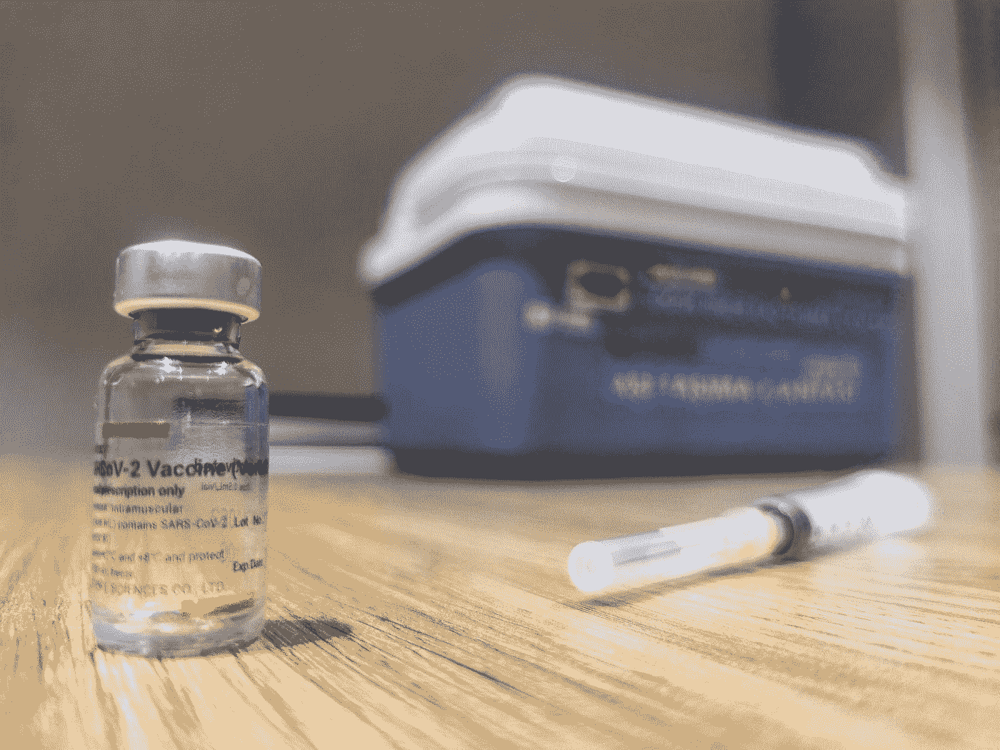
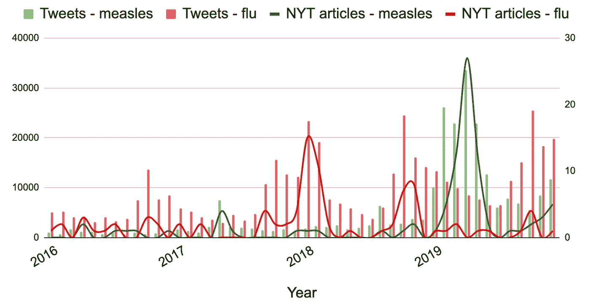
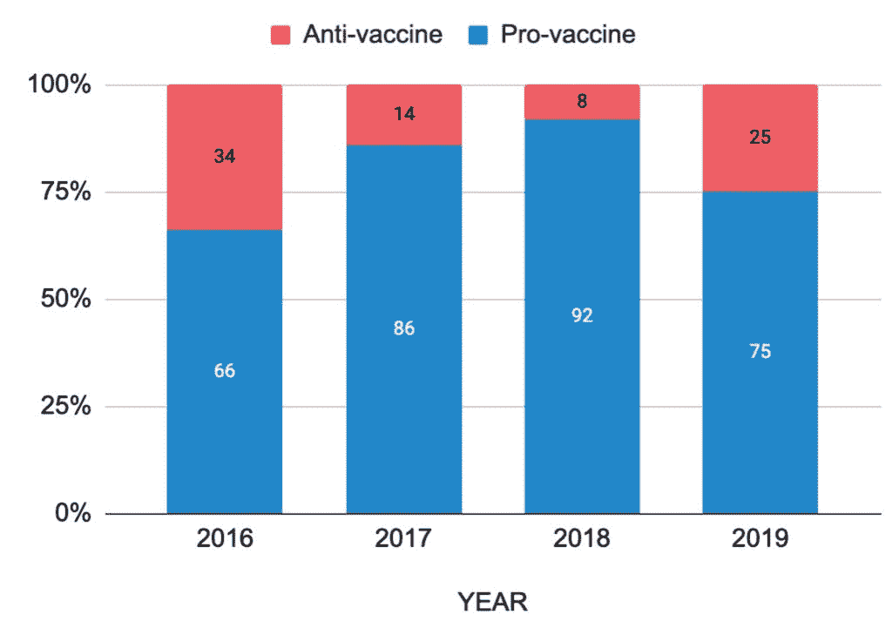
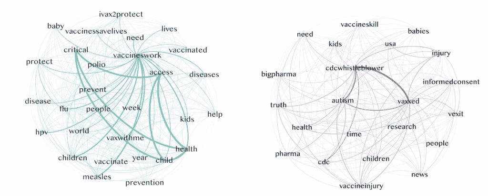
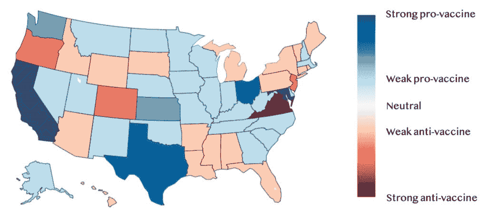

# 新冠肺炎之前关于疫苗在线对话的大规模分析

> 原文：<https://towardsdatascience.com/large-scale-analysis-of-on-line-conversation-about-vaccines-before-covid-19-ecebde4180ef?source=collection_archive---------31----------------------->

## 在前疫情时代，推特和新闻来源发挥了作用

## 你还记得过去反对疫苗接种的争论吗？有没有影响到今天的态度？数据可以暴露一切

Mehmet Turgut Kirkgoz 在 [Unsplash](https://unsplash.com?utm_source=medium&utm_medium=referral) 上拍摄的照片

关于疫苗的作用和需求的讨论从未如此激烈。新冠肺炎疫情戏剧性地改变了这个问题在外行人日常生活中的可见度。

然而，**疫苗接种近年来一直是一个有争议的话题。**多年来，反疫苗接种运动的增长已被记录在案。虽然疫苗反对者的大本营仍然在与新冠肺炎疫苗作斗争，但不要忘记和忽视导致当前疫苗辩论的历史是极其重要的。

这激发了我们对新冠肺炎袭击前社交媒体上关于疫苗接种的辩论和讨论的以数据为中心的研究。在这项研究中，我们绘制了新冠肺炎事件前四年推特上关于疫苗接种的英语对话。我们的目的是:

*   发现对话的数量和趋势；
*   将 Twitter 上的讨论与报纸上的内容进行比较；
*   将人们分为支持或反对疫苗接种，并探究他们的行为有何不同。

## **推特数据集**

在新冠肺炎疫情出现之前，我们收集了 4 年关于疫苗接种的推特数据，使用了三个关键词:“疫苗”、“疫苗接种”和“免疫”，获得了大约 6.5 条 MLN 推特。

## **新闻来源**

我们分析了推文中引用最多的新闻来源，不仅包括“官方”报纸或新闻机构，还包括在线媒体和博客，如 YouTube、NaturalNews(通常被认为是有偏见的假新闻网站)和脸书。

总体而言，在被引用最多的来源中，32%可以被标记为可靠，25%可以被标记为阴谋/假新闻来源。另外一个有趣的点是，在 Twitter 上分享的所有链接中，有 32%的引用指向了其他社交网络(包括 YouTube)。这项分析显示了社交媒体和不可靠的信息来源如何频繁地推动 Twitter 上与疫苗相关的对话。

## **基本分析**

我们的分析显示，与该主题相关的推文数量逐年增加，**在 2019 年达到峰值**。除其他外，我们确定 2019 年**麻疹爆发**是增长的主要原因之一。这一点突出体现在**推文量与美国疾病预防控制中心 2019 年麻疹病例数据的高度相关性**以及关于该主题的大量报纸文章，这两者在 2019 年都有显著增加。还进行了其他人口统计、时空和内容分析。

## **科目**

除了一般的数据分析，我们还考虑了疫苗对话中经常涉及的一些特定主题，如流感、hpv、脊髓灰质炎等。我们确定了时间趋势，并进行了与这些主题相关的具体分析，同时也结合了各自的媒体报道。

讨论和 NYT 新闻涉及特定疾病的疫苗接种，如流感和麻疹。[作者图片(*)]

## **用户立场。**

多年来疫苗接种立场的演变。[作者图片(*)]

我们对推文的作者进行了立场分析，以确定用户对疫苗接种的取向，即他们是支持还是反对疫苗。初步分析显示**大量内容具有讽刺或嘲笑的性质，导致许多分类技术在数据集上表现不佳。**

鉴于其他研究认为立场指示标签的存在是发现极化推文和用户的有效方法，因此应用了基于规则的分类，基于 100+标签的选择。这允许自动将推文分类为支持疫苗接种或怀疑疫苗接种，在 4 年中获得了总共 250，000+分类推文。

## 措辞和引用

这两组用户在讨论疫苗相关话题时使用的词汇有着深刻的不同，他们参考的信息来源也是如此。
**反疫苗用户引用的大多是假新闻网站**和极少数可靠的消息来源，而这些消息来源大多被支持疫苗的用户引用。在这两种情况下，社交媒体(主要是 Youtube)代表了链接内容的很大一部分。反疫苗使用者使用的词语强调了对抗大型制药公司的趋势，对效果的不信任，受伤和自闭症的风险(以及阴谋论和告密者)。

支持疫苗接种(左)和反对疫苗接种(右)群体最常使用的词和共现词。[作者图片(*)]

## 地理和人口统计

此外，我们对两类用户(支持和反对疫苗)进行了人口统计(年龄、性别、种族)和空间分析，目的是了解这两个群体的特征。我们的分析还显示了美国各州在 Twitter 上支持或反对疫苗接种的程度。结果如图所示。

推特上美国各州支持和反对疫苗接种的两极分化。[作者图片(*)]

视频中描述了更多细节和结果:

总结视频报告研究的主要结果。[作者视频(*)]

现在的问题是:由于新冠肺炎及其全球影响，这种情况如何改变？请继续关注进一步的分析。

这项工作是米兰理工大学的马可·布拉姆贝拉和玛格丽塔·里科蒂在数据科学实验室开展的活动的一部分。它已于 2020 年 7 月 17 日至 20 日在美国马萨诸塞州剑桥市麻省理工学院举行的 [IC2S2 2020](http://2020.ic2s2.org/6th-international-conference-computational-social-science) 会议上发表(由于新冠肺炎的限制，在网上发布),它是触发器和潜望镜欧盟 H2020 研究项目的一部分。

您可以参考并引用以下作品:

*玛格丽塔·里科蒂，马可·布拉姆贝拉。关于疫苗相关现象的在线对话的大规模分析。IC2S2 2020。*