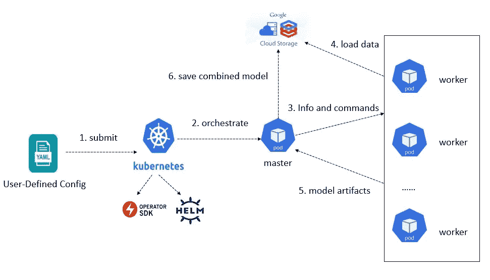
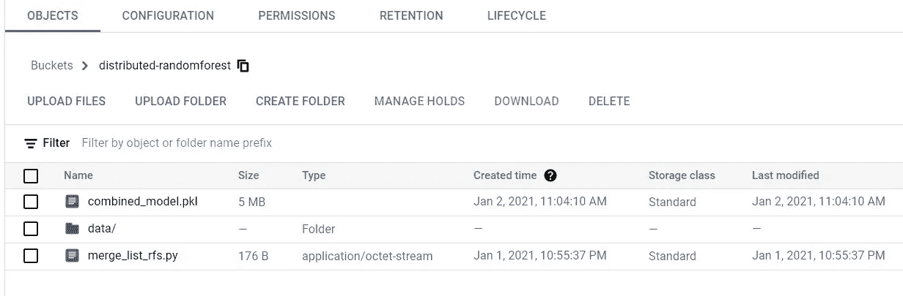
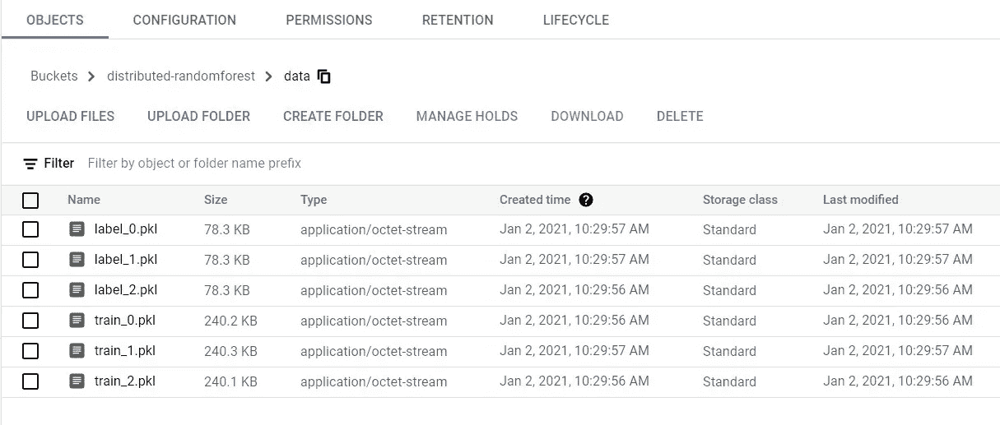
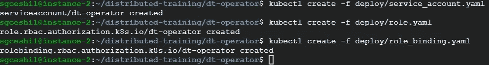
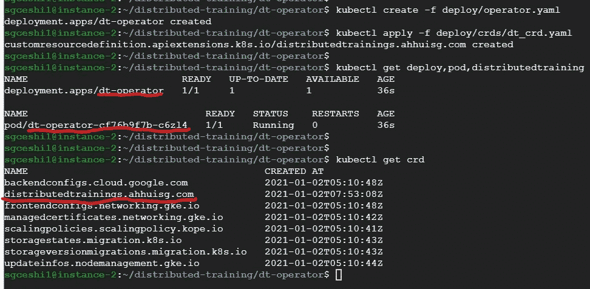
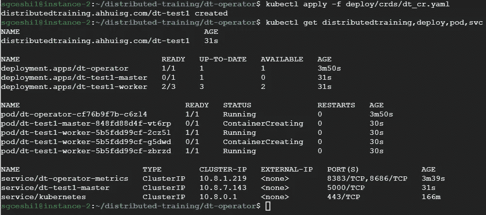
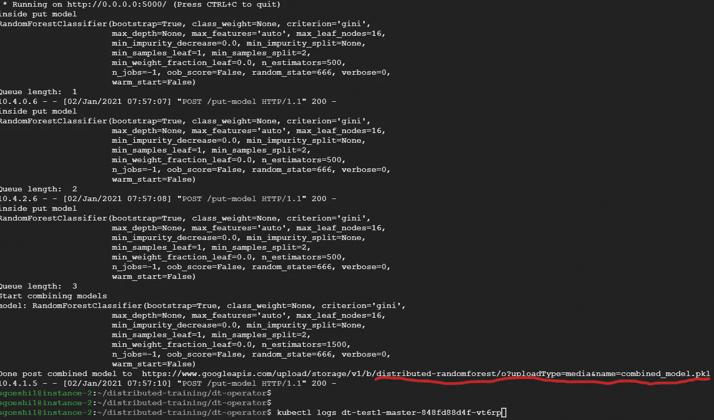

# 带 Kubernetes 算子的大规模分布式随机森林

> 原文：<https://towardsdatascience.com/large-scale-distributed-randomforest-with-kubernetes-operator-797c68c065c?source=collection_archive---------44----------------------->

## 使用简单的 YAML 文件在 Kubernetes 集群中进行分布式培训

几天前，我正在用一个巨大的数据集探索 RandomForest 模型。令我失望的是，训练数据无法放入单个工作节点的内存中。我必须手动拆分训练数据来训练几个 RandomForest 模型，然后再将这些模型合并成一个模型。

这促使我产生了一个想法:**我能否提出一个框架来自动化和分布对具有巨大数据集的可集成模型的训练？**我可以准备并**提交一个简单的配置文件**，框架将**编排、监控并分发**培训并自动产生模型工件**。**

**经过几天的研究和实现，我提出了这样一个框架的第一个版本，这是一个 Kubernetes 操作符。我使用了 GCP 的 operator-SDK(0 . 19 . 4)和 Kubernetes 集群(1.16.15)。操作员满足了分布式培训自动化的基本要求，尽管仍有很大的改进空间。github 库在这里是。**

**在下面几节中，我将解释 Kubernetes 操作符是什么，然后解释**分布式训练操作符**是什么。最后，我还将向您展示如何在您自己的集群中设置操作符。**

# **1.什么是 Kubernetes 运算符**

**简而言之，Kubernetes 操作员是一个特定于应用程序的控制器，它扩展了 Kubernetes API 的功能，以代表 Kubernetes 用户创建、配置和管理复杂应用程序的实例。**

**您可能熟悉 Kubernetes 的基本概念，如 Pod、部署、服务等。这些是内置的 Kubernetes API 资源。然而，在 Kubernetes 的早期，自动化和管理复杂的有状态应用程序已经变得困难重重。**

**从 1.7 版本开始，Kubernetes 引入了一个 API 插件机制:自定义资源定义或 CRD。CRD 允许用户指定他们自己的 API 资源(客户资源)。Kubernetes 操作员利用定制的 Kubernetes 控制器和**定制资源** (CR)来管理应用程序及其组件。**

**在我的例子中，定制资源被称为 **DistributedTraining** ，它由 1 个带有 1 个 Pod 的主部署&服务和 1 个带有用户指定数量的 Pod 的工作部署组成。操作员自动协调、监控和管理所有组件以及它们之间的工作关系。**

# **2.分布式训练算子**

**下面是整个过程的工作流程。用户需要做的只是指定并提交配置文件。操作员将负责剩下的步骤。**

****

## **YAML 配置文件**

```
apiVersion: ahhuisg.com/v1
kind: DistributedTraining
metadata:
  name: dt-test1
spec:
  name: dt-test1
  baseGcsBucket: distributed-randomforest

  model:
    module: sklearn.ensemble
    class: RandomForestClassifier
    parameters: "n_estimators=500, max_leaf_nodes=16, random_state=666, n_jobs=-1"
    merger:
      module: merge_list_rfs
      function: combine_rfs

  image:
    master:
      repository: ahhuisg/dt-master
      tag: 0.0.2
    worker:
      number: 3
      repository: ahhuisg/dt-worker
      tag: 0.0.2
```

*   ****先决条件**:模型必须是可组合的(装袋、助推或堆叠)。在我的例子中，一个随机森林模型可以由多个随机森林模型组合而成**
*   ****baseGcsBucket** :来自 Google 云存储的桶名，里面包含了训练数据集，最终的合并模型以及合并模型的 python 脚本**
*   ****model . module**&**model . class**&**model . parameters**:模型模块、类和实例化参数**
*   ****model . merge**:这包含了如何合并来自工人的模型的 python 脚本。您可以指定您想要如何集合模型。在下面的示例中，python 脚本名为 merge _ list _ rfs . py(model . merger . module ),集成函数名为 combine _ rfs(model . merger . function)**

```
merge_list_rfs.py:def combine_rfs(rfs):
    rf_a = rfs[0]
    for rf in rfs[1:]:
        rf_a.estimators_ += rf.estimators_
        rf_a.n_estimators = len(rf_a.estimators_)
    return rf_a
```

*   ****image.master** :包含主 pod 的容器图像。操作员中只有一个主 pod。**
*   ****image.worker** :包含 worker pods 的容器图像。操作员中可能有 N 个工人舱**

**正如您所看到的，YAML 配置文件相当简单。在 GCS 存储桶中准备好培训数据后，您只需根据 Kubernetes 的容量和您的要求指定**与模型相关的值、存储桶名称以及工人数量**。然后**您可以将文件提交到集群(ku bectl apply-f<file _ name>)并等待模型工件可用。****

# ****3。在您的集群中设置操作员****

## **克隆我的 Github 库**

```
git clone [https://github.com/ahhuisg/distributed-training](https://github.com/ahhuisg/distributed-training)
```

## **设置 ServiceAccount、Role 和 RoleBinding(仅完成一次)**

```
kubectl create -f deploy/service_account.yaml
kubectl create -f deploy/role.yaml
kubectl create -f deploy/role_binding.yaml
```

## **设置操作员和自定义资源定义(仅完成一次)**

```
kubectl create -f deploy/operator.yaml
kubectl apply -f deploy/crds/dt_crd.yaml
```

## **创建并运行您的分布式培训**

*   **在 GCS 存储桶准备您的数据(如 baseGcsBucket 中所指定的)。当前在 bucket 中必须有一个**数据**子目录。在数据目录中，训练数据的每个分区应该是 pickle 文件格式，命名为 training_ < n >。pkl/label_ < n >。pkl**
*   **分区的数量应该与配置文件中的 **image.worker.number** 的数量相同**
*   **修改 yaml 文件 **deploy/crds/dt_cr.yaml** 。您可以在配置文件的模型部分指定与模型相关的属性。比如要用 XGBoost 进行分布式训练，可以设置模型模块、类、参数。您还应该通过更改合并部分来定义您想要如何合并子模型**

```
kubectl apply -f deploy/crds/dt_cr.yaml
```

# **4.我的示例演示**

****

**GCS 桶**

****

**GCS 存储桶中的数据目录**

****

**创建服务帐户、角色和角色绑定**

****

**创建 CRD 和操作员**

****

**应用自定义资源并触发培训**

****

**运行成功，组合模型保存到 GCS**

## **确认**

**使用 40，000 个数据点的模拟数据集，我验证了来自 3 个来源的模型:**

*   **单一随机森林模型(精确度:0.909)**
*   **局部组合随机森林模型(精度:0.908)**
*   **运营商的组合随机森林模型(精度:0.908)**

**请参考本[笔记本](https://github.com/ahhuisg/distributed-training/blob/main/notebook/distributed_randomforest.ipynb)以作进一步参考**

## **需要改进的地方**

*   **根据员工人数自动拆分和保存培训数据，而不是目前手动拆分和保存数据到 GCS 存储桶**
*   **允许每个工人训练实例具有其自己的模型参数，以利用集成学习中更多的多样性和随机性**

# **5.结论**

**在本文中，我介绍了我为 ML 模型的分布式训练开发的 Kubernetes 操作符。Kubernetes 是一个非常流行和强大的平台，用于自动编排和管理分布式工作负载。Kubernetes 中工作负载的声明性质，加上它在应用程序中定义和管理复杂关系的卓越能力，使 Kubernetes 成为处理复杂 ML 工作负载的最合适的工具之一。如果您有类似的用例，我希望这个小工具能让您的生活变得更轻松！**