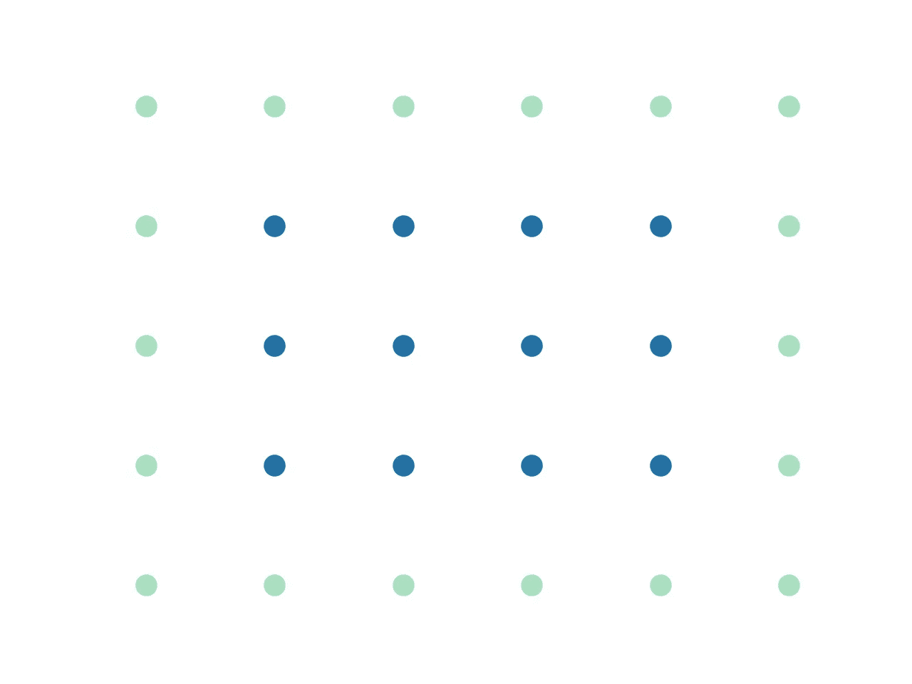
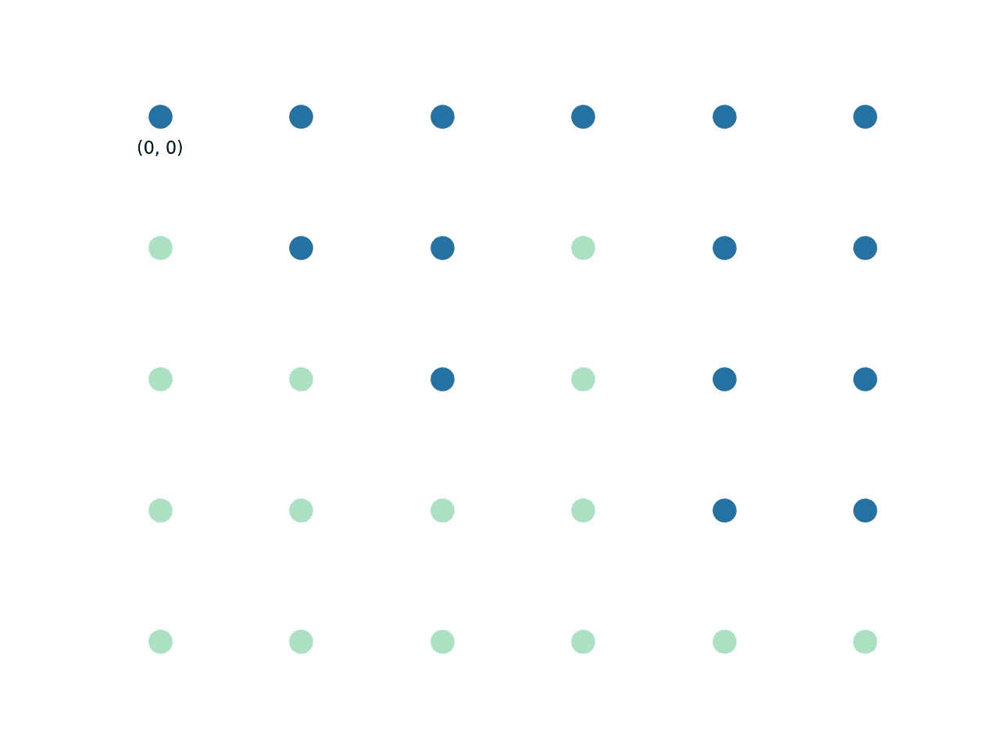
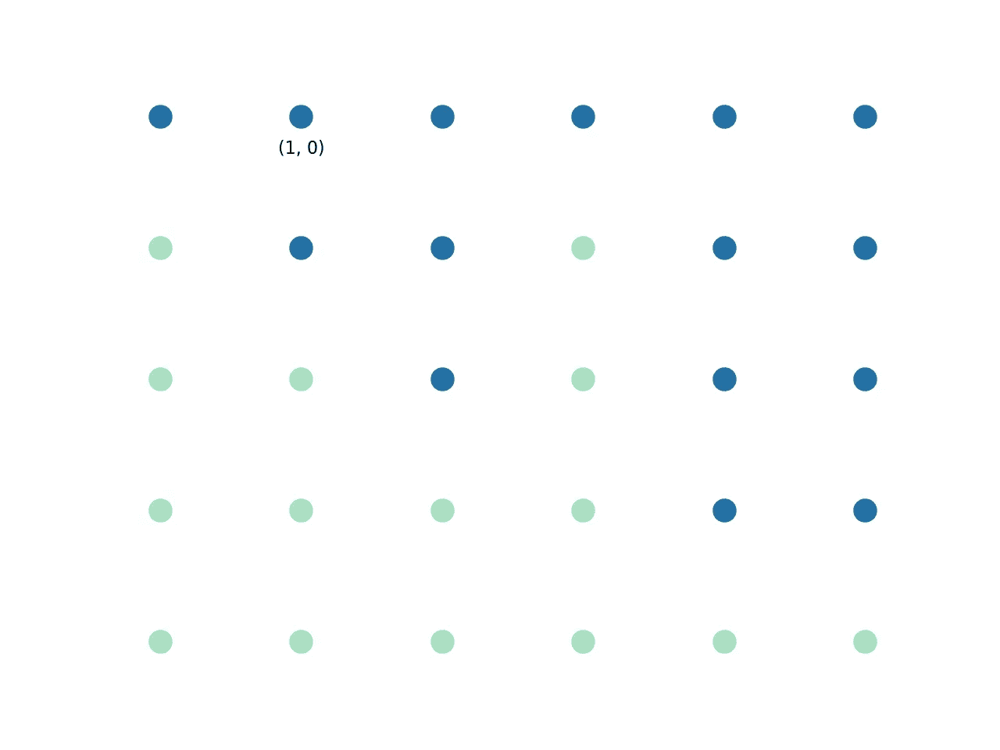
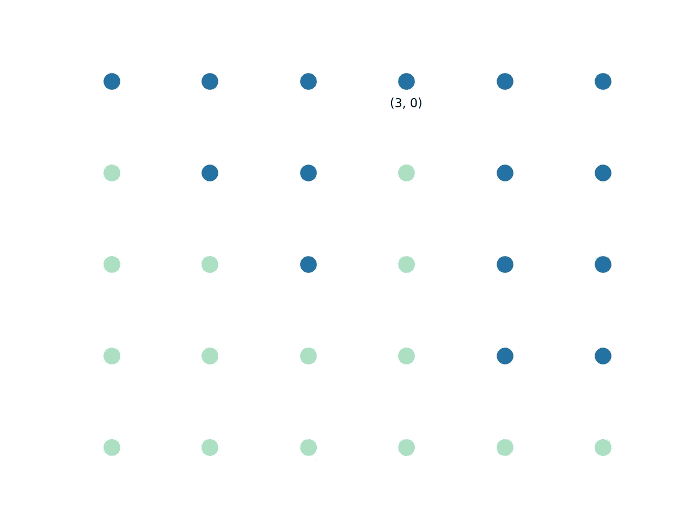

# 矩阵中最大的矩形

> 原文：<https://towardsdatascience.com/largest-rectangle-in-a-matrix-33dd93bd2c45?source=collection_archive---------20----------------------->

## 如何结合编程技术



随着我在编码和生活中积累了更多的经验，在我的观察中有一件事让我印象深刻，那就是，每当有一个问题需要解决时，通常都会有一个非常直观的解决方案。有时这种解决方案碰巧是有效的，有时是次优的。这在算法中尤其明显，因为算法通常是现实生活问题的概念化，通过算法，问题的基本要素被保留，允许我们直接处理问题。

在我看来，矩阵中最大的矩形就是这样一个问题。以下是对该问题的简要描述。

# 问题

我有一个由红蓝点组成的棋盘，想找出由蓝点组成的最大矩形:



(图片由作者提供)

在这个例子中，很容易看出由蓝点形成的最大矩形的大小为 8。

但是让我们从算法上想出一个办法。

## 解决方案#1

> 如何简单地做到这一点

我第一次尝试解决这个问题时，我心想:

嗯，看起来我可能需要遍历矩阵中的每个点，在每个点上，我需要找到包含该点的最大矩形。我将把那个矩形与我已经找到的矩形的大小进行比较。如果新的更大，我就保留它，否则我继续下一个点。

这听起来很棒，但是有一个问题。如何找到包含特定点的最大矩形？我想不出任何能帮我解决这个问题的方法。

如果我只想找到以当前点为左上角的最大矩形呢？我认为这是一个更容易处理的问题。

为了让我搞清楚，我将遍历当前点右侧的每个点，在每个点我找到蓝点的最大高度，如果它小于当前点的高度，我将当前点的高度更新为新的高度，并找到新矩形的大小，如果它是一个更大的矩形，我将更新最大大小。

让我们将这个过程应用到我们的例子中。

假设我循环到点(1，0):



(图片由作者提供)

我找到了我当前点的高度，是 2，给定这个信息，右上角为(1，0)的最大矩形也是 2。

(1，0): height = 2，max_rectangle = 2。

我迭代右边的每一点:

点(2，0)的高度是 3，但是它比起点大，所以高度仍然是 2。但是现在我们知道我们可以有一个 2 * 2 = 4 的矩形:

(2，0): height = 2，max_rectangle = 4

点(3，0)的高度为 1，它小于当前高度，因此我们将当前高度更新为 1，可以创建的矩形为:1 * 3 = 3，但当前最大值为 4，因此我们忽略它:

(3，0): height = 1，max_rectangle = 4

对其余的点进行相同的过程:

(4，0): height = 1，max_rectangle = 4

(5，0): height = 1，max_rectangle = 5

我们发现右上角为(1，0)的最大矩形的大小为 5。

让我们把它写成代码:

```
def find_max001(matrix):

    width = len(matrix[0])
    height = len(matrix)

    # max width and max height at the a point
    # uses memorization and dynamic programming
    max_matrix = [[None for v in row] for row in matrix]
    def get_max(i, j):
        if i >= width:
            return 0, 0
        elif j >= height:
            return 0, 0
        elif max_matrix[j][i] is not None:
            return max_matrix[j][i]
        elif matrix[j][i] == 0:
            max_matrix[j][i] = (0, 0)
            return max_matrix[j][i]

        max_down = get_max(i, j + 1)
        max_right = get_max(i + 1, j)

        max_matrix[j][i] = (max_right[0] + 1,
                            max_down[1] + 1)
        return max_matrix[j][i]

    max_rect = 0
    for i in range(width):
        for j in range(height):
            rect = get_max(i, j)
            cur_max = rect[1]
            for k in range(1, rect[0]):
                cur_max = min(cur_max, get_max(i+k, j)[1])

            max_rect = max(max_rect, cur_max * rect[0])

    return max_rect def problem003(solver):

    m001 = [
        [1, 1, 1, 1, 1, 1],
        [0, 1, 1, 0, 1, 1],
        [0, 0, 1, 0, 1, 1],
        [0, 0, 0, 0, 1, 1],
        [0, 0, 0, 0, 0, 0]
    ]

    res1 = solver(m001)
    print(f'res1: {res1}') def test003():
    solver = find_max001
    problem003(solver) test003()
# res1: 8
```

## 解决方案#1 的性能

> 算法的复杂度是多少？

由于我们循环遍历每个点，复杂性至少是 w * h。幸运的是，我们能够使用记忆和动态编程技术来找到每个点的高度，因此它们不会增加复杂性。

在每一点上，我们都循环遍历矩阵的宽度，以找到该点上最大的矩形，这将复杂度降低到 w*h*w。

所以复杂度是:O(w *h)

因为我们还使用地图来存储每个点的宽度和高度:

内存使用量为:O(w*h)。

## 解决方案 2

> 如何改进算法？

有没有办法降低复杂度中的 w 项？

事实证明，是有的。

让我们回到我们的例子:



(图片由作者提供)

假设现在我们正在循环第一行。

从(0，0)，(1，0)，(2，0)高度不断增加 1，2，3。我们保留了一个列表:

[(0, 0: 1), (1, 0: 2), (2, 0: 3)]

在位置(3，0)，高度下降到 1。这个新信息告诉我们什么？

实际上，相当多。给定该信息，我们可以肯定地说，左上角在位置(2，0)且高度为 3 的矩形的最大尺寸只能是 3。

我们也可以肯定地说，一个左上角在位置(1，0)且高度为 2 的矩形的最大尺寸只能是 4。

处理完这两个点后，我们可以永久删除它们，但是我们需要添加一个新点，在(1，0)(注意，不是在(3，0))，高度为 1:

[(0, 0: 1), (1, 0: 1)]

本质上，我们所做的是修剪(2，0)和(1，0)的高度，使其等于(3，0)的高度。

以这种方式移动到这一行的末尾，我们不会遇到更多的高度下降。

[(0, 0: 1), (1, 0: 1), (5, 0: 4), (4, 0: 4)]

然后，我们可以处理其余的行:

(5，0) max_rectangle = 4

(4，0) max_rectangle = 4 * 2 = 8

(1，0) max_rectangle = 1 * 5= 5

(0，0) max_rectangle = 1 * 6 = 6

所以处理第一行后的 max_rectangle 是 8，我们只循环了 6 个点！这意味着算法的复杂度现在是 w*h！

下面是代码中的算法:

```
from collections import deque

def find_max002(matrix):

    width = len(matrix[0])
    height = len(matrix)

    # max depths
    max_matrix = [[None for v in row] for row in matrix]

    def get_max(i, j):
        if i >= width:
            return 0, 0
        elif j >= height:
            return 0, 0
        elif max_matrix[j][i] is not None:
            return max_matrix[j][i]
        elif matrix[j][i] == 0:
            max_matrix[j][i] = (0, 0)
            return max_matrix[j][i]

        max_down = get_max(i, j + 1)
        max_right = get_max(i + 1, j)

        max_matrix[j][i] = (max_right[0] + 1, max_down[1] + 1)
        return max_matrix[j][i]

    def get_rect(stack, j):
        cur_idx = stack.pop()
        cur_max = cur_idx[1] * (j - cur_idx[0])
        print(f"cur_max at {cur_idx[0]}: {cur_max}")
        return cur_max

    max_rect = 0
    for i in range(width):

        # implement the algorithm with stack
        stack = deque()
        stack.append((-1, 0))
        for j in range(height):
            rect = get_max(i, j)
            cur_width = rect[0]
            cur_idx = j
            while stack[-1][1] > cur_width:
                cur_idx = stack[-1][0]
                max_rect = max(max_rect,
                               get_rect(stack, j))
            stack.append((cur_idx, cur_width))

        while len(stack) > 1:
            max_rect = max(max_rect, get_rect(stack, height))

    return max_rectdef test004():

    solver = find_max002

    problem003(solver) test004()
# res1: 8
```

注意，为了在到达(3，0)后实现点(2，0)和(1，0)的移除，我们使用堆栈数据结构来有效地推送和弹出点。

## 解决方案 2 的复杂性

如前所述，我们对解决方案 1 进行了改进，因此在每一点上，我们都不必再遍历其右侧的其余点。复杂度提高到:O(w*h)！

内存使用保持不变:O(w*h)。

## 能从中得到什么？

*除了算法和编码技术*

一个算法可以有很多变化，你想出的第一个通常不是最有效的。理解复杂性分析和编程技术会有很大的不同。这种认识的重要性不仅延伸到编程，而且延伸到生活中的几乎所有事情，因为生活中的所有事情都是算法。