# LASSO 增加了线性模型的可解释性和准确性

> 原文：<https://towardsdatascience.com/lasso-increases-the-interpretability-and-accuracy-of-linear-models-c1b340561c10?source=collection_archive---------15----------------------->

## 了解套索的工作原理和原因

由[爱德华·克鲁格](https://www.linkedin.com/in/edkrueger/)、[艾琳·欧菲莱因](https://www.linkedin.com/in/erin-oefelein-3105a878/)和[迈克尔·斯特兰克](https://www.linkedin.com/in/michael-a-strenk-72a6b532/)

Joshua Sukoff 在 [Unsplash](https://unsplash.com/s/photos/rodeo?utm_source=unsplash&utm_medium=referral&utm_content=creditCopyText) 上拍摄的照片

# 为什么是套索？

LASSO 或 L1 正则化是一种可用于改进许多模型的技术，包括广义线性模型(GLMs)和神经网络。LASSO 代表“最小绝对收缩和选择操作符”然而，你可能想知道是短语还是缩写先出现的。

**套索执行子集选择**

在线性回归、泊松回归和逻辑回归等(GLMs)情况下，LASSO 可以选择要素子集。子集选择通常通过消除特征和预测度量以及适用模型的泛化来增强 GLMs 的可解释性。GLMs 中的 LASSO 功能强大，因为它可以内生地选择子集-无需构建大量不同的模型并与要素子集进行比较。

**套索提高了可解释性**

LASSO 相对于许多其他子集选择方法的另一个优势是，它倾向于具有较少共线性的要素子集。由于预测指标通常不会受到共线性的影响，依赖于预测指标的子集选择技术通常无法排除高度相关的变量。

然而，对于解释和因果推断，共线性可能是毁灭性的。

例如，考虑在此处找到的[sci kit-Learn 糖尿病数据集。目标是衡量糖尿病的进展。标记为“s1”到“s6”的六个特征是每个受试者在不同时间进行的血清测量的记录。](https://scikit-learn.org/stable/datasets/toy_dataset.html#diabetes-dataset)

即使只有一些读数是因果上重要的，线性回归和其他 GLMs 也会给每个特征一些权重。为什么？

因为非因果读数与因果读数相关，而因果读数与目标相关，*非因果无关读数与目标相关*。

后果不仅是非因果特征会影响模型中的目标，而且模型会对因果特征产生错误的影响！直观上，通过添加与另一个特征相关的特征，估计过程将在两个特征之间分割原始特征的因果权重。

当要素之间存在共线性时，LASSO 倾向于将这些要素系数中的一部分降低为零。

如果您有兴趣查看共线性如何影响推理的模拟，或者如何使用 SciKit-Learn 将 LASSO 应用于糖尿病数据集，[订阅我的邮件列表](https://edkruegerdata.com/subscribe)以获取即将发布的文章。

**正则化提高了准确性和泛化能力**

更少的特征可以导致具有更好预测指标的更精确的模型，这可能是反直觉的。尽管如此，在训练中，尤其是在小型或中型数据集上，该模型将识别无意义特征和目标之间的弱关联。在极端情况下，当对模型评分时，一些观察值将具有无意义特征的相对高或低的值，从而导致极端的预测。

泛化是指模型在训练集和测试集的观察值上的表现。很难量化一个模型概括得有多好。尽管在实践中很少见，但在理想的情况下，如果测试数据来自相同的数据生成过程，测试度量可以评估泛化性能。在任何情况下，稀疏模型都更简单，并且不容易出现不可量化的风险，即留下弱预测特征。

在神经网络中，l1 正则化不会在模型级别执行子集选择。然而，在神经元层面，它会选择哪些特征是重要的。这种正则化产生了一个更稀疏的神经网络，该网络在测试度量上更有性能，并且泛化得更好。

**让我们回顾一下！**

在我们深入了解 LASSO 的工作原理和原因之前，让我们回顾一下。通过排除倾向于相关的特征，LASSO 构建了更稀疏、更易解释且通常更具性能的 GLMs。一些其他模型也可以受益于预测准确性的提高。

# 套索是如何工作的

了解了它的应用，我们可以看看套索是如何在数学上工作的。LASSO 算法是许多正则化技术中的一种，它通常对问题的损失函数应用惩罚项。我们将使用线性回归来演示这项技术。

## 线性回归如何工作

在我们将 l1 惩罚应用于线性回归之前，让我们快速回顾一下线性回归是如何工作的。

回想一下，线性回归根据以下形式进行预测。

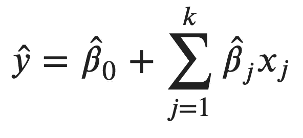

线性形式(来源:作者)

为了训练模型，我们需要估计系数。为了估计系数，我们通过选择系数值来最小化以下等式给出的平方和。

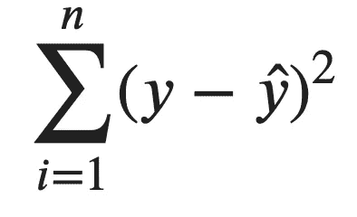

平方和(来源:作者)

代入线性形式，我们得到下面的损失函数。

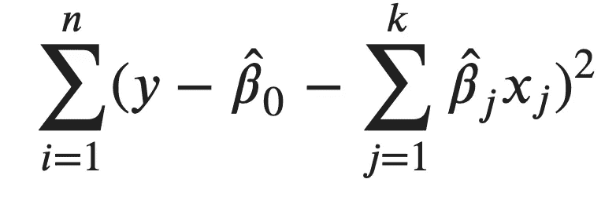

线性回归的损失函数(来源:作者)

使用线性代数符号编写表达式会产生一个看起来更简洁但等效的函数。

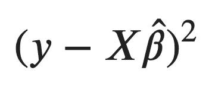

线性回归的损失函数(来源:作者)

请注意，除了系数之外，这个方程中的所有内容我们都知道。我们可以使用几种最小化技术来找到这个问题中系数的最佳值，包括:

*   解析求解一阶条件
*   使用 QR 分解
*   使用诸如梯度下降的数值方法

在我们总结线性回归之前，让我们从几何角度来看这个问题。我们想通过一组点找到最佳平面。直觉上，最好的平面是最接近这些点的平面。在下图中，我们有两个维度用于特征，一个维度用于创建 3d 空间的目标。线性形式是三维平面，因此线性回归会给我们一个最佳拟合平面。黑线表示每个点和平面之间的距离。

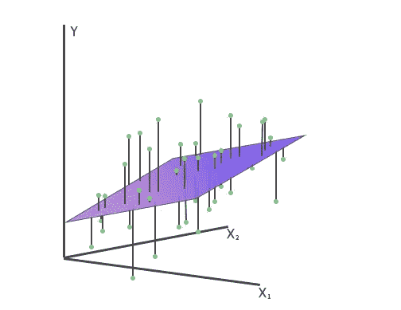

线性回归几何学(来源:作者)

一个合理的目标是找到使黑线的绝对值之和最小的平面，但相反，线性回归使它们的平方和最小。有几个数学和计算上的原因让我们更喜欢用平方和作为损失函数。紫色平面代表最佳拟合平面。

## 添加惩罚

要使用 LASSO 回归，我们只需在损失函数中添加以下惩罚项。

L1 刑罚(来源:作者)

该表达式由系数的 L1 范数和惩罚系数(也称为正则化强度)的乘积组成。惩罚参数是一个固定的外生超参数。这些项的乘积被称为 L1 罚项，然后应用于损失函数或线性回归，以生成 LASSO 的损失函数，如下所示。

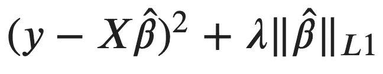

拉索的损失函数(来源:作者)

这个最小化问题没有封闭形式的解。因此，我们必须使用数值方法，如梯度下降法，来求解最佳系数。

这就是套索回归的全部内容，但是如果不深入研究最小化问题，很难对它的工作原理有任何直觉。

# 套索为什么有效

## 作为约束优化问题的套索

为了理解套索为什么有效，让我们从另一个角度去发现损失函数。

假设我们有以下问题，我们必须最小化最小二乘，但在系数的选择上受到限制。特别是，系数的绝对值之和必须小于罚参数。

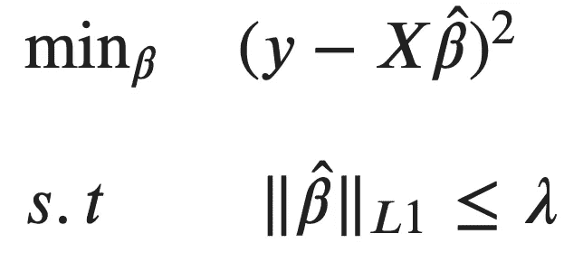

拉索作为一个约束优化问题(来源:作者)

事实证明，这个约束优化问题可以通过将其重写为无约束优化问题来解决，从而得到我们针对 LASSO 的损失函数。

如果你对将约束问题转化为损失函数背后的数学和直觉感到好奇，请查看安德鲁·张伯伦博士的精彩文章！

<https://medium.com/@andrew.chamberlain/a-simple-explanation-of-why-lagrange-multipliers-works-253e2cdcbf74>  

## 可视化约束区域

既然这两个公式是等价的，那就让我们从几何上更仔细地看一下约束问题。

但是，首先，让我们快速绕道。另一种正则化罚函数叫做 L2 罚函数，它的应用方式与 L1 罚函数完全相同。在线性回归中加入 L2 惩罚的模型称为岭回归。

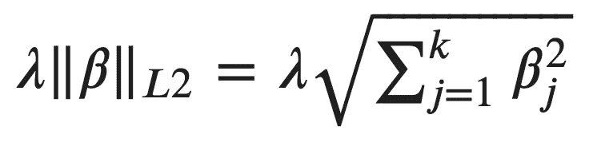

岭回归惩罚(来源:作者)

相关的约束如下。

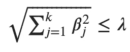

脊约束区域(来源:作者)

这可能看起来不熟悉，但让我们看看二维空间，设置惩罚参数为 1，平方两边，看看等式边界。我们得到下面的等式。

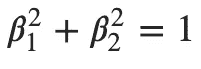

单位圆(来源:作者)

不认的话就是单位圆！看看二维的套索约束，我们得到类似的东西。

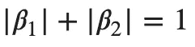

单位钻石(来源:作者)

这就是单位钻石。让我们想象一下这些约束区域。

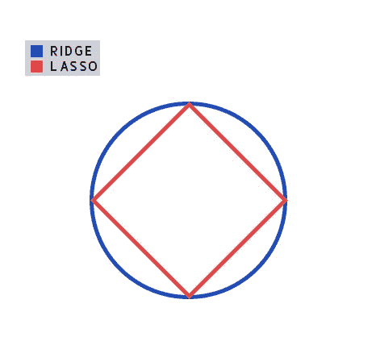

约束区域(来源:作者)

事实证明，这种菱形约束负责产生稀疏模型。

## 可视化约束优化问题

让我们通过在下图中可视化整个约束优化问题来理解约束区域的形状如何产生稀疏模型。

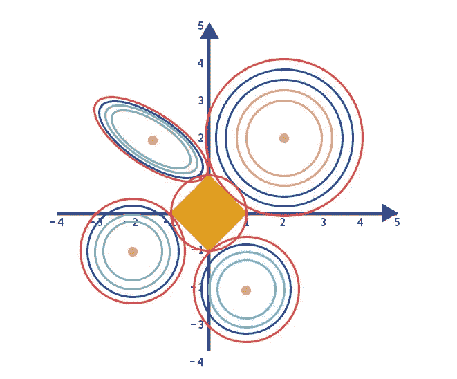

约束最优化问题(来源:作者)

我们看到不同损失函数的套索和脊约束区域和轮廓集(没有惩罚项)。

*   一组环表示每个轮廓集。类似于地形图，每个连续的向外环表示更高的损失函数值。
*   在每个轮廓集中心找到的每个点代表无约束问题的解。相比之下，轴相交处的菱形和圆形区域代表约束区域。
*   橙色菱形对应于套索的约束区域，由所有服从 L1 罚约束的有效候选解组成。相比之下，红色圆圈对应于脊约束区域，由遵守 L2 约束的所有有效候选解组成。

请注意，左上角的轮廓集(带有绿色的内部轮廓)在形状上更像椭圆形，而不是圆形。当等值线集具有相关的要素时，会产生此形状。轮廓组的椭圆形状和约束区域的菱形形状使得轮廓组的最佳点与约束区域的角点重合的机会很高。此时，一些特征可能会被消除，因为一个轴坐标上的值为 0。这就是 LASSO 生成稀疏解的原因。

# 选择正则化强度

现在我们理解了为什么 LASSO 产生稀疏解，我们可以检查正则化强度如何产生更多的稀疏解。这由分配给惩罚参数的值控制，该值决定正则化强度。下图显示了系数收缩的路径，即系数向 0 收缩时的路径。

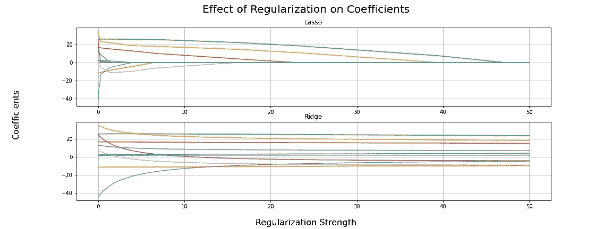

正则化强度对系数的影响(来源:作者)

此图展示了 LASSO 与岭回归的不同之处，LASSO 在应用更多惩罚时会将一些系数设置为零。对于 Ridge，这种现象只在罚值非常大的情况下出现，罚值会将所有系数收缩到零。

查看套索模型系数的正则化路径可能会很有趣，尤其是当它们将下一个系数设置为 0 时。路径给出了一系列越来越稀疏的模型。在选择一个时，如果我们主要关心预测，我们可以应用我们的主题专业知识或使用交叉验证。

**结论**

这是对 LASSO 回归方法的介绍，我们已经展示了它可以执行正则化和内生变量选择。请继续关注我们的下一篇文章，它将演示如何用 Python 实现 LASSO！

要了解更多关于数据科学、机器学习和开发的内容，请查看 [Edward 的 YouTube 频道](https://www.youtube.com/channel/UCmvdvjDaSjjMRIAxE5s7EZA)，并订阅我下面的邮件列表，成为第一个听到新文章的人！

<https://edkruegerdata.com/subscribe> [## 每当爱德华·克鲁格发表文章时，就收到一封电子邮件。

edkruegerdata.com](https://edkruegerdata.com/subscribe)