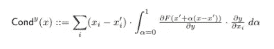

# 从零开始的层电导

> 原文：<https://towardsdatascience.com/layer-conductance-from-scratch-df53005e08b8?source=collection_archive---------26----------------------->

## 理解神经网络中隐藏单元的重要性

这是关于深度神经网络中使用集成梯度和相关技术的可解释性的文章的第二部分。

## 介绍

在[上一篇文章](/integrated-gradients-from-scratch-b46311e4ab4)中，我们已经看到了如何使用综合梯度计算特征属性，它显示为从基线到特征值的线性路径上梯度的简单平均值。但是，如果我们想测量特定层中神经元的重要性，而不是测量某个特征的重要性，会怎么样呢？为此，我们需要看看层的电导。

## 解释电导

电导是基于积分梯度的，我们在本系列的第一部分已经讨论过。提醒一下，我们将积分梯度定义为:

Ref:深度网络的公理化归属(【https://arxiv.org/abs/1703.01365】T2

为了计算层的电导，我们需要通过链规则分解积分梯度，如下所示:

Ref:神经元有多重要？(【https://arxiv.org/abs/1805.12233】T4)

我们也可以将其近似为:

作者图片

## 履行

> 注意:我们将使用本系列第一部分中的相同模型和数据。

为了计算层电导，我们采用与综合梯度相同的策略——因为模型是饱和的，为了看到有意义的梯度，我们需要从基线到输入捕捉它们。下面我们计算*网*模型中 *sigmoid1* 层的电导:

为了计算导数 *dydx_i* 我们需要使用一个向后的钩子(我个人发现这个教程有助于理解 py torch[https://www.youtube.com/watch?v=syLFCVYua6Q](https://www.youtube.com/watch?v=syLFCVYua6Q)中的钩子)覆盖向后的梯度直到层 *y* 然后从那里继续向后传播。

我们可以手动计算 *dydx_i* 进行反向传播，而不是使用*亲笔签名的*:

偏导数 *dfdy_i* 不需要钩子——我们简单地计算输出相对于 *sigmoid* 层的导数。

## 结论

希望你发现这个系列有助于通过代码更好地理解集成梯度和层电导是如何实现的。使用原始公式计算电导非常慢，并且在 tensorflow 中首次实现时没有很好地缩放，因此提出了另一个计算效率更高的公式，您可以在这里熟悉。

## 参考

[1]https://arxiv.org/pdf/1805.12233.pdf

[2]https://captum.ai/tutorials/Titanic_Basic_Interpret