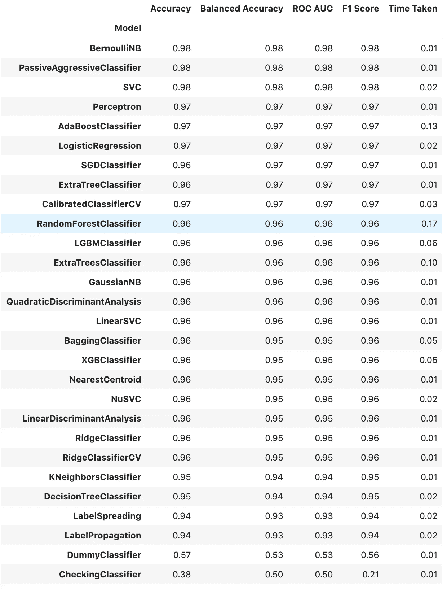
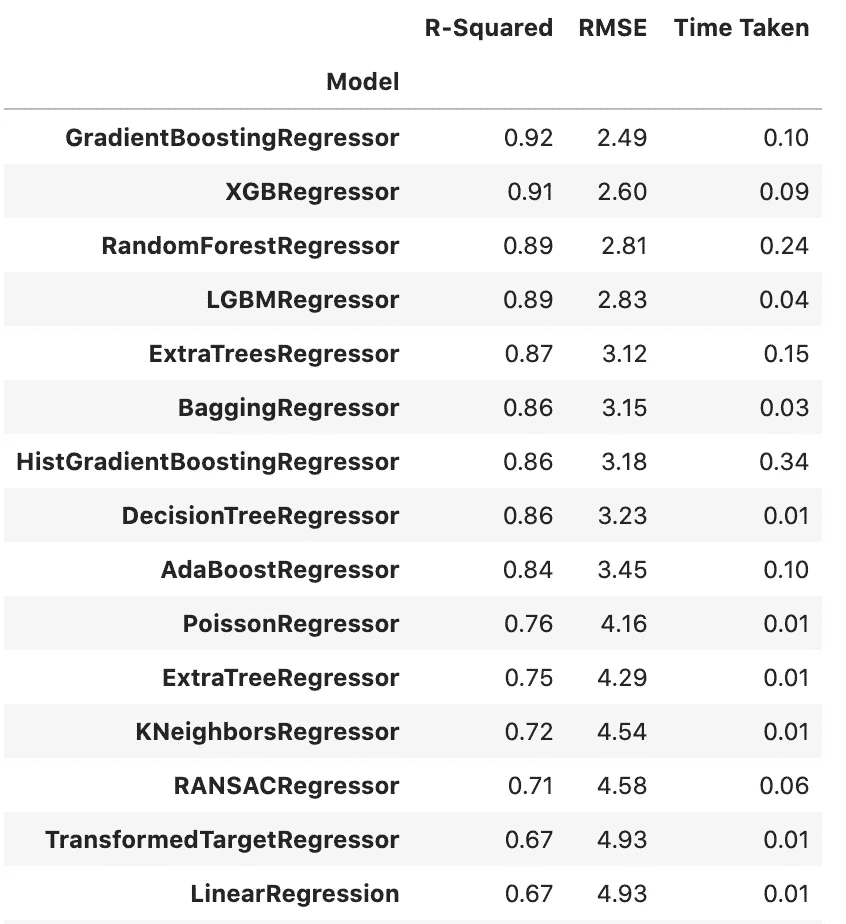

# 懒惰预测:拟合和评估 scikit 中的所有模型——用一行代码学习

> 原文：<https://towardsdatascience.com/lazy-predict-fit-and-evaluate-all-the-models-from-scikit-learn-with-a-single-line-of-code-7fe510c7281?source=collection_archive---------7----------------------->


约书亚·阿拉贡在 [Unsplash](https://unsplash.com/s/photos/code?utm_source=unsplash&utm_medium=referral&utm_content=creditCopyText) 上的照片

## 查看哪些模型最适合您的数据集的最简单方法！

当开始处理监督学习问题时，我们通常不确定哪些模型将与手头的数据集一起工作。一个可能的解决方案是从一个对许多数据集(如 Random Forest)相当有效的模型开始，然后进行迭代。这样，我们就可以建立一个旨在提高的基准。

> “早起的人不会取得进步。它是由懒惰的人试图找到更简单的方法来做某事而制造的。”罗伯特·海因莱茵

最有可能的是，在某个时间点，你也考虑过将所有的模型扔向数据集，看看会发生什么。然而，这并不是那么简单的编码(或者更确切地说，它是相当乏味的)，所以很可能你放弃了这个想法，只是尝试了一些你过去曾经使用过的模型。但是现在，有一个方便的库叫做`[lazypredict](https://github.com/shankarpandala/lazypredict)`，用它你可以用一行代码训练`scikit-learn`中所有可用的模型(还有更多，像 XGBoost 和 LightGBM)。听起来很棒，对吧？让我们看看这在实践中是如何实现的！

# 实践示例

首先，您需要通过运行以下命令来安装库:

```
pip install lazypredict
```

很有可能，你会遇到一些关于缺失库的错误，那么就用`pip`或者`conda`分别安装吧。我稍后会提到这一点，作为可能的改进。然后，我们加载所需的库:

```
from lazypredict.Supervised import LazyClassifier, LazyRegressor
from sklearn.model_selection import train_test_split
from sklearn import datasets
```

`lazypredict`支持分类和回归问题，所以我将对两者进行简单介绍。

## 分类任务

因为这篇文章的目的是快速展示这个库是如何工作的，所以我没有使用任何花哨的数据集，只是使用了 scikit-learn 中的例子。对于分类任务，我使用乳腺癌数据集。我加载数据，并将其分成训练集和测试集。

```
# load data
data = datasets.load_breast_cancer()
X, y = data.data, data.target
X_train, X_test, y_train, y_test = train_test_split(X, y, test_size=.2, random_state=42)# fit all models
clf = LazyClassifier(predictions=True)
models, predictions = clf.fit(X_train, X_test, y_train, y_test)
```

对于任何熟悉`scikit-learn`的人来说，使用`lazypredict`非常容易和直观。我们首先创建估计量的一个实例，在本例中是`LazyClassifier`，然后使用`fit`方法使其适合数据。通过在创建`LazyClassifier`的实例时指定`predictions=True`，我们还将接收每个观察的所有模型的预测。以防我们以后想用它们做别的事情。此外，我们可以使用`custom_metric`参数来传递我们想要用来评估模型性能的自定义指标。

**注意**:通过查看[代码](https://github.com/shankarpandala/lazypredict/blob/dev/lazypredict/Supervised.py)，您可以看到哪些估算器被排除在可用模型列表之外。对于分类，我们收到以下 4 个指标，以及模型适合数据集所需时间的指示。

另一个对用户隐藏的重要事情是，库自动对数据集应用预处理。首先，它使用`SimpleImputer`估算缺失值(对数字特征使用平均值，对分类特征使用常量`‘missing’`值)。然后，它将`StandardScaler`用于数字特性，将`OneHotEncoder`或`OrdinalEncoder`用于分类特性(取决于基数——唯一值的数量)。虽然这很方便，并且可以确保模型实际运行，但是一些用户可能更喜欢不同的方法来预处理数据集。这就是为什么在我看来，这应该是图书馆的一个自愿的特点，而不是强制性的。

**注意**:对于被视为分类的特征，它必须在底层数据帧中被表示为`object`类型。虽然这不是这个数据集的情况，但它在下面描述的回归问题中很重要。其中，数据集包含一些分类特征(例如，`CHAS`和`RAD`特征)。如果不将类型转换为`object`，库将把它们视为数字特征，并应用不正确的预处理！

`models`数据帧包含所有分类器的性能总结，而`predictions`(此处未显示，因为数据帧相当大)包含每个模型的所有预测。



## 回归任务

如前所述，回归任务与分类问题非常相似。我使用了 Boston Housing 数据集，并实例化了一个不同的类— `LazyRegressor`。剩下的就是类比了。

```
# load data
boston = datasets.load_boston()
X, y = boston.data, boston.target
X_train, X_test, y_train, y_test = train_test_split(X, y, test_size=.2, random_state=42)# fit all models
reg = LazyRegressor(predictions=True)
models, predictions = reg.fit(X_train, X_test, y_train, y_test)
```

自然，包含模型性能的表对于回归任务有不同的度量，即 R 平方和 RMSE。我们可以使用`custom_metric`参数添加更多(例如，MAPE)。为了保持文章简洁，下表被截断了，但是可用回归变量的列表要长得多。



# 可能的改进

在简单地摆弄了一下`lazypredict`库之后，我认为有几件事可能会有显著的改进:

*   这是一个简单的方法，但是要确保这个库有一个合适的依赖项列表，这样用户就不必根据他们得到的错误手动安装每个库，
*   允许访问最佳/所有经过训练的模型，现在我们只能看到包含结果和预测的表格，
*   并行训练模型——这对于小数据集来说不是问题，但是，对于大数据集来说，加快速度会更好，
*   创建一个专用的`predict`方法来获得预测，
*   使默认的预处理成为可选的，并清楚地记录下来，
*   允许一些超参数调整。

# 结论

`lazypredict`是一个方便的包装器库，它使我们能够快速将所有模型与我们的数据集相匹配，并比较它们的性能。通过这种方式，我们可以看到“开箱即用”的有效方法。然而，这并不是模型训练和选择的灵丹妙药，因为只训练默认变量。众所周知，超参数调整可以极大地改变性能。

您可以在我的 [GitHub](https://github.com/erykml/medium_articles/blob/master/Machine%20Learning/lazypredict.ipynb) 上找到本文使用的代码。一如既往，我们欢迎任何建设性的反馈。你可以在推特上或者评论里联系我。

觉得这篇文章有趣？成为一个媒介成员，通过无限制的阅读继续学习。如果你使用[这个链接](https://eryk-lewinson.medium.com/membership)成为会员，你将支持我，不需要你额外付费。提前感谢，再见！

如果您喜欢这篇文章，您可能还会对以下内容感兴趣:

</my-experience-as-a-data-scientist-in-a-startup-13ae037780d0>  </facebooks-prophet-deep-learning-neuralprophet-76796aed1d86>  </the-new-kid-on-the-statistics-in-python-block-pingouin-6b353a1db57c>  

# 参考

*   [https://github.com/shankarpandala/lazypredict](https://github.com/shankarpandala/lazypredict)