# 线性判别分析——如何用监督降维改进你的模型

> 原文：<https://towardsdatascience.com/lda-linear-discriminant-analysis-how-to-improve-your-models-with-supervised-dimensionality-52464e73930f?source=collection_archive---------3----------------------->

## 使用 Python 示例对 PCA 和 LDA 进行深入比较

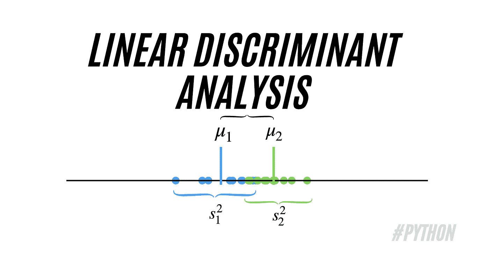

线性判别分析(LDA)。图片由[作者](https://solclover.com/)提供。

# 介绍

线性判别分析(LDA)是一种常用的降维技术。然而，尽管与主成分分析(PCA)相似，但它在一个关键方面有所不同。

它不是寻找新的轴(维度)来最大化数据中的变化，而是关注于**最大化目标变量中已知类别(类)之间的可分性**。

在本文中，我直观地解释了 LDA 的工作原理，同时强调了它与 PCA 的不同之处。同时，我提供了一个对真实数据执行线性判别分析的 Python 示例。

# 内容

*   LDA 属于机器学习技术的范畴
*   对 LDA 工作原理的直观解释
*   对真实数据执行 LDA 的 Python 示例
*   结论

# 线性判别分析(LDA)属于哪一类机器学习技术？

与主成分分析(PCA)不同，LDA 要求你为你的目标提供特征**和类别标签**。因此，尽管它是一种类似于 PCA 的降维技术，但它位于机器学习的**监督**分支内。

下图是**交互式的，**所以请点击不同的类别来**放大并展示更多的**👇。

机器学习算法分类。由[作者](https://solclover.com/)创建的互动图表。

***如果你喜欢数据科学和机器学习*** *，请* [*订阅*](https://solclover.com/subscribe) *每当我发布一个新故事时，你都会收到一封电子邮件。*

# 线性判别分析(LDA)是如何工作的？

理解 LDA 概念的最简单的方法是通过一个例子。因此，我没有关注算法背后的数学，而是为我们创建了一个可视化的解释。

## 数据

假设我们已经收集了一系列关于城市公寓价格的数据。我们根据某个门槛，比如 100 万美元，将它们分为“昂贵”和“便宜”两类。

```
I.e., <$1M = cheap, and ≥$1M = expensive. 
```

我们将数据显示在一个散点图上，其中 x 和 y 轴代表纬度和经度，为我们提供公寓的位置。同时，颜色代表类别/级别(便宜与昂贵)。请注意，我们已经对这个虚构示例中的数据进行了标准化，因此它以原点为中心。

> **S* 串联化是一种数据转换技术，它会重新调整数据，使每个属性的平均值为 0，标准差为 1。这种转换可以用下面的公式来描述:

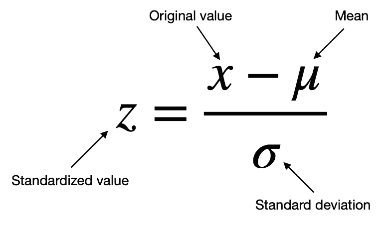

标准化。图片由[作者](https://solclover.com/)提供。

让我们看一下示例数据的散点图:

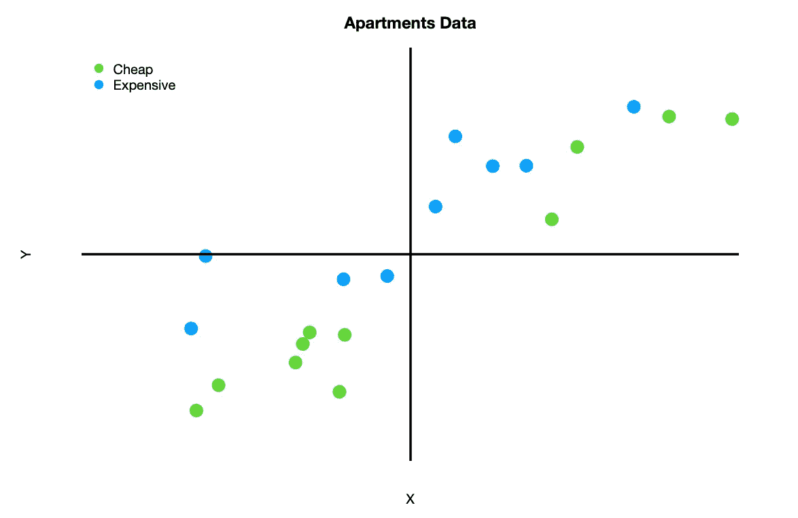

公寓数据散点图。图片由[作者](https://solclover.com/)提供。

现在，让我们比较 PCA 和 LDA 过程，以了解这些算法是如何工作的以及它们有什么不同。

## 应用主成分分析(PCA)

由于 PCA 是一种无监督的机器学习技术，我们不需要提供带有类别标签的目标变量。这意味着 PCA 不关心公寓是属于“便宜”还是“昂贵”的类别。

尽管如此，我还是保留了下图中的颜色标签，以突出与 LDA 的主要区别。

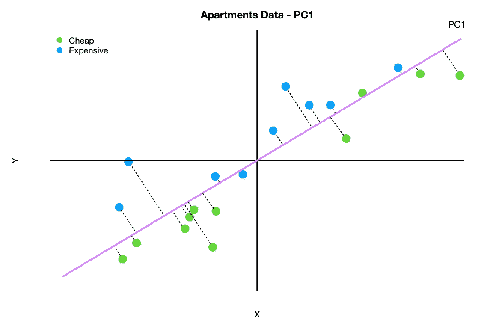

寻找主成分 1 (PC1)。图片由[作者](https://solclover.com/)提供。

PCA 的目标是捕捉最大的变化量，这是通过算法找到一条线来实现的，该线使数据点到该线的距离最小。有趣的是，这相当于最大化**同一条线上数据点投影的分布，这就是为什么我们可以**捕捉最大的方差。

从上面的图表中可以看出，我们已经很好地找到了一个新的轴，它保留了大部分的方差，使我们能够从二维下降到一维。这是我们将数据映射到新的一维(PC1)后的样子:

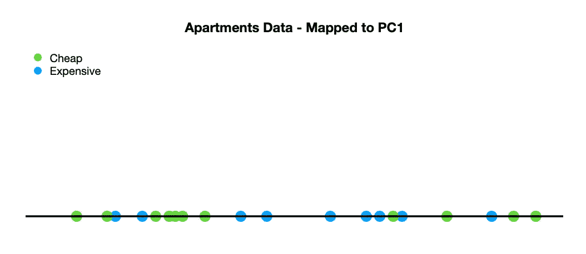

公寓数据映射到一个维度(PC1)。图片由[作者](https://solclover.com/)提供。

您可以清楚地看到，在这个场景中，我们能够保留大部分的差异，但是仍然丢失了一些在试图分离两个类别(类)时有用的信息。

*如果你想更深入的了解 PCA，可以参考我之前的文章:*

[](/pca-principal-component-analysis-how-to-get-superior-results-with-fewer-dimensions-7a70e8ab798c) [## PCA:主成分分析——如何用更少的维度获得优越的结果？

### 降维的最佳技术之一

towardsdatascience.com](/pca-principal-component-analysis-how-to-get-superior-results-with-fewer-dimensions-7a70e8ab798c) 

## 应用线性判别分析(LDA)

现在让我们回到我们的原始示例数据，并应用 LDA 而不是 PCA。快速提醒，**LDA 的目标是最大化我们的目标变量**(“便宜”、“昂贵”)中已知类别的可分性，同时降低维数。

下面是我们执行 LDA 时新轴的样子:

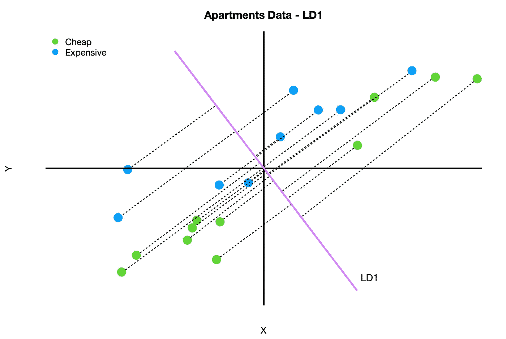

寻找线性判别式 1 (LD1)。图片由[作者](https://solclover.com/)提供。

如您所见，在这种情况下，新轴的选择与 PCA 的选择非常不同。在这种情况下，通过将数据映射到 LD1，我们最终会损失大量的方差。但是，我们实现了两个类别的更好分离:

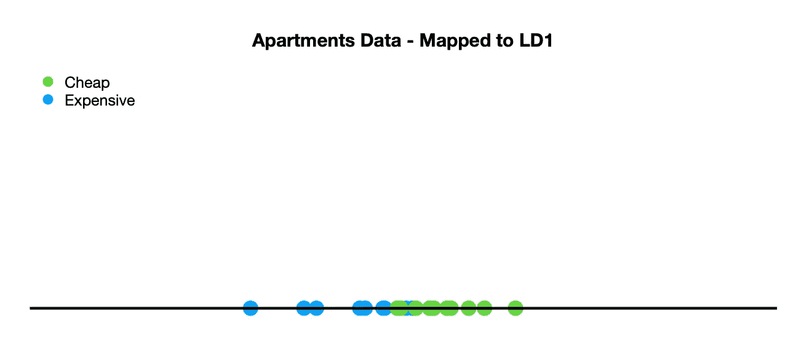

公寓数据映射到单一维度(LD1)。图片由[作者](https://solclover.com/)提供。

虽然这种分离并不完美，但它明显更好，两个类别中只有一些重叠的观察结果。

## LDA 如何找到合适的轴？

在为我们的新轴寻找“最佳”线时，使用了两个关键标准，这两个标准是同时考虑的。

1.  **最大化距离(d)。**
    ***2 类*** —当你的目标变量中有两个类时，距离是指类 1 的均值(μ)与类 2 的均值之差。
    ***超过两个类别*** —当目标变量中有三个或更多类别时，算法首先找到所有数据的中心点，然后测量每个类别平均值(μ)到该中心点的距离。

2.**最小化变化，也称为 LDA (s)中的“分散”。**

让我们用图表来说明这两个标准:

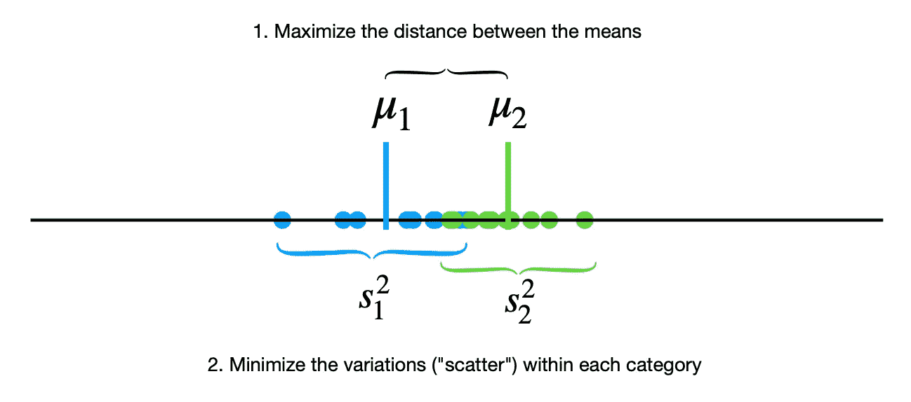

LDA 步骤。图片由[作者](https://solclover.com/)提供。

实际上，计算通常借助奇异值分解(SVD)或特征值分解来进行。这两个选项在 sklearn 的 LDA 实现中都是可用的，我们将在下一节中使用它。

[](https://solclover.com/membership)[](https://www.linkedin.com/in/saulius-dobilas/)

# 对真实数据执行 LDA 的 Python 示例

最后，是有趣的时候了，我们可以使用 Python 来应用 LDA。让我们从为我们的分析获取正确的库和数据开始。

## 设置

我们将使用以下数据和库:

*   [来自 Kaggle](https://www.kaggle.com/quantbruce/real-estate-price-prediction?select=Real+estate.csv) 的房价数据
*   [Scikit-learn library](https://scikit-learn.org/stable/index.html)for
    1)编码分类类标签([ordinal encoder](https://scikit-learn.org/stable/modules/generated/sklearn.preprocessing.OrdinalEncoder.html))；
    2)特征标准化([standard scaler](https://scikit-learn.org/stable/modules/generated/sklearn.preprocessing.StandardScaler.html?highlight=standard%20scaler#sklearn-preprocessing-standardscaler))；
    3)执行主成分分析([PCA](https://scikit-learn.org/stable/modules/generated/sklearn.decomposition.PCA.html))；
    4)进行线性判别分析([LDA](https://scikit-learn.org/stable/modules/generated/sklearn.discriminant_analysis.LinearDiscriminantAnalysis.html#))；
    5)创建基于决策树的预测模型([决策树分类器](https://scikit-learn.org/stable/modules/generated/sklearn.tree.DecisionTreeClassifier.html#))；
    6)模型评估([分类 _ 报告](https://scikit-learn.org/stable/modules/generated/sklearn.metrics.classification_report.html))
*   [Plotly](https://plotly.com/python/) 用于数据可视化
*   [熊猫](https://pandas.pydata.org/docs/)进行数据操作

让我们导入所有的库:

接下来，我们从 Kaggle 下载一个摄取的[房价数据](https://www.kaggle.com/quantbruce/real-estate-price-prediction?select=Real+estate.csv)。

下面是数据的一个片段:

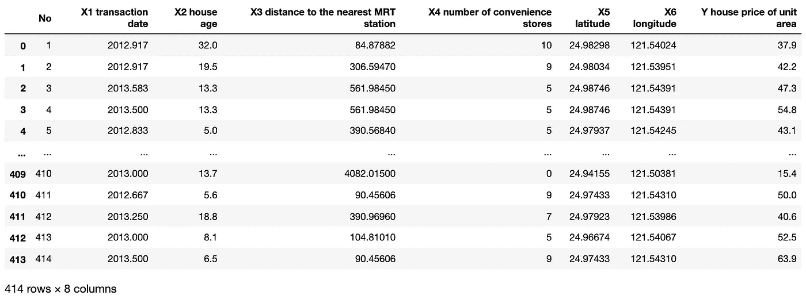

Kaggle 的房地产数据。图片由[作者](https://solclover.com/)提供。

## 数据准备

对于这个例子，我们想要创建一个多类目标变量。因此，我们将“Y 单位面积的房价”分成三个相等的类别。我们称它们为:‘1。“负担得起”(最低的 33%)，‘2。中档”(中间 33%)和“3。“昂贵”(前 33%)。

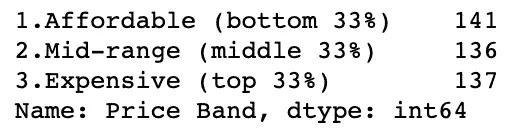

类别(类)标签分布。图片由[作者](https://solclover.com/)提供。

因为我们已经创建了分类标签，而算法需要数字标签，所以让我们使用顺序编码器将它们转换成数字标签。*【注意，我们可以直接分配数字标签，但是分类标签将使我们更容易阅读即将到来的可视化】。*

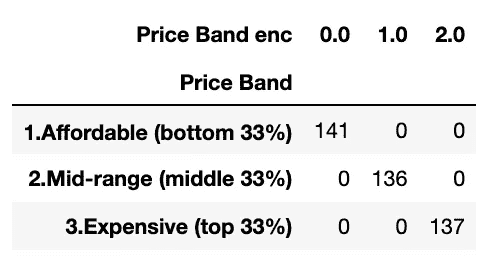

编码的目标变量类标签。图片由[作者](https://solclover.com/)提供。

为了保持可视化数据的能力，我们将限制自己使用前 3 个特征变量:“X1 交易日期”、“X2 房屋年龄”和“到最近的 MRT 站的 X3 距离”。

让我们通过在 3D 散点图上绘制这三个要素来看看数据是什么样的:

模型特征的 3D 散点图。图表作者[作者](https://solclover.com/)。

我们可以看到数据非常分散。此外，我们注意到，较便宜的房地产位于远离捷运站，而昂贵的往往更接近捷运，也较新。

数据准备的最后一步是特征的标准化。

请注意，在这个阶段，我们还应该将数据分为训练样本和测试样本，但是我们将处理整个数据集，以保持这个示例的简单性。

## 执行主成分分析(PCA)

出于兴趣，我们还将执行 PCA，这样我们可以将 PCA 的结果与 LDA 的结果进行比较。

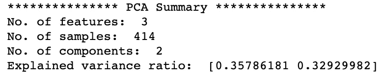

PCA 结果。图片由[作者](https://solclover.com/)提供。

有趣的是，PC1 和 PC2 的解释方差比率仅占总方差的约 69%，这意味着当从 3 维下降到 2 维时，我们损失了约 31%的总方差。这很大程度上是由于这三个特征之间的相关性很小。

以下是应用主成分分析后得到的 2D 散点图:

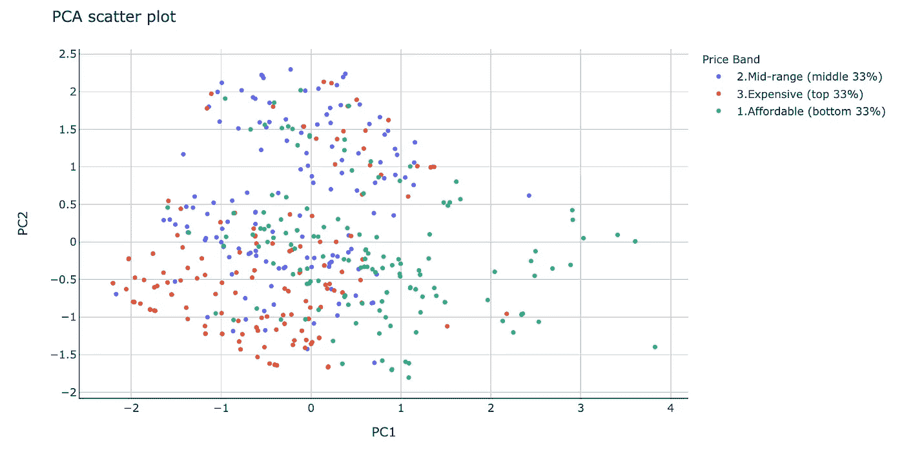

PCA 图。图片由[作者](https://solclover.com/)提供。

虽然我们损失了 31%的方差，但我们仍然设法保持了两个新维度之间的大量差异。然而，由于 PCA 只考虑特征而不考虑目标，所以这三个类别(类)最终都混在一起了。

接下来，我们来看看 LDA 与 PCA 相比如何。

## 执行线性判别分析(LDA)

我们将使用特征分解作为我们的求解器(sklearn 实现使您能够在 SVD、LSQR 和特征之间进行选择),并将组件参数(维数)设置为 2，将所有其他参数保留为默认值。注意，这一次我们还需要向算法提供我们的目标(y)。

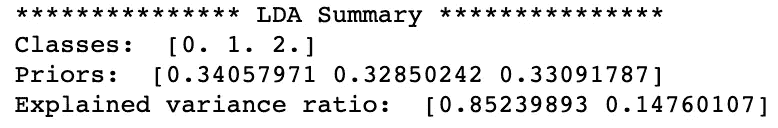

LDA 结果。图片作者[作者](https://solclover.com/)。

和以前一样，我们也将结果可视化在 2D 散点图上。

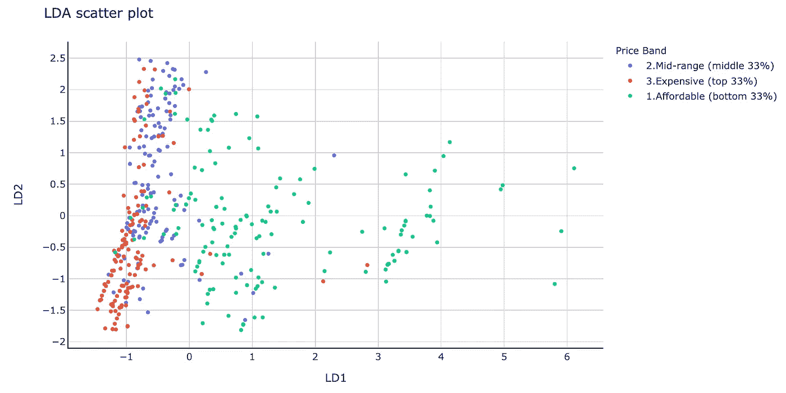

LDA 图。图片由[作者](https://solclover.com/)提供。

与 PCA 相比，LDA 结果有显著差异。由于 PCA 的目标是分离目标类别，而不是最大化方差，因此它设法找到了减少蓝色(' 2。中档)和红色(‘3。昂贵的)点，使它们基本上保持在自己的空间内。与此同时，尽管在绿色(‘1。实惠)类，红蓝分离的还蛮不错的。

为了验证我们在这些散点图中看到的内容，让我们构建几个决策树模型，看看我们可以根据使用 PCA 和 ld a 创建的特征预测“价格带”的效果如何。

## 用决策树分类器创建预测模型

让我们建立一个可重用的函数，我们可以快速调用它来训练模型并显示结果。

现在让我们用它来建立一个具有 PCA 转换特征的模型。

以下是模型结果:

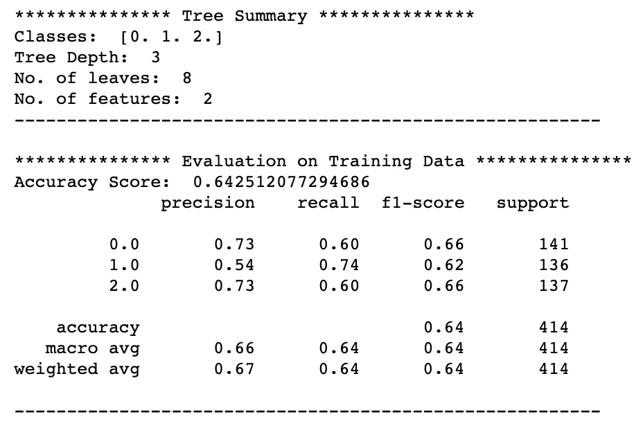

使用 PCA 变换特征的决策树模型结果。图片由[作者](https://solclover.com/)提供。

正如所料，结果不是很好，准确率只有 64%。应用主成分分析后类别的混合无疑增加了预测价格标签的难度。

让我们对 LDA 变换的特征重复同样的操作。

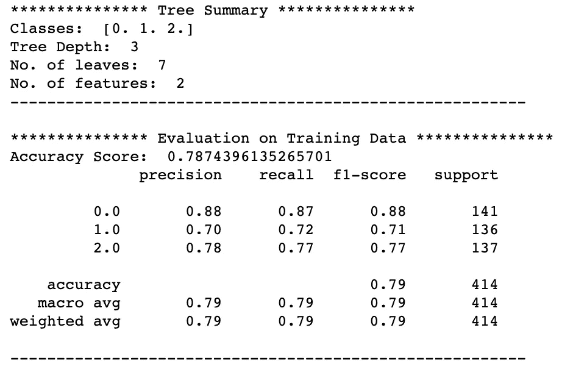

使用 LDA 转换特征的决策树模型结果。图片由[作者](https://solclover.com/)提供。

这一次模型似乎好了很多，准确率接近 79%。这些结果支持了我们早期的直觉，即与 PCA 相比，LDA 更好地保存了与预测公寓价格相关的信息。

# 结论

当我们希望降低数据的维数，同时保留尽可能多的与预测目标相关的信息时，LDA 是一个很好的工具。

然而，直接比较 PCA 和 LDA 可能不完全公平，因为它们是用于不同目的的两种不同技术。例如，PCA 是一种**非监督**学习技术，而 LDA 则属于 ML 的**监督**分支。

因此，请不要把上面的结果作为 LDA 优于 PCA 的证据。相反，请首先评估这些算法对您的独特情况的适用性。

我真诚地希望我的文章能够帮助您更好地理解线性判别分析，使您能够将其融入到自己的数据科学项目中。

干杯！👏
**索尔·多比拉斯**

***如果你已经花光了这个月的学习预算，下次请记得我。*** *我的个性化链接加入媒介是:*

[](https://solclover.com/membership) [## 通过我的推荐链接加入 Medium 索尔·多比拉斯

### 作为一个媒体会员，你的会员费的一部分会给你阅读的作家，你可以完全接触到每一个故事…

solclover.com](https://solclover.com/membership) 

如果你喜欢这个故事，这里有几篇你可能会喜欢的文章:

[](/dbscan-clustering-algorithm-how-to-build-powerful-density-based-models-21d9961c4cec) [## DBSCAN 聚类算法——如何构建强大的基于密度的模型

### 对有噪声的应用程序使用基于密度的空间聚类的详细指南

towardsdatascience.com](/dbscan-clustering-algorithm-how-to-build-powerful-density-based-models-21d9961c4cec) [](/k-nearest-neighbors-knn-how-to-make-quality-predictions-with-supervised-learning-d5d2f326c3c2) [## k-最近邻(kNN)-如何使用监督学习进行质量预测？

### 使用 kNN 解决回归和分类问题的综合指南

towardsdatascience.com](/k-nearest-neighbors-knn-how-to-make-quality-predictions-with-supervised-learning-d5d2f326c3c2)