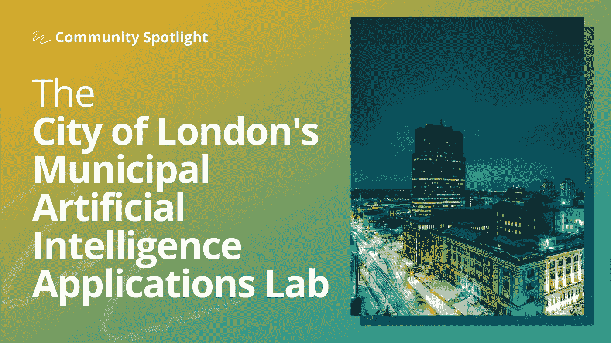

# 以身作则改善公民生活

> 原文：<https://towardsdatascience.com/leading-by-example-to-improve-civic-life-550d88a16b27?source=collection_archive---------15----------------------->

## [社区聚焦](https://towardsdatascience.com/tagged/community-spotlight)

## 伦敦金融城的人工智能实验室正在为加拿大(及其他地区)的地方政府采用机器学习铺平道路

*在 Community Spotlight 系列中，TDS 编辑与数据科学社区成员畅谈有助于推动该领域发展的激动人心的计划。今天，我们很激动地与大家分享* [***埃利奥特·冈恩***](https://medium.com/u/aad1101621dd?source=post_page-----550d88a16b27--------------------------------) *与* ***马特·戴利、*** [***马特·罗斯***](https://medium.com/u/2599aba9aff?source=post_page-----550d88a16b27--------------------------------)**和**[***布莱克·范贝罗***](https://medium.com/u/8b80f4848f08?source=post_page-----550d88a16b27--------------------------------)**

****

**图片由《走向数据科学》和斯科特·韦伯制作**

*****【Mat Daley】*******(***[***LinkedIn***](https://www.linkedin.com/in/mat-daley-829225141/)***)****是伦敦金融城信息技术服务部主任。Mat 在公共和私营部门拥有 20 年的管理经验，并有幸在五个不同的行业工作过。作为一名企业家，马特参与了三家初创公司的领导工作。Mat 在滑铁卢大学完成了本科学业，在西方大学完成了公共管理研究生课程，是指定的项目管理专业人员。****

*******(***[***LinkedIn***](https://www.linkedin.com/in/matt-as-ross/)***)****过去十年一直在技术与社会善的交汇处工作。创建了一家非营利性的技术创业公司，作为独立的数据科学承包商工作，并在伦敦金融城共同创建了人工智能实验室。马特在休伦大学攻读哲学学位，在西方大学攻读化学学位。*****

*******(***[***LinkedIn***](https://www.linkedin.com/in/blake-vanberlo-51484676/)***)****是范贝罗咨询公司的创始人，这是一家专门从事机器学习应用研发的公司。Blake 之前在西方大学获得了软件工程学士学位，现在是滑铁卢大学 Cheriton 计算机科学学院的研究生。*****

**在市级政府层面找到一个内部人工智能实验室并不常见。我很想更多地了解这个团队。你能分享一下这个实验室在伦敦做什么吗？典型的一天是什么样子的？**

**城市人工智能应用实验室是伦敦市信息技术服务部门的一部分。由于一些人事变动，实验室正处于过渡阶段。该实验室寻找机会利用人工智能和分析来部署低成本、低风险的解决方案，以改善该市市民和/或员工的生活。我们目前是一个非常小的团队，但由于不同项目的不同性质，我们试图变得灵活。**

**实验室典型的一天包括与利益相关者和开发者的频繁交流。利益相关者通常是城市服务的一部分或与之相关。由于我们的项目是由业务需求驱动的，我们不断地就正在进行的项目与利益相关者联系，接收反馈并提供教育。开发人员可能是内部员工或外部顾问，他们根据涉众提出的不断发展的需求，在项目上工作。我们也一直在寻找新的项目，接触城市中愿意合作的人。**

****你在 TDS** **发表的文章** [**是第一篇讨论实验室将机器学习应用于公民问题的项目的博文(**](/an-open-source-interpretable-machine-learning-approach-to-prediction-of-chronic-homelessness-8215707aa572) [**也在 CBC**](https://www.cbc.ca/news/canada/london/artificial-intelligence-london-1.5684788) **)。你能分享一下这个项目是如何产生的吗？****

**长期无家可归预测系统确实是该实验室首次将机器学习应用于公民问题的举措。该项目的想法来自一位在金融城工作的商业系统分析师，它诞生于一个旨在发现应用机器学习机会的黑客马拉松。这个人与无家可归预防利益相关者密切合作，他想知道是否有一种方法可以使用机器学习来根据[无家可归个人和家庭信息系统(HIFIS)数据库](https://www.canada.ca/en/employment-social-development/programs/homelessness/hifis.html)中包含的信息进行预测，该数据库包含有关获得无家可归服务的个人的信息。这个想法后来演变成从这些记录中预测长期无家可归者。在用一个小原型展示了这种方法的前景后，我们让利益相关者参与到无家可归者预防工作中。与他们的讨论强调了可解释的机器学习的重要性。从那时起，项目就处于开发人员和利益相关者不断迭代的循环中。**

**我们希望分享这项工作，因为这样做可能会给其他城市带来好处。作为一个市政府，我们认为我们不仅对伦敦有责任，而且对所有社区的福祉也有责任。通过展示我们的工作，我们增加了其他城市看到我们工作的机会。由于 HIFIS 应用的普及，我们的解决方案适用于加拿大的其他地区。为了让我们的工作尽可能容易理解，我们在 [GitHub 库](https://github.com/aildnont)中包含了关于如何开始编写代码的详细说明。**

**你能告诉我们一些已经看到有希望结果的项目吗？**

**我们对长期无家可归预测项目感到特别自豪。该项目已经部署，现在可供与寻求无家可归服务的客户互动的个案工作者使用。**

**另一个我们引以为豪的项目是我们在水需求预测方面的工作。根据过去的用水量记录，我们开发了一个模型来预测未来几年全市的需水量。这项工作可能有助于基础设施规划和预算预测。这个项目的一个关键方面是，我们采用的模型本身是可以解释的；因此，水资源管理部门可以更好地理解和信任其预测。**

****在资源有限的情况下，政府如何确定有前景的项目并对其进行优先排序？你如何使 ML 项目与政府更广泛的目标保持一致？****

**市政当局提供广泛的服务；因此，有几个应用机器学习的流。政府的长期总体目标是变得更加有效和高效。更好的资源和更高效的服务交付直接关系到成功的机器学习项目的机会。因此，我们根据潜在项目实现这一目标的能力来评估它们。例如，无家可归和住房安全的内在和普遍性质促使我们应用机器学习来改善无家可归服务的提供。**

****该团队如何降低部署人工智能解决方案和干预与边缘化社区相关的漏洞的风险？****

**首先，我们与利益相关方进行持续的讨论，以确定突出的风险。我们将利益相关者放在第一位，确保开发由他们领导，并认为数据科学家会提供支持。例如，在我们的第一个项目中，我们与无家可归者预防组织(经理和个案工作者)密切合作，以确保数据得到尊重。**

**我们遵循多种策略来优先考虑信息安全和隐私。首先，我们与该市的隐私专员密切合作，发现并应用一流的安全和隐私考虑因素。我们要求明确同意数据使用，并在开发人员访问数据或将其发送到部署环境之前取消数据标识。**

**为了确定其他可能的风险，我们努力遵守加拿大政府关于自动决策的[指令](https://www.tbs-sct.gc.ca/pol/doc-eng.aspx?id=32592)。为此，我们完成了联邦政府的[算法影响评估工具](https://www.canada.ca/en/government/system/digital-government/digital-government-innovations/responsible-use-ai/algorithmic-impact-assessment.html)，以确定我们项目的影响水平。**

**最后，我们优先考虑可解释的机器学习，以提高透明度。本质上不可解释的模型总是与可解释性方法产生的解释结合在一起。解释确保涉众理解为什么模型做出他们所做的决定。它们还可能揭示模型中存在的偏差，这些偏差可能触发后续的开发迭代。**

**有没有一些项目可能更适合由加拿大的政府机构来处理，而不是由 AI 和 DS 的盈利机构来处理？**

**有些服务由政府机构提供要比由私营企业提供好得多。我们认为有益于社会的服务属于这一类。在市政一级，这包括提供清洁饮用水、废水管理和公共交通。在省一级，示例可能包括医疗保健、教育、法律服务、警务、消防管理和应急服务。明确地说，我们不认为私营部门不能发挥作用——我们只是认为有些服务更自然地适合政府提供。**

**另一个考虑是，用于市政服务相关项目的数据集位于政府范围内。数据共享是一项复杂的任务，尤其是当个人数据可能与私人组织共享时。此外，数据科学工具和开源代码的普及需要政府机构免费使用，从而减少政府在这些项目上对私营部门的依赖。**

****作为数据科学造福社会的领导者，你认为这个团队扮演着什么样的角色？****

**我们视自己为榜样。我们分享从我们的项目中产生的代码和方法，旨在帮助其他城市采用相同的工具。**

****你喜欢什么样的 DS/ML 写作，你更希望看到什么？****

**我们喜欢阅读关于端到端机器学习项目的文章和论文，我们希望看到更多的产品。所谓“端到端”，我们指的是涵盖一个 ML 项目的所有步骤:从研究到部署。数据科学社区充斥着教程和想法，但我们很少看到关于可操作性、可持续性和资源的出版物。**

****您希望 DS/ML 社区在未来的哪些领域继续发展？****

**在接下来的几个月/几年里，我们希望看到对可解释的 ML 的更大推动。深度学习的进步以增加不透明性为代价，产生了更强大和更具表现力的模型。在市政府，透明度是向公民提供公平服务的关键。我们希望看到现有解释方法的应用得到更大的推动，新的解释方法得到发展，固有的可解释建模方法得到重新考虑。**

**我们希望社区更加关注机器学习系统的可持续性和维护。我们有几个关于这些主题的问题，我们一直在寻找关于当前和即将到来的项目的答案。当新数据可用时，保持系统相关性的最佳做法是什么？如果数据分布和/或特性集随着时间的推移而变化，会怎么样？谁在支持部署的系统，如何维护它们？**

**我们希望社区继续采用开放的方法，代码继续开源。如果没有免费的机器学习软件包，我们的项目(当然还有其他政府的项目)就不可能实现。**

**最后，我们希望看到对人工智能治理的更多追求。关于部署提供公共服务的系统的立法对于公平和安全地提供这种服务至关重要。**

**想在伦敦金融城的市政人工智能应用实验室了解更多关于数据科学的知识吗？下面是采访中提到的两篇文章，它们分享了利用机器学习造福社会的项目的深入案例研究。**

*   **"[预测长期每日市政需水量](/forecasting-long-term-daily-municipal-water-demand-e299fb1a1928)"(2021 年 4 月，TDS): Blake VanBerlo 分享了该实验室一个项目的案例研究，该项目专注于获取长期全市需水量的每日预测。**
*   **"[预测长期无家可归者的开源可解释机器学习方法](/an-open-source-interpretable-machine-learning-approach-to-prediction-of-chronic-homelessness-8215707aa572)"(2021 年 5 月，TDS): Blake VanBerlo 解释了该团队如何将机器学习应用于预测伦敦金融城的长期无家可归者，从研究到部署。**