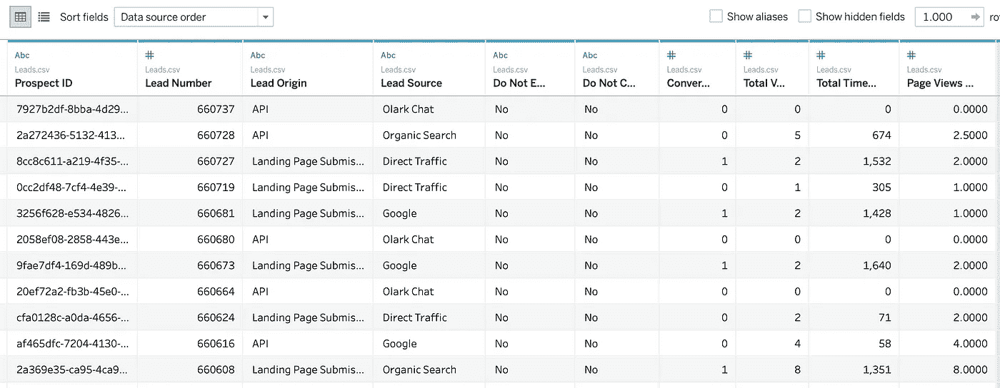
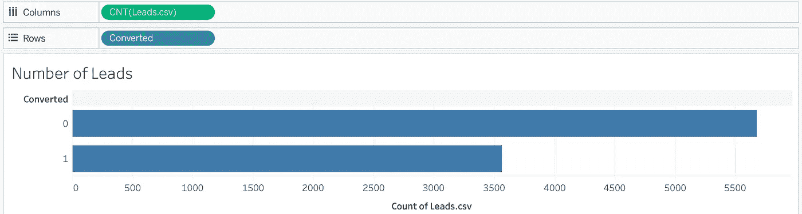
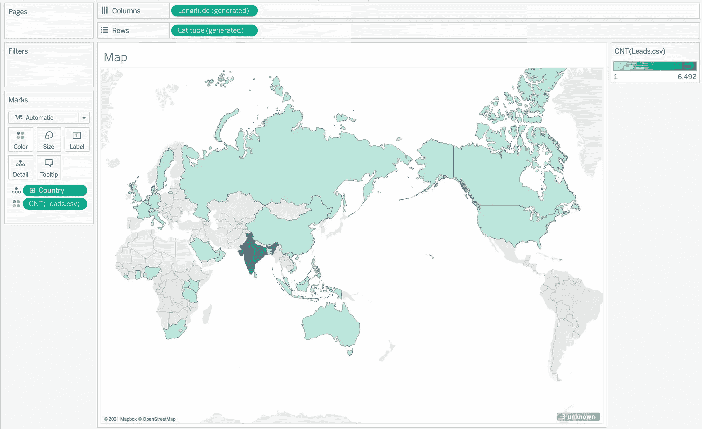
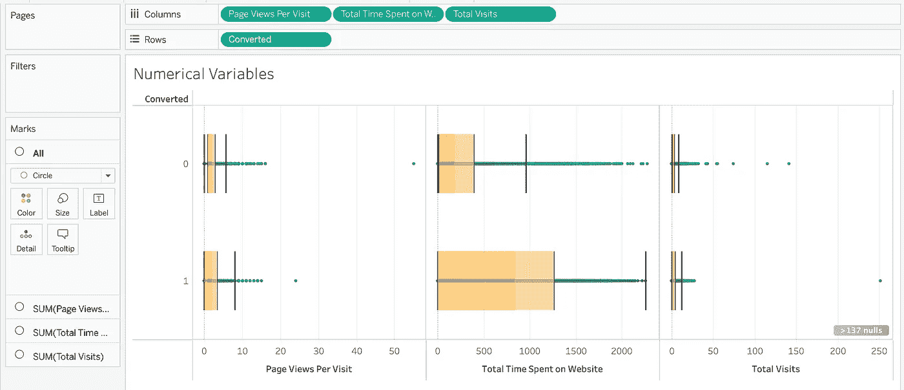
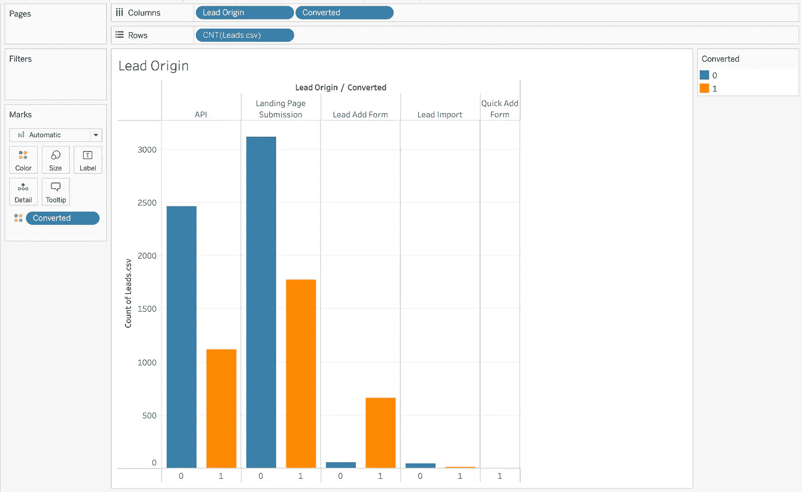
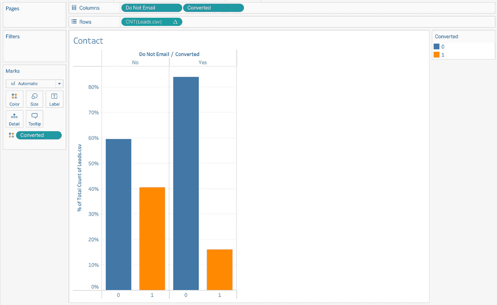
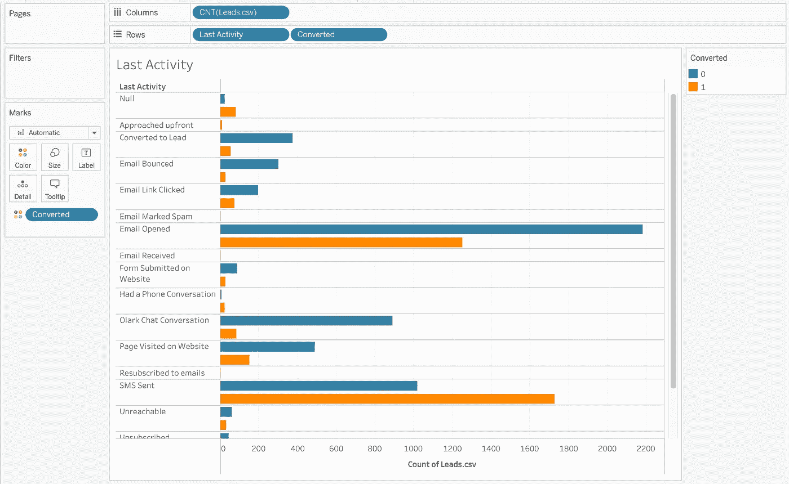
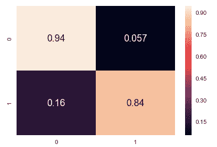

# 使用 Tableau 和 Scikit Learn 进行线索预测

> 原文：<https://towardsdatascience.com/leadprediction-with-tableau-und-scikit-learn-aa90b388bae1?source=collection_archive---------12----------------------->

## 基于 Kaggle 数据的案例研究

www.pexels.com 知识共享组织 CC0

## 任务

利用潜在客户(“潜在客户”)在网站上留下的数据，可以获得关于客户行为的重要见解和结果。然后使用机器学习从这些数据中创建预测模型。实例研究表明，该预测模型的准确率为 90%。

一家教育公司向行业专业人士出售在线课程。在任何一天，由于营销努力，许多对课程感兴趣的专业人士都会登陆他们的网站并浏览课程。这就是社交媒体渠道、网站或搜索引擎(如谷歌)吸引新潜在客户的方式。

一旦人们登陆该网站，他们就可以浏览课程，填写课程表格，或者观看一些视频。如果他们没有完成这一预期活动就再次离开网站，他们会被重新定位的活动带回来，并转化为销售线索。当这些人填写表格并提供他们的电子邮件地址或电话号码时，他们就被**归类为潜在客户**。

一旦获得这些线索，销售团队成员就开始打电话、写电子邮件等。通过这一过程，一些销售线索被转化，而大多数则没有。典型的铅转化率在 30%左右。

例如，如果他们一天收到 100 条线索，其中只有 30 条会转化。为了使这一过程更加高效，该公司希望**识别出**潜在的潜在客户，也称为**热门客户**。如果他们能够识别这些销售线索，销售线索转化率应该会提高。因为销售团队现在更专注于与潜在的潜在客户沟通，而不是打电话给所有潜在客户。这不仅使销售过程更快、更成功，还节省了人员成本。

我们的任务是创建一个模型，在该模型中，每个销售线索都分配有一个**销售线索得分**。销售线索得分较高的客户转化机会较高，而销售线索得分较低的客户转化机会较低。

## 数据

我们在这个演示中使用了来自 Kaggle 的数据[https://www.kaggle.com/ashydv/leads-dataset](https://www.kaggle.com/ashydv/leads-dataset)

数据集包含以下信息:

*   请求是否成为客户—该列称为“已转换”。
*   网站上的行为，如花费的时间、浏览的内容等。
*   表格中提供的信息
*   访问者是如何来到网站的(搜索引擎、推荐人、直接)

下表显示了数据的摘录。有 9240 人的数据记录，有 37 个特征。存储每个导联的特征。有些是数字特征，如访问网站花费的时间，但也有许多分类特征，如人口统计信息或来自 web 表单的信息。

数据可以通过 Kaggle 提供的 CSV 文件导入 Tableau。

记录的第一行

## 数据清理

正如实践中经常出现的情况，不完整的数据集提出了一个必须解决的问题。简单地删除所有不完整的记录通常不是可行的方法，因为太多的记录受到影响。详细的分析是必要的。

我们**删除缺失值超过 40%的特征**,因为这里没有什么可做的。在缺失数据较少的要素中，这些数据将被要素的主导值所取代。

此外，数据集中的许多列都有“选择”值。这些来自输入表单，其中客户没有从表单的列表中选择值(可能这不是强制输入)。“选择”显示在这里的数据集中。“选择”值和空值一样好，所以用空值替换。

如何执行这些步骤的详细描述可以在 https://www.kaggle.com/danofer/lead-scoring[找到](https://www.kaggle.com/danofer/lead-scoring)

根据分析，我们发现许多特征没有向模型添加信息，因此我们从进一步的分析中移除它们。 **16 个特征保留在数据集中**。

## 使用 Tableau 进行探索性数据分析

让我们首先通过创建一个简单的条形图来看看有多少潜在客户和非潜在客户。为此，将“已转换”作为维度拖至“行”，将销售线索数拖至“列”。

“已转换”功能指示销售线索是否已成功转换(1)或未成功转换(0)。在我们的数据集中，大约 38%的客户被赢得。

现在，让我们通过根据记录数量显示带有彩色国家的地图来查看数据的区域分布。

映射销售线索来源

为此，我们使用“国家”维度和销售线索数量以及适当的图表类型。Tableau 然后自动生成纬度和经度数据，并将它们放在“行”和“列”中。

很多数据来自印度，如图所示。

我们现在考虑数字特征“总访问量”、“在网站上花费的总时间”和“每次访问的页面浏览量”。我们使用“盒须”图来检查数据的分布。

数字特征的“盒须”图

已转化和未转化销售线索的网站访问次数的中位数是相同的。根据访问的总次数，不能期望得出结论性的陈述。

在网站上花更多时间的人更有可能改变信仰。建议改进网站，使其对用户更有帮助，并让用户继续关注网站。

转化和未转化的潜在客户每次访问的页面浏览量中位数**是相同的。从每次访问的页面浏览量来看，没有什么可以特别说明潜在客户的转化。**

**现在我们考虑范畴特征。**

销售线索是从哪个来源产生的？

潜在客户的来源

二维条形图(引线来源和转换)用于显示引线计数。

*   ‘Lead Add Form’的转化率非常高，但是 lead 的数量不是很高。
*   “API”和“登录页面提交”带来了更多的潜在客户。
*   “销售线索导入”产生的销售线索非常少

为了提高整体销售线索转化率，我们需要更加注重提高 API 和登录页面提交来源的销售线索转化率，并从销售线索添加表单中生成更多销售线索。

联系信息

我们看到，不想收到邮件的人，转化率很低。

作为最后一个例子，让我们看看用户的最后活动。

最后一次活动

大多数销售线索都将打开电子邮件作为他们的最后一项活动。**对于那些将手机短信记录为最后一次活动的潜在客户来说，发送的手机短信具有很高的转化率**。

## 预测模型

我们现在创建一个预测模型，为每个销售线索提供一个预测，说明它是否会在所考虑的时间段内转换。为了评估模型，只有 70%的数据用于创建模型。剩余的 30%用于通过创建预测并将其与实际转换数据进行比较来测试模型。

这为未来提供了一种**计算方法**，它根据销售线索特征计算转化概率，并提供了一种**对该预测有多好的估计**。平均多久出错一次？

为了构建预测模型，我们使用了**逻辑回归**模型类。逻辑回归是模拟二元因变量的统计模型。在我们的案例中，线索是否被转换。

模型中有许多特征，但是它们中的许多对模型的良好性没有任何贡献。我们现在执行**特征选择**。从我们可用的众多特征中，我们希望仅使用最重要的特征来建立模型，以便一方面获得更简单但也更稳定的模型。

**递归特征消除(RFE)** 的目标是逐渐选择越来越少的特征。首先，对原始特征集进行训练，并计算每个特征的重要性。然后，从当前特征集中移除最不重要的特征。在缩减的集合上递归地重复该过程，直到最终获得缩减的期望数量的特征。然后，我们用减少的特征数创建一个新模型。

使用 Scikit Learn 训练模型的代码可在此处找到:

## 用 30%测试数据进行评估

这样，我们现在可以用测试数据来确定预测的准确性。这个大概是 90.5%。

误差矩阵

通过误差矩阵，我们可以了解模型在评估过程中出现何种误差的频率。**在 5.7%的预测中，一个转换被错误地预测**，尽管没有。这是一个相当适合实践的数值。

**16%的转化案例未被检测到**。这也是一个有用的值。

## 摘要

我们从分析数据中获得了以下见解:

*   花在网站上的时间是成功完成的一个很好的指标。
*   “潜在客户来源”在潜在客户数量和转化率方面有很大差异。
*   最后记录的活动为预测提供了重要信息。

该信息用于创建新销售线索的预测模型，在评估时，显示预测**准确率略高于 90%** 。