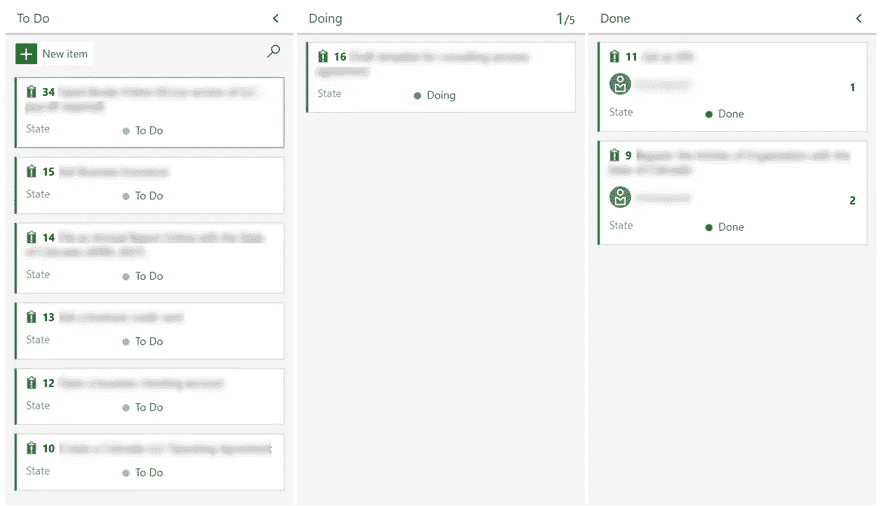
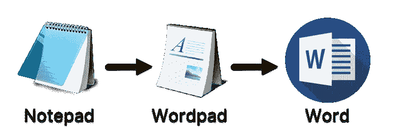

# 精益毫升

> 原文：<https://towardsdatascience.com/lean-ml-c003511b29a1?source=collection_archive---------45----------------------->

萨姆·穆卡达姆在 [Unsplash](https://unsplash.com?utm_source=medium&utm_medium=referral) 上拍摄的照片

## [入门](https://towardsdatascience.com/tagged/getting-started)

## *精益软件开发*的原则如何应用于机器学习项目？我们来看看吧！

# 介绍

诞生于汽车行业的*精益制造原则*已经被软件工程社区热情拥抱。总的来说,*精益原则*寻求在软件开发过程中最小化浪费的努力，并最大化客户对你的产品的满意度。如果它适用于制造汽车和构建传统软件，那么对于您的下一个 ML 项目来说，它值得一看！

以下是原则:

*   **消除浪费**
*   **在**中构建质量
*   **加速学习**
*   **推迟决策**
*   **送快递**
*   **授权给你的团队**
*   **整体优化**

# 启动你的冲浪板

微软 Azure 上的看板(图片由作者提供)

在我对一个项目做任何事情之前，我确保我有我的*看板板*设置！本着保持精益的精神，管理一个项目，没有比定义任务(当它们显露出来的时候)并跟踪每个任务从 ***到>做- >完成*** 更简单的了！

这是*敏捷*方法的最简单、最轻的版本。完整的方法论包括将像*功能*、*故事*和*任务*这样的事情安排到*冲刺*中——这对于很多项目来说可能是多余的。

最棒的是——*看板*是*免费*！点击*微软*的链接，开始在云中做这件事:

 [## 看板快速入门- Azure 板

### 你的看板把你的待办事项变成了一个交互式的招牌，提供了一个可视化的工作流程。作为工作…

docs.microsoft.com](https://docs.microsoft.com/en-us/azure/devops/boards/boards/kanban-quickstart?view=azure-devops) 

# 概念验证 vs MVP vs 产品

微软文字处理产品(作者图片)

要想在一个 ML 项目中取得成功，重要的是*先走后跑*。我总是从一个无技术或低技术的概念验证开始，来梳理这个项目是否值得。当回报遥遥无期时，没有理由投入大量时间或金钱来构建一个复杂的 ML 模型。

当我从浅入深时，就我的 ML 项目的价值主张来挑战我自己是必要的。

为了说明的目的，我们可以想到微软的文字处理产品:*记事本*是一个基本的文本编辑器；*写字板*在基本的富文本格式上更进了一步；微软 Word 是面向专业人士的终极文字处理软件。

## 概念证明(POC)

这是原型阶段，我证明了将机器学习技术应用于我的项目的整体概念是有价值的。在这一点上，快速行动/快速失败是很重要的:我只是使用现成的算法和框架来快速建立我所想的几乎不起作用的版本。

## 最小可行产品(MVP)

现在是时候认真构建一个能够经受住部署到生产的严酷考验的机器学习模型了。如果我已经扫清了概念验证的障碍，并走到了这一步，那么是时候投资于详尽的模型选择/调整工作，并确保我的 MLOps 管道中的*管道*能够承受压力。

这个阶段成功的关键是抑制我对产品*功能*的热情。我的机器学习项目的这个版本不需要取悦客户——它只需要为他们提供一些基本的功能，让他们体验即将到来的东西。

## 产品

假设我的 MVP 产生了很多兴奋，是时候卷起袖子，认真对待*功能*了。管道和脚手架现在应该已经准备好了，所以在这一点上的大部分工作都围绕着梳理出哪些特定的特性会让我的客户高兴，以及什么是最佳的工作流。

我努力不低估工作流程的重要性。过去，有这些笨重的便携式 MP3 播放器用来听音乐。早期的模型一点也不直观，需要阅读用户手册才能操作。然后苹果公司带着他们的 iPod 出现了，游戏完全改变了。我们现在都希望能够在没有指导的情况下使用手机上的应用程序——我们的机器学习产品应该具备这种可用性水平。

# 进化而非革命

从本质上来说，*精益原则*是关于*将*从一个基本的*原型*发展成为生产中功能齐全的*产品*。我发现这个过程中最难的部分之一是放下*死胡同*:当我发现自己朝着一个没有结果的方向前进时，我需要*停止*、*支持*、以及*再次尝试*！说起来容易做起来难。但这并不是用完美的计划描绘出完美的产品，而是通过快速、反复的尝试发现理想的产品。

# 7 项原则

Fabrizio Chiagano 在 [Unsplash](https://unsplash.com?utm_source=medium&utm_medium=referral) 拍摄的照片

精益原则与其说是具体的项目生命周期方法，不如说是一种态度或哲学。我试图在我的 ML 项目中记住它们——但避免对此过于严格——这都是为了保持精益！

## 消除浪费

这里的当务之急是简化开发过程——去除任何减缓向客户交付价值的东西。这可能意味着过度官僚化的过程、过度的上下文切换、需求变动、过高的目标等等。

## 将质量建立在

bug 是在浪费大家的时间。降低软件质量最可靠的方法是建立一个质量保证部门。质量需要成为每个人的关注点——在整个过程中——而不仅仅是那些标题中有名词的人。

## 加速学习

ML 项目的团队应该在结束时带着比开始时更多的知识离开。同行评审、频繁的头脑风暴会议、培训演示、全面的文档和有意义的注释代码是如何实现这一点的一些例子。

## 推迟决定

我试图尽可能晚地将假设和决策锁定在我的 ML 模型中，拥抱迭代的方法来充实我的项目，并抵制在不得不提交之前提交的诱惑。

## 快速交付

我的 ML 项目越早交到客户手中，我就能越早收到有价值的反馈——为我下一次迭代的成功做好准备。

## 授权给你的团队

团队成员必须有一种主人翁意识，才能达到最高的工作效率，因此确保沟通渠道保持畅通，每个人的意见都得到尊重，这一点至关重要。

## 整体优化

我们对这一原则的关注是提高我们向客户交付价值的速度——在整个 ML 项目团队中。这是关于所有团队成员和利益相关者在追求速度最大化的过程中减少摩擦。

# 结论

挑战自己，在下一个 ML 项目中使用*看板*——即使只是一个快速教程。将这 7 条精益原则放在你面前，并考虑如何将它们应用到你目前正在做的事情中。是否有机会将您的交付成果分成 POC / MVP /产品？那会是什么样子呢？