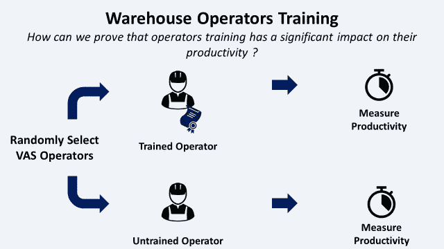
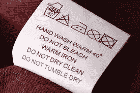
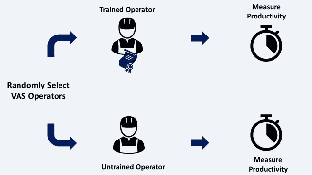
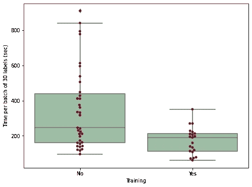
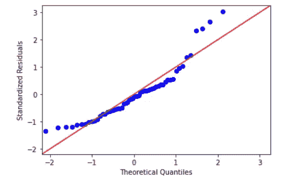
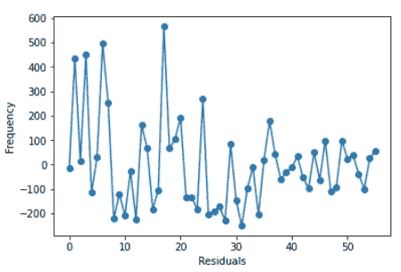

# 精益六适马与 Python-Kruskal Wallis 测试

> 原文：<https://towardsdatascience.com/lean-six-sigma-data-analytics-with-python-kruskal-wallis-test-3afafa097ed?source=collection_archive---------17----------------------->

## 如何用 **Python** 替换 **Minitab** 来执行**克鲁斯卡尔沃利斯测试**评估培训对仓库操作员生产力的**影响**



仓库操作员培训—(图片由作者提供)

**精益六适马(LSS)** 是一种基于逐步改进流程的方法。

这种方法通常遵循 5 个步骤(**定义、测量、分析、改进和控制)**来改进原因不明的现有流程问题。

在本文中，我们将探讨 **Python** 如何在**分析**步骤中取代**Minitab***(LSS 专家广泛使用的软件)* 来测试**假设**和**了解**什么可以提高特定流程的**性能指标**。

💌新文章直接免费放入你的收件箱:[时事通讯](https://www.samirsaci.com/#/portal/signup)

```
**SUMMARY**
**I. Problem Statement** *Can we improve the operators' productivity by giving them a training designed by R&D team?*
**II. Data Analysis
1\. Exploratory Data Analysis**
Analysis with Python sample data from experiment with few operators 
**2\. Analysis of Variance (ANOVA)**
Verify the hypothesis that training impacts productivity
ANOVA assumptions are not verified
**3\. Kruskal-Wallis test** Confirm that the hypothesis can be generalized
**III. Conclusion**
```

如果你喜欢看，你可以看看这篇文章的视频版本

# 一.问题陈述

## 1.方案

你是一家专注于**时装、香水和手表**的标志性奢侈品牌**配送中心(DC)** 的**持续改进经理**。

仓库在[入库流程](https://www.youtube.com/watch?v=nz69i6l7SzI&t=72s)中接收**需要**总装**和 [**增值服务**](https://www.youtube.com/watch?v=vrT6VhVkBJ4) 的**服装**。**


某奢侈品牌配送中心的 4 条增值服务生产线车间示例—(作者提供的 CAD 模型)

对于**收到的每件服装**，您的操作人员需要**用当地语言打印标签**并且**执行标签缝制**。



标签示例—(图片由作者提供)

在本文中，我们将重点关注**标签缝制生产率**的提高。

标签以 30 个为一批分发给操作人员。生产率是根据完成一个批次所需的时间(秒)来计算的。


4 个标签缝制工作站—(作者提供的 CAD 模型)

## 2.培训员工的影响

在 R&D 团队的支持下，您为 VAS 操作员设计了培训，以提高他们的[生产力](https://www.youtube.com/watch?v=KR_ziEiPcDk)并减少质量问题。

**问题**
培训对操作员的[生产力有积极影响吗？](https://www.youtube.com/watch?v=KR_ziEiPcDk)

**假设**
培训对 VAS 操作员的生产力有积极影响。

**实验** 随机选择操作者，测量每批时间*(以秒为单位完成一批 30 个标签的时间)*构建 **56 条记录的样本**。



测试我们假设的数据驱动分析—(图片由作者提供)

<http://samirsaci.com>  

# 二。数据分析

> *你可以在这个 Github 资源库中找到完整的代码:* [*链接*](https://github.com/samirsaci/lss-kruskal-wallis)

## 1.探索性数据分析

你可以把这个实验的结果下载到这个 CSV 文件中，在你的电脑上运行整个代码([此处](https://gist.github.com/samirsaci/5dbd7eb5c3903ff1a7c57a47601f5adf))。

实验结果:每个操作员的生产率(秒/批次)

> 56 条记录
> 35 条未培训操作人员记录
> 21 条培训操作人员记录

**方框图**



实验结果的箱线图—(图片由作者提供)

根据样本数据，我们可以看到，受过培训的操作员的中值和平均值要低得多。

**假设**
该训练减少了每批的平均时间。

**代码**

```
**Minitab**
Menu Graph > Box Plot > Simple > 1 Y with Groups 
```

## 2.方差分析(ANOVA)

在这个场景中，我们想要检查**培训(变量 X)** 是否影响**每批总时间(变量 Y)** 。

因为 **X 是分类变量**(训练=是/否) **Y 是数值**，所以合适的方法是 **ANOVA** 。

**ANOVA 是一种统计方法**，用于检查我们是否可以将样本数据中的均值差异推广到整个人群。

**第一步:计算 p 值**

```
Source: Training
ddof:   11
ddof:   245.267
F:      17.1066
**p-unc**:  0.000151308
p:      20.173692p-value is below 5%
```

**代码**

```
**Minitab**
Menu Stats > ANOVA > One-Way 
```

**第二步:验证方差分析的假设**

基于 p 值，我们知道平均值的差异是真实的，而不是由于随机波动。

然而，在得出结论之前，我们需要检查方差分析假设是否得到满足

*   残差是自然分布的



残差分布—(图片由作者提供)

**回答:**没有

*   没有异常值或不规则性



对比顺序—(图片由作者提供)

**回答:**没有

**结论**

**代码**

```
**Minitab**
Menu Stats > ANOVA > One-Way > Graphs > Four in one
```

## 3.克鲁斯卡尔-沃利斯试验

如果您的样本数据不符合 **ANOVA** 的要求，您可以使用 **Kruskal-Wallis 检验**来检查均值的差异是否是由于随机波动造成的。

```
**statistic** = 54.99
**pvalue** = 1.205e-13
**p-value is below 5%**
```

**结论**

我们可以确认培训对操作员的生产力有积极的影响。

**代码**

```
**Minitab**
Menu Stats > Non-parametric > Kruskal Wallis > Graphs > Four in one
```

如果您对使用 Python 的精益六适马方法的其他应用感兴趣，可以看看下面的文章:

<https://www.samirsaci.com/lean-six-sigma-with-python-chi-squared-test/>  <https://www.samirsaci.com/lean-six-sigma-with-python-logistic-regression/>  

# 三。结论

*关注我的 medium，了解更多与供应链数据科学相关的见解。*

这种数据驱动的方法为您提供了足够的要素，让您能够说服管理层投资劳动力培训。

通过使用统计学从样本数据中归纳出模式，你用适度的实验努力带来了足够的洞察力。

# 关于我

让我们在 [Linkedin](https://www.linkedin.com/in/samir-saci/) 和 [Twitter](https://twitter.com/Samir_Saci_) 上连线，我是一名供应链工程师，正在使用数据分析来改善物流运营并降低成本。

如果你对数据分析和供应链感兴趣，可以看看我的网站

<https://samirsaci.com>  

# 参考

[1]变异数的 ANOVA 分析， [Ted Hessing](https://sixsigmastudyguide.com/author/sixsigmaadmin/) ，六适马学习指南， [link](https://sixsigmastudyguide.com/anova-analysis-of-variation/)
[2]奢侈品总装线的排产与 Python，Samir Saci， [link](/scheduling-of-luxury-goods-final-assembly-lines-with-python-e5c4b0590bfc)