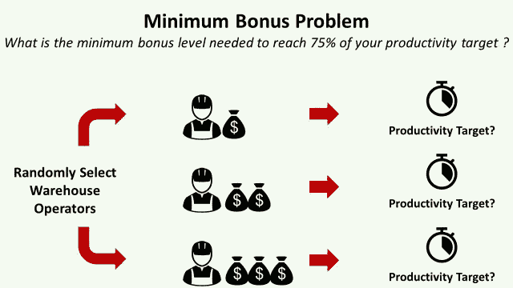

# 基于 Python 的精益六适马—逻辑回归

> 原文：<https://towardsdatascience.com/lean-six-sigma-with-python-logistic-regression-36d160e84548?source=collection_archive---------30----------------------->

## 用 Python 替换 Minitab 以**执行逻辑回归**以**估计达到 75%的生产率目标所需的最低奖金**



最低奖金问题-——(图片由作者提供)

精益六适马是一种可以定义为过程改进的逐步方法的方法。

在之前的一篇文章中，我们使用了**克鲁斯卡尔-沃利斯测试**来验证特定培训对运营者**入站增值服务生产力**产生积极影响的假设。([链接](/lean-six-sigma-data-analytics-with-python-kruskal-wallis-test-3afafa097ed?source=your_stories_page-------------------------------------))

在本文中，我们将使用 Python 实现**逻辑回归**，以评估**每日生产率奖金**对您的**仓库操作员拣选生产率**的影响。

💌新文章直接免费放入你的收件箱:[时事通讯](https://www.samirsaci.com/#/portal/signup)

```
**SUMMARY**
**I. Problem Statement** *What should be the minimum amount of daily incentive to get 75% of workers that reach their productivity target?*
**II. Data Analysis
1\. Exploratory Data Analysis**
Analysis with Python sample data from experiment 
**2\. Fitted Line Plot of your Logistic Regression**
What is the probability of reaching the target for each value of daily incentive?
**3\. Validation with the p-value** Validate that your results are significant and not due to random fluctuation
**III. Conclusion**
```

如果你喜欢看，可以看看这篇文章的视频版本

# 一、如何优化仓库操作员的生产力奖金？

## 1.方案

你是一家**物流公司(3PL)** 的区域总监，你的职责范围内有 **22 个仓库**。


带提货、VAS 和包装的履行中心—(作者设计的 CAD 模型)

在每个仓库，现场经理为操作人员确定了一个[拣货生产率](https://www.youtube.com/watch?v=KR_ziEiPcDk)目标；你的目标是找到正确的激励政策，以达到该目标的 75%。

## 2.找到正确的激励政策

目前，除了日薪 **64 欧元** *(税后)*之外，有生产能力的操作人员*(达到每日生产能力目标的操作人员)*每天还能获得 **5 欧元**。

但是这个激励政策在 2 个仓库**应用的效果不是那么好**；只有 20%的操作员达到了这个目标。

**问题** 要达到 75%的拣货生产率目标，每天需要的最低奖金应该是多少？

**实验**

1.  **在你的 22 个仓库中随机**选择操作员
2.  实施**每日奖励**金额，在 **1 至 20 欧元**之间变化
3.  检查**操作员是否达到他们的目标**

# 二。数据分析

## 1.探索性数据分析

> *你可以在这个 Github(跟我来:D)资源库中找到完整的代码:* [*链接*](https://github.com/samirsaci/lss-logistic-regression) *。
> 我的投资组合与其他项目:* [*小萨奇*](https://samirsaci.com/)

样本分布的箱线图


按目标划分的激励分布箱线图—(图片由作者提供)

> 达到目标日的奖励中值比低于该目标日的奖励中值高两倍以上。

## 2.逻辑回归的拟合线图

逻辑回归将为我们提供一个概率图。我们可以估计每天激励的每个值达到目标的概率。


样本数据的拟合线图—(图片由作者提供)

> 确认当前趋势:5 欧元->达到 20%的生产率目标
> 
> 我们需要每天至少 15 欧元的奖励，以确保 75%的可能性达到目标

**代码**

```
**Minitab**
Menu Stat > Binary Fitted Line Plot
```

## 3.使用 p 值进行验证

为了检查这些基于样本数据的结果是否显著，我们需要计算 p 值。

```
p-value: 2.1327739857133364e-141
p-value < 5%
```

**p 值低于 5%** ,因此我们可以得出均值差异具有统计学意义的结论。

**结论** 如果你固定了价值 **15 欧元每天**的激励，你将达到目标的 75%。

**代码**

```
**Minitab**
Menu Stat > Binary Fitted Line Plot
```

如果您对使用 Python 的精益六适马方法的其他应用感兴趣，可以看看下面的文章:

[](https://www.samirsaci.com/lean-six-sigma-with-python-chi-squared-test/) [## 使用 Python - Chi-Squared 测试的精益六适马

### 物流持续改进执行卡方检验，解释影响您的…

www.samirsaci.com](https://www.samirsaci.com/lean-six-sigma-with-python-chi-squared-test/) [](https://www.samirsaci.com/lean-six-sigma-with-python-kruskal-wallis-test/) [## 使用 Python - Kruskal Wallis 测试精益六适马

### 物流持续改进如何用 Python 替换 Minitab 来执行 Kruskal Wallis 测试评估…

www.samirsaci.com](https://www.samirsaci.com/lean-six-sigma-with-python-kruskal-wallis-test/) 

# 三。结论

*关注我的 medium，了解更多与供应链数据科学相关的见解。*

## 投资回报率是多少？

基于这一实验，我们确定了最低金额为 **15 欧元/天**，用于奖励**达到您的** [**生产率目标**](https://www.youtube.com/watch?v=KR_ziEiPcDk) 的 75%。

在实施这一新的激励政策之前，您需要检查您的投资回报是否为正:

*   提货操作员每小时的总**公司成本(CTC)** (基本工资+社会贡献)是多少？**(欧元/小时)**
*   生产率提高后获得的总小时数是多少？**(小时)**
*   雇佣这个小时数的临时工的 **CTC 是多少？**(欧元)****
*   激励措施的总 **CTC 是多少？**

回答完这些问题后，你将能够估计这项新激励政策的投资回报。根据操作员的每小时成本，您可能会损失或节省资金。

## 后续步骤

然而，操作员的工作效率可能不仅受他们的动机驱动，还会受到仓库布局、提货流程或订单概况的影响。

因此，该分析应通过流程优化研究来完成，以确保运营商能够在适当的激励下充分发挥其潜力。*(更多信息可以查看我之前关于仓库拣货效率的系列:* [*链接*](/optimizing-warehouse-operations-with-python-part-1-83d02d001845?source=your_stories_page-------------------------------------) *)*

# 关于我

让我们在 [Linkedin](https://www.linkedin.com/in/samir-saci/) 和 [Twitter](https://twitter.com/Samir_Saci_) 上连线，我是一名供应链工程师，正在使用数据分析来改善物流运营和降低成本。

如果你对数据分析和供应链感兴趣，可以看看我的网站

[](https://samirsaci.com) [## Samir Saci |数据科学与生产力

### 专注于数据科学、个人生产力、自动化、运筹学和可持续发展的技术博客

samirsaci.com](https://samirsaci.com) 

# 参考

sklearn 逻辑回归的 P 值， [Rob Speare](https://gist.github.com/rspeare/77061e6e317896be29c6de9a85db301d)

[2]使用 Python、Samir Saci、L [ink](/optimizing-warehouse-operations-with-python-part-1-83d02d001845) 的订单批处理提高仓库生产率

[3]精益六适马与 Python — Kruskal Wallis Test，Samir Saci，[链接](/lean-six-sigma-data-analytics-with-python-kruskal-wallis-test-3afafa097ed)