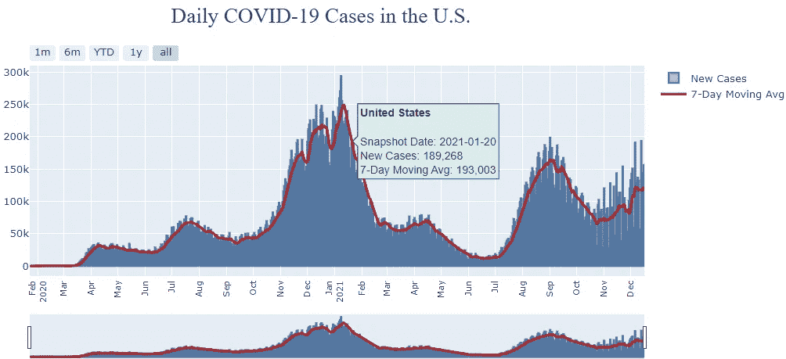
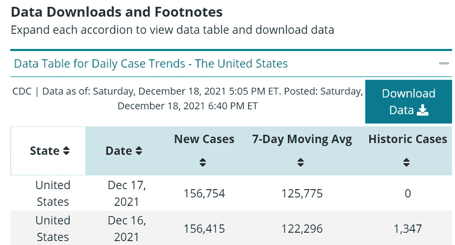
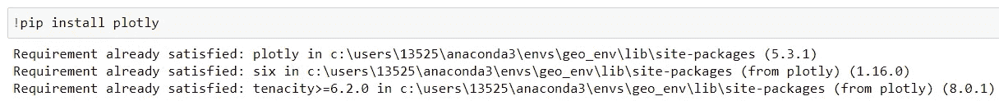
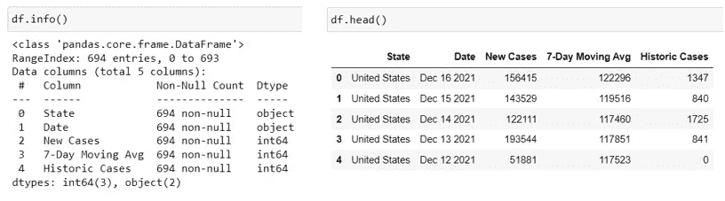
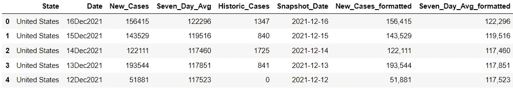
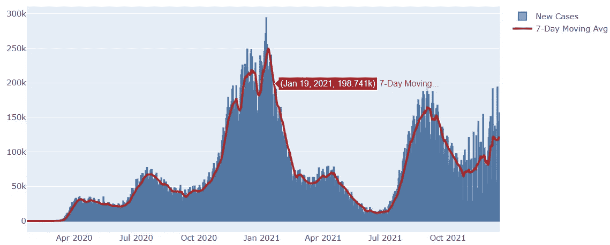
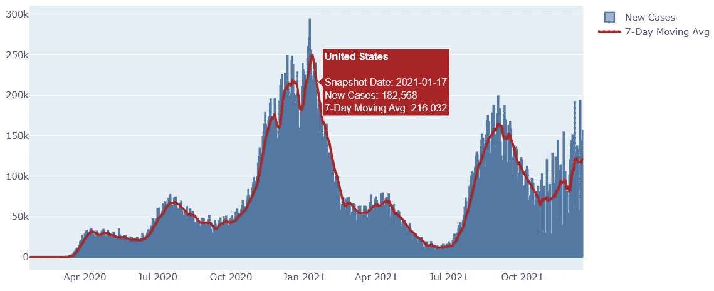
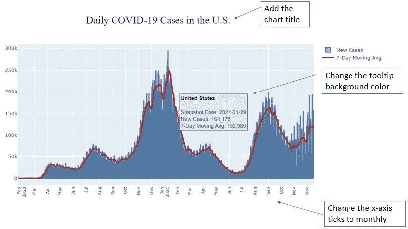
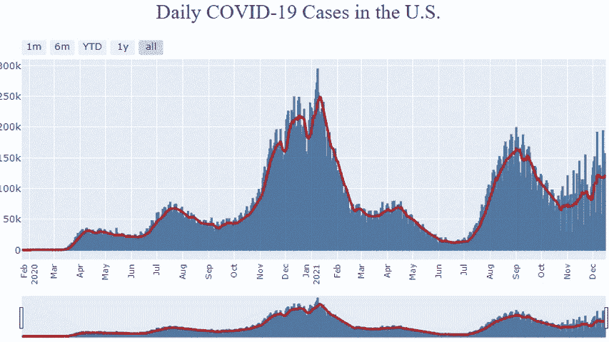

# 从 Matplotlib 到 Plotly 的飞跃:初学者实践教程

> 原文：<https://towardsdatascience.com/leap-from-matplotlib-to-plotly-a-hands-on-tutorial-for-beginners-d208cd9e6522?source=collection_archive---------12----------------------->

## 如何使用 Plotly 创建带有自定义工具提示和范围滑块的交互式组合图

图片来源: [Pixabay](https://pixabay.com/illustrations/books-leap-high-to-learn-boy-4342968/)

# 介绍

作为一名数据科学家，在了解 *Plotly* 之前，我曾经非常依赖 Matplotlib 来完成我的数据可视化任务。虽然 Matplotlib 是一个在 Python 中创建可视化的快速而简单的工具，但它最适合于初始探索性分析和静态绘图。如果你想用 Matplotlib 做一些不仅仅是基本的静态图，有时会变得非常复杂。

*Plotly，*另一方面，是一个更新的开源图形库，旨在高效地创建更复杂的交互式可视化。它通常只需要最少的努力和几行必要的代码就能创造出美观和互动的情节。近年来，它在数据科学社区获得了显著的增长和发展，将来可能会超过 Matplotlib 的受欢迎程度。

在本文中，我将一步一步地向您展示如何使用 *Plotly* 创建一个带有定制工具提示和范围滑块/选择器的交互式组合图。在整个教程中，你将学习到*的关键概念和特性，同时提供完整的代码供你一路尝试。*

我们正在构建的交互式组合图如下所示:

使用 Plotly 的交互式组合图(图片由作者提供)

# Plotly Express vs. Plotly Go

*Plotly* Python 库是一个交互式的开源图形库，涵盖了广泛的图表类型和数据可视化用例。它有一个名为 *Plotly Express* 的包装器，是 *Plotly* 的高级接口。

*Plotly Express* 作为一个起点，使用简单的语法创建最常见的图形既简单又快捷，但在涉及更高级的图表类型或自定义时，它缺乏功能性和灵活性。

与 Plotly Express 相比，Plotly Go (图形对象)是一个低级的图形包，通常需要更多的编码，但更具可定制性和灵活性。在本教程中，我们将使用 *Plotly Go* 创建如上所示的组合图。您还可以将代码保存为模板，以便在其他用例中创建类似的图表。

# 下载数据

用于创建组合图的数据可以从 [CDC](https://covid.cdc.gov/covid-data-tracker/#trends_dailycases) 的网站下载。这是一个开放式数据集，用于跟踪美国每天的新冠肺炎新病例和 7 天移动平均数。

每日新冠肺炎病例数据(数据来源: [CDC](https://covid.cdc.gov/covid-data-tracker/#trends_dailycases)

# 导入库并读取数据

让我们首先导入本教程所需的所有库，并将数据读入 python。如果这是你第一次使用 *Plotly，*你需要在导入库之前安装 *Plotly* 。你可以在你的 Jupyter 笔记本上运行下面的命令行(我已经有了 *Plotly* 所以它显示‘需求已经满足’)。

安装 Plotly(图片由作者提供)

数据集信息(按作者分类的图像)

这是一个相当简单的数据集，几乎可以被可视化。我们注意到“日期”字段是一个字符串，所以我们需要将其转换为“日期”类型。此外，为了最佳实践，我总是重命名单词之间有空格的字段，所以我们将通过删除空格来重命名最后三个字段。

最后一件事是，后来，我们想显示“新的情况”和“7 天移动平均”在工具提示的阴谋。如果用千位分隔符显示数字，会更容易阅读。我们可以通过创建两个新的重新格式化的字段(对象类型)来处理这个问题，这两个字段将显示带有千位分隔符的数字。

可用于可视化的数据框

# 使用 Plotly Go 创建标准组合图

要使用 *Plotly Go* (图形对象)开始绘图，我们需要首先使用 *go 创建一个图形。Figure()* 然后使用 *fig.add_trace()向其添加两条*轨迹*。*什么是痕迹？来自 [*Plotly*](https://plotly.com/python/figure-structure/) 的文档:

> “跟踪只是我们给数据集合起的一个名字，以及我们想要绘制的数据的规格。请注意，轨迹本身也是一个对象，并且将根据您希望数据在绘图表面上的显示方式来命名。

追踪类似于您希望用数据绘制的特定可视化类型。每个轨迹都有 40 多种可能的类型，包括散点图、条形图、饼图、choropleth 图等。在我们的例子中，由于我们正在绘制一个组合图(折线图和条形图的组合)，我们将向图中添加两条轨迹。

注意，线形图是使用 *go 绘制的。散布()。*这是因为 *Plotly* 折线图被实现为相连的散点图。这也意味着数据点按照它们在数据集中出现的顺序与线连接。因此，如果最初的排序没有得到想要的输出，您可能需要在将数据传送到 *Plotly* 之前对数据进行明确的排序。

使用 Plotly 的基本交互式组合图(图片由作者提供)

# 自定义悬停工具提示

默认情况下， *Plotly* 自动在工具提示中显示 x 轴和 y 轴值。例如，在上图中，如果将鼠标悬停在折线图中的任何数据点上，将出现一个工具提示，并显示新案例的快照日期和 7 天移动平均值。

我们可以自定义工具提示的外观，首先在数据框中创建一个名为“文本”的新列。这个“文本”列显示了我们想要在工具提示中显示的信息，并定义了工具提示的外观和感觉。然后，我们将这个列“文本”传递给 *go。通过将其分配给 *hoverinfo* 参数来散布()*轨迹。

以下代码在数据框中创建“文本”列。被称为 Boldface 元素的 **HTML 元素在这里被用来将“State”字段的文本加粗。HTML 元素在文本中产生一个换行符，并且文本在文本块的下一行的开始处重新开始。**

现在让我们将“文本”列传递给 *go 中的 *hoverinfo* 参数。Scatter()* 并检查它在工具提示中的外观:

带有自定义工具提示的组合图(图片由作者提供)

这个看起来不错！让我们对剧情做一些额外的调整，让它看起来更专业。我们将把工具提示的背景颜色从红色改为浅蓝色。我们还将为该图添加一个图表标题，并将 x 轴刻度改为月度(而不是季度)。所有这些更改都可以使用 *fig.update_layout()* 来实现，如下面的代码所示。

作者图片

# 添加范围滑块/选择器

我们还可以向绘图添加一个范围选择器/滑块，以便用户可以放大到特定的时间序列范围，这使得可视化更加丰富和互动！这可以通过使用 *fig.update_xaxes()* 用几行代码轻松实现。

交互式组合图(图片由作者提供)

这就对了。您已经使用 *Plotly Go* 创建了一个交互式组合图，通过定制的工具提示和范围滑块/选择器来可视化美国每天的新冠肺炎病例趋势。正如你所看到的，Plotly 图形库非常强大，优雅，高度可定制。它使得创建复杂的交互式可视化的任务变得非常容易和高效。我希望这篇文章对你有所帮助，并准备好将 *Plotly* 添加到你的数据科学家工具箱中。

参考和数据来源:

1.  Plotly 官方文档页面:[https://plotly.com/python/](https://plotly.com/python/)
2.  数据来源:来自疾病控制和预防中心(CDC)网站([https://covid.cdc.gov/covid-data-tracker/#trends_dailycases](https://covid.cdc.gov/covid-data-tracker/#trends_dailycases))的公开新冠肺炎追踪数据集

你可以通过这个[推荐链接](https://medium.com/@insightsbees/membership)注册 Medium 会员(每月 5 美元)来获得我的作品和 Medium 的其他内容。通过这个链接注册，我将收到你的会员费的一部分，不需要你额外付费。谢谢大家！