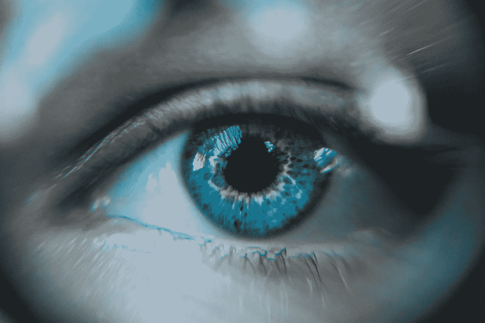
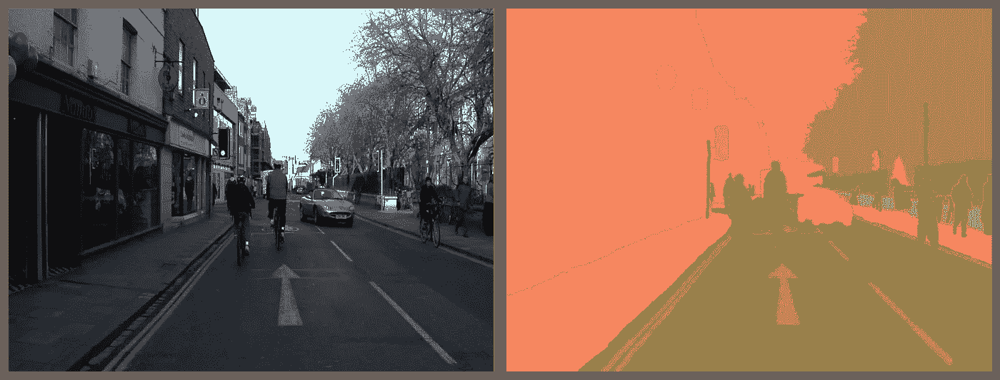
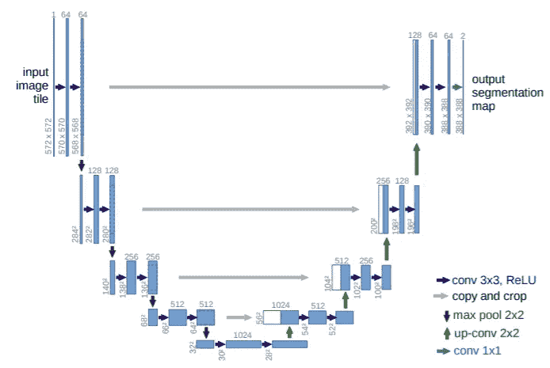
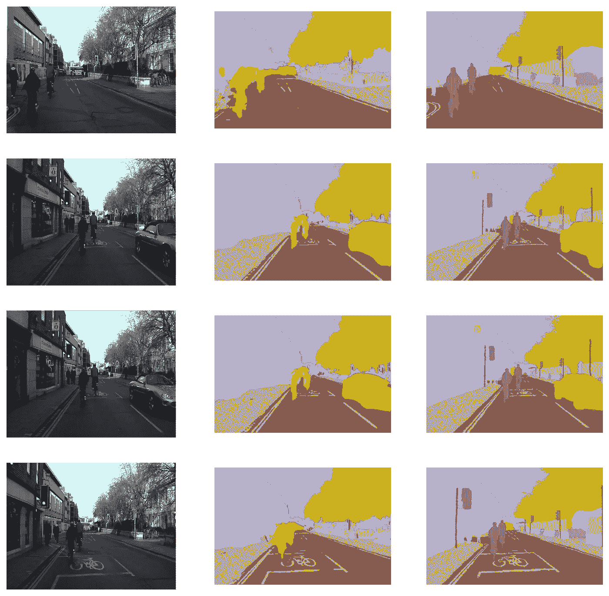
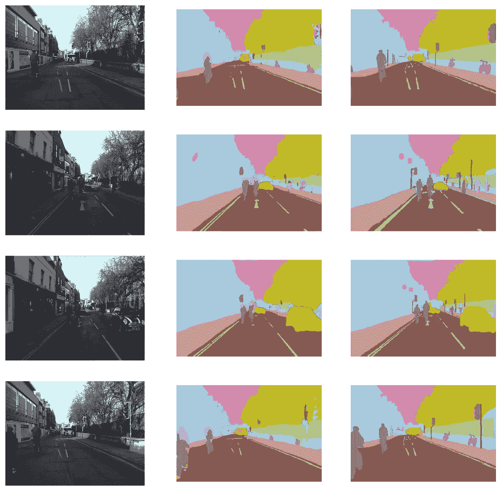

# 今天学习人工智能 05:用 U-Net 模型进行图像分割

> 原文：<https://towardsdatascience.com/learn-ai-today-05-image-segmentation-with-u-net-models-800105e400d1?source=collection_archive---------18----------------------->

## [今天学 AI](https://towardsdatascience.com/tagged/learn-ai-today)

## 面向实用深度学习的图像分割简介

[丹尼尔·库切列夫](https://unsplash.com/@kuzelevdaniil?utm_source=unsplash&utm_medium=referral&utm_content=creditCopyText)在 [Unsplash](https://unsplash.com/s/photos/mirror?utm_source=unsplash&utm_medium=referral&utm_content=creditCopyText) 上的照片。

这是 [**学艾今日**](http://learn-ai-today.com/) 系列的第 5 个故事！如果你还没有，一定要检查以前的故事。

 [## 今日学习人工智能 04:时间序列多步预测

### 创建并训练一个 1D 卷积神经网络来预测混沌时间序列的多个未来时间步…

towardsdatascience.com](/learn-ai-today-04-time-series-multi-step-forecasting-6eb48bbcc724) 

# 你将从这个故事中学到什么:

*   图像分割的意义和一些实际应用。
*   用于图像分割的 U-Net 体系结构。
*   如何使用 fastai 库训练 U-Net 模型标注街景数据？
*   如何使用基于预训练 ResNet34 的 fastai U-Net 类模型？

# 什么是图像分割

图像分割是一个**计算机视觉**问题，其中给定一些输入图像，你的任务是识别图像中每个像素的类别。一个常见的应用是标记街景图像/视频，以便在自动驾驶汽车中使用。正如您在下图中看到的，输入(左)是一张常规图片，输出(右)中叠加的标签对应于几个类别，包括人、车道标志、建筑物、天空等等。

图 0。来自 [CamVid](https://mi.eng.cam.ac.uk/research/projects/VideoRec/CamVid/) 数据集的街景样本。

除了街景图像，图像分割的一些常见应用包括:

*   生物医学图像分割(X 射线、MRI 等)以识别异常并帮助医生进行医疗诊断。
*   卫星图像分割，以确定土地覆盖，烧毁地区，街道，房屋，云，水体，作物健康，任何你能想象到的。

# U-Net 模型架构

U-Net 是用于图像分割任务的非常常见的模型架构。早在 2015 年，它就在一篇展望生物医学图像分割的科学论文中被提出，但很快成为任何图像分割问题的主要选择之一。

图一。U-Net 架构。[图片来自原学术论文](https://www.researchgate.net/publication/276923248_U-Net_Convolutional_Networks_for_Biomedical_Image_Segmentation)。

U-Net 这个名字直观地来自图 1 中模型图的 U 形结构。

*   **左侧(编码器)**具有图像分类模型的典型结构，其中卷积层插入逐渐降低图像维度的最大池层。
*   **右侧(解码器)**是一种相反的情况——一组卷积运算和放大，然后将特征图恢复到原始大小。(图中的输出尺寸比输入尺寸稍小，但现在通常的做法是输入和输出尺寸相同)。
*   U-Net 架构的一个非常重要的特征是，在模型的解码器部分，输入不仅是来自前一层的特征图(图中的绿色箭头)，还来自编码器上的相应模块(图中的灰色箭头)。这确保了没有空间信息由于图像尺寸的压缩而丢失。

# 编写一个基本的 U-Net

让我们根据图 1 中的图表开始用 Pytorch 编写一个基本的 U-Net。为了使代码更简单、更清晰，我们可以定义几个模块，从仅仅是 2d 卷积层的 **ConvLayer** 开始，然后是 2d 批处理规范化和 ReLU 激活。请注意，在卷积层中，偏差被设置为假，因为后面的批范数已经有一个偏差项。

定义 ConvLayer 模块。

接下来，让我们定义 **ConvBlock** ，这将对应于上面定义的一组 2 个 ConvLayers，然后是将图像大小减半的 max-pooling。

定义 ConvBlock 模块。

**注意:**我把 ConvLayer 和 ConvBlock 定义为 **nn 的子类。顺序**。这就是为什么没有 forward 方法，因为它必须在创建 **nn 的子类时发生。模块**。我从 fastai 的课程中借鉴了这个想法:-)另外，请注意 [fastai 库](https://github.com/fastai/fastai)已经实现了更完整版本的 ConvLayer 和 ConvBlock(带有额外的选项)。

转到解码器，每个模块需要两个输入，一个对应于 U-Net 图(图 1)中的绿色箭头，另一个对应于灰色箭头。

*   绿色箭头对应于放大，因此对第一个输入(下面代码中的 x1)应用了内核大小为 2、步长为 2 的 2d 转置卷积。这使得输出的大小是输入的两倍。(如果你想了解更多关于卷积的知识，请查看这个故事)。
*   然后，升级后的特征映射(下面代码中的 x_up)与来自编码器的输入(下面代码中的 x2)连接在一起。
*   最后，应用两个转换器，结束我们的**上变频模块**。

定义上变频模块。

**就是这样！有了三个各有几行代码的模块，我们现在就有了创建 U-Net 的基础了！**

下面的代码定义了 U-Net 模型，你可以看到我们有 5 个编码器模块和 5 个解码器模块。我在注释中加入了每个特征图的形状，以输入张量的大小开始:批量大小 x 3 x 128 x 128。

花些时间看看这些数字，并确保您理解计算是如何工作的，以获得与输入图像大小相同的最终输出。

定义 UNet 模型。

**现在是将这一模式付诸实践的时候了！**

# 训练基本的 U-Net 模型

Fastai 使这项任务变得非常简单。下面的代码是你在 CamVid 数据集上训练模型达到 0.87 精度所需要的全部！(为了简单起见，省略了损耗和度量的代码，但是完整的代码可以在[这个 Kaggle 内核](https://www.kaggle.com/mnpinto/learn-ai-today-05-image-segmentation-using-u-net)中找到)。

*   在第 1 行中，数据被下载并解压缩。
*   在第 2 行中，我们读取每个类别的标签名称。
*   在第 3–8 行，创建了数据加载器，包括图像放大和调整到 256x384 图像大小。
*   在第 10 行中，我们创建了一个 UNet 模型的实例，它有 3 个输入通道，输出通道的数量等于类的数量。然后我们用。cuda()。
*   在第 11 行中，我们创建了 **fastai 学习器**对象，它将数据加载器、模型、损失函数、优化器和指标放在一起。
*   最后，在第 13 行，我们调用 **fit_one_cycle** 对模型进行 12 个历元的训练，最大学习速率为 3e-3，权重衰减为 1e-2。注意 **fit_one_cycle** 以低学习率开始，然后增加到最大学习率，然后按照**余弦退火**学习率计划逐渐降低。

用于训练我们之前定义的 UNet 模型的代码。这段代码的一部分来自 CamVid 上的 fastai 课程笔记本[。](https://github.com/fastai/fastai/blob/master/dev_nbs/course/lesson3-camvid.ipynb)

我们现在可以将模型预测可视化(图 2，中间一栏)，并将它们与目标(右栏)和输入图像(左栏)进行比较。请注意，像天空、建筑物、树木和街道这样的大特征大多都被很好地识别出来。然而，对于一些较小的特征来说，情况并非如此。这就是为什么像准确性这样的简单指标有时会产生误导。

图二。列分别表示输入图像、模型预测和目标。每行对应于验证集中的不同样本。

# 火车 fastai U-Net (ResNet34)型号

当然，fastai library 已经提供了一个更现代的 U-Net 版本，它使用一个分类模型(如 ResNet34)作为编码器，并根据 Imagenet 数据进行了预训练。是的，下面几行是你训练这个新模型所需要的，从只训练解码器开始，然后解冻所有层，以较低的学习速率进行下一个周期的训练。

**如图 3 所示，结果要好得多！**

图 3。如图 2 所示，但用于带有 ResNet34 编码器的 fastai U-Net。

# 结束语

**今日学 AI**系列第五个故事到此结束！

*   如果你想关注我的工作和未来媒体故事或其他学习材料，请随时在[推特](https://twitter.com/mnpinto_)上关注我。
*   我还在[**learn-ai-today.com**](http://learn-ai-today.com/)**——**我为这次学习之旅创建的页面——以及 [**这个 GitHub 资源库**](https://github.com/mnpinto/learn_ai_today) 列出了这个系列的所有故事！
*   如果你以前错过了， [**这是 Kaggle 笔记本的链接，上面有这个故事的代码**](https://www.kaggle.com/mnpinto/learn-ai-today-05-image-segmentation-using-u-net) ！

欢迎在评论中给我一些反馈。你觉得什么最有用，或者什么可以解释得更好？让我知道！

你可以在下面的故事中了解更多关于我的深度学习之旅！

 [## 我的 3 年历程:从零 Python 到深度学习竞赛高手

### 自从 2017 年开始学习 Python 以来，我一直遵循的道路是成为一名独自参加 Kaggle 比赛的大师…

towardsdatascience.com](/my-3-year-journey-from-zero-python-to-deep-learning-competition-master-6605c188eec7)  [## 我在 Kaggle 上的两年旅程:我如何成为竞赛大师

### 描述我的旅程和策略，我遵循成为一个竞赛大师与个人金牌

towardsdatascience.com](/my-2-year-journey-on-kaggle-how-i-became-a-competition-master-ef0f0955c35d) 

*感谢阅读！祝您愉快！*