# 使用 Python 解释器学习计算机视觉

> 原文：<https://towardsdatascience.com/learn-computer-vision-using-the-python-interpreter-8cfb79041adb?source=collection_archive---------47----------------------->

## 在终端中玩语义分割

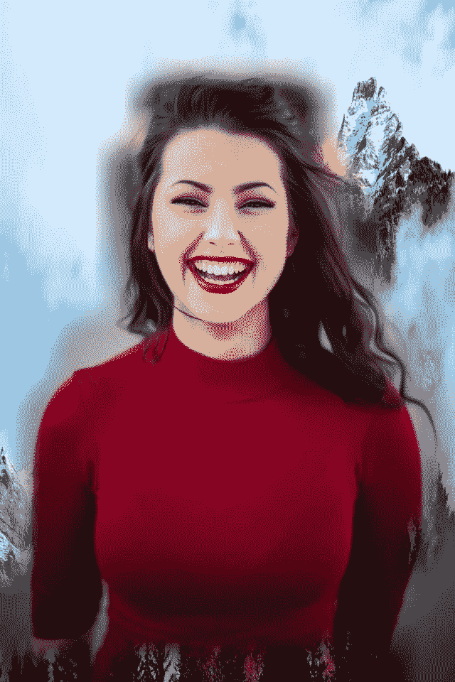

使用语义分段将微笑女子的原始背景替换为山脉的图像。原图:[迈克尔·达姆](https://unsplash.com/@michaeldam?utm_source=unsplash&utm_medium=referral&utm_content=creditCopyText)在 [Unsplash](https://unsplash.com/s/photos/people?utm_source=unsplash&utm_medium=referral&utm_content=creditCopyText) 拍摄的照片

如果您和我一样，在构建应用程序时，喜欢打开 Python 解释器，在终端中尝试函数或使用新的数据结构。对于内置模块来说，这是非常容易的，但是对于外部包来说，这可能会变得稍微复杂一些，尤其是对于处理计算机视觉模型输出来说！我制作这个教程是为了帮助提供一个在计算机视觉应用中使用语义分割的基础。您可以使用相同的通用技术来处理其他计算机视觉模型输出:对象检测、关键点和图像分类。

*注:你可以在*[*Unsplash*](https://unsplash.com)*上找到免费的图片，女人的图片来自那里，山的图片(如下图)来自那里。本教程中的所有其他图像都是我自己生成的，在这些原始图像上使用了图像分割。*

# 一些背景

本教程使用了一套由 [alwaysAI](https://alwaysai.co?utm_campaign=Website%20Traffic&utm_source=medium&utm_medium=medium&utm_content=learn_computer_vision_terminal) 提供的免费计算机视觉工具，这是一个基于 Python 的平台，用于构建和运行计算机视觉应用程序，我是该平台的成员。如果您不想使用该工具，您仍然可以参考本文中更通用的 NumPy 操作！

alwaysAI 编写了一个 Python [API](https://alwaysai.co/docs/edgeiq_api/index.html?highlight=apis?utm_campaign=Website%20Traffic&utm_source=medium&utm_medium=medium&utm_content=learn_computer_vision_terminal) ，名为 edgeiq，使处理计算机视觉模型输出成为一个更加标准化和简单的过程，并且包含了许多流行的包，所以你不需要单独安装它们。我们将介绍如何从命令行与 edgeiq 和其他有用的计算机视觉模块交互，如 OpenCV 的 cv2。这对于逐步执行分段掩码的不同操作和查看输出非常有用。

这篇博文是在演示了下面嵌入的 YouTube 视频中的一些语义分割应用程序之后发表的，目的是在进入更一般的应用程序之前提供一个更好的基础。本教程将展示如何一步一步地用语义分割替换图像的部分。

本教程中使用的部分代码演示。

该视频介绍了几个语义分段应用程序，这两个应用程序的完整代码可以在 GitHub 上找到:

1.  [原虚拟绿屏储存库](https://github.com/alwaysai/virtual-green-screen)
2.  [一个应用程序，通过运行语义分割平滑返回的边缘](https://github.com/alwaysai/smooth-semantic-segmentation)

这些库向您展示了如何使用[语义分割](https://nanonets.com/blog/semantic-image-segmentation-2020/)结果来替换一个图像中与另一个图像中的标签相对应的像素，以及如何使用 numpy 数组操作和其他技术来创建更平滑的边缘。

# 建立

注意，你必须在你的本地机器上安装 alwaysAI 来使用 API 并完成本教程。你可以从 alwaysAI [仪表盘](https://alwaysai.co/dashboard?utm_campaign=Website%20Traffic&utm_source=medium&utm_medium=medium&utm_content=learn_computer_vision_terminal)免费下载 alwaysAI。或者，如果你喜欢，就按照 NumPy 操作！

安装 alwaysAI 后，让我们来设置您的环境。您需要配置和安装任何使用语义分段模型的应用程序；所以使用上面的任何一个库，或者任何一个使用语义分割的入门应用都可以。您可以通过在终端中键入`aai get-starter-apps`来获得启动应用程序；此命令会将初学者应用程序下载到您当前的工作目录中。然后，您可以使用`ls`查看所有的启动应用程序，然后使用`cd`导航到“semantic _ segmentation _ cityscape”目录或“semantic_segmentation_voc”目录。

选择您的应用程序，并从工作目录中运行

```
aai app configure
```

您应该为目录选择您的本地机器。接下来，运行

```
aai app install
```

该命令构建了[虚拟环境](/virtual-environments-104c62d48c54)，其中包含 alwaysAI API、edgeiq 以及 OpenCV、cv2 中流行的开源计算机视觉库。如果你想使用任何其他的包，只需将它们添加到 app 目录下的一个`requirements.txt`文件中，然后重新运行`aai app install`。

接下来，通过运行以下命令激活 python 虚拟环境，该环境将安装所有必需的包

```
source venv/bin/activate
```

最后，通过运行以下命令启动 python 终端

```
python3
```

您应该看到终端变成了 python 解释器，它有如下提示

```
>>>
```

*注意:完成后，您可以通过键入* `*exit()*` *退出 Python，然后在终端中键入* `*deactivate*` *退出虚拟环境。*

现在，您已经准备好学习本教程了！

# 笔记

*   您可以使用`type(variable)`来检查 python 中输出的类型
*   您可以尝试使用以下代码查看图像，尽管我在虚拟环境和 python 解释器中遇到了问题:

```
def display(image):
    cv2.imshow("image", image)
    cv2.waitKey(0)
    cv2.destroyAllWindows()
```

这将创建一个函数，您可以使用`display(image)`调用该函数来显示任何图像。我在关闭窗口时遇到了麻烦，但你可以按任意键，然后回到终端，尽管显示窗口可能会保持打开。

*   另一个解决方案是像这样写出图像:

```
cv2.imwrite("test1.png", image)
```

任何时候你想看到一个步骤的输出，我建议写出一个图像，这就是本教程要做的。

# 辅导的

我将在下面的代码中拼接一些图像和文本，但是您仍然可以将代码文本复制粘贴到您的终端中来完成本教程。以下大部分代码摘自[虚拟绿屏库](https://github.com/alwaysai/virtual-green-screen)。

首先，我们需要导入必要的库。

```
import edgeiq
import cv2
import numpy as np
import sys
```

alwaysAI API，edgeiq，是我们用来进行语义分割的。我们将使用 OpenCV 的库 cv2 来写入和输出图像。Numpy 用于一些数组操作，sys 用于更改 numpy 数组的显示格式。

```
# use this if you want to see the entire numpy array (not very user 
# friendly, but can be helpful to seeing what labels are used)
np.set_printoptions(threshold=sys.maxsize)
```

在你的工作目录中你需要一个图像，我把我的命名为‘output . png’。我刚刚从 [Unsplash](https://unsplash.com/) 得到一张图片。

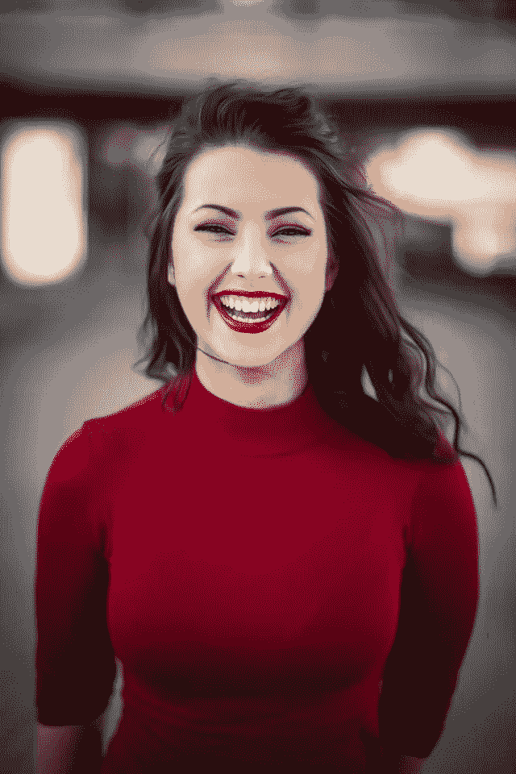

照片由[迈克尔·达姆](https://unsplash.com/@michaeldam?utm_source=unsplash&utm_medium=referral&utm_content=creditCopyText)在 [Unsplash](https://unsplash.com/s/photos/people?utm_source=unsplash&utm_medium=referral&utm_content=creditCopyText) 拍摄

下面的代码读入一个图像，然后使用 edgeiq 创建一个`SemanticSegmentation`对象的实例，并指定在哪个推理引擎上运行输入。在第三个块中，它从输入图像中获得分割结果。

```
# read in the image
image = cv2.imread("output.jpg")# instantiate a semantic segmentation object and load the engine
semantic_segmentation = edgeiq.SemanticSegmentation("alwaysai/fcn_alexnet_pascal_voc")
semantic_segmentation.load(engine=edgeiq.Engine.DNN)# run segmentation and get the results
segmentation_results = semantic_segmentation.segment_image(image)# to view the class_map of the resulting segmentation_results object:
segmentation_results.class_map
```

上述代码块中的最后一行代码产生以下输出(在重置显示选项之前运行，以用于本教程):

数组([[ 0，0，0，…，0，0，0]，
[ 0，0，0，…，0，0，0]，
[ 0，0，0，…，0，0，0]，【T9…，
[ 0，0，0，…，11，11，11]，
[ 0，0，0，…，11，11，11]，
[ 0，0，0，…，11，11]

我们还可以用下面的代码写出这个类别映射的样子:

```
# to write out an image of the class map (note, the class_map is a numpy array!)
cv2.imwrite("class_map.png", segmentation_results.class_map)
```

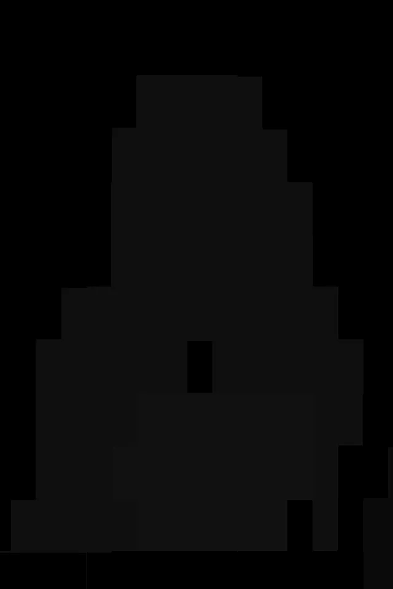

使用微笑女人的原始图像生成的语义分割掩模。

注意，这有点难以看出，但是在教程的后面还有一个例子会更明显一些。

```
# get a label map, which is the same dimensions as the class map but # uses labels
label_map = np.array(semantic_segmentation.labels)[segmentation_results.class_map]
```

上述代码产生以下输出:

数组([['背景'，'背景'，，…，'背景'，

背景'，'背景']，

['背景'，'背景'，'背景'，…，'背景'，

背景'，'背景']，

['背景'，'背景'，'背景'，…，'背景'，

背景'，'背景']，

…,

['背景'，'背景'，'背景'，…，' diningtable '，

diningtable '，' diningtable']，

['背景'，'背景'，'背景'，…，' diningtable '，

diningtable '，' diningtable']，

['背景'，'背景'，'背景'，…，' diningtable '，

' diningtable '，' diningtable']]，dtype = '

Now we’ll start building a mask that just has our desired labels in it.

```
# First just make a numpy array that is the same shape as the class # map but just zeros
filtered_class_map = np.zeros(segmentation_results.class_map.shape).astype(int)# print the filtered class map
filtered_class_map
```

This yields the following:

array([[0, 0, 0, …, 0, 0, 0],

[0, 0, 0, …, 0, 0, 0],

[0, 0, 0, …, 0, 0, 0],

…,

[0, 0, 0, …, 0, 0, 0],

[0, 0, 0, …, 0, 0, 0],

[0, 0, 0, …, 0, 0, 0]])

And, just to show how the ‘type’ command works, we can check the type of the output like so:

```
type(filtered_class_map)
```

Which yields:

<class></class>

这里是当前 filtered_class_map 的样子(不要紧张，现在都是黑色的！):

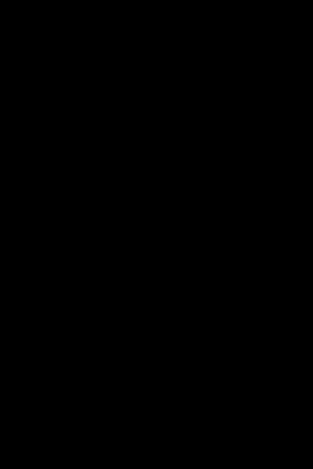

```
# you can add labels here if you want to pick up more labels, 
# check out what you get from the 
# label_map print out to see what is being picked up 
# around the person
labels_to_mask = ['person']# now toggle the cells that mapped to ‘person’
for label in labels_to_mask:
    filtered_class_map += segmentation_results.class_map * (label_map == label).astype(int)# Print out the map
filtered_class_map# Now, If we write out the image
cv2.imwrite(“new_filtered_class_map.png”, filtered_class_map)
```

同样，这个输出是模糊的，但是它与 class_map 输出略有不同:

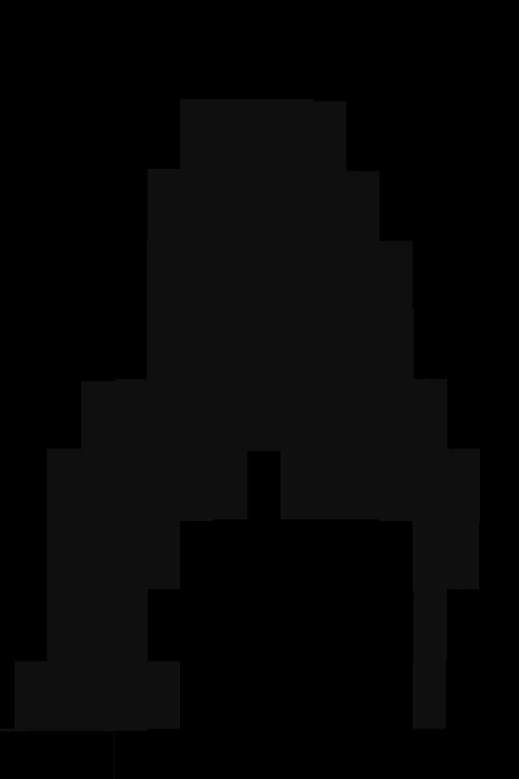

您还可以查看我们使用过的所有地图的尺寸:

```
image.shape
label_map.shape
filtered_class_map.shape
```

对于我的输入图像的结果，上面的代码分别产生(960，640，3)，(960，640)，(960，640)。请注意，它们的大小都一样！第一个元组中的“3”表示深度为三，用于 BGR(或 RGB)颜色通道。

```
# Now we can make a map to pull out just the 
# labels of interest (i.e. people)
detection_map = (filtered_class_map != 0)
```

示例输出:

数组([[假，假，假，…，假，假，假]，

[假，假，假，…，假，假，假]，

[假，假，假，…，假，假，假]，

…,

[假，假，假，…，假，假，假]，

[假，假，假，…，假，假，假]，

[假，假，假，…，假，假，假]])

我们还可以通过运行以下命令来检查 detection_map 的形状

```
detection_map.shape
```

示例输出:

(960, 640)

现在我们将选择一个背景图像。请注意，您可以在 GitHub 资源库中找到一些图片示例！下载其中一个，并在下面的示例命令中指定您选择的任何名称。

```
# Read in an image for your background. I found a picture of a mountain on Unsplash.
background = cv2.imread("mountain_pic.jpg")
```


我们将使用这张山的图片作为我们的新背景！照片由来自[佩克斯](https://www.pexels.com/photo/panoramic-photography-of-alps-291732/?utm_content=attributionCopyText&utm_medium=referral&utm_source=pexels)的[蒂姆·高](https://www.pexels.com/@punttim?utm_content=attributionCopyText&utm_medium=referral&utm_source=pexels)拍摄

每当我们使用一个新的图像，它必须是相同的形状！所以我们可以用

```
shape = image.shape[:2]
background = edgeiq.resize(background, shape[1], shape[0], keep_scale=False)
```

请注意，由于背景是水平的，输入图像是垂直的，我们将不得不使用' keep_scale=False '，这将扭曲图像一点。你也可以为你的背景选择一个垂直的图像，或者如果你的流/输入图像是水平的，保持它不变。

最后，我们用原始图像替换背景中对应于检测图中“真实”部分的区域

```
background[detection_map] = image[detection_map].copy()# And finally write out the new image!
cv2.imwrite("final_background.png", background)
```

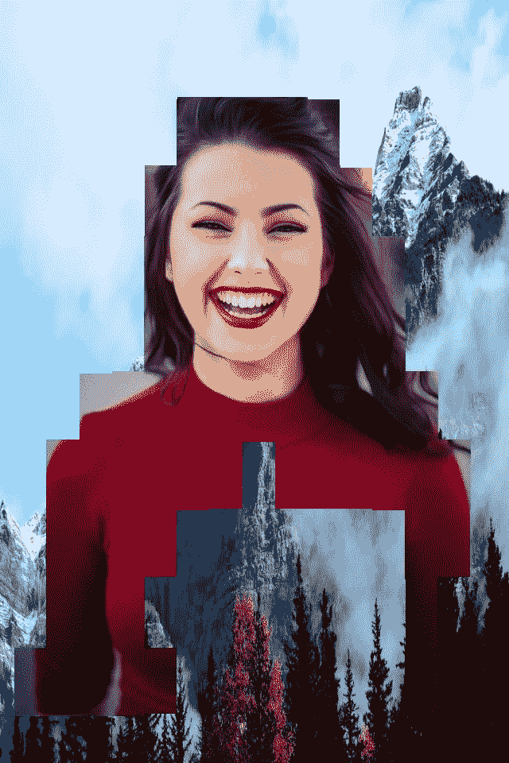

保留了带有“人”标签的原始图像，所有其他图像都替换为山的图像。

现在，只有原始图像中被标记为“人”的部分被用来替换背景中的相应部分。这是一个(粗略的)虚拟绿屏例子！

接下来，我们将看到更多分段遮罩的例子，包括一些模糊。

让我们更改标签颜色，使蒙版更容易查看。

```
# iterate over all the desired items to identify, 
# labeling those white
for label in labels_to_mask:
    index = semantic_segmentation.labels.index(label)
    semantic_segmentation.colors[index] = (255,255,255)# build a new mask, and write a new image
new_mask = semantic_segmentation.build_image_mask(segmentation_results.class_map)
cv2.imwrite("new_mask.png", new_mask)
```

这是输出:

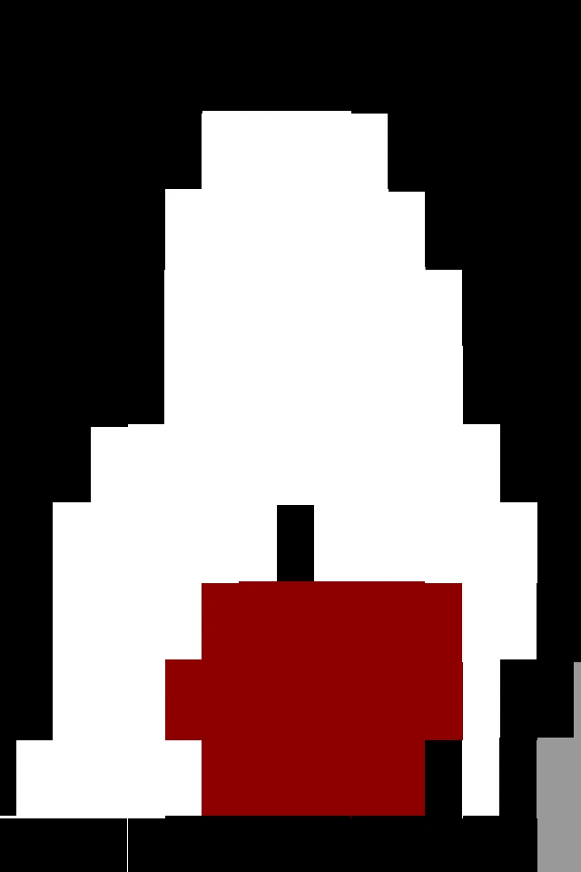

现在，对应于“人”的像素是白色的。

现在我们有了这个更容易看到的面具，让我们做一些图像操作。如果我们想模糊背景，我们可以这样做:

```
# Create a blurred mask
blurred_mask = cv2.blur(new_mask, (100, 100))
cv2.imwrite("blurred.png", blurred_mask)
```

这会创建以下图像:

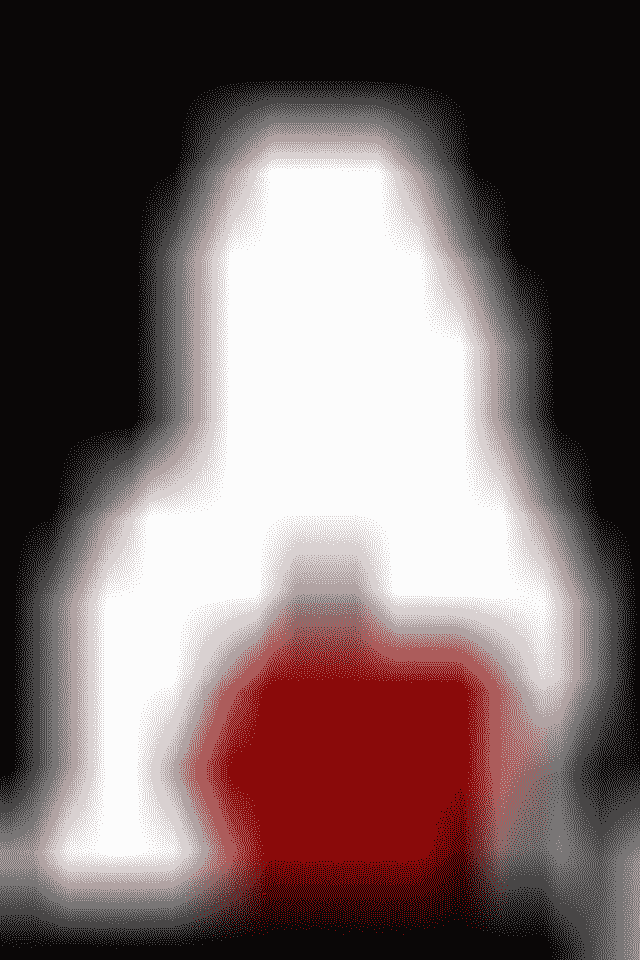

与之前显示的图像相同，但边缘模糊。

如果我们只想让标签变成白色，其他的都变成黑色，执行下面的代码并重新运行上面的 for 循环:

```
# this makes all the colors in the label map black
semantic_segmentation.colors = [ (0,0,0) for i in semantic_segmentation.colors]
```

运行 for 循环后，重新构建掩码并写出输出，结果是:

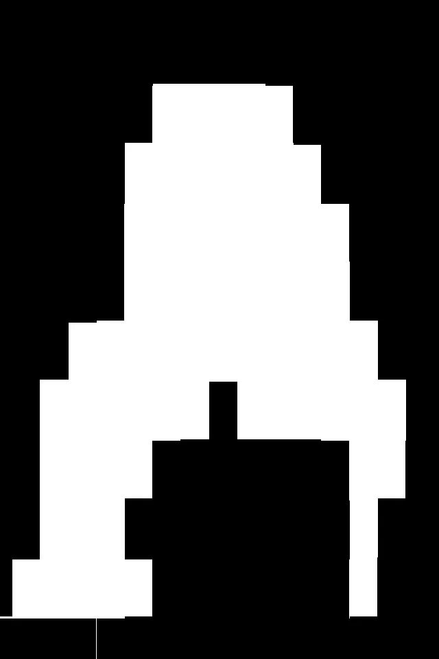

现在，只有人的像素是白色的，其他所有标签都是黑色的。

现在我们有了如何使用和操作蒙版的想法，让我们使用这些技术来平滑这些边缘，并创建一个更具视觉吸引力的虚拟绿色屏幕。本教程的下一部分将使用来自以下资源库的代码:【https://github.com/alwaysai/smooth-semantic-segmentation】T4。

我们正在处理的图像与上面显示的图像相同。但是，如果您想确保设置正确，可以重新运行以下代码:

```
# read in the initial image again
image = cv2.imread("output.jpg")# build the color mask, making all colors the same except for background
semantic_segmentation.colors = [ (0,0,0) for i in semantic_segmentation.colors]# iterate over all the desired items to identify, labeling those white
for label in labels_to_mask:
   index = semantic_segmentation.labels.index(label)
   semantic_segmentation.colors[index] = (255,255,255)# build the color mask
mask = semantic_segmentation.build_image_mask(results.class_map)
```

首先，我们将从放大扩张蒙版开始(平滑边缘报告中的第 95 行)。

```
dilatation_size = 15
dilatation_type = cv2.MORPH_CROSS
element = cv.getStructuringElement(
                        dilatation_type,
                        (2*dilatation_size + 1, 2*dilatation_size+1),
                        (dilatation_size, dilatation_size))
mask = cv2.dilate(mask, element)
```

现在面具看起来像:

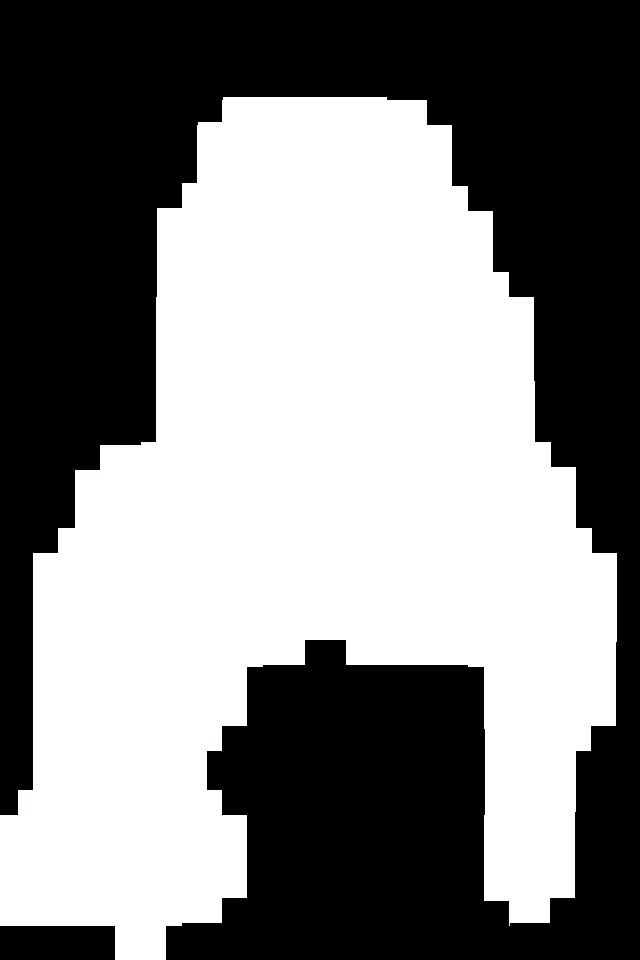

现在，图像已经有一个扩大应用到人的面具。

接下来，我们将平滑应用到遮罩:

```
mask = cv2.blur(mask, (50, 50))
```

现在面具看起来像这样:

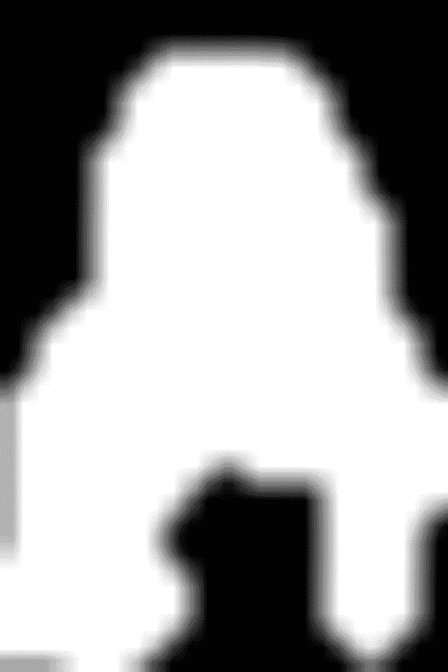

应用于遮罩的平滑(模糊)。

接下来，我们将设置背景图像。为了安全起见，我们将重新导入它并运行调整代码。

```
# Also import the background image again
background = cv.imread("mountain_pic.jpg")
background = edgeiq.resize(background, image.shape[1],
image.shape[0], keep_scale=False)
```

最后，我们将使用 edgeiq 内置的“覆盖”功能。这将使用模糊的面具，前景图像和背景图像，并交织他们，以提供良好的，平滑的边缘。

```
# Now overlay the background and foreground using the overlay function
frame = edgeiq.overlay_image(frame, background, mask)
cv.imwrite("overlayed_frame.png", frame)
```

这是结果输出:

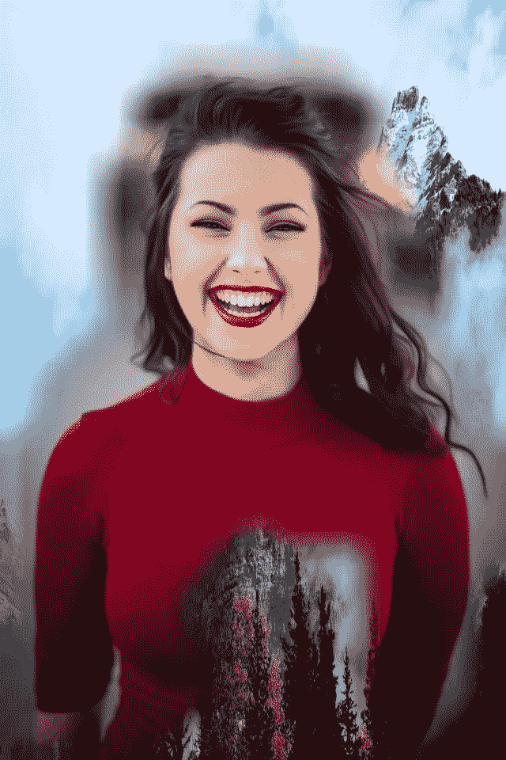

现在背景从原来的女人换成了山。

现在，注意到女人的中间部分是树吗？这些看起来像是对应于我们创建的原始类别映射的红色部分。如果我们查看`label_map`输出，我们会看到`diningtable`和`sofa`是打印出来的其他标签。这有点像黑客，但是让我们把这些添加到`labels_to_mask`中，并重新运行上面平滑边缘部分的所有代码。

现在输出如下所示:


使用不同的标签，我们填补了女人的空白。

好多了！

我希望这篇教程对你有所帮助。我们讲述了如何在终端内与 edgeiq 和 cv2 交互，如何使用分段掩码，以及如何使用这些掩码替换图像的特定部分。这将使您能够使用语义分割模型。我们还介绍了如何平滑来自更粗粒度分段模型的输出，当粗粒度分段模型是唯一可用的分段模型，或者是唯一最适合您的特定用例的模型时，这将有助于您改进您的应用程序。

注册一个免费的 alwaysAI 帐户可以让你访问不同的计算机视觉模型类型，因此你可以使用 Python 解释器来探索物体检测、图像分类和姿态估计！