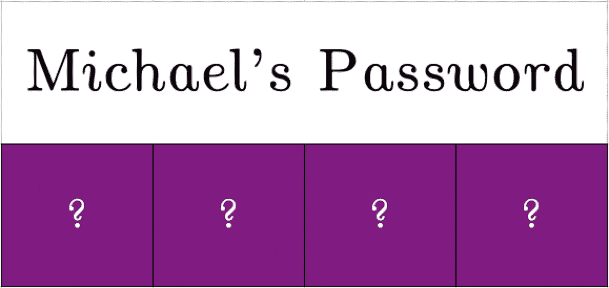

# 立即学习数据科学:条件概率

> 原文：<https://towardsdatascience.com/learn-data-science-now-conditional-probability-acae6ec7b474?source=collection_archive---------23----------------------->

## 机器学习中的吉娃娃、松饼和混淆矩阵

艾丽西娅·高蒂耶在 [Unsplash](https://unsplash.com?utm_source=medium&utm_medium=referral) 上拍摄的照片

条件概率是概率和统计中的基本概念之一，通过扩展，也是数据科学和机器学习中的基本概念之一。

事实上，我们可以使用混淆矩阵来思考机器学习模型的性能，混淆矩阵可以使用条件概率的观点来解释。

在这篇博客文章中，我们将涵盖所有这些，甚至更多

1.  介绍
2.  条件概率的形式定义
3.  直觉到条件概率:走向新的宇宙
4.  机器学习中的条件概率与混淆矩阵
5.  如何学习更多的概率

让我们开始吧。

# 条件概率介绍

条件概率是一种基于**部分信息对实验结果进行推理的方法。**

在不使用任何公式的情况下，我们试着用一个例子直观地理解条件概率。

**问题:**你掷出一个六面骰子。你的朋友看着这个卷，告诉你这个卷是偶数。有多大可能是 6？

由[Lea bhm](https://unsplash.com/@alleslea?utm_source=medium&utm_medium=referral)在 [Unsplash](https://unsplash.com?utm_source=medium&utm_medium=referral) 上拍摄的照片

在你的朋友看掷骰子之前，掷骰子有 6 种可能的结果(1，2，3，4，5，6)

当你的朋友告诉你掷骰子是偶数时，我们只剩下 3 种可能的结果——2，4，6。

因此，在三种可能的情况中，其中一种是我们掷出 6。假设掷骰子是一个事件数，掷出 6 的概率是 1/3。

# 条件概率形式定义

我们现在可以寻求将这种直觉形式化。

我们现在可以说，如果所有的结果都是同样可能的，就像上面掷骰子的情况一样，我们可以说

进一步概括，我们可以说

有了这个概念，我们也可以寻求回答以下问题—

(b)你是一个密码黑客。您的高级黑客技能告诉您，迈克尔的电子邮件密码有 8 个小写字母。如果所有的密码组合都是可能的，那么密码是‘密码’的几率是多少？

(c)如果一个人的艾滋病毒检测呈阴性，那么这个人感染艾滋病毒的可能性有多大？

(d)你建立了一个机器学习模型来对吉娃娃和松饼的图片进行分类。你的分类模型通知你图片 X 是吉娃娃的照片。模型出错的可能性有多大？

请注意，条件概率试图回答的问题的模式是“给定 X，求 Y 的概率”的形式。

# 条件概率直觉:走向新的宇宙

条件概率的一个直觉是，我们可以把条件概率看作一个新的宇宙 B 上的概率定律，因为所有的条件概率都集中在 B 上。

在解决条件概率问题 P(A|B)时，我们可以想象把自己传送到一个给定事件 B 肯定已经发生的世界，我们可以简单地在那个宇宙中寻找事件 A 的简单概率。

我们来比较两个场景。在这两种情况下，您都想侵入迈克尔的 Dunder Mifflin 邮件。默认情况下，密码的长度没有限制。

## 场景 A)在没有任何附加信息的情况下，迈克尔的密码是“1234”的可能性有多大？

在这种情况下，迈克尔的密码是 1234 的概率接近于零，甚至无限小。这是因为有无限的密码组合，1234 只是其中之一。

## 假设迈克尔的电子邮件密码只包含数字 1、2、3、4，那么密码是“1234”的可能性有多大？

在场景 B 中，我们可以想象我们进入了一个所有电子邮件密码都必须是 4 个字符并且包含 1、2、3 和 4 的世界。现在，在这个世界上，我们问自己，这 4 个数排列成 1234 序列的概率是多少？

在这个世界上，密码只能是 1234，1243，1342，1324，1423，1432，2134，…，4321 中 24 种组合中的一种

因此，条件概率是 1/24。

有了这样的直觉，我们可以更轻松地解决简单的问题，而不需要求助于无脑的数学。

# 机器学习中的条件概率与混淆矩阵

条件概率在评估机器学习模型的上下文中是有用的。我用一个例子来说明。

你建立了一个机器学习模型来对吉娃娃和松饼的图片进行分类。

吉娃娃 vs 松饼:可爱还是好吃？图片来自 ImageNet [1]

获得了以下结果。

现在，你给你的机器学习模型输入一张新图片。假设你的分类模型预测图片 X 是一张吉娃娃的照片，那么这张照片实际上是吉娃娃照片的可能性有多大？从数学上来说，这可以解释为

答案是 3/4。我们怎么知道的？让我们一步一步来找答案。

1.  既然模型预测了“吉娃娃”，我们将只关注黄色突出显示的列，而忽略另一列。换句话说，我们把自己传送到一个“新的宇宙”,在那里模型只能预测照片是一只吉娃娃。
2.  在这个新的宇宙中，该模型总共做出了 600 次预测。
3.  在 600 个预测中，450 个是正确的，而 150 个是错误的。
4.  于是，条件概率为 450/600，简化为 3/4。

你看到的是一个**混淆矩阵**，常用于机器学习。直观地说，混淆矩阵是一个表格，它告诉我们你的模型在被训练后表现得有多好。

更具体地说，混淆矩阵是一个具有两行和两列的表格，报告假阳性、假阴性、真阳性和真阴性的数量，如上所述。

理解混淆矩阵及其相关度量需要理解条件概率。

实际上，我们刚刚计算的是一个叫做精度的度量。事实上，精度和其他一些度量标准也是如此。

你能使用上表计算召回率和特异性吗？

# 结论

条件概率是我们对不同条件下的不确定性进行逻辑量化的一种方式。它是数据科学家工具箱中的一个重要工具。如果你真的想成为一个好数据，一定要掌握它。这里我提供一些我推荐的资源。

**对于也想学习编程和编码的新学员**， [HarvardX 的 Data Science-Probability(ph 125.3 x)on Data camp](https://www.datacamp.com/courses/harvardx-data-science-probability-ph1253x?tap_a=5644-dce66f&tap_s=1264035-087d1d&utm_medium=affiliate&utm_source=travistang)*将温和地介绍概率，同时允许您在 r 中实现概率。此外，这还附带了一个关于 2007-08 年金融危机的激励性案例研究，这可能是一个您可以进一步研究和展示您的投资组合的项目。

**对于进阶学习者，**我建议[参加 HarvardX Stat 110:概率入门](https://tidd.ly/3qe9LLz) *。这个班是迄今为止我参加过的最有收获的一个班。布利茨坦教授是我最喜欢的概率教授之一，他严谨而直观地讲述了这些话题。

这里还有一份我写的完整指南—

 [## 2021 年如何学习数据科学与概率

### 学习概率的最佳资源

towardsdatascience.com](/how-to-learn-data-science-and-probability-in-2021-ee7b5d5e0a49) 

此外，如果您有任何问题，或者只是想一起学习数据科学，请随时与我联系。

 [## Travis Tang -数据分析师

www.linkedin.com](https://www.linkedin.com/in/travistang/) 

这是概率系列的一部分。这是一个很小的数据科学，你现在可以在 5 分钟内学会。

1.  [概率模型和公理](https://medium.com/analytics-vidhya/learn-data-science-now-probability-models-3c5fd7863a33)
2.  [概率 vs 统计](/probability-vs-statistics-for-data-science-and-machine-learning-84f00bf67ce1)
3.  条件概率(你来了！)
4.  贝叶斯统计(即将推出)
5.  离散概率分布(即将推出)
6.  连续概率分布(即将推出)
7.  平均值和大数定律(即将推出)
8.  中心极限定理(即将推出)
9.  联合发行(即将推出)
10.  马尔可夫链(即将推出)

# 参考文献和脚注

[1]邓俊杰，董文伟，索彻，李，李，李，，李(2009).Imagenet:一个大规模分层图像数据库。2009 年 IEEE 计算机视觉和模式识别会议(第 248-255 页)。

*这些是我推荐的课程的附属链接。这意味着，如果你点击链接后购买，我会收到一定比例的费用，没有额外的费用给你。