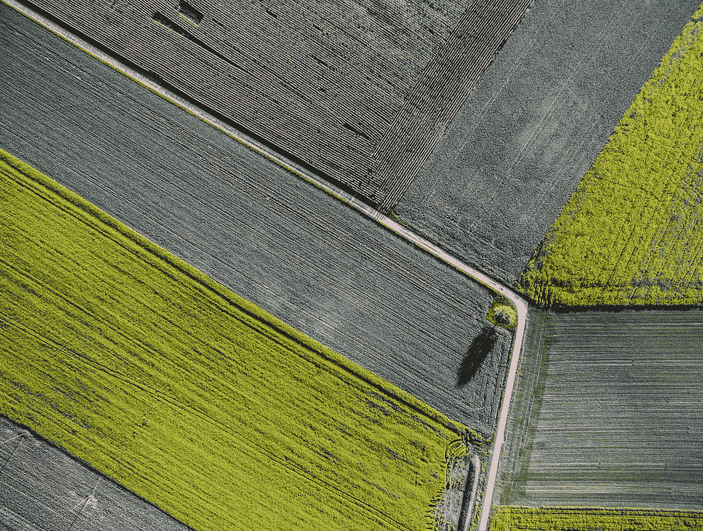
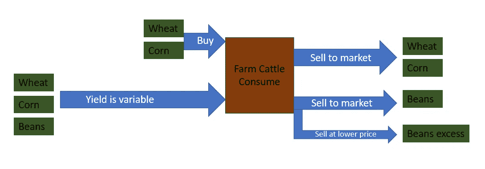
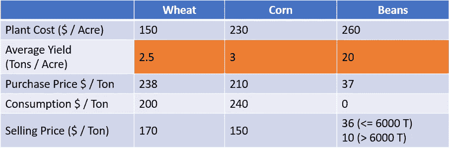
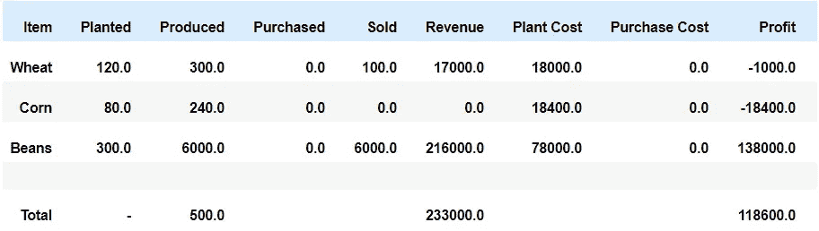
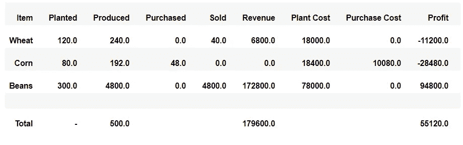
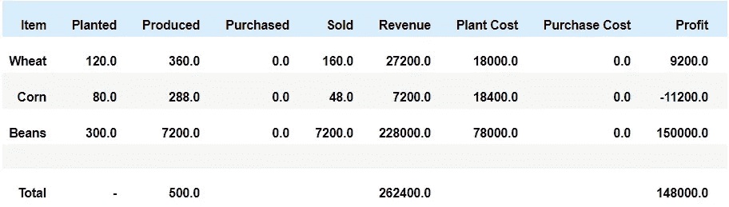
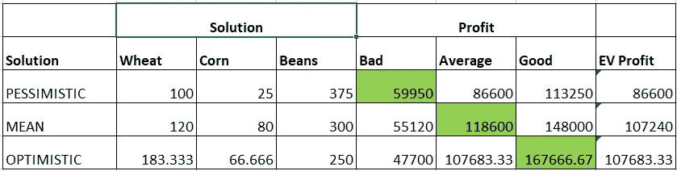

# 学习不确定情况下的决策——第 1 部分:用平均值解决问题

> 原文：<https://towardsdatascience.com/learn-decision-making-under-uncertainty-part-1-solve-the-problem-with-mean-values-368c35add0b7?source=collection_archive---------24----------------------->

## 使用 Python 和 PuLP 的随机规划来最大化种植作物的预期利润



让·维默林在 [Unsplash](https://unsplash.com?utm_source=medium&utm_medium=referral) 上拍摄的照片

# 介绍

许多决策问题可以作为线性方程组来解决。处理问题中的不确定性并不简单。在这一系列文章中，我们将探索在一个简单的业务问题上使用随机编程的概念。这是第一篇文章，介绍了构建一个模型的基本方法，该模型可以基于平均值解决问题。在我们能够处理不确定性之前，以这种方式对问题建模是很重要的。我们将用 python 来解决这个问题，使用一个开源的解算器，它拥有这些算法。

在以后的文章中，我们将改变这个模型来考虑不确定性，并改进我们在这里找到的解决方案。

## 先决条件

*   线性方程
*   概率，期望值

**注:**报摊问题是用来学习这个题目的另一个问题。媒体上已经有几篇文章了。这个农民问题提供了一个不同的视角，尤其是在未来被揭示后所做的决定。这个问题已经在教科书中解释过了(见下面的参考文献),但是要得到解决方案需要使用线性编程软件。使用 Python 可以更容易地试验和可视化解决方案，而无需安装新软件或获取许可证。

## 你将学到的技能

*   用 Python 求解线性方程组
*   使用 Python 计算任何解决方案的期望值，尤其是“平均值解决方案”
*   解决方案的直观解释(可选)

# 商业问题

一位农民正在计划今年这个季节的作物。生产的庄稼将用来喂牛，直到明年。剩余的庄稼可以在公开市场上出售。



“作者形象”——农民流程步骤

农民必须决定每种作物的种植面积。她共有 500 英亩农场可供使用。每种作物的种植成本如下表所示。给出了每种作物的平均产量。在不好的季节产量只有 80%,在好的季节产量增加到 120%。这几种情况发生的概率是相等的(33%)。每种作物的平均产量如下表所示。

当生长季节结束时，农民根据产量知道农场生产了多少作物。为了满足农场直到下一季的消费需求，农民也可以在公开市场上购买农作物(只有小麦和玉米)。多余的庄稼可以卖到市场上。请注意，农场并不需要大豆，但可以种植到 6000 吨并获得丰厚利润，6000 吨以上价格更低。



“作者图片”——产量、成本和售价

# 用线性规划模型求解平均收益率问题

我们有足够的信息来解决这个问题吗？我们的收益率是多少？让我们假设我们的产量是平均的，并尝试规划分配给每种作物的英亩数。这是一个非常合理的方法，因为它既考虑了不良收益率，也考虑了良好收益率。许多线性和混合 inter 编程模型正在被构建，以使用这种方法来解决业务问题。

我们将通过使用线性方程组来解决这个问题。我会推荐一步一步的运行[笔记本](https://github.com/buzzrk/mlor/blob/main/Optimization/Stochastic/Farmer/Farmer_MeanValue_Model.ipynb)来了解以下内容。

## **决策变量:**

农民要做几个决定。我们可以认为决策是在两个阶段做出的——产量已知之前和产量已知之后。因此，像这样的问题被称为两阶段随机规划问题。然而，对于这个问题，就像报童问题一样，第二阶段的决策是微不足道的(不要购买超过我们养牛所需的作物，出售所有剩余的数量)。

*   每种作物的种植面积(第一阶段)
*   小麦和玉米的购买量(第二阶段)
*   小麦、玉米和豆类的销售金额(第二阶段)
*   以较低价格出售的多余豆量(第二阶段)

**目标:**

农场主希望我们在季末实现利润最大化。我们从出售牛消费后剩余的作物中获得收入。我们产生的成本来自季节前的种植成本和购买小麦和玉米来喂养牲畜。

> 利润最大化=
> 
> 季末作物销售收入—购买小麦和玉米的成本赤字—种植作物的成本

```
M = LpProblem("Farmer", LpMaximize)M += lpSum( 
      [      selling_prices[item]       * var_tons_sold[item]        for item in items ]
    + [      selling_price_excess_beans * var_excess_beans_sold]     #excess beans
    + [ -1 * planting_costs[item]       * var_acres_planted[item]    for item in items ]  
    + [ -1 * purchase_prices[item]      * var_tons_purchased[item]   for item in purchasable_items ]    
)
```

## **约束:**

**农场可用英亩数**

所有作物的种植面积≤ 500 英亩

```
M += lpSum([var_acres_planted[item] for item in items]) <= total_acres
```

**对于小麦和玉米:**

种植生产的作物+购买的作物=用于消费的作物+出售给市场的作物

```
M += lpSum([yields[item] * var_acres_planted[item]] + [var_tons_purchased[item]] + [-1 * var_tons_sold[item]]) == consumption_feed[item]
```

**对于豆子:**

*   种植生产的作物-以正常价格出售给市场的作物-以较低价格出售给市场的作物=豆类消费(我们的农民为 0)
*   以正常价格出售给市场的作物≤ 6000 吨

```
M += lpSum([yields[item] * var_acres_planted[item]] + [-1 * var_tons_sold[item]] + [-1 * var_excess_beans_sold]) == consumption_feed[item]  

M += lpSum([var_tons_sold[item]]) <= limit_on_beans_regular_price
```

# 用 Python 求解模型


照片由[丹尼尔·里卡洛斯](https://unsplash.com/@ricaros?utm_source=medium&utm_medium=referral)在 [Unsplash](https://unsplash.com?utm_source=medium&utm_medium=referral) 上拍摄

该方程组可以在任何线性规划求解器中求解。尽管 Excel 有插件，但建模语言更容易使用，而且对于解决这个问题的随机版本是必要的。商业解决方案(IBM CPLEX、Gurobi、FICO Xpress、AMPL 等。)可用于此目的，但它们需要安装。一些商业解算器有 python APIs，但是它们需要许可。对于具有更好性能和客户支持的生产系统，商业解决方案可能是更好的选择。出于学习的目的，我选择了开源 Python 包 PuLP，允许任何人以最小的安装运行笔记本。

笔记本可以在这里找到[。请使用 conda 或 pip 安装 pip。](https://github.com/buzzrk/mlor/blob/main/Optimization/Stochastic/Farmer/Farmer_MeanValue_Model.ipynb)

```
pip install pulp
```

我们可以运行求解器并获得最优解，然后使用 python 计算下表来计算成本、收入和利润。 ***解决的办法是种植豆子以更高的价格卖出 6000 吨，生产足够喂牛的玉米，用剩下的几亩地生产小麦。***



“按作者分类的图像”——最佳解决方案

# 如果产量不同，农民会有什么变化？

我们已经知道从最优解到平均收益率的平均收益率(118600)的利润(见上表)。

如果产量不好，并且我们已经根据平均产量的解决方案进行了种植，我们将实现以下结果。(不需要做出真正的决定——在这种情况下，我们必须购买赤字 48，并出售剩余的赤字)



“按作者分类的图像”——当产量很低时，使用一般情况下的解决方案(120，80，300)获利

同样，如果我们实现了良好的收益，我们可以计算利润



“按作者分类的图像”——当产量很低时，使用一般情况下的解决方案(120，80，300)获利

如果农民决定根据平均产量实施我们的建议，她将在 33%的时间里获得 118600 英镑的最优利润，但也会获得 55120 英镑和 148000 英镑的利润。从长远来看，她的预期利润可以计算如下(在 99 个赛季中，他将实现每个利润 33 次)。

> 均值解的 EV =(55120+118600+148000)/3 = $ 107240

请注意，这比我们希望的要低(118600 美元)。这是因为我们是基于平均收益率进行规划的——我们在好年景获得的利润无法弥补坏年景的利润损失。

# 使用笔记本进行实验

使用笔记本探索解决方案在以下场景中会如何变化。

*   如果用其他收益率代替平均收益率，最优解是什么？(提示:使用笔记本更改产量)。
*   如果农民有一个乐观或悲观的偏见，并希望我们使用使用坏或好产量找到的最佳解决方案，使用这些解决方案的预期价值是什么？它们与使用平均值解决方案相比如何？对照下表检查你的答案。对于这个例子，看起来一个乐观的农民想要使用我们的基于好产量的解决方案会比使用平均产量做得更好。请注意，我们的平均值解决方案是接近的。



“作者图像”——三种场景下的最优解

*   我们可以同时使用所有三个最优解吗？由于我们不知道哪个季节会有哪个产量，所以只有在我们能够聘请一位能够 100%准确预测产量的甲骨文或机器学习专家的情况下，我们才能做到这一点。我们可以计算这种方法的期望值，这样我们就可以建立利润的上限。在本例中，它是 1/3(59950+118600+167666)= $ 115406。因此，我们的平均值解决方案表现良好(107240 美元)，但仍有改进的空间。如果农民对 8166 美元的增长不太兴奋，我们就不需要投入更多的精力来提高利润。
*   有没有一个解决方案能使我们的预期利润最大化，不是针对一个给定的收益率，而是同时针对所有三个收益率？是的，有，该解决方案的利润应该在 107240 美元到 115406 美元之间。我们将在下一篇文章中讨论这个问题。

# 结论

*   我们已经将商业问题建模为线性方程组
*   我们使用 Python 和 Pulp 获得了一个基于一般场景的解决方案。这个笔记本可以用来评估所有参数之间的权衡。
*   即使发生其他情况，我们也知道该解决方案的预期价值。这将是我们试图通过在线性程序中添加随机元素来击败的基准。
*   了解了不同的解决方案在三种不同场景下的表现后，我们就可以从线性规划转向随机规划了。


照片由 [Unsplash](https://unsplash.com?utm_source=medium&utm_medium=referral) 上的 [Ugne Vasyliute](https://unsplash.com/@ugnehenriko?utm_source=medium&utm_medium=referral) 拍摄

# 参考

我将把我的参考资料限制在解释基础知识和涉及这个问题的资源上。

[1] J .林德洛特，[课堂笔记](http://homepages.cae.wisc.edu/~linderot/classes/ie495/lecture2.pdf)涵盖了这个问题。附加[注释](http://homepages.cae.wisc.edu/~linderot/classes/ie495/)

[2] J. Birge，F. Louveaux，教科书:[随机规划介绍](https://link.springer.com/book/10.1007/978-1-4614-0237-4) —这个问题在第 1 章中有所涉及。

[3]Python 中的[纸浆](https://pypi.org/project/PuLP/)解算器的官方网站

# 思考的食粮——尝试用直觉解决问题(可选练习)


由[杰克·杨](https://unsplash.com/@huskerfan3?utm_source=medium&utm_medium=referral)在 [Unsplash](https://unsplash.com?utm_source=medium&utm_medium=referral) 上拍摄的照片

阅读这一部分只是为了获得权衡的直觉。像这样的方法在存在复杂约束的情况下不能保证最优。此外，一旦我们开始做随机规划，这种方法是不可能的。

我们是否可以采取贪婪的方法，将每一英亩土地分配给一种能给我们带来最大利润的作物，直到我们遇到一个约束？

让我们计算一下每种作物每英亩的利润。因为我们计划的是平均情况，所以我们将使用平均收益率。

小麦是每英亩 2.5 * 170 -150 = 275 美元
同样，玉米是 220 美元，豆类是 460 美元(正常价格)和-60 美元(降价)。

然而，对于小麦和玉米，在我们满足农场需求之前，利润来自于农民避免以高得多的价格购买而节省的成本。换句话说，在满足消费需求之前，他可以通过卖给自己(以买方价格)来增加利润。小麦是 2.5 * 238–150 = 445，玉米是 400。在我们能够满足农场的消费之前，这些数字非常重要。

## 算法:

按递减顺序排列边际利润:460(出售豆类)，445(生产小麦以满足需求)，400(生产玉米以满足需求)，275(生产小麦以出售)，220(生产玉米以出售)，-60(生产豆类以低价出售)

对每个利润率执行这些步骤，直到农田被消耗或利润率消失。

1.  使用 300 英亩土地生产豆子，直到边际利润在 6000 单位时消失。剩余英亩数= 200
2.  用 80 英亩土地生产小麦以满足农场的需求。剩余英亩数= 120
3.  用 80 英亩的土地生产玉米来满足农场的需求。剩余英亩数= 40
4.  用 40 英亩的土地生产小麦并销往市场。剩余英亩数= 0

这给了我们答案:小麦 120 英亩，玉米 80 英亩，豆类 300 英亩。

事实证明，我们的直觉解决方案确实是最优的，因为没有其他复杂的约束。

**注意:**为了理解这种方法背后的直觉，试着改变一级和二级咖啡豆的销售价格。

豆类的边际利润与消费小麦和玉米的边际利润匹配时，有两个拐点= 33 和 35.25(提示:你可以通过求解简单的方程很容易地计算出来)。在价格低于 33 美元时，我们应该先生产小麦和玉米，然后再生产大豆出售。

有几个拐点，豆子的边际利润与 24 美元和 26.75 美元的玉米产量相当。在低于 24 美元的价格下，我们应该首先生产小麦和玉米用于消费，然后销售，然后我们只生产豆类用于销售。

*在我的媒体* [*个人资料*](https://medium.com/@mlor) *查看关于这个话题的新文章。如果你想联系我这里是我的*[*LinkedIn*](https://www.linkedin.com/in/ramgit/)*。*