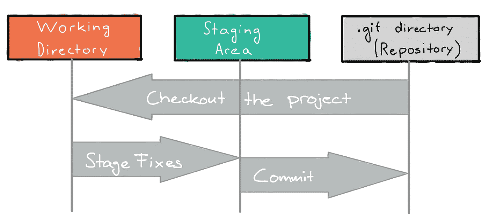

# 学习 ML 项目的 Git 基础知识

> 原文：<https://towardsdatascience.com/learn-git-basics-for-your-ml-project-46ecf03865b?source=collection_archive---------24----------------------->

## 开始使用 Git，并通过使用版本控制系统来模拟真实软件和机器学习工程师的工作风格。

你已经在你的数据科学和机器学习项目中使用 Git 版本控制了吗？如果你还没有考虑这个问题，让我问你第二个问题，你在数据科学或机器学习的旅程中处于什么位置？

> 在 Jupyter 笔记本上修修补补似乎不再是正确的选择。——伊夫·布特利尔

这个问题是我两个月前完成生物学和计算科学学士学位后问自己的。在我的学习期间，我在数据科学和机器学习方向总共选修了 6 门课程。尽管我为那些课程解决了几个项目。作为学生，我们经常坚持用最简单的方法来完成这些项目。在 Jupyter 笔记本上修修补补，直到代码和结果令人满意，然后提交它们。

然而，回到引言问题:我问自己，我想用我在学习期间获得的数据科学和机器学习知识工作吗？我对这个问题的回答是肯定的，我决定暂停学业，兼职做我的数据科学/ MLE 项目，以找到一份工作，或者尝试将这个或另一个项目变成一家初创公司。**但是现在** **在 Jupyter 笔记本上修修补补似乎不再是正确的选择**。

> 我想模仿机器学习工程师的工作风格，这就是为什么我决定学习 Git 版本控制的基础知识，并将其应用到我的项目中。

这篇文章将为你提供遵循这个想法的基础知识，并用另一种技能升级你的投资组合: **Git 版本控制**

# 为什么是 Git？

我曾经像一个业余爱好者一样修补我的代码。有什么不好？嗯，如果你想为你的简历创建一个**项目来获得一份工作**，你要确保它是一个体面的项目，不是在短时间内完成的。他们希望看到你能从事比小项目更大的项目，因为如果他们雇佣你，你会从事他们的产品，当然这也不是小项目。你应该表明你以一种有组织的方式编码，你可以计划、测试和部署独特的功能，同时仍然独立地开发代码的其他部分。

Git 使您能够做到这一点。维护多个不同的版本，并跟踪您所做的更改。 **1)** 我们先看基础， **2)** 远程存储库，然后是 **3)** [分支](/learn-git-branches-with-your-ml-project-7f58bdf1ae80)。

在每个主题(1-3)之后，我将展示命令行命令来练习从每个段落中获得的知识。

# 1.Git 基础

## Git 是如何看待文件的？

Git 将文件视为一系列快照。如果你想要版本控制系统，即。Git，为了保存你最近的修改，Git 基本上是对你所有的文件进行快照，并保存对这个快照的引用。因此 Git 的效率很高，如果一个或多个文件没有改变，Git 会存储一个到先前相同版本的链接。

## 请记住三个状态

Git 有三种文件状态:

*   **已修改**:文件已修改但未提交
*   **暂存**:文件被修改，标记为下一次提交快照的一部分
*   **已提交**:文件安全地存储在您的本地数据库中

我们现在可以如下观想我们的知识:



作者手绘

**工作树**(工作目录)是项目的一个版本。这个版本是给你修改的。要么是旧版本的。git 目录，或者它反映了已修改但未提交或暂存的最新版本。

**暂存区**是一个存储信息的文件，该信息表示哪些文件在下一次提交时被提交。

最后， **Git 目录**是 Git 保存项目的对象数据库和元数据的地方。它可用于与其他计算机和人员共享项目。

现在是时候看看 Git 工作流了，因为您已经学习了基本的基础知识。

## 基本 Git 工作流程

1.  你修改你的文件
2.  您将包含更改的文件添加到临时区域
3.  您提交，这将文件保存在临时区域中，并将快照永久存储到您的 Git 目录中。我们现在把这些改变后的文件称为 ie。版本，已提交。

下一段介绍一个例子，自己练习学到的知识。

# **练习 1 -练习 Git 基础知识**

首先，我们想要设置一个 Git 存储库，我们有一个链接的暂存区和一个工作树。你有两种可能。要么你在一个已经存在的项目上工作。或者创建一个新项目。

## 1.1 创建新项目

要创建一个新的项目，在你的本地计算机上创建一个目录，然后手动或者用 cd *(其中* *表示更改目录)*转到你想要你的项目所在的位置。

```
$ cd /Users/user/my_project (MacOs or Linux)
$ cd C:/Users/user/my_project (Windows)
```

接下来你输入:

```
$ git init
```

这将为您创建一个本地 git 存储库。一个`.git`文件夹。更具体地说，这将是您的目录 my_project 中的一个子目录。

## 1.2 克隆已经存在的项目

另一种方法是获得一个已经存在的项目。要做到这一点，您只需复制远程存储库的 url，这里表示为<url>并键入</url>

```
$ git clone <url>
```

请记住，我们有三种状态:已修改、已暂存和已提交

## 1.3 准备和提交

我们可以创建文件并在其中写些东西。他们在*状态下改装了*。要将它们转换到状态" *staged* ，我们可以使用命令`add`。

```
$ git add HelloWorld.py
```

最后，为了将它提交到本地 git 存储库，我们编写:

```
$ git commit -m 'This message describes what changes I made'
```

每个提交都需要一个消息，-m 是一个标志，表示下面的字符串就是消息。

你现在可以继续去偏远的地方了:)


照片由 [Yogendra Singh](https://unsplash.com/@yogendras31?utm_source=medium&utm_medium=referral) 在 [Unsplash](https://unsplash.com?utm_source=medium&utm_medium=referral) 上拍摄

# 2.远程基础

大多数操作只需要本地文件。然而，如果你考虑在你的项目中与其他同事合作，或者你想展示你的作品，例如在 Github.com，你需要学习一些其他的工具。

远程存储库由服务器托管。一个非常受欢迎的地方是 GitHub。与远程存储库相关联的是名称和 url。一旦有了本地 Git 存储库，创建远程存储库就非常简单了。

# 练习 2 -创建远程存储库

一旦您编写了`git init`并建立了一个本地存储库，您还可以将一个远程存储库与它相关联。只需为你的遥控器选择一个名字(`origin`或`main`)这些都是流行的名字，然后从 Github 复制 url。

```
git remote add <remoteName> <url>
```

例如，它可能看起来像这样

```
git remote add origin [https://github.com/myusername/ourproject](https://github.com/myusername/ourproject)
```

一旦您对项目中的一些代码感到满意，您就可以添加到您在**例 1** 中学到的工作流之上

```
$ git push <remoteName> <localName>
```

总的来说，你会写一些类似这样的东西

```
$ git add HelloWorld.py
$ git commit -m 'This message describes what changes I made'
$ git push origin main
```

现在 HelloWorld.py 是 GitHub 上远程存储库的一部分。

其他同事可以像第 1 节中提到的那样克隆这个存储库，并与您一起工作。但是如果你工作并尝试不同的东西。这时你可能需要分支。

# 3.分支

分支会扩大本文的篇幅，因此包含在这篇流行的文章中:

</learn-git-branches-with-your-ml-project-7f58bdf1ae80>  

# 摘要

你带着学习版本控制的强烈愿望而来，但是你不知道如何开始，然后你走过了介绍性的解释。你学会了通过小练习来运用知识。您当然可以创建一个存储库，并向其中添加和提交文件。远程存储库也变得为您所熟悉。请记住，远程资源库是您可以通过 Github 为您的团队共享您的工作的地方。如果您仍然渴望了解更多，那么关于分支的文章将在另一个层面上带给您关于版本控制的知识。

如果图形机器学习更适合你，你可能想看看:

**图的跳格神经网络**

</skip-gram-neural-network-for-graphs-83b8f308bf87>  

**初学者节点嵌入**

</node-embeddings-for-beginners-554ab1625d98> 