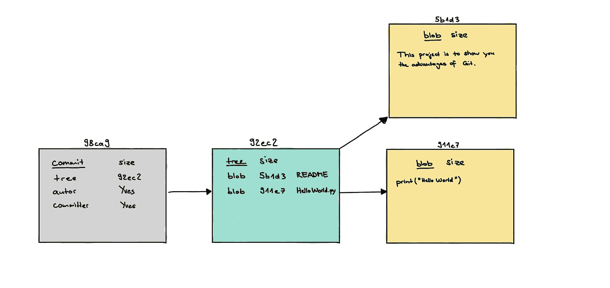
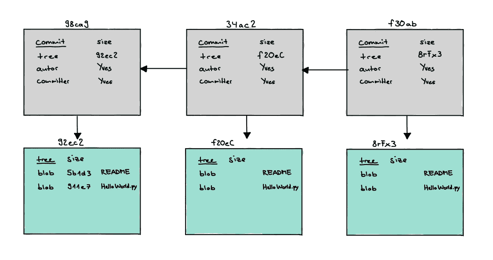
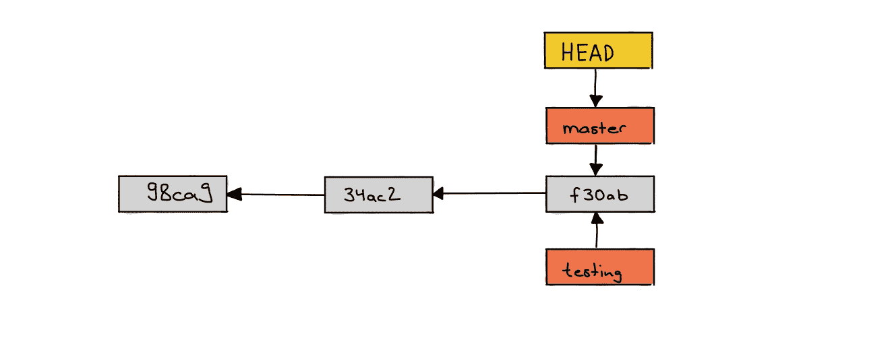
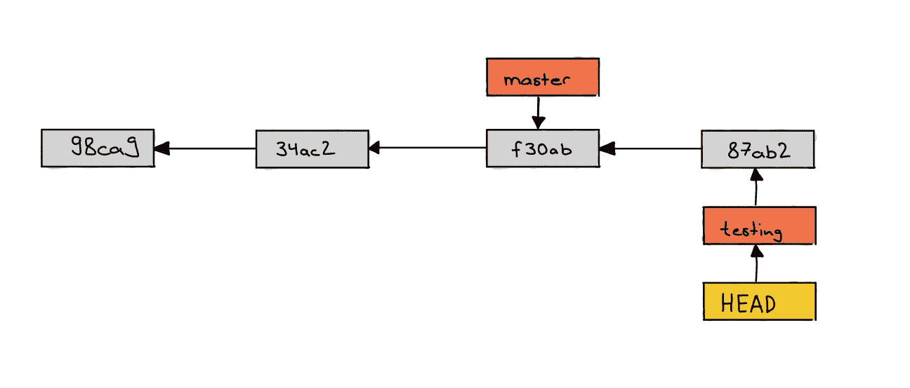
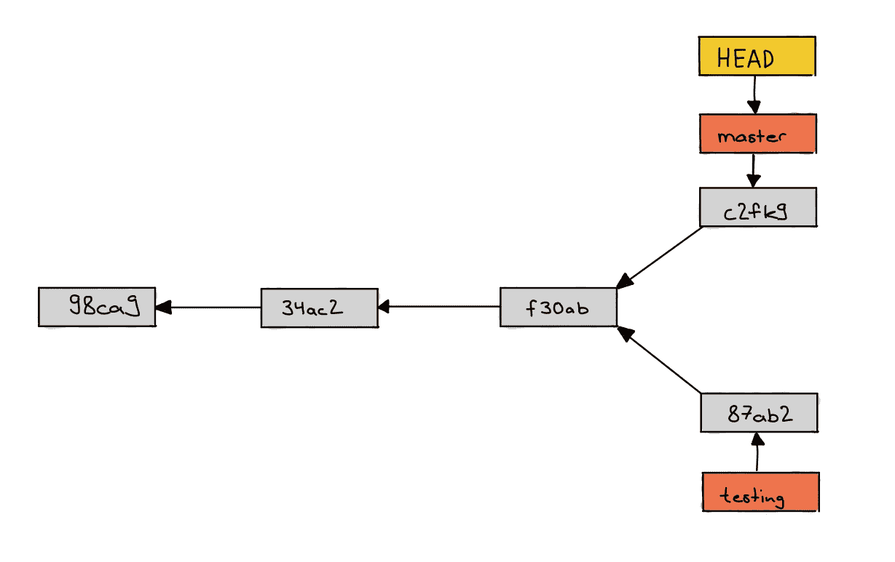
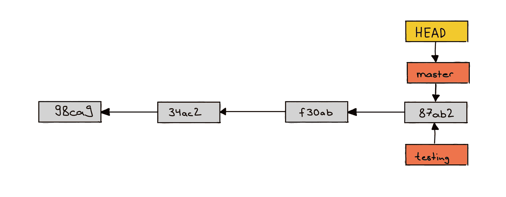
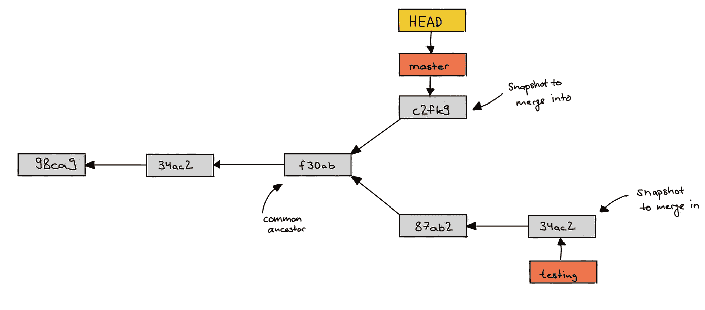
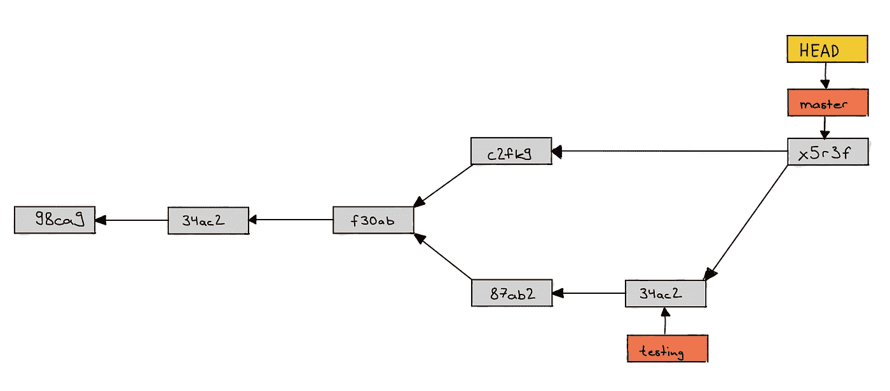

# 用您的 ML 项目学习 Git 分支

> 原文：<https://towardsdatascience.com/learn-git-branches-with-your-ml-project-7f58bdf1ae80?source=collection_archive---------14----------------------->

让我提出一个假设来开始这篇文章。你知道 git 的基础知识。你做 **git init，git clone** ， **git add** ， **git commit** ， **git push，git fetch，git pull** 。但是让我来测试你。下面这句话是什么意思？

```
$ git switch -c development
```

我跟你说实话，在我一个月前开始我的机器学习项目之前，我不知道这一行是做什么的。但是我在学习**分支**的过程中偶然发现了这个命令，以使我在 Git 版本控制方面的技能更加完整。这篇文章总结了我的学习，也是我想要的，这样我就可以尽可能快速有效地学习分支。如果你和我来自相似的地方，我鼓励你通过阅读这篇文章来适应分支。

为了使这种学习有效，我们首先*看看 Git 的内部，真正理解分支。这将包括**指针、blobs、提交对象**。*其次*，我定期向您展示我写的代码行，这样您就可以在 Git 库的不同分支中拥有多个版本的项目。*


照片由[凯拉·霍泽尔](https://unsplash.com/@keilahoetzel?utm_source=medium&utm_medium=referral)在 [Unsplash](https://unsplash.com?utm_source=medium&utm_medium=referral) 拍摄

# **分支是如何在引擎盖下工作的？**

如果输入`git commit -m “update"`会怎么样？它创建了一个提交对象。它包含作者的姓名和电子邮件地址、您为此提交键入的消息(“更新”)、指向之前提交的指针以及指向您暂存的文件的指针。好吧，有点快了。我们从舞台开始。

让我们假设您创建了两个文件

*   自述文件
*   HelloWorld.py

并用`git add README HelloWorld.py`将它们登台

Staging 导致对每个文件进行校验和检查，并将该版本存储在 Git 存储库中。在 Git 中，这个校验和单个文件的结果被称为 blob。每个 blob 代表文件的内容。当我们提交时，每个子目录(包含已转移的文件)也依次进行校验和检查。这一步的结果是一个树对象。树对象保存指向单个 blobs 的指针，存储单个文件的名称和 SHA-1 散列。不要忘记我前面提到的提交文件。这指向以前的提交，也指向根文件，以便能够在需要时重新创建版本。我们现在有 4 个 Git 文件:



作者绘图，Git 文件示意图

我注意到一个提交文件指向前一个提交文件，也称为父文件。让我们也想象一下。



提交指向其树对象的对象

# 现在，您已经准备好听听分支到底是什么了！

> 分支基本上是指向一个提交对象的可移动指针。

因此创建一个分支就是创建一个指针。这是一个非常轻量级的解决方案。分支是一个 40 个字符的 SHA-1 散列，它是对提交对象进行校验和检查的结果。创建一个分支就像创建 41 个字节并将它们写入一个文件一样简单(41 是因为 1 个换行符)。

## 分支在实践中是如何工作的

创建名为“testing”的分支的命令如下所示:

```
$ git branch testing
```

但是你可能想知道这个分支在哪里分叉？为了理解这一点，我们必须引入另一个 Git 要素。**头部指针**。

## 头部指针

Git 通过维护一个 HEAD 指针知道你在树状结构上的位置。HEAD 指向您当前所在的分支。所以如果你输入`git branch testing`，现在分支`testing`指向相同的提交，就像头指针之前指向的另一个分支。但是`git branch`并没有改变头部指针指向的位置，所以它仍然在 master 上。

我画了一张图让你更清楚。一个名为 master 的分支在我们创建一个名为 testing 的新分支之前就存在了，因为`git branch`没有改变 HEAD 的位置，所以在创建`testing`之后它仍然指向 master。



一个简单的提交历史，有两个分支和头指针

这意味着如果你想对分支的位置有更多的控制，你必须首先改变头指针指向的位置。这是用单词`checkout`完成的，但是它只能检出已经存在的分支。请注意，如果您`checkout`其他分支，您的工作目录中的文件会更改为保存在其他分支中的版本，如果您签出这些其他分支的话。

还记得`git switch -c testing`吗？它结合了`git branch testing`和`git checkout testing`，让你一次完成。你创建一个分支/指针，让 HEAD 指向这个新的分支。

> EAD 决定向哪个分支添加新的提交。

如果我们编写了`git checkout testing`，然后向我们的库`git commit -m "another commit"`提交一些东西，我们的情况看起来是这样的:



测试分支提前一个提交

在这种情况下，它看起来不像我们从自然界中所知道的实际分支。但是如果我们回到分支主节点`git checkout master`，然后在主分支上回到`commit`，我们会得到这两个分支的共同祖先或节点。这种情况看起来更像实际的分支。但是你明白了。



测试分支仍然提前 1 次提交，但现在也落后 1 次提交

# 我们必须谈论合并

有分支有什么用？你有两条或多条开发路径，你可能想两全其美，例如，从一个分支获得新的功能，并将其与主开发合并。

为了理解合并，让我们考虑两种可能的合并机制。

## 快进合并

使用快速向前合并，您基本上将落后的分支(主)向前移动到领先的分支(测试)。我再次展示了之前的情况。如果在后面的分支(主分支)没有在前面的分支(测试分支)中丢失的提交，这个**快速前进合并**起作用。

**之前:**


这种情况是为快速向前合并而设计的

之后:



快进合并的结果

为此，首先将头部指针移动到`master`，然后移动到`merge`:

```
$ git checkout master
$ git merge testing
```

如果你不再需要测试指针，你可以通过写来删除它

```
$ git branch -d testing
```

## 基本合并

另一种合并方式发生在两条路径都存在的情况下，如下图所示



一个稍微困难一点的合并工作，测试是提前 2 次提交和滞后 1 次提交

在这种情况下，Git 必须执行三个版本的合并。Git 不是向前移动分支指针，而是创建文件的快照，并创建指向它的新提交。这个提交有一个特殊的名称。它被称为合并提交，因为它有多个父级。



创建了一个名为合并提交的提交对象，以从两个分支获取关于共同祖先 f30ab 的更改

# 创建远程分支

如果您想与他人共享您的分支，以便多个编码人员可以处理您的项目，或者在 GitHub 上向他人展示您的项目，您需要将分支推送到远程存储库并创建远程分支。

语法如下所示:

```
$ git push <remote> <branch> #for example
$ git push origin master
```

这个命令创建了两件重要的事情。

1.  它创建了一个远程分支，其他人可以使用并进一步构建
2.  它在您的本地存储库中创建一个**远程跟踪分支**

将远程跟踪分支视为对远程分支状态的引用。他们有下面的名字结构`remotes/<remoteName>/<branchName>`。您仍然拥有分支的本地版本`master`，这意味着您的本地 Git 存储库拥有以下分支:

```
master
remotes/origin/master
```

注意，带有语法`remotes/<remoteName>/<branchName>`的远程跟踪分支是本地引用，不能用`git merge`移动它们。相反，如果您在`master`上做了更改，您可以将它们推送到服务器并获得一个更新的远程跟踪分支`remotes/origin/master`。因此，只要您不与远程储存库联系，远程跟踪分支**就不会移动。如果您的一位同事想要进行更改，并且他们已经克隆了他们使用的存储库:**

```
git fetch origin 
```

远程跟踪分支将被置于在那些分支上完成的最新提交。但是请注意，如果您获取和接收新的远程跟踪分支，您将不会自动拥有可以编辑的本地副本。如果`issue`是一个新的分支，它会是这样的:

```
master
testing
remotes/origin/master
remotes/origin/testing
remotes/origin/issue
```

您将只有一个无法修改的指针`remotes/origin/issue`。这意味着您需要使用以下命令来创建本地可编辑副本:

```
$ git checkout -b issue origin/issue
```

## git 拉

也可以通过编写一步完成`fetch`和`merge`

```
git pull <remote>
```

# 知道你的团队在做什么

你正在失去概观？别担心。我将用一个命令结束这篇文章，这个命令让您了解您的分支超前或落后了多少个版本。但是要确保，首先输入`git fetch`，这样您的本地 repo 就会得到更新，并从您的同事那里了解最新的提交。

```
$ git branch -vv
```

结果可能如下所示

```
testing     7e424c3 [origin/testing: ahead 2, behind 1] change abc  master      1ae2a45 [origin/master] Deploy index fix
* issue     f8674d9 [origin/issue: behind 1] should do it          cart        5ea463a Try something new
```

我想从这个例子中指出几点:

*   在左边你可以看到分支的名称，星号表示头部指针的位置
*   右边是代表每个分支上最后一次提交的 SHA-1 散列
*   远程分支在版本差异旁边的方括号中表示，例如，前面的 2 表示我向本地分支`testing`提交了两次，而这个工作还没有推送到远程。此外，我们的本地分支机构还没有完全更新。团队中有人推到了偏远地区，我们还没有将这项工作合并到我们当地的分支机构。
*   右边是提交消息

# **删除(远程)分行**

最后，如果你不再需要树枝..

**远程，**

```
$ git push <remoteName> --delete <branchName>
```

**本地，**

```
$ git branch -d <branchName>
```

开始时，记住在两个地方都删除可能会很烦人，但是我向您展示了如何删除，并且您可能会在对其中一个命令感到不确定时返回到本文。

# 摘要

您了解了提交、树和 blob 对象。您知道分支实际上只是指向提交对象的指针。此外，记住 HEAD 指针的存在是至关重要的，因为这个指针将决定你的新分支将在你的`git branch`命令上创建的位置。您现在熟悉的一个概念是合并分支，并在不使用它们之后删除它们。请务必记住快速向前合并和基本合并之间的区别。

如果你喜欢这篇文章，你可能会喜欢我在 medium 上写的其他一些文章。

</working-with-json-data-in-python-45e25ff958ce>  </skip-gram-neural-network-for-graphs-83b8f308bf87>  </graph-coloring-with-networkx-88c45f09b8f4> 