# 了解决策树是如何生长的

> 原文：<https://towardsdatascience.com/learn-how-decision-trees-are-grown-22bc3d22fb51?source=collection_archive---------22----------------------->

## 用 Python 中的一个例子解释决策树

作者:[爱德华·克鲁格](https://www.linkedin.com/in/edkrueger/)、[希德尔·邦戈尔](https://www.linkedin.com/in/sheetal-bongale/)和[道格拉斯·富兰克林](https://www.linkedin.com/in/dougaf/)。

卡丹和彼得在 Unsplash 上拍摄的照片

# 什么是决策树？

决策树是一种受监督的机器学习算法，可用于回归和分类问题。决策树遵循一组嵌套的 if-else 条件来进行预测。

由于决策树可用于分类和回归，因此用于生成决策树的算法通常被称为 CART(分类和回归树)。没有单一的决策树算法。已经提出了多种算法来构建决策树，但是我们将重点关注 scikit-learn 中使用的 CART 算法。

决策树是二叉树，其中每个节点代表一个决策。

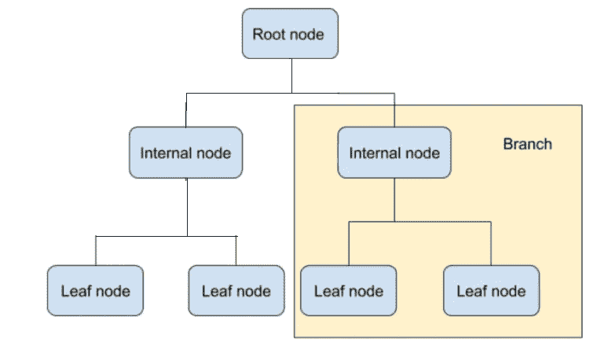

可视化购物车模型

*   **根节点:**这是启动图形的节点。深度为零。
*   **内部/子节点:**这些是做出二元决策的子节点。
*   **叶节点:**这些是树的最终节点，在这里进行类别或数值的预测。

该算法旨在从一组输入变量及其属性中预测目标变量。树结构是通过从根节点经由分支的一系列二进制分裂(是/否)构建的。当我们深入到树中时，我们会经过几个内部节点，直到到达叶节点。正是在这些终端节点上进行预测。

# 训练决策树

该算法首先将训练集分成两个子集。一旦 CART 算法成功地分割了训练集，它就使用相同的逻辑等递归地分割子集。

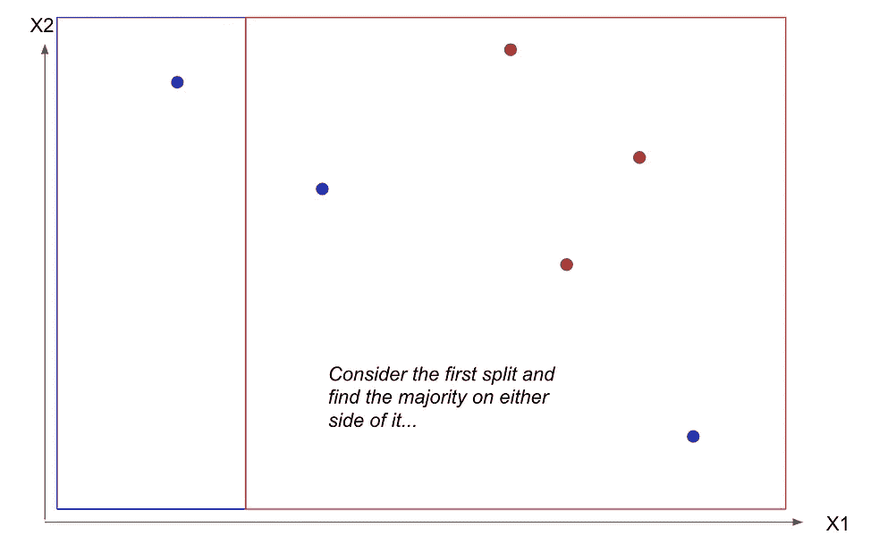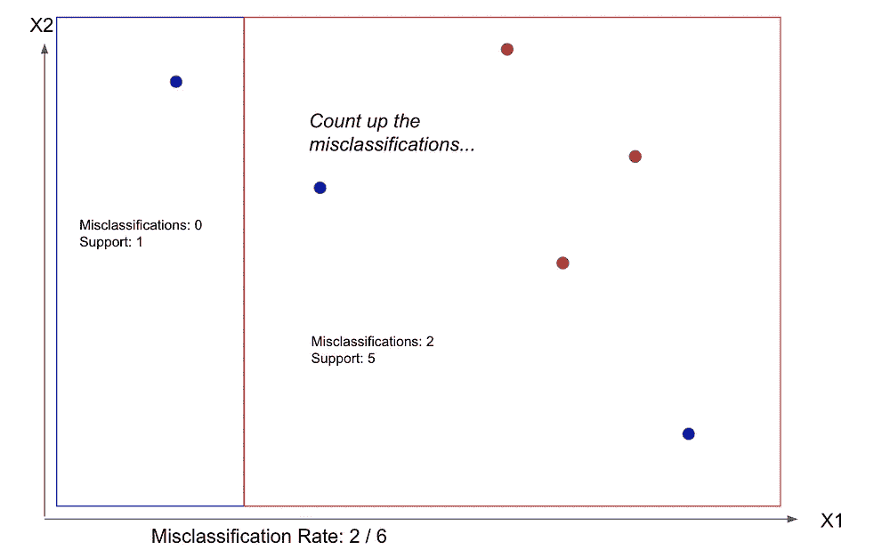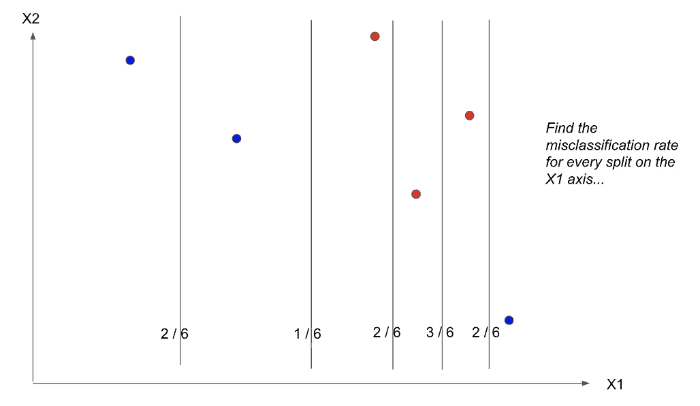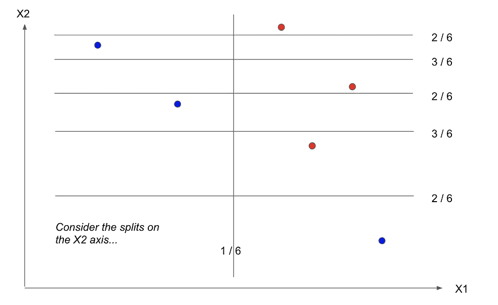

它一旦到达最大深度就停止分裂，或者找不到分裂来减少杂质。这种方法使决策树成为一种*贪婪算法—* 它贪婪地在根节点搜索最优分裂，并在每个后续级别重复该过程。

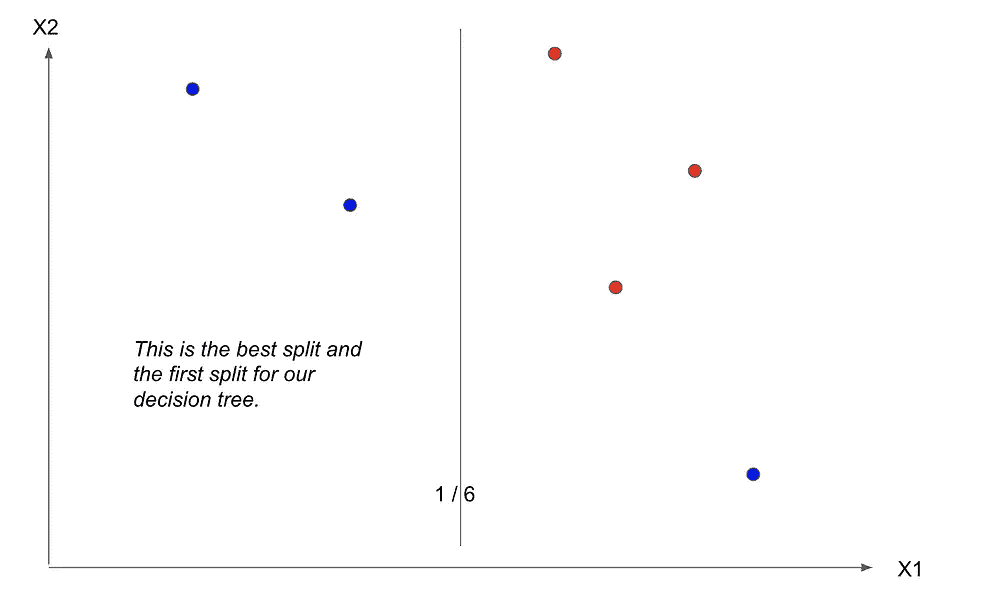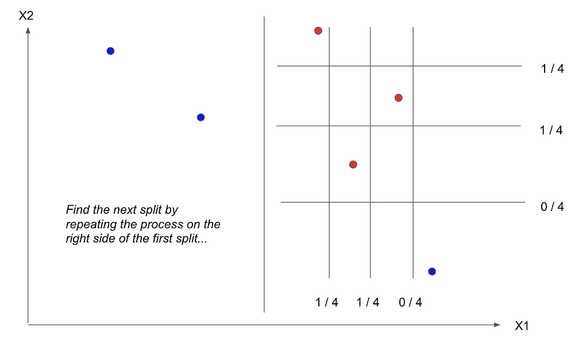

决策树是通过使用来自数据的特征递归分割我们的训练样本来构建的。

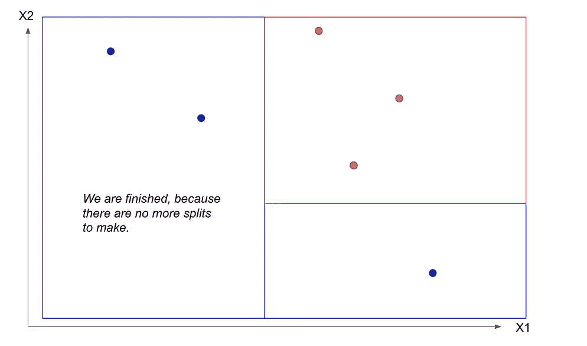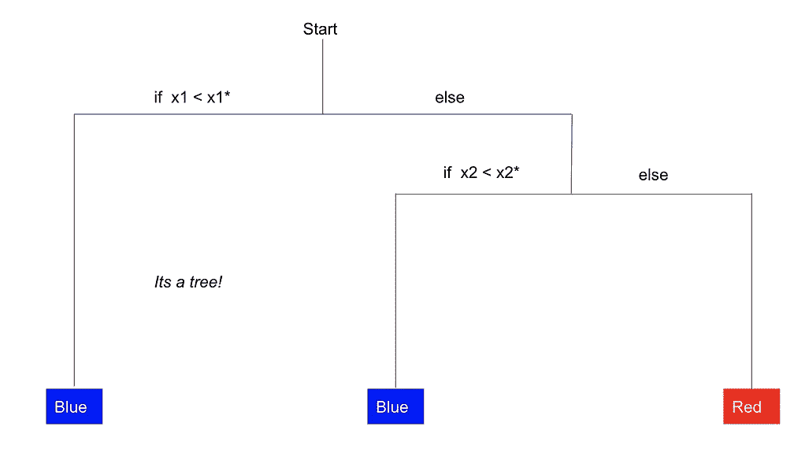

随着树的深度增加，杂质或不确定性的水平降低，导致更好的**分类**或每个节点的“最佳分割”。

将属性的最佳值确定为分割点相当于分割数据集以最小化给定的成本函数。所采用的成本函数取决于我们是在解决分类问题还是回归问题。在上面的可视化例子中，我们使用误分类率作为代价函数。

分类树的另外两个常见的成本函数是基尼不纯度和信息增益(熵)。当算法遍历一个属性的所有可能值时，它会计算该点的基尼系数或信息增益。最佳**最小化成本函数**的属性的值被用作分割。

> *一个节点的基尼指数或熵测量其杂质和无序度。一个节点是“纯”的，即如果它应用的所有训练实例属于同一类，则基尼指数或熵为零。默认情况下，使用基尼杂质测量，但您可以通过更改超参数来选择熵杂质测量。*

对于回归树，您可以使用回归度量作为成本函数。均方误差是一个非常常见的选择。当算法遍历独立变量的不同值时，它选择最大程度地减少 MSE 的分割。

# 编码示例

我们将使用 scikit-learn 中的经典葡萄酒数据集来构建一个购物车模型。该数据包含三个等级，没有明显的不平衡。在这里找到数据集。

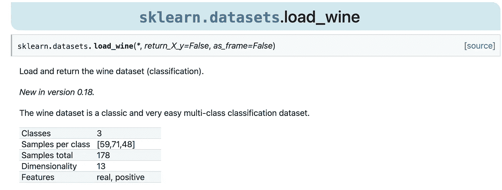

葡萄酒数据集信息

导入工具和数据

`load_wine()`的结果存储在`bunch`中是一个类似地图的物体，有六个主要成分:`['data', 'target','frame', 'target_names', 'DESCR', 'feature_names']`。

熊猫可以很容易地将这一串转换成数据帧:

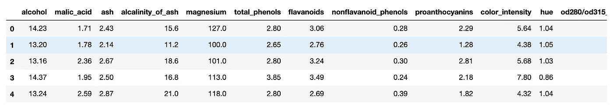

葡萄酒数据

决策树的主要优势之一是它们需要很少的数据准备或特征缩放。

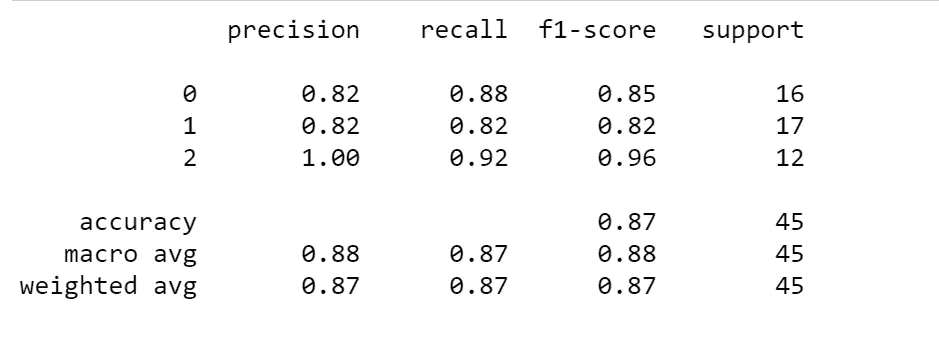

模型度量

现在让我们的模型可视化。

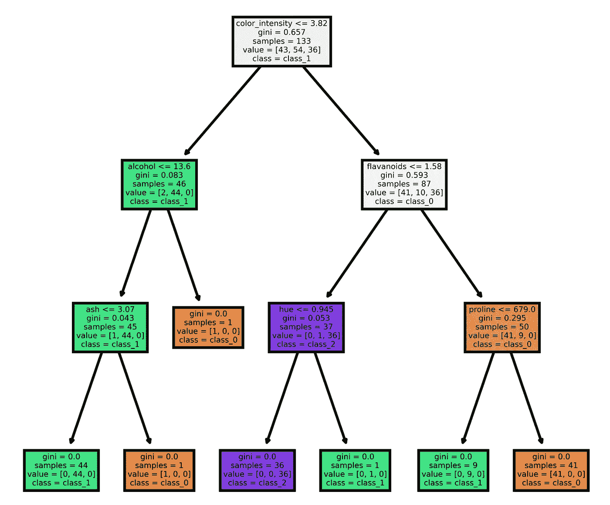

在这个可视化中，每种颜色代表一个葡萄酒类别。颜色的深浅表明纯度。每个决策节点中的第一个值表示用于从根到叶遍历的二进制逻辑。另外，请注意，样本大小是从父节点到子节点进行分割的，演示了最佳分割是如何分割样本的。

让我们用一个葡萄酒的例子来看看这棵树。想象一款颜色强度为 2.0，酒精含量为 12.o，灰分为 2.0 的葡萄酒。在第一个节点，当颜色强度≤ 3.82 时，我们将向左。按照这个逻辑，我们在酒精节点处向左，在 ash 节点处向左，最终在最左边的叶节点(class_1)处结束。

# 结论

决策树(CART)是强大的算法，与其他 ML 方法相比，很容易解释。它们不需要太多的计算能力，允许你快速种树。

虽然您需要小心不要过度拟合您的数据，但 CART 是解决许多问题的好算法。如果你想提高模型的性能和健壮性，你也可以探索集合方法，比如**随机森林**或者**修剪。**

## 决策树的优势

*   简单的理解和解释，易于使用，多功能和强大的。
*   需要很少的数据准备或特征缩放。
*   可以处理数字和分类数据。也可以解决多输出问题。

## 决策树的局限性

*   决策树的主要问题是它们对训练数据中的微小变化非常敏感。随机森林可以通过在许多树上平均预测来限制这种不稳定性。
*   没有正则化，决策树很容易过度拟合，因为决策树学习者可以创建过于复杂的树，不能很好地概括。随机森林也有助于防止过度适应。
*   树也相当不稳定。训练数据集中的一些变化可以导致完全不同的树。假设选择不同的特征作为第一个分割特征，整个树结构会改变。这也会给模型的可解释性带来问题。

## 参考

*   [sci kit-learn:Python 中的机器学习](http://jmlr.csail.mit.edu/papers/v12/pedregosa11a.html)，Pedregosa *等人*，JMLR 12，第 2825–2830 页，2011 年。
*   [数据](https://scikit-learn.org/stable/modules/generated/sklearn.datasets.load_wine.html):2007–2020，scikit-learn 开发者。