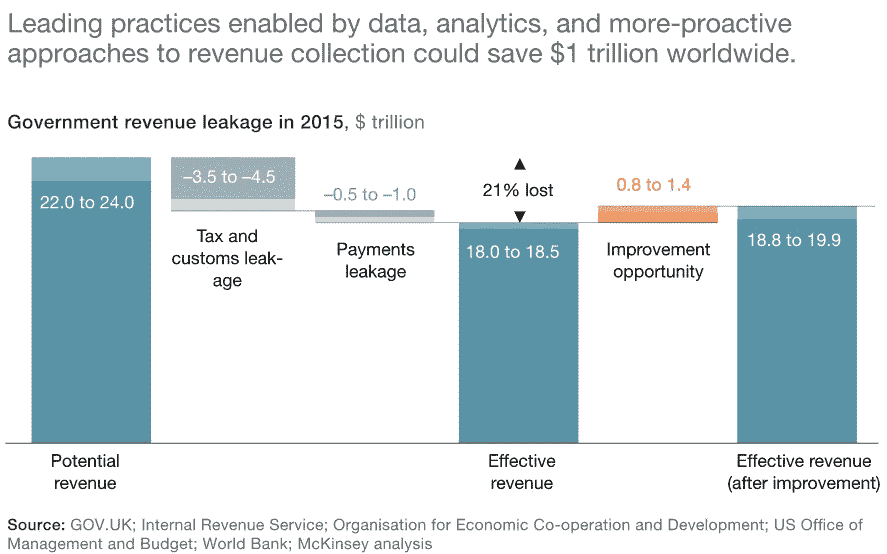
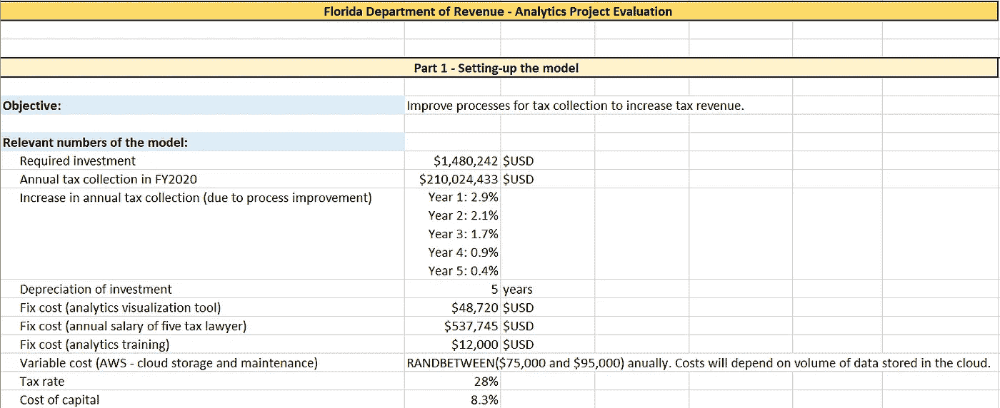
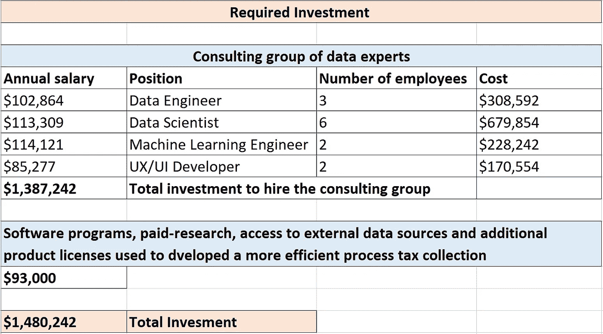
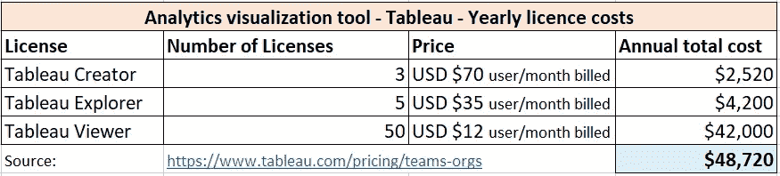
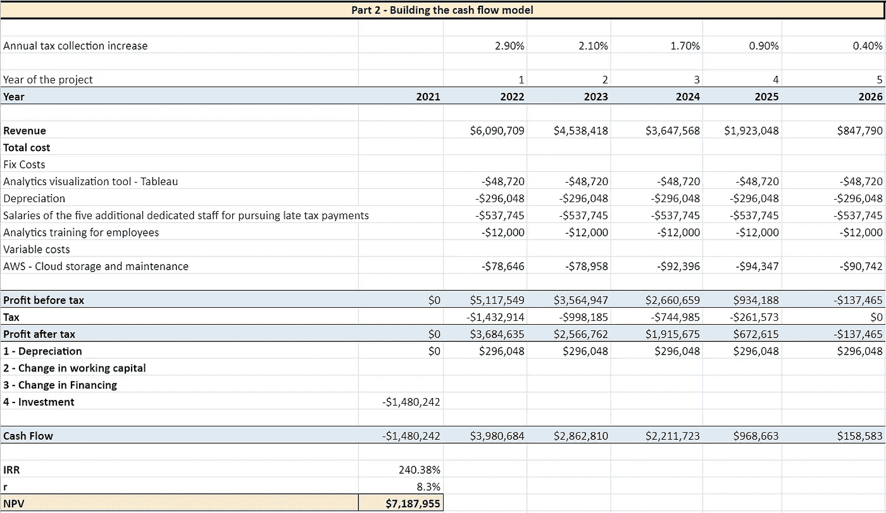
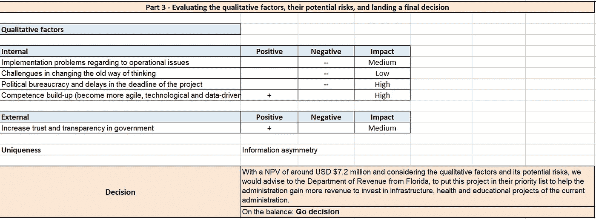
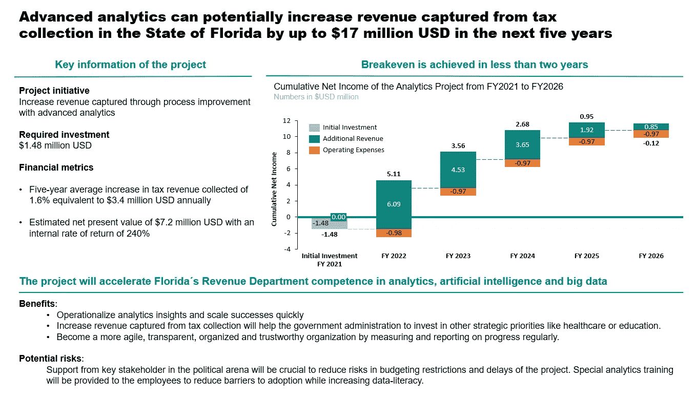

# 了解如何利用强大的决策模型对您的分析项目进行财务评估

> 原文：<https://towardsdatascience.com/learn-how-to-financially-evaluate-your-analytics-projects-with-a-robust-decision-model-6655a5229872?source=collection_archive---------12----------------------->

## 利用考虑定量和定性因素的有用框架，估算收入和成本、评估风险并计算分析项目的价值

全球的公司、政府和非政府组织已经意识到分析可以为他们的组织带来巨大的价值。自动化流程以节省成千上万的工时，基于数据驱动的分析改进决策制定，以及通过变得更加敏捷和有效来获得竞争优势，这些只是公司大力投资分析项目的几个原因。

话虽如此，首席数据官(CDO)必须以财务方式正确评估分析用例，以说服首席财务官和首席执行官投资于为其组织带来最大价值的项目。

为了了解如何做到这一点，我们将研究一个**商业案例**，展示进行商业分析项目的财务含义。我们将评估最相关的财务指标，并查看分析结果如何流经公司的损益表(P & L)。最后，我们将通过考虑定量和定性因素，说明在什么样的假设下，我们会建议是否继续进行该项目。

我们将着手的商业案例集中在**政府对分析领域的投资**。我们将给出政府可以从分析项目中获益的三个领域的例子，然后我们将选择其中一个项目来构建 Excel 电子表格模型，以评估其潜在的好处。

我们将对其中的一些数字进行假设，但重点是要考虑模型结构以及这些数字在模型中的处理方式。最后，我们将在面向非技术观众(例如政府机构)的幻灯片中总结我们的结果。

由 [Unsplash](https://unsplash.com?utm_source=medium&utm_medium=referral) 上的[absolute vision](https://unsplash.com/@freegraphictoday?utm_source=medium&utm_medium=referral)拍摄的照片

> **文章的结构**

1.  我们的商业案例——政府在分析领域的投资

2.政府可以从分析中获益的三个领域示例

3.介绍我们的决策模型

4.将 Excel 电子表格模型应用于潜在的政府分析项目

5.执行演示文稿——将我们的结果移交给政府机构

# 1.我们的商业案例——政府在分析领域的投资

大数据和高级分析的进步为政府提供了前所未有的机会来改善收入管理和支付方面的成果。根据麦肯锡&公司在 2018 年发表的一篇[文章，全球近 20%的政府收入，或约 5 万亿美元，每年都消失，要么是欠下的美元从未支付，要么是对外支付出错。](https://www.mckinsey.com/industries/public-and-social-sector/our-insights/the-trillion-dollar-prize-plugging-government-revenue-leaks-with-advanced-analytics)

三个趋势为政府创造了一个独特而直接的机会，动员起来争取更大的成功。这些趋势包括:

*   数据的可用性；
*   数据和分析工具以及存储的成本直线下降；和
*   将分析转化为行动的新技术。

为了利用这些机会，政府领导人需要能够有效地评估对分析项目的投资，以在社会中产生最大的积极影响。

为了做到这一点，我们将使用一个决策模型，主要利益相关者可以将其作为制定更明智决策的指南。值得一提的是，该模型并不仅限于政府项目，因此公司和非政府组织也可以使用它来评估他们的分析业务用例。

# 2.政府可以从分析中获益的三个领域示例

政府对分析的投资可以对社会产生巨大的积极影响。这些好处的一些例子包括:改善城市的安全，减少浪费，以更有效的方式进行审计，以及升级一个州的卫生系统。

我们将介绍三个具体的例子， [Jane Wiseman](https://datasmart.ash.harvard.edu/authors/jane-wiseman) 在她于 2019 年 9 月发表的题为“ [*政府投资分析*](https://datasmart.ash.harvard.edu/news/article/case-government-investment-analytics)*的研究论文中介绍的例子。在每一个例子中，我们将指出将发生的投资和运营成本的总和，以及可以实现节约的地方。*

*值得一提的是**我们将对这些数字做一些假设**，比如投资金额或运营成本中涉及的概念，当它们没有在示例描述中说明时。*

> ****例 1****

***增加收入——利用流程改进在堪萨斯市创建更高效的税收流程***

*密苏里州堪萨斯城利用数据分析和精益流程改进将税收增加了两倍。在首席数据官 Eric Roche 的领导下，数据团队(DataKC)与该市的法律部门合作，检查该市的过期税款征收流程。数据提供的见解导致了一种新的案件处理方式，并决定增加两名专门的工作人员来追踪滞纳金。年度收款从 2015 财年的 110 万美元增长到 2018 财年的 320 万美元。算上员工工资，这是投资的八倍回报。*

*▹ ***投资*** :支付给数据专家咨询组的工资。一名数据工程师、一名数据科学家、一名机器学习工程师和一名 UX/UI 开发人员被临时聘用，以支持 DataKC 团队改进税收流程。这个项目的回报是投资的八倍。*

*▹*

***▹ ***受益*** :税收增加三倍，发现办案新途径。这种新方法也有助于政府实体变得更加敏捷和灵活。年度收款额从 2015 财年的 110 万美元上升至 2018 财年的 320 万美元。***

> ******例 2******

*****通过提高效率节省成本—波士顿通过数据分析监控节省资金并降低碳足迹*****

***波士顿市通过一种优化校车路线的算法，每年节省 500 万美元，同时减少 20，000 磅的碳排放。该市实施该解决方案无需成本，因为它是由麻省理工学院的研究生开发的，是该市主办的黑客马拉松的一部分，奖金由一家私人基金公司赞助。***

***该市还通过实时监控和能源经理每年节省 100 万美元的城市建筑能源成本，能源经理可以在高峰成本 times⁴.期间战略性地调整消耗这一节省包括仅在一栋建筑(该市的主图书馆)中每年节省的 40，000 美元。***

***▹ ***投资*** :直接来说这个项目是没有投资的。以一种间接的方式，组织了一个黑客马拉松来创建这个解决方案，一个私人投资者为进一步的开发和部署提供资金。***

***▹ ***运营成本****:*data robot(一个自动化机器学习平台)的年度许可证订阅以及云中数据存储的可变月度费用。此外，有必要向数据科学家和数据工程师支付月薪，以保持算法的更新，并制定严格的数据治理协议。***

***▹ ***好处*** :波士顿市每年节省 500 万美元，同时减少了校车路线上的 2 万磅碳排放。此外，该市每年还在城市建筑能源成本上节省了 100 万美元。***

> ******例 3******

*****欺诈检测—在德克萨斯州发现失业保险欺诈*****

***得克萨斯州发现并阻止了利用 analytics⁵.进行的 9000 万美元的欺诈德克萨斯州信息资源部门的数据协调员 Ed Kelly 领导了德克萨斯州的透明和开放数据、数据共享和数据扫盲工作。得克萨斯州数据投资高回报的一个例子是得克萨斯州劳动力委员会(TWC)，该委员会发现了 9000 万美元的欺诈性失业救济金，被关押在该州监狱和拘留所的个人可能会申请这些救济金。通过将失业索赔数据与该州刑事司法部门的数据进行比较，该州现在可以确保不向被监禁者支付失业救济金。在该计划的早期，每年确定超过 2500 万美元，2018 年为 1800 万美元。这种避免欺诈的下降趋势可能表明，有消息称分析团队将识别潜在的欺诈，阻止更多的尝试。***

***▹ ***投资*** :招聘和保留计划对于吸引和保留德克萨斯劳动力委员会的合适分析人才至关重要。这些举措被认为是一项投资，也是项目开始时为以最佳方式改善数据共享流程而实施的数据架构。***

***▹ ***运营成本*** *:* 向政府实体的员工推出了季度培训计划，以提高他们的数据素养。额外的运营成本包括数据存储的可变成本、分析员工的固定工资成本以及起诉流程中额外三名律师的可变工资成本。***

***▹ ***救济金*** :阻止了 9000 万美元的欺诈性失业救济金。***

***这几个例子帮助我们看到了大数据和人工智能项目可以在政府实体中产生的价值。很少有政府数据团队拥有记录其价值的资源，但那些有资源的团队可以显示高达 8 比 1 的成本回报。此外，还有一个重要的非财务利益，因为当节省时间和金钱与提高透明度和问责制相结合时，公众对政府的信任可能会提高。***

# ***3.介绍我们的决策模型***

***为了评估决策，使用考虑了主要因素的**通用决策模型**是有意义的。在下面的视频中，BI 挪威商学院商业分析理学硕士项目的副院长 pl berth ling-Hansen 描述了这样一个模型。虽然有几种方法来构建这样一个*序列模型*，但是对于这个特定的模型有一些很好的论据。***

***建议的决策模型是通用的，适合大多数决策类型。重要的是要考虑到定性因素总是存在的，并旨在总结最终影响财务的所有积极和消极因素。这些因素是有关联的，因项目而异，也随着时间而变化。***

***现在，我们已经看到了决策模型的结构，我们将继续看一个具体的例子。 **Excel 电子表格模型**遵循与之前相同的方法，但现在我们将添加一些数字以使其更容易理解。请观看以下视频，了解我们将使用的模型的更多背景信息。***

***在本文的下一部分中，我们将对电子表格模型进行修改，使之适应示例 1 的一个小变化，以便更详细地理解如何将该模型应用于一个分析业务项目。***

# ***4.将 Excel 电子表格模型应用于潜在的政府分析项目***

***假设您在佛罗里达州税务局工作，该部门是负责佛罗里达州税收管理的政府实体。您已经了解了堪萨斯市如何通过流程改进增加税收收入*(示例 1)* ，并且您希望在您所在的州启动类似的计划，以增加政府实体的价值。该州有几个分析业务用例要考虑，所以现在是时候以严格的方式评估您的项目，以说服关键利益相关者您的项目是最好的！***

***首先，你需要的是建立模型，然后处理现金流，最后，你将评估定性因素及其潜在风险，以做出最终决定。在这个过程中，你将研究和假设这些数字中的一些，以获得一个可靠的财务估计。***

*****模型结构*****

*   ***第 1 部分—建立模型***
*   ***第 2 节——建立现金流模型***
*   ***第 3 部分—评估定性因素、其潜在风险，并做出最终决策***

> ******第一节*模型设置*****

******

***我们将分解这些数字来描述我们的假设。***

******

***对于 ***所需投资*** *，*我们建议，鉴于项目的规模，有必要聘请一组数据专家来协助佛罗里达州税务局。我们建议雇佣一个由 13 名顾问组成的团队，包括数据工程师、数据科学家、机器学习工程师和 UX/UI 开发人员。总的来说，咨询集团将向州政府收取 1387242 美元的服务年费，该费用基于 [Glassdoor](https://www.glassdoor.com/Salaries/data-engineer-salary-SRCH_KO0,13.htm) 上的美国年薪。需要额外的投资来访问外部数据源、研究和软件许可，这又增加了 93，000 美元，总投资为 1，480，242 美元。该金额将在项目开始时一次性支付。***

***根据[美国国内税收署(ISR)](https://www.irs.gov/statistics/soi-tax-stats-gross-collections-by-type-of-tax-and-state-irs-data-book-table-5) 的税收统计，佛罗里达州 2020 财年 的年度税收为 210，024，433 美元。此外，咨询集团预测，由于流程改进，年度税收*将增长如下:第 1 年增长 2.9%，第 2 年增长 2.1%，第 3 年增长 1.7%，第 4 年增长 0.9%，第 5 年增长 0.4%。****

********

****该团队还决定将 [Tableau](https://www.tableau.com/pricing/teams-orgs) 作为主要的 ***分析可视化工具*** ，供政府实体中的员工用于其分析和日常运营。这将使他们的*固定成本每年增加 48，720 美元。*****

*****该团队还将增加 5 名新的专职工作人员的工资，以追踪迟缴的税款。 ***税务律师*** 的[年薪为 107，549 美元，因此每年的固定成本总计为 537，745 美元。](https://www.glassdoor.com/Salaries/tax-lawyer-salary-SRCH_KO0,10.htm)*****

****对税务所员工进行特殊的 ***分析培训*** 对项目的成功至关重要。每月将安排研讨会和个人培训，教员工如何使用新工具，变得更加数据驱动。这将产生每年***12，000 美元*** 的固定成本。****

*******可变成本*** 将包括亚马逊网络服务 ***(AWS)针对云存储和维护*** 的每月现收现付服务。这些费用每年从 75，000 美元到 95，000 美元不等，取决于公民和企业每年提交的纳税申报数量。为了对此建模，我们使用了 Excel 中的 RandBetween 函数来简化事情，但在现实生活中，肯定有更好的方法来估算这些成本。****

****最后，我们决定采用 28%的*税率和 8.3%的 ***资本成本。********

> *******第二节——建立现金流模型*******

********

****在模型的第二部分，我们构建现金流以获得项目的**净现值(NPV)** ，在本例中为 7，187，955 美元。如果你想更详细地分析现金流模型，你可以查看我在下面附上的 Google Sheet 链接。****

****<https://docs.google.com/spreadsheets/d/1bqOesbj5UOvhdWz0XY-LvtBONdZF2NaD76c-k0FQ_Gs/edit?usp=sharing>  

> ***第 3 节——评估定性因素、其潜在风险，并做出最终决策***

现在，在模型的最后部分，是时候关注能够以积极或消极的方式影响项目的**定性因素**了。如上图所示，我们决定根据*内部*或*外部*、*正*或*负、*以及它们的*影响* ( *低*、*中、*或*高*)对这些因素进行细分。

对于这个项目，我们确定了三个需要考虑的内部负面因素，因为它们可能是**潜在风险**，会降低项目的盈利能力，甚至完全取消项目。关于积极因素，我们确定了其中两个，一个是内部因素，另一个是外部因素。

与**风险**联系在一起，我们尤其要关注*影响*较大的负面因素。对于这个项目，我们确定了一个是*“政治官僚主义和项目期限的延误”*。我们认为，为了在这个项目中取得成功，依靠佛罗里达州税务局的主要利益相关者的支持是至关重要的。该项目可能会面临许多操作问题和官僚主义，为了克服这一点，得到决策领导人的支持至关重要。

与积极因素相关，我们认为政府实体增强其分析能力有很多好处。这将有助于政府变得更加灵活、数据驱动、透明、有组织和可信，最终将带来长期的好处。

我们**计算了如果计划被延迟，对项目的相对影响**。例如，让我们假设该项目需要一年多的时间才能投产，税收的增长低于预期，项目的寿命从五年缩短到四年。

该项目的净现值仍然为正，净现值为 390 万美元。不同的**场景**可以通过修改模型的参数(如寿命、初始投资或成本)来创建，以查看潜在的财务影响。之前解释过的**悲观情景**的模型可以在这里访问:

<https://docs.google.com/spreadsheets/d/1-mJVGdNn6SIBpHIFbh7lBtZTDvq7auUMLkw4GovtxEk/edit?usp=sharing>  

为了做出最终决定，我们需要平衡定量和定性因素，同时考虑项目的潜在风险。

在*量化因素中，*我们使用了现金流模型，计算出的净现值为 7，187，955 美元。这是一个非常好的结果，因为 NPV 需要为正才能有吸引力。然而，重要的是要考虑我们还应该将 NPV 和内部收益率(IRR)与政府实体正在考虑的替代分析项目进行比较，以确定哪一个更有吸引力。

与*定性因素*和*潜在风险*、相关，我们可以得出结论，如果项目得到一群有影响力的领导人的支持，那么积极的方面会超过消极的方面。总的来说，我们建议对这个项目进行决策。

# 5.执行演示文稿——将我们的结果移交给政府机构

现在，我们已经以广泛的方式完成了对分析项目的评估，是时候将我们的结果以压缩幻灯片的形式呈现给佛罗里达州税务局的政府领导了。

以简短、精确和令人信服的形式展示结论对于说服关键利益相关者投资你的项目至关重要。我建议使用一个好的行动标题，写下与你的项目最相关的需求，使用图表来可视化你的结果，在底部有一些关键的要点和建议。

下面，您将看到一个如何向政府实体展示最终结果的示例。

最后，我想感谢您有兴趣阅读我的文章。希望对你有用！

最诚挚的问候，

胡安·曼努埃尔·鲁伊斯·阿科斯塔

# ***附加材料***

为了更好地理解什么是**商业案例**以及为什么它在撰写项目建议书时如此重要，我推荐你观看来自 YouTube 上项目管理视频的 Devon Dean 的视频。

> ***致谢***

这篇文章反映了许多个人的有益贡献和启发。这篇论文反映了简·怀斯曼的宝贵意见和建议，她是哈佛大学肯尼迪学院民主治理和创新阿什中心的美国政府创新研究员。此外，BI 挪威商学院负责商业分析理学硕士项目的副院长[pl berth ling-Hansen](https://www.bi.edu/about-bi/employees/department-of-accounting-auditing-and-business-analytics/pal-berthling-hansen/)提供了决策模型的解释视频，之前引用的[麦肯锡文章](https://www.mckinsey.com/industries/public-and-social-sector/our-insights/the-trillion-dollar-prize-plugging-government-revenue-leaks-with-advanced-analytics)对于丰富分析以得出更好的结论也至关重要。

> ***参考书目***

[1]:苏珊·坎宁安；戴维斯，乔纳森；以及 Dohrmann，Thomas， [*《万亿美元大奖:用高级分析堵住政府收入漏洞》*](https://www.mckinsey.com/industries/public-and-social-sector/our-insights/the-trillion-dollar-prize-plugging-government-revenue-leaks-with-advanced-analytics) ，2018 年 1 月，麦肯锡&公司。

[2]: Wiseman，Jane，“ [*政府投资案例分析*](https://datasmart.ash.harvard.edu/news/article/case-government-investment-analytics) *”，*2019 年 9 月*，*哈佛大学肯尼迪学院— ASH 民主治理与创新中心。

[3]:麦金蒂，乔·克雷文。“你是怎么修好校车路线的？打电话给麻省理工学院。”《华尔街日报》2017 年 8 月 12 日。

[4]:科林·伍德(Colin Wood)，“波士顿如何计划通过观看其电力账单节省 100 万美元”，Statescoop，2017 年 3 月 30 日。

【5】:木头，科林。“数据共享协议为德克萨斯州节省了 9000 万美元，”Statescoop，2019 年 1 月 11 日。****