# 了解如何使用 Google Cloud Workflow 执行无服务器流程编排

> 原文：<https://towardsdatascience.com/learn-how-to-perform-serverless-orchestration-with-google-cloud-workflow-5e20cee72a7c?source=collection_archive---------13----------------------->

## 关于创建工作流以连接服务的简单教程


安德里亚·扎内加拍摄于 [Unsplash](https://unsplash.com/)

# **简介**

谷歌工作流于[2020 年](https://cloud.google.com/workflows/docs/release-notes#January_25_2021)8 月 25 日首次推出。它是一个平台，作为开发人员的无服务器工作流来编排和自动化 Google Cloud，并连接一系列基于 HTTP 的 API 服务。例如，您可以使用 Google Workflow 连接云运行微服务、云功能、外部 API 等。

工作流由一系列步骤组成，这些步骤指定了每个步骤要执行的功能，并以 YAML 或 JSON 格式编写。完成工作流创建后，您需要**部署**工作流，然后才能**执行**。在**执行**时，它将基于创建的工作流中指定的逻辑运行。

在本文中，让我们学习如何使用 Google Cloud Workflow——我将通过涵盖以下项目，提供如何在 Google Workflow 上执行特定任务的示例:

(1)打印“Hello World”消息

(2)调用 HTTP 端点/ API /微服务

(3)用数组和字典进行循环和迭代

(4)向工作流添加日志

# **我们开始吧:**

如果这是您第一次访问 Google Workflow，您将需要启用 API。

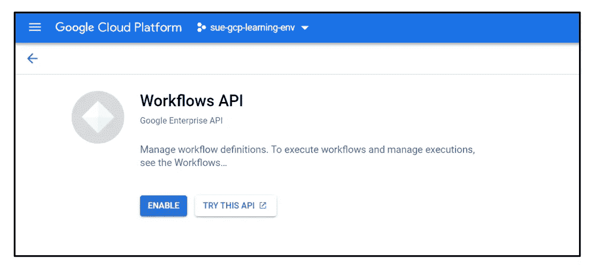

启用 Google 工作流 API

启用工作流 API 后，您可以创建新的工作流。选择“创建”以创建您的第一个工作流程:

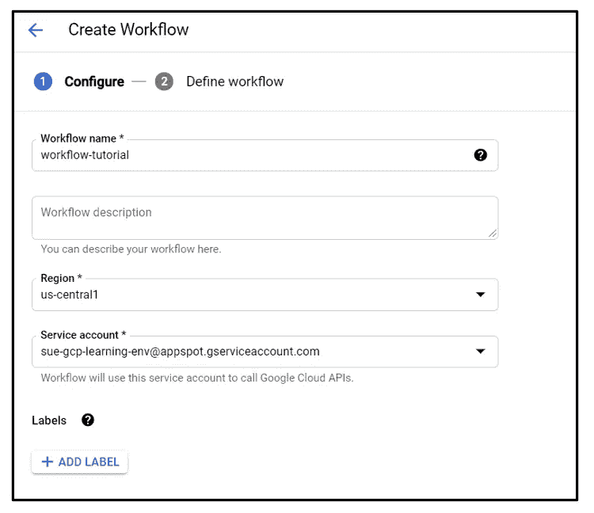

创建 Google 工作流

点击“下一步”按钮，您可以开始定义您的工作流程。

## (1)打印“Hello World”消息

让我们从基础开始，创建一个要返回的“Hello World”消息。我们需要定义一个返回消息的步骤。下面是我们将如何定义:

```
- returnHelloWorld:
        return: "Hello World"
```

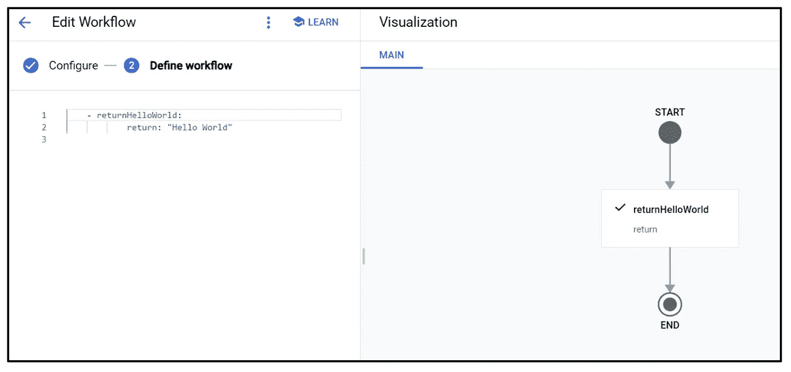

工作流程示例—打印“Hello World”

定义完工作流后，单击“部署”按钮部署工作流，然后执行它。您会注意到，如果没有错误，您的工作流已经成功执行，输出消息为“Hello World”。

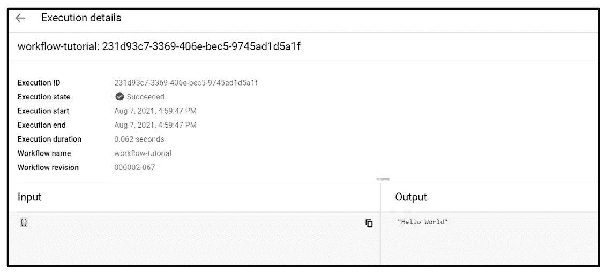

工作流示例—打印“Hello World”执行结果

恭喜你！您已经创建了第一个工作流。让我们继续，看看如何从 Google workflow 调用 API 端点。

## (2)调用 HTTP 端点/ API /微服务

现在，我们将构建一个调用 HTTP 端点的步骤。常见的 HTTP 请求方法有“GET”和“POST”。但是在这个例子中，我们将尝试一个“HTTP。GET”请求使用已部署的云运行微服务。我们可以从部署的服务细节中检索云运行 URL。

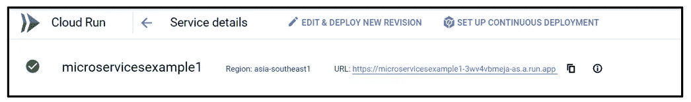

云运行端点

这个云运行微服务使用 GET 方法，需要传递一个输入。在本例中，输入“AZ”(state-Arizona)将被传递给服务，它将返回一条消息，其中包含该州新冠肺炎病例总数的值。 [*(该数据集是 Google BigQuery 数据集程序下检索的新冠肺炎公共数据集，日期范围为 2020 年 5 月至 2020 年 10 月)*](https://console.cloud.google.com/marketplace/browse?filter=solution-type:dataset&filter=category:covid19)

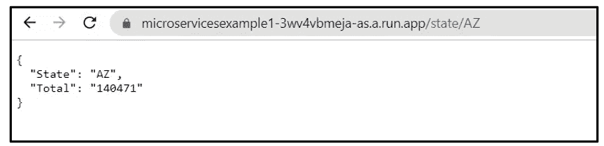

云运行微服务—返回消息

如上图所示，cloud run 服务将以 JSON 格式返回亚利桑那州的全部新冠肺炎病例。现在，要从 Google workflow 中调用这个服务，我们需要创建一个步骤( *getMicroservice* )，调用属性为“http.get”，URL 需要在参数下指定。

```
- getMicroservice:
       call: http.get
       args:
           url: [https://microservicesexample1-3wv4vbmeja-as.a.run.app/state/AZ](https://microservicesexample1-3wv4vbmeja-as.a.run.app/state/AZ)
       result: state_result
- returnResult:
       return: ${state_result.body}
```

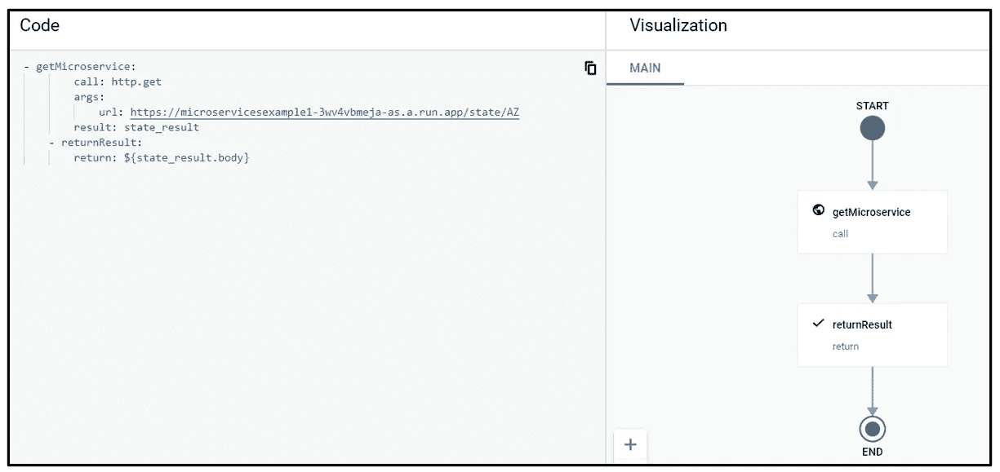

工作流示例—呼叫端点

注意，在最后一步( *returnResult* )，我们从 HTTP 端点检索返回消息的主体。返回消息将采用 JSON 格式，说明它是如何被指定的，并从云运行微服务返回。

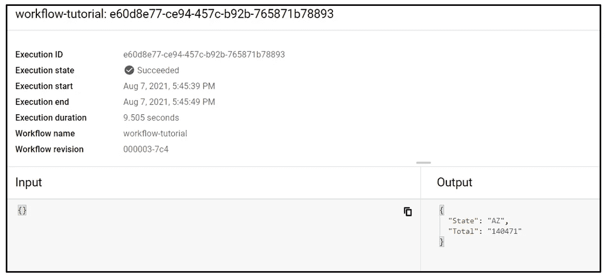

工作流示例—调用端点执行结果

干得好！您现在了解了如何在 Google Workflow 中调用 URL。让我们继续，看看如何通过迭代数组值列表来创建循环和迭代。

## (3)用数组和字典进行循环和迭代

在本例中，我们将创建循环和迭代，这些循环和迭代将遍历定义的数组列表，并将数组值传递给 HTTP 端点，并使用不同的输入值多次触发 HTTP 端点。在上一步中，我们只传递了“Arizona(AZ)”的输入值，而数据集中还有其他州。让我们看看如何为多个状态创建一个数组列表，并通过多次迭代传递这个值来调用 HTTP 端点。我们将创建一个数组列表来调用“亚利桑那(AZ)，加利福尼亚(CA)，佛罗里达(FA)”。

```
- define:
        assign:
            - array: ['AZ','CA','FL']
            - result: ""
            - i: 0
    - checkCondition:
        switch: 
            - condition: ${i<len(array)}
              next: iterate
        next: returnResult 
    - iterate:
        steps:
            - getMicroservice:
                call: http.get
                args:
                    url: ${"[https://microservicesexample1-3wv4vbmeja-as.a.run.app/state/](https://microservicesexample1-3wv4vbmeja-as.a.run.app/state/)"+array[i]}
                result: state_result
            - assign_loop:
                assign:
                    - i: ${i+1}
        next: checkCondition
    - returnResult:
        return: ${"Result has been Successfully executed"}
```

注意，有一个称为( *checkCondition)* 的步骤，用于决定循环应该何时结束。如果循环条件为真，它将把数组值传递给步骤(*迭代*)。在步骤( *iterate)* 下，数组值将作为输入值传递给 HTTP 端点“ *+array[i]”。*在完成数组列表中的值的迭代后，循环将结束并移动到最后一步( *returnResult* )。

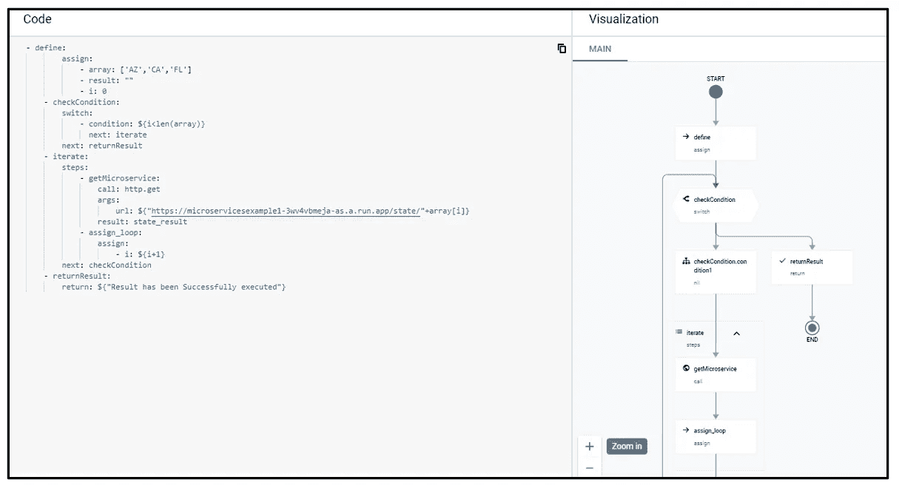

工作流示例—使用数组列表进行循环和迭代

干得好！您现在已经了解了如何创建一个循环并使用数组列表进行迭代。接下来，我们想添加日志来了解每个循环中发生了什么。

## (4)向工作流添加日志

在 Google workflow 中，有内置的日志记录功能，我们可以将这些功能添加到工作流中，以创建更多关于正在发生的事情的可见性。例如，在我们前面的例子中，我们想知道在每个循环中传递哪个数组值，以及这些值是什么。让我们将这个额外的日志步骤添加到我们的工作流中。

```
- define:
        assign:
            - array: ['AZ','CA','FL']
            - result: ""
            - i: 0
    - checkCondition:
        switch: 
            - condition: ${i<len(array)}
              next: iterate
        next: returnResult 
    - iterate:
        steps:
            - logstep-1:
                call: sys.log
                args:
                    text: ${"Job is running for " + array[i]}
                    severity: INFO
            - getMicroservice:
                call: http.get
                args:
                    url: ${"[https://microservicesexample1-3wv4vbmeja-as.a.run.app/state/](https://microservicesexample1-3wv4vbmeja-as.a.run.app/state/)"+array[i]}
                result: state_result
            - logstep-2:
                call: sys.log
                args: 
                    text: ${"Result for State " + array[i] + " total is " + state_result.body.Total}
                    severity: INFO
            - assign_loop:
                assign:
                    - i: ${i+1}
        next: checkCondition
    - returnResult:
        return: ${"Result has been Successfully executed"}
```

要将日志添加到工作流中，只需添加一个新步骤和对函数“sys.log”的调用。在示例 create 中，有几个关于严重性的选项，如 INFO、WARNING、CRITICAL 等。请注意，在下面的可视化中，logs 步骤被添加为循环迭代的一部分。因此，日志会打印出每次迭代中发生的事情。

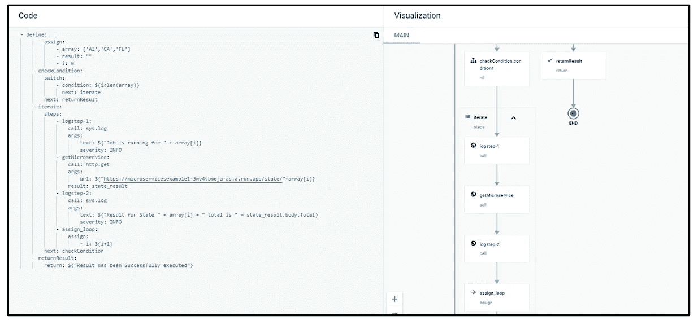

工作流示例—添加日志

可以通过导航到日志选项卡来查看日志。让我们看看我们的日志上打印了什么:

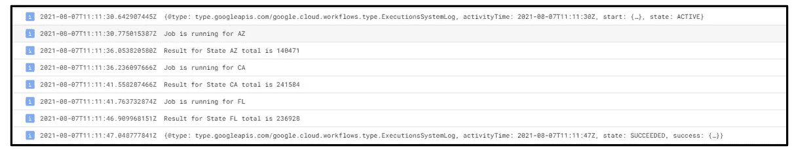

工作流示例-添加日志:日志结果

从日志中我们可以看到，我们知道第一次运行的迭代是针对 Arizona (AZ)的，总案例数是 140471。后续的迭代细节也会在日志中打印出来。添加日志确实让工作流中发生的事情更加清晰。

## **结论:**

当您需要管理多个服务时，例如处理一系列事件/API，Google workflow 是一个合适的平台。此外，它易于管理，因为不需要基础架构，并且平台可以按需扩展。Google Workflow 中还有本文没有涉及的其他特性，比如错误处理、重试步骤、睡眠功能等。尽管如此，我希望这篇文章能让你很好地理解如何在 Google Cloud 上创建工作流。

**参考文献&链接:**

[1][https://cloud.google.com/workflows/docs](https://cloud.google.com/workflows/docs/http-requests)

[2][https://cloud . Google . com/workflows/docs/reference/stdlib/sys/log](https://cloud.google.com/workflows/docs/reference/stdlib/sys/log)

[3][https://atamel . dev/posts/2020/09-08 _ first _ look _ at _ workflows/](https://atamel.dev/posts/2020/09-08_first_look_at_workflows/)