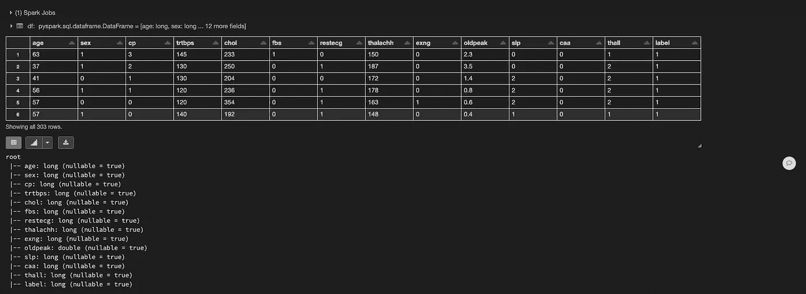
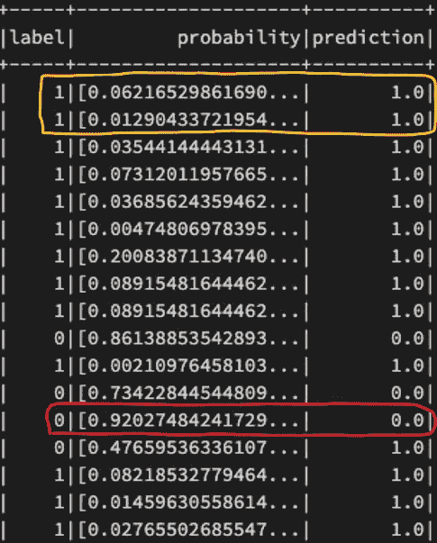
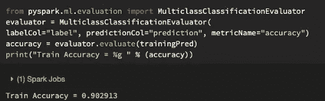
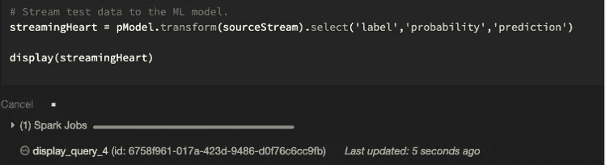
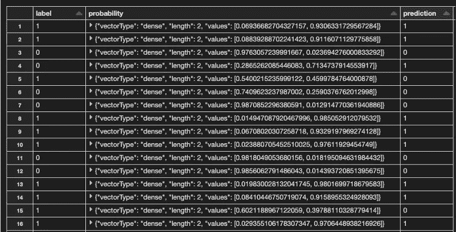

# 了解如何使用 Spark ML 和 Spark 流

> 原文：<https://towardsdatascience.com/learn-how-to-use-spark-ml-and-spark-streaming-3a731485d052?source=collection_archive---------9----------------------->

## 关于如何使用 SparkML 对使用 PySpark 的流数据进行预测的教程


马库斯·温克勒在 [Unsplash](https://unsplash.com/s/photos/tutorial?utm_source=unsplash&utm_medium=referral&utm_content=creditCopyText) 上的照片

# **目标:**

在本文中，我将通过一个例子来说明如何使用 Spark ML 来预测流数据。请注意，我们不会将重点放在比较不同的模型和调整模型上。主要的焦点将是我们如何能够结合火花流来使用数据块进行预测。除此之外，您应该对如何使用 Spark ML 有一些基本的了解。如果你对 Spark ML 不熟悉，可以看看下面的视频。

对于这个例子，我们将根据某人的年龄、性别和医疗状况来预测他是否会心脏病发作。逻辑回归将被训练，我们流入看不见的数据来做预测。

# **数据收集:**


杰西·奥里科在 [Unsplash](https://unsplash.com/s/photos/heart-attack?utm_source=unsplash&utm_medium=referral&utm_content=creditCopyText) 上的照片

对于这个项目，我使用了 Kaggle 上可用的数据集。如果您想跟进，请点击此处的。数据由 303 行和 14 列组成。每行代表一名患者的信息。此数据集的要素由以下各列组成:

*   年龄:以年为单位的年龄 1。年龄:以年为单位的年龄
*   性别:性别(1 =男性；0 =女性)
*   cp:胸痛型(1 =典型心绞痛；2 =不典型心绞痛；3 =非
    心绞痛；0 =无症状)
*   trtbps:静息血压(入院时以毫米汞柱为单位)
*   chol:血清胆固醇，单位为毫克/分升
*   fbs:空腹血糖> 120 mg/dl (1 =真；0 =假)
*   restecg:静息心电图结果(1 =正常；2 = ST-T
    波异常；0 =肥大)
*   thalachh:达到最大心率
*   exng:运动诱发心绞痛(1 =是；0 =否)
*   oldpeak:相对于静息运动诱发的 ST 段压低
*   slp:运动 ST 段峰值的斜率(2 =上坡；1 =平坦；
    0 =下降)
*   caa:透视着色的主要血管数(0-3)
*   thall: 2 =正常；1 =固定缺陷；3 =可逆缺陷

目标列如下:

*   输出:0=心脏病发作几率降低，1=心脏病发作几率增加。

第一步是创建一个模式，以确保在读取 csv 文件时数据包含正确的数据类型。接下来，我们将使用 spark.read.format()函数，以“csv”作为参数，添加选项以读入标头，并将我们创建的模式分配给数据框。最后，我们加载数据，我们还将目标列更改为 label，以便我们的逻辑回归可以识别目标变量是哪一列。

```
from pyspark.ml import Pipeline
from pyspark.sql.types import StructType,StructField,LongType, StringType,DoubleType,TimestampType# We use the following schema
schema = StructType( \
                     [StructField("age", LongType(),True), \
                      StructField("sex", LongType(), True), \
                      StructField("cp", LongType(), True), \
                      StructField('trtbps', LongType(), True), \
                      StructField("chol", LongType(), True), \
                      StructField("fbs", LongType(), True), \
                      StructField("restecg", LongType(), True), \
                      StructField("thalachh", LongType(), True),\
                      StructField("exng", LongType(), True), \
                      StructField("oldpeak", DoubleType(), True), \
                      StructField("slp", LongType(),True), \
                      StructField("caa", LongType(), True), \
                      StructField("thall", LongType(), True), \
                      StructField("output", LongType(), True), \
                        ])data = "dbfs:/FileStore/tables/heart.csv"
df=spark.read.format('csv').option('header',True).schema(schema).load(data)
df = df.withColumnRenamed("output","label")
df.display()
df.printSchema()
```

一旦我们运行上面的代码，我们会得到下面的输出:



作者图片

# **机器学习:**

说到数据预处理步骤，我首先将数据分为训练集(70%)和测试集(30%)。

```
testDF, trainDF = df.randomSplit([0.3, 0.7])
```

之后，我创建了一个包含五个阶段的管道。第一阶段是一个向量汇编器，它接收 age、trtbps、chol、thalachh、oldpeak 列，并将它们转换成一个向量。第二阶段需要上述特征的缩放过程。我使用 pyspark.ml.feature 库中的 MinMaxScaler()函数。之后，我一次性编码了 sex、cp、fbs、restecg、slp、exng、caa 和 thall 列，因为它们是名义上的分类变量。接下来，我创建了第二个矢量组装器，并将一个 hot 编码列和缩放特征添加到一个矢量中。最后但并非最不重要的是，最后一个阶段由具有以下参数的逻辑回归组成:

*   maxIter = 10
*   regParam = 0.01

我选择了逻辑回归算法，因为我们的目标由二进制数(0 和 1)组成。一旦创建了管道，我就调整并转换训练集。之后，我选择标签、概率和预测列。训练模型时，请参见下面管道施工和预测的片段。

```
from pyspark.ml.feature import OneHotEncoder
from pyspark.ml.feature import MinMaxScaler
from pyspark.ml.feature import StringIndexer
from pyspark.ml.feature import VectorAssembler
from pyspark.ml.feature import OneHotEncoder
from pyspark.ml.classification import LogisticRegression# Create the logistic regression model
lr = LogisticRegression(maxIter=10, regParam= 0.01)# We create a one hot encoder.
ohe = OneHotEncoder(inputCols = ['sex', 'cp', 'fbs', 'restecg', 'slp', 'exng', 'caa', 'thall'], outputCols=['sex_ohe', 'cp_ohe', 'fbs_ohe', 'restecg_ohe', 'slp_ohe', 'exng_ohe', 'caa_ohe', 'thall_ohe'])# Input list for scaling
inputs = ['age','trtbps','chol','thalachh','oldpeak']# We scale our inputs
assembler1 = VectorAssembler(inputCols=inputs, outputCol="features_scaled1")
scaler = MinMaxScaler(inputCol="features_scaled1", outputCol="features_scaled")# We create a second assembler for the encoded columns.
assembler2 = VectorAssembler(inputCols=['sex_ohe', 'cp_ohe', 'fbs_ohe', 'restecg_ohe', 'slp_ohe', 'exng_ohe', 'caa_ohe', 'thall_ohe','features_scaled'], outputCol="features")# Create stages list
myStages = [assembler1, scaler, ohe, assembler2,lr]# Set up the pipeline
pipeline = Pipeline(stages= myStages)# We fit the model using the training data.
pModel = pipeline.fit(trainDF)# We transform the data.
trainingPred = pModel.transform(trainDF)# # We select the actual label, probability and predictions
trainingPred.select('label','probability','prediction').show()
```



作者图片

正如我们在上面看到的，标记的黄色行表明概率越低，模型越有信心预测为 1。另一方面，标记的红色行显示概率越高，它预测输出为零就越确定。除此之外，我还评估了模型的性能，计算了总的准确度分数。请看下面我如何计算准确度分数的代码片段。



作者图片

在对训练数据进行模型训练时，准确率达到了 0.902913%，这是一个令人满意的结果。

# **流媒体:**

为了合并 Spark 流，我将测试数据集重新划分为十个不同的文件来复制流模拟。

```
# We now repartition the test data and break them down into 10 different files and write it to a csv file.
testData = testDF.repartition(10)#Remove directory in case we rerun it multiple times.
dbutils.fs.rm("FileStore/tables/HeartTest/",True)#Create a directory
testData.write.format("CSV").option("header",True).save("FileStore/tables/HeartTest/")
```

之后，我首先创建了一个源代码，它由以下代码行组成。

```
# Source
sourceStream=spark.readStream.format("csv").option("header",True).schema(schema).option("ignoreLeadingWhiteSpace",True).option("mode","dropMalformed").option("maxFilesPerTrigger",1).load("dbfs:/FileStore/tables/HeartTest").withColumnRenamed("output","label")
```

从上面可以看到，我使用 spark.readStream，读入一个格式为“csv”的文件。除此之外，我还添加了我在开始读取文件时创建的模式，后面是多个选项，例如:

*   ignoreleeadingwhitespace:True→删除前导空格。
*   模式:drop formattered→当设置为 drop formattered 时，将忽略所有损坏的记录。
*   maxFilesPerTrigger: 1 →每个触发器中要考虑的新文件的最大数量。

之后，我从重新划分测试数据的目录中加载数据，以复制流的模拟。最后但同样重要的是，为了实现逻辑回归，我将输出列更改为 label。

最后一步是建立测试数据的流。我使用适合训练集(pModel)的管道，并使用带有参数“sourceStream”的转换功能，这是我之前创建的源。最后，我选择标签、概率和预测列。请参见下面的代码片段。



作者图片

正如我们所看到的，绿灯亮了，这表明我们正在传输看不见的数据，这些数据来自为了传输而重新划分以复制模拟的测试数据。下面是我们的流输出示例，它向我们展示了测试数据的实际标签、概率以及模型对未知数据的预测。



作者图片

为了评估对测试数据的预测，我们可以看到流数据属于哪一类的概率。例如，当我们看第 1 行时，我们可以看到概率列中的向量，它由[0.06936682704327157，0.93631729567284]组成。向量中的第一个元素表示 0 级(没有心脏病发作)的概率，第二个元素表示 1 级(心脏病发作)的概率。该模型选取较高的概率值，并将流数据分配给具有较高概率的类。在第一个示例中，模型预测 1，当与实际标签进行比较时，这是正确的。

# **最后的话:**

我希望这个例子能帮助您更好地理解如何使用 Spark 的流数据进行预测。同样，本文的主要焦点不是关于模型的性能，而是关于我们如何在我们的机器学习模型中使用看不见的流数据。如果您对将 Spark 流合并到 Spark ML 有更多的问题，我强烈建议您仔细阅读 databricks 文档。请查看下面的链接:

 [## using-mllib-with-structured-streaming.html-数据布里克斯

### 编辑描述

docs.databricks.com](https://docs.databricks.com/_static/notebooks/using-mllib-with-structured-streaming.html) 

如果你对这个话题有任何问题或者有任何反馈，请随时联系我。如果你能在任何社交媒体平台上分享这篇文章，我将不胜感激。谢谢，下次再见！✌️

[](https://www.navidma.com/) [## 纳维德·马辛奇作品集

### 我已经在分析行业工作了四年多，并且热爱其中的每一秒钟。我是一个高度…

www.navidma.com](https://www.navidma.com/)