# 学习高级 Python 可视化:用例方法

> 原文：<https://towardsdatascience.com/learn-plotly-for-advanced-python-visualization-a-use-case-approach-7a43b2f9d5d1?source=collection_archive---------28----------------------->

## 使用 Plotly Go 创建交互式散点图的实用指南

图像源( [Pixabay](https://pixabay.com/photos/analytics-charts-graphics-marketing-2618277/) )

# 介绍

我最近完成了一个有趣的数据科学项目，该项目使用无监督的机器学习根据几个关键的住房市场指标对北卡罗来纳州的 162 个社区进行了细分/聚类。如果你有兴趣了解更多关于这个项目的信息，你可以阅读我的文章[房产市场聚类分析](/sharpen-your-machine-learning-skills-with-this-real-world-housing-market-cluster-analysis-f0e6b06f6ba0)。

在项目的最后，我使用 Tableau 绘制了一个散点图来可视化各个部分。散点图是一种优秀的可视化技术，适用于可视化分割结果等用例。它允许你将你的集群投射到“三维”上——前二维是你的 x 和 y 轴，第三维是气泡大小。下面是我为这个项目创建的 Tableau 仪表盘的截图。

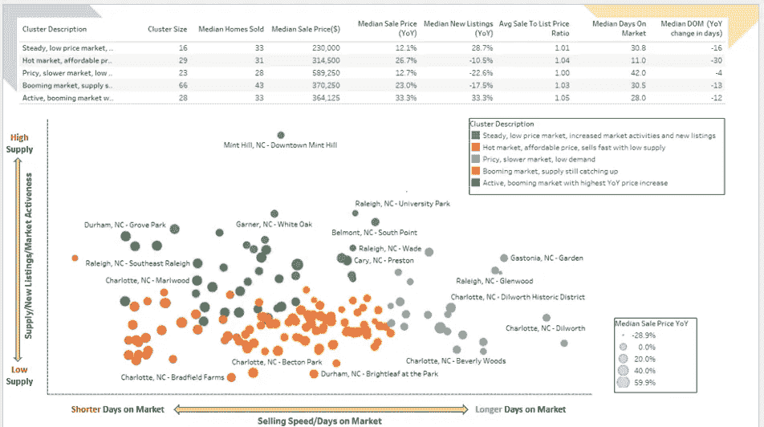

在 Tableau 中绘制的散点图(图片由作者提供)

虽然 Tableau 是创建交互式可视化的绝佳工具，但在两个平台之间切换有点麻烦:在 Python 环境中训练模型和创建片段，然后在另一个工具中可视化结果。因此，在本教程中，我将向您展示如何使用 Python 的 *Plotly Go* (Graph Objects)来创建相同的交互式图表，这些图表具有定制的颜色和工具提示，可以满足我们在这个用例中的需求。

# Plotly Express vs. Plotly Go

*Plotly* Python 库是一个交互式的开源绘图库，涵盖了广泛的图表类型和数据可视化用例。它有一个名为 *Plotly Express* 的包装器，是 *Plotly* 的高级接口。

*Plotly Express* 作为一个起点，使用简单的语法创建最常见的图形既简单又快捷，但在涉及更高级的图表类型或自定义时，它缺乏功能性和灵活性。

与 *Plotly Express 相比，Plotly Go* (图形对象)是一个较低级别的图形包，通常需要更多的编码，但更具可定制性和灵活性。在本教程中，我们将使用 *Plotly Go* 创建与 Tableau 中创建的相同的交互式散点图。您还可以将代码保存为模板，以便在其他用例中创建类似的图表。

# 阅读并准备数据

在[住房市场聚类分析](/sharpen-your-machine-learning-skills-with-this-real-world-housing-market-cluster-analysis-f0e6b06f6ba0)项目结束时，我们创建了一个数据框，其中包含北卡罗来纳州 162 个社区的住房市场指标以及通过 k-means 算法分配给它们的聚类(cluster_nbr)。让我们来看看这些数据，看看这些数据是什么样的:

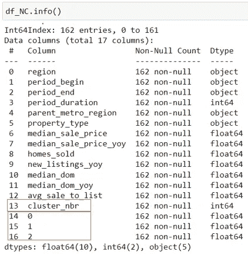

作者图片

我们有 162 行和 17 个字段。“cluster_nbr”字段是我们根据 k-means 算法分配给每个邻域的分类标签。最后三个字段是从 PCA 得到的主成分，这将允许我们将我们的聚类投影到散点图上，前两个主成分是 x 和 y 轴。

让我们也重命名一些列，使它们更容易理解。此外，cluster_nbr 列是一个整数，这在我们的代码中不会产生期望的输出。因此，我们需要将其数据类型更改为 string。

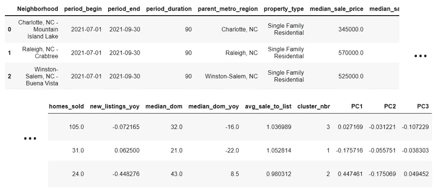

聚类数据(作者图片)

# 添加集群描述

现在我们已经读取并准备好了集群数据，让我们做一个快速分析来显示集群级别的汇总统计信息。这将帮助我们理解每个聚类的独特特征，并为每个聚类添加有意义的描述(而不是通用的聚类标签，如 0、1、2、3 等)。)

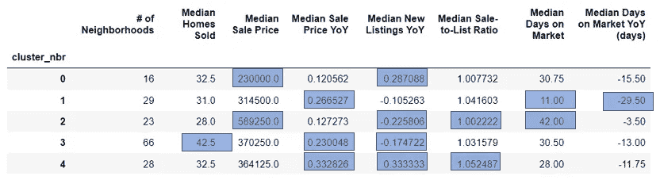

聚类摘要统计(按作者分类的图片)

基于汇总统计数据，我们可以描述每个集群的特征。例如，集群“1”的平均上市天数最短，年同比价格涨幅第二高，而集群“2”的市场价格相对较高，平均销售价格最高，但与去年相比价格降幅最大。这个集群中的房子也需要最长时间才能卖出去。根据我们的观察，我们可以向数据集添加一个分类描述列:

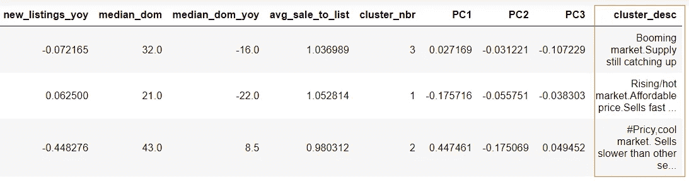

图片由作者提供

# 使用 Plotly 创建一个基本的散点图

为了熟悉 *Plotly* ，让我们首先创建一个标准简单的散点图，只有几行代码，如下所示。

基本散点图将 162 个街区投射到一个二维图表上。X 轴是第一个主成分(PC1 ),代表销售速度/上市天数指标。Y 轴是第二个主成分(PC2 ),它代表供应/新上市 YoY 指标。

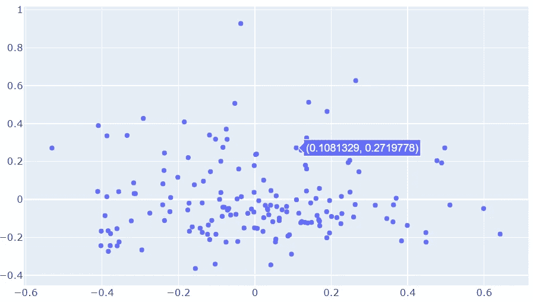

使用 Plotly 的基本散点图(图片由作者提供)

当悬停在每个数据点上时，默认情况下，绘图会显示带有 x 和 y 坐标的工具提示。只用了几行代码，我们就制作了一个非常方便的基本交互式图表。现在，我们可以向图表中添加更多功能和自定义设置，使其信息量更大。具体来说，我们将通过以下方式定制和优化情节:

*   用代表不同分类的自定义颜色显示数据点
*   添加代表每个数据点的“销售价格增长中值(YoY)”的气泡大小
*   自定义悬停工具提示以显示每个数据点的附加信息
*   添加图表标题、x 轴和 y 轴标签等。

# 向基本散点图添加自定义内容

为了添加自定义项，如聚类颜色、气泡大小和悬停提示，我们需要首先向数据框添加三个新列，将这些“自定义参数”分配给每个数据点。

以下代码将向数据框添加一个名为“color”的新列。我们首先定义一个名为“color”的函数，它为每个 cluster_nbr 分配一个唯一的颜色代码(由我们指定)。然后，我们将该函数应用于数据帧中的每个数据点，使得每个数据点将根据其所属的聚类而具有其自己的颜色代码。

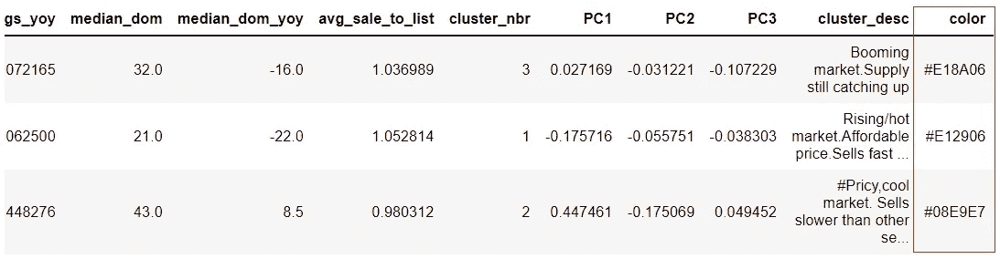

将“颜色”列添加到数据框(图片由作者提供)

我们还将为每个数据点添加一个名为“size”的新列，以显示每个气泡的大小。我们希望气泡的大小代表销售价格同比增长的中位数:气泡越大，与去年同期相比，销售价格的增幅越大。

一些数据点的中值价格变化变量为负值，当您试图直接使用该变量来绘制泡沫大小时，会出现错误。因此，让我们使用最小-最大缩放器来缩放此变量，并使其介于 0 和 1 之间，所有值都为正值。

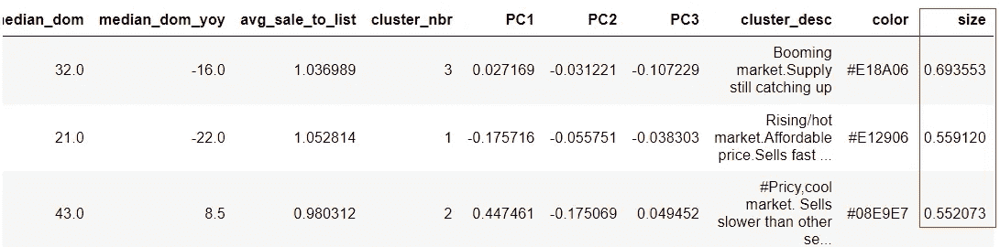

为气泡大小添加大小“列”(图片由作者提供)

最后，让我们添加一个“文本”列，当鼠标悬停在每个数据点上时，它将显示定制的工具提示。这可以通过在下面的代码中使用*代替*循环来实现。

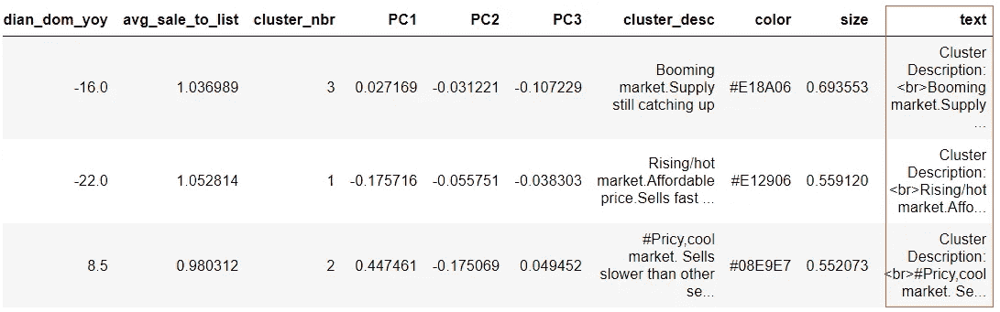

为自定义工具提示添加“文本”栏(图片由作者提供)

# 将所有定制放在一起

现在我们已经将自定义列添加到了数据框中，我们可以创建一个图形并将这些自定义添加到图形中。

在下面的代码中，我们首先创建一个字典，其中包含每个聚类的数据框。然后，我们创建一个图形，并添加使用第一个集群的数据帧的第一个轨迹。我们遍历字典，将剩余的轨迹(聚类)一次一个地添加到图形中，并最终在同一个图形中绘制所有的聚类。

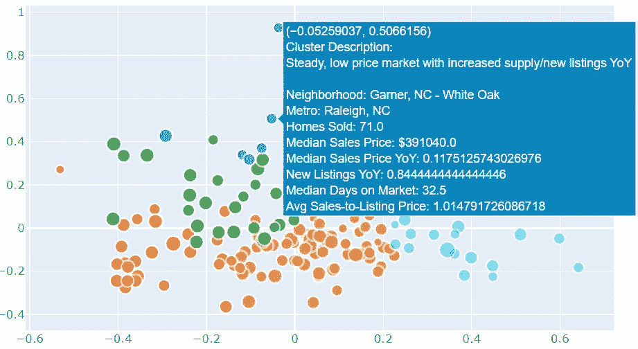

带有自定义颜色和工具提示的气泡图(图片由作者提供)

# 设置图表的样式和格式

我们实现了定制基本散点图的目标，用不同的颜色分割、工具提示中的定制文本以及指定的气泡大小。我们注意到，在工具提示中，一些指标显示在许多小数位，很难阅读。有些指标用百分比表示可能更好。因此，让我们改变一下样式，让工具提示更容易理解。

我们还将向图表添加图表标题和轴标签。请记住，我们的 x 轴和 y 轴是代表销售速度和供应/新上市同比的两个主要组成部分，因此让我们根据这些含义来标记轴。

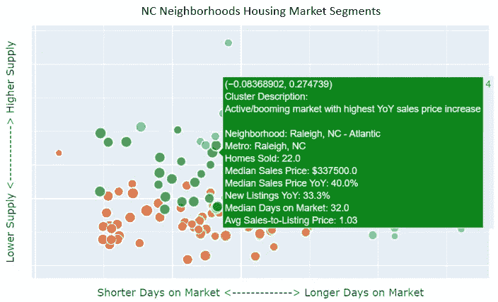

交互式散点图(图片由作者提供)

现在我们用 Python 和 *Plotly* 创建了一个交互式散点气泡图！最初我认为这应该是一个很容易制作的图表。但是正如您所看到的，当您实际处理一个真实世界的用例时，在您的编码中有许多细节和细微差别需要考虑，以使图表看起来完全像您所想的那样！感谢阅读，我希望你喜欢这篇文章。快乐学习！

你可以通过这个[推荐链接](https://medium.com/@insightsbees/membership)注册 Medium 会员(每月 5 美元)来获得我的作品和 Medium 的其他内容。通过这个链接注册，我将收到你的一部分会员费，不需要你额外付费。谢谢大家！