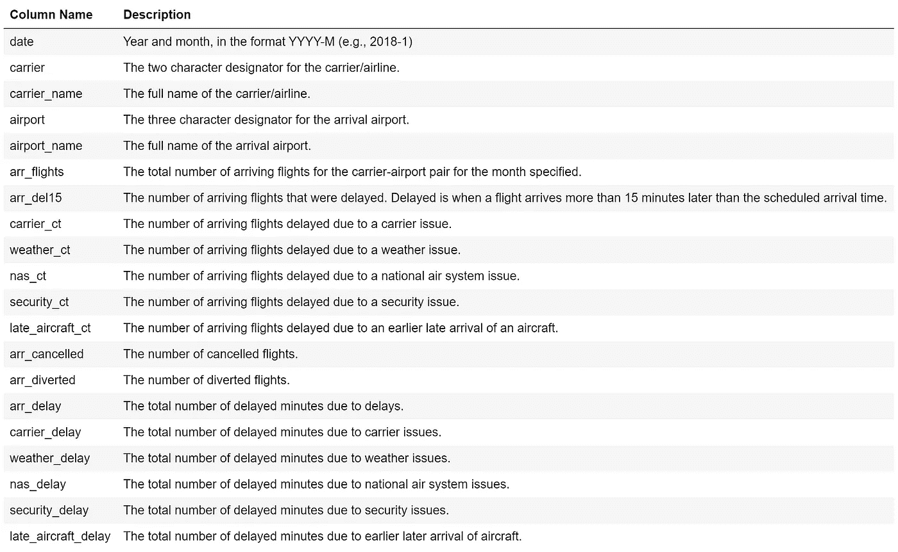
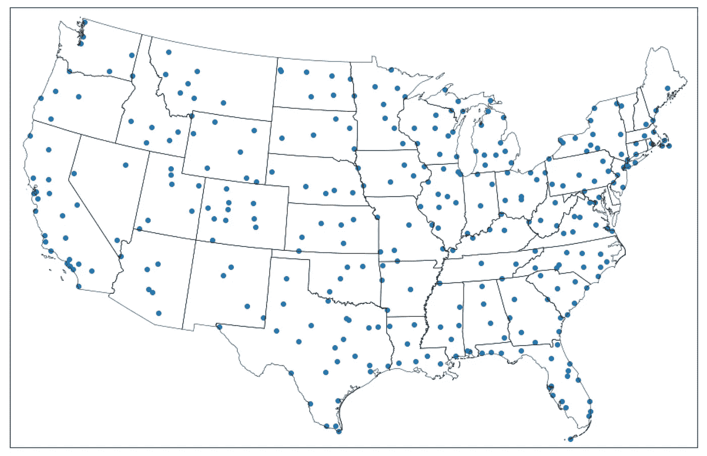
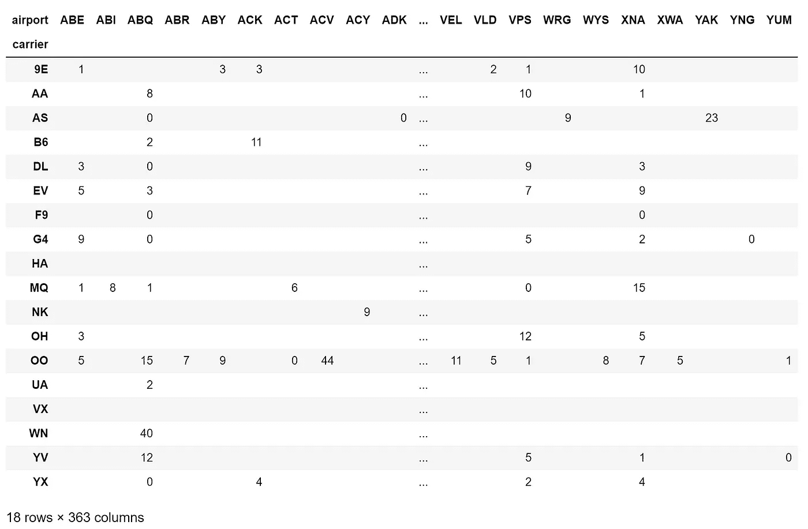
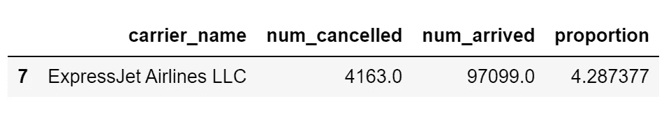
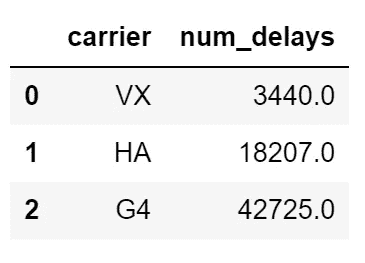
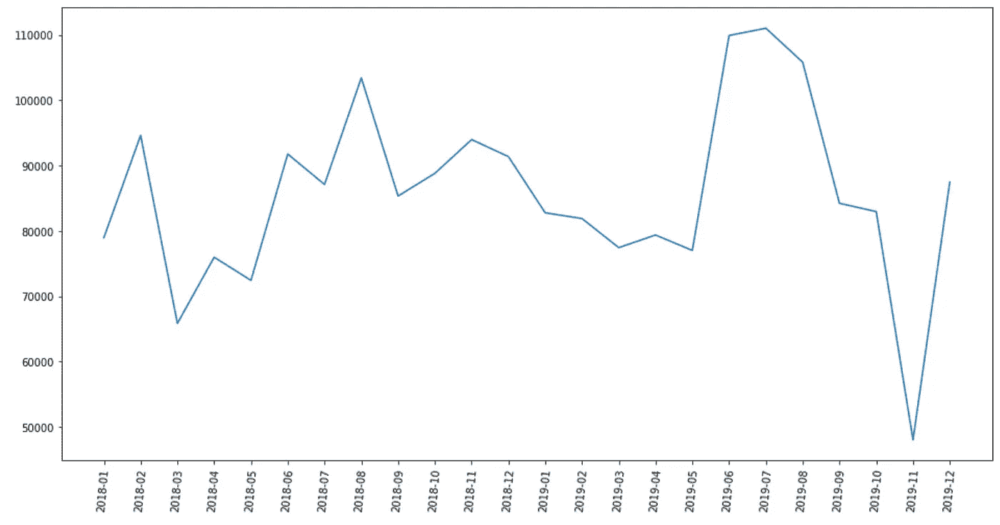

# 通过示例了解 Python 数据分析-航班到达延误

> 原文：<https://towardsdatascience.com/learn-python-data-analytics-by-example-airline-arrival-delays-e26356e8ae6b?source=collection_archive---------10----------------------->

## 一个有趣的项目和详细的数据分析步骤演练，帮助您学习 Python、pandas、matplotlib 和底图


由 [Unsplash](https://unsplash.com?utm_source=medium&utm_medium=referral) 上的 [CHUTTERSNAP](https://unsplash.com/@chuttersnap?utm_source=medium&utm_medium=referral) 拍摄

# 介绍

在攻读商业分析硕士学位期间，我发现通过实例学习是我学习 Python 数据分析的最佳方式。获得一个数据集和一组编码任务比阅读教科书或听教授讲课要有益得多。

我想把这种学习方法分享给其他人，他们也会受益。你需要的只是一个 Python 开发环境(我推荐 [Jupyter Notebook](https://jupyter.org/) )和乐于学习的意愿。

本文包括一个数据分析任务列表，后面是如何完成这些任务的详细演练。在通读演练之前，请尝试自己完成这些任务，这样您会获得更多的收获。请记住，有很多方法可以解决编码问题，所以你的代码可能不会和我的一字不差，这没关系。

另请查看:[通过示例学习 Python 数据分析:纽约市停车违规](/learn-python-data-analytics-by-example-ny-parking-violations-e1ce1847fa2)

# 项目描述

对于这个项目，我们将使用大约 40，000 条记录的数据集，这些记录代表了美国 18 家航空公司的航班到达延迟。数据集中的每一行代表指定月份的承运商-机场对的延误数据的汇总。该数据集创建于 2021 年 1 月，包含 2018 年 1 月 1 日至 2019 年 12 月 31 日的数据，数据来源于[交通统计局](https://www.transtats.bts.gov/OT_Delay/OT_DelayCause1.asp)。

如果你还没有[熊猫](https://pandas.pydata.org/)、 [matplotlib](https://matplotlib.org/) 和[底图](https://matplotlib.org/basemap/index.html)库，你需要安装它们。

# 数据分析任务

请使用从 [GitHub repo](https://github.com/nickdcox/learn-airline-delays) 中获得的 *delays_2018.csv* 、 *delays_2019.csv* 和*airport _ coordinates . CSV*数据集在 Python 中执行以下任务。

1.  将包含航班延误数据的 CSV 文件读入单个数据帧。然后显示导入的总行数。
2.  将*日期*列改为日期格式 YYYY-M(如 2018–1)。然后对导入的数据集执行探索性数据分析，以识别无效数据—编写代码以删除受影响的行。最后，显示剩余的行数。
3.  显示数据集中出现的所有田纳西机场的列表。
4.  导入坐标数据集，并将其与现有数据集合并。在地图上标出所有机场的坐标(提示:使用 Matplotlib 和底图)。
5.  显示每个承运商-机场对的改航航班数量。
6.  显示 2019 年有多少抵达 JFK 的航班遇到了天气和承运人延误。
7.  显示航班取消最多的航空公司，占到达航班总数的百分比。
8.  确定每个机场的总平均延误次数。
9.  请显示延误航班数量最少的三家航空公司。
10.  请求用户输入航空公司。然后画出该航空公司每月的国家航空系统(NAS)延误分钟数。显示趋势在过去两个月是上升还是下降。

# 数据字典(delays_2018.csv，delays_2019.csv)

数据集中的每一行代表指定月份的承运商-机场对的延误数据的汇总。例如，一行可以表示 2018 年 5 月到达纽约市 JFK 机场的美国航空公司航班的延迟数据。

当多个原因被分配给一个延误的航班时，每个原因根据它所负责的延误分钟数按比例分摊。这些数字是四舍五入的，相加可能不等于总数。



由[约翰尼·科恩](https://unsplash.com/@jonecohen?utm_source=medium&utm_medium=referral)在 [Unsplash](https://unsplash.com?utm_source=medium&utm_medium=referral) 上拍摄的照片

# 步骤 1:将包含航班延误数据的 CSV 文件读入单个数据帧。然后显示导入的总行数。

```
Number of Rows: 41177
```

## 代码解释:

我们首先将熊猫模块的内容提供给我们的程序。pandas 是一个易于使用的开源数据分析和操作工具，构建于 Python 编程语言之上。我们将在整个项目中广泛使用它。

```
import pandas as pd
```

我们通过调用 read_csv()方法导入 *delays_2018.csv* 文件的内容，并将其存储在一个 DataFrame 中，命名为 *df_18* 。DataFrame 是一个带有标记轴的二维数据结构，由数据、行和列组成。可以把它想象成在 Microsoft Excel 或 Microsoft Access 中构建的表。然后，我们对 *delays_2019.csv* 文件重复相同的操作，将其命名为 *df_19* 。

```
df_18 = pd.read_csv('delays_2018.csv')
df_19 = pd.read_csv('delays_2019.csv')
```

为了将两个数据帧组合成一个数据帧，我们调用 pandas 的 concat()方法，这是 concatenate 的缩写。我们传递两个参数:第一个是包含我们想要连接的两个数据帧的名称的列表，第二个是告诉 pandas 忽略两个数据帧中的现有索引，从而创建一个新的索引。

```
df = pd.concat([df_18, df_19], ignore_index=True)
```

我们使用 print()函数打印字符串‘Number of Rows:'后跟 DataFrame 中的行数。我们传递给 print()函数的参数由两部分组成。第一个是用单引号括起来的字符串“Number of Rows:”表示它是一个字符串。参数的第二部分是计算 *df* 中的行数。我们使用 len()函数告诉我们 *df* 中的行数，然后将其封装在对 str()方法的调用中，将长度转换为字符串。最后，+将两个字符串部分连接在一起。传递给 print()函数的参数的所有部分都必须是字符串类型。

```
print('Number of Rows: ' + str(len(df)))
```

# 第二步:将日期列改为日期格式 YYYY-M(如 2018–1)。然后对导入的数据集执行探索性数据分析，以识别无效数据—编写代码以删除受影响的行。最后，显示剩余的行数。

以下数据被视为无效:

*   年份:不是 2018 或 2019 的值
*   到达航班:没有到达航班的机场( *arr_flights* 栏空白值)
*   承运人:空白值
*   机场:空白值

```
Number of Rows: 41077
```

## 代码解释:

在我们寻找无效数据之前，我们将把*日期*列从字符串数据类型转换为日期。为此，我们调用 pandas 的 to_datetime()方法。作为参数，我们传递现有的*日期*列和日期格式，即使它们存储为字符串。%Y-%m 代表 YYYY-M，例如 2018–1。如果我们停在这里，那么熊猫会用年、月、日和时间格式化日期，这是我们不希望的。为了避免这种情况，我们使用. dt.strftime('%Y-%m ')来强制我们需要的日期格式。

```
df['date'] = pd.to_datetime(df['date'], format='%Y-%m').dt.strftime('%Y-%m')
```

我们需要子集 *df* 来过滤掉无效数据的记录。我们可以通过将每个参数括在括号中并在它们之间使用&字符来一次应用多个参数。我们用> =表示大于等于，< =表示小于等于。对于到达航班、承运人、承运人名称、机场和机场名称列，我们需要通过调用 notnull()方法来检查 null 值。

```
df = df[(df['date'] >= '2018-01') & (df['date'] <= '2019-12') & (df['arr_flights'].notnull())
              & (df['carrier'].notnull()) & (df['carrier_name'].notnull()) 
              & (df['airport'].notnull()) & (df['airport_name'].notnull())]
```

我们使用 print()函数的方式与上面的步骤 1 完全相同。

```
print('Number of Rows: ' + str(len(df)))
```

# 第三步。显示数据集中出现的所有田纳西机场的列表。

```
Tennessee Airports:
{'Chattanooga, TN: Lovell Field', 'Memphis, TN: Memphis International', 'Bristol/Johnson City/Kingsport, TN: Tri Cities', 'Nashville, TN: Nashville International', 'Knoxville, TN: McGhee Tyson'}
```

## 代码解释:

首先，我们需要识别数据集中到达田纳西机场的航班的行。为此，我们需要沿着数据帧的轴应用一个函数。因为我们没有指定轴，所以默认为 0，这是索引。因此，我们将向下迭代机场名称列。

lambda 函数对每个机场名称调用 find()方法，以便在其中查找子字符串 *TN* 。如果在机场名称中没有找到子字符串 *TN* ，则在新的 TN 列中放置一个值-1。如果找到了 *TN* ，则将一个非-1 的整数放入 TN 列。

```
df['TN'] = df['airport_name'].apply(lambda x: x.find('TN'))
```

既然我们已经确定了田纳西州的所有机场，我们需要创建一个它们的列表，但是不要重复。我们可以使用 set()函数来实现这一点，并作为参数传递 DataFrame 的一个子集，该子集仅包含机场名称包含 *TN* 的行，如 TN 列中的 a -1 所示。

```
airports = set(df[df['TN'] != -1]['airport_name'])
```

然后我们打印出田纳西机场的列表。

```
print('Tennessee Airports:')
print(airports)
```

# 第四步。导入坐标数据集，并将其与现有数据集合并。在地图上标出所有机场的坐标(提示:使用 Matplotlib 和底图)。



## 代码解释:

请在这一点上容忍我，因为有许多代码需要解释。这种努力是值得的，因为您将学习如何显示地图并使用坐标在地图上绘制点。

我们通过调用 read_csv()方法导入 *airport_coordinates.csv* 文件的内容，并将其存储在名为 *df_coords* 的 DataFrame 中。

```
df_coords = pd.read_csv('airport_coordinates.csv')
```

我们现在将创建一个新的数据框架来表示数据集中的所有机场及其坐标。我们将 *df* 分成子集，只包含机场和机场名称的列。通过添加对 drop_duplicates()函数的调用，我们能够创建一个每个机场只出现一次的数据帧。最后，通过调用 reset_index()函数，我们将数据帧索引重置为原始索引。

```
df_airports = df[['airport', 'airport_name']].drop_duplicates().reset_index(drop=True)
```

现在，我们使用 pandas 的 merge()函数来合并 *df_airport* 和 *df_coords* 数据帧，以创建我们最终的机场数据帧及其各自的坐标。前两个参数是我们正在合并的数据帧，第三个参数是两个数据帧中的公共列— airport，它是到达机场的三个字符指示符。

```
df_airports = pd.merge(df_airports, df_coords, on='airport')
```

您可能需要也可能不需要下面的代码行。我在从 mpl_toolkits.basemap 导入底图代码行运行*时遇到了一个错误，解决方案是添加以下内容。*

```
import os
os.environ["PROJ_LIB"] = "C:\\Users\\Nick\\anaconda3\\envs\\sandbox\\Library\\share\\basemap";
```

我们让 matplotlib 库的内容对我们的程序可用。matplotlib 是一个用于在 Python 中创建可视化的综合库。

然后，我们将 mpl_toolkits.basemap 库提供给我们的程序使用。底图是一个用于在地图上绘制 2D 数据的库，我们将使用它来绘制数据集中的机场地图。

```
import matplotlib.pyplot as plt
from mpl_toolkits.basemap import Basemap
```

我们指定地图的大小为 16 x 16。接下来，我们创建一个底图类的实例，传递一大组参数。前四个(llcrnclon、llcrnrlat、urcrnrlon 和 urcrnrlat)指定绘图左下角的经度、左下角的纬度、右上角的经度和右上角的纬度。对于这个项目，我们正在指定坐标，给我们一个美国地图。对于项目参数，我们将通过 lcc (Lambert Conformal ),它通常用于航空图表。其余参数是特定于 lcc 的选择。

有关参数的更详细描述，请参考官方的[底图文档](https://matplotlib.org/basemap/api/basemap_api.html)。

```
fig = plt.figure(figsize=(16, 16))
m = Basemap(llcrnrlon=-119,llcrnrlat=22,urcrnrlon=-64,urcrnrlat=49,
        projection='lcc',lat_1=32,lat_2=45,lon_0=-95)
```

上述代码为我们提供了地块上的正确坐标，但没有为我们提供美国及其各州的轮廓。为此，我们需要使用 shapefiles。该项目所需的 shapefiles 可以在[底图 GitHub repo](https://github.com/matplotlib/basemap/tree/master/examples) 中找到。查找 st99_d00.dbf、st99_d00.shp 和 st99_d00.shx，将这些文件放在与其他源文件相同的文件夹中。

我们在 Basemap 对象上调用 readshapefile()方法，并向它传递两个参数。第一个是我们下载的 shapefile 的名称，第二个是我们分配给保存 shapefile 映射点的属性的名称。

```
m.readshapefile('st99_d00', name='states')
```

现在剩下的工作就是通过调用底图对象的 scatter()方法在地图上绘制坐标。传递的参数是我们的 *df_airports* 数据帧中机场的经度和纬度坐标，latlon 参数等于 True，表示我们的坐标以度为单位。我们指定。值，以便只传递数据帧中的值，从而排除索引。

```
m.scatter(df_airports['long'].values, df_airports['lat'].values, latlon=True)
plt.show()
```

# 第五步。显示每个承运商-机场对的改航航班数量。



## 代码解释:

创建了一个很棒的地图绘图后，我们现在将转向另一个强大的 pandas 函数——crosstab。交叉制表是一种定量分析多个变量之间关系的方法。在这个项目中，我们希望确定每个航空公司-机场对的改航航班数量，例如:有多少计划到达 JFK 机场的美国航空公司航班被改航？使用 pandas 的 crosstab()函数，我们可以创建一个表，显示我们数据集中所有航空公司-机场对的信息。

我们传递的第一个参数是来自 *df* 的 carrier 列，这将是我们的交叉表中的行。第二个是 airport 列，这将是我们的交叉表中的列。我们希望在交叉表中显示的值是改航航班的数量，arr_diverted 列。使用第四个参数，我们指定要对每个承运商-机场对的改航次数求和，这是必需的，因为每个承运商-机场对在数据集中出现多次，每月一次。最后，我们通过调用 fillna()函数用空白替换 NaN 值来结束这一行代码——这消除了结果交叉表中的噪声，并降低了可读性。

只有一行代码，但是非常强大。

```
pd.crosstab(df['carrier'], df['airport'], values=df['arr_diverted'], aggfunc='sum').fillna('')
```

# 第六步。显示 2019 年有多少抵达 JFK 的航班遇到了天气和承运人延误。

```
Number of Delays: 6919.429999999999
```

## 代码解释:

我们在上面的步骤 2 中使用了类似的代码。我们正在对 *df* 进行子集化，以便只获取那些代表 2019 年抵达 JFK 的航班的行，这些航班既有航空公司的延误，也有天气原因的延误。我们将结果存储为 *df_f* 。

```
df_f = df[(df['date'] >= '2019-01') & (df['date'] <= '2019-12') & (df['airport'] == 'JFK') 
          & (df['carrier_ct'] > 0) & (df['weather_ct'] > 0)]
```

延误总数是承运人和天气延误的总和，我们打印出来。请记住，在打印之前，我们需要将总和转换为字符串。

```
print("Number of Delays: " + str(df_f['carrier_ct'].sum()  + df_f['weather_ct'].sum()))
```

# 第七步。显示航班取消最多的航空公司，占到达航班总数的百分比。



## 代码解释:

为了计算取消百分比，我们需要表示分子(取消的航班)和分母(所有航班)的数据框架。我们从后者开始:我们按照承运商名称对 *df* 中的行进行分组，并对每个承运商到达的航班数量进行求和。我们将“num_arrived”的 name 参数传递给 reset_index()函数，以命名包含总和值的列。

然后，我们按照承运商名称对 *df* 中的行进行分组，并对每个承运商取消的到达次数进行求和。我们再次使用 reset_index()。最后，我们通过使用“carrier_name”的公共列合并数据帧来创建 *df_cancelled* 数据帧。

```
df_flights = df.groupby('carrier_name')['arr_flights'].sum().reset_index(name='num_arrived')
df_cancelled = df.groupby('carrier_name')['arr_cancelled'].sum().reset_index(name='num_cancelled')
df_cancelled = pd.merge(df_cancelled, df_flights, on='carrier_name')
```

然后，我们可以通过将每个承运商取消的航班数除以到达的航班数来计算每个承运商取消航班的百分比。

```
df_cancelled['proportion'] = df_cancelled['num_cancelled'] / df_cancelled['num_arrived'] * 100
```

最后一步，我们通过调用 sort_values()函数对值进行降序排序，然后使用 head(1)只显示取消航班百分比最高的航空公司。

```
df_cancelled.sort_values(by=['proportion'], ascending=False).head(1)
```

# 第八步。确定每个机场的总平均延误次数。

```
Average Number of Delays per Airport: 7544.997245179064
```

## 代码解释:

为了计算每个机场的总平均延误次数，我们首先需要计算每个机场的延误次数，然后求出这些值的平均值。我们能够在一行代码中实现这一点。我们按照机场对 *df* 中的行进行分组，并对每个机场的延迟到达数进行求和。通过在最后添加对 mean()函数的调用，我们计算出总和的平均值。

```
avg_delays = df.groupby('airport')['arr_del15'].sum().mean()
```

然后我们简单地打印出结果。

```
print('Average Number of Delays per Airport: ' + str(avg_delays))
```

# 第九步。请显示延误航班数量最少的三家航空公司。



## 代码解释:

我们按承运人对 *df* 中的行进行分组，并对每个承运人的延迟到达次数进行求和。我们只对延迟到达次数最少的三家承运商感兴趣，所以使用。给我们三个最低的承运人。出于显示的目的，我们在对 reset_index()的调用中传递 name 参数。

```
df.groupby('carrier')['arr_del15'].sum().nsmallest(3).reset_index(name='num_delays')
```

# 第十步。请求用户输入航空公司。然后画出该航空公司每月的国家航空系统(NAS)延误分钟数。显示趋势在过去两个月是上升还是下降。

```
What airline (9E, AA, AS, B6, DL, EV, F9, G4, HA, MQ, NK, OH, OO, UA, VX, WN, YV, YX)? EV
```



```
Total NAS delay minutes for EV are increasing.
```

## 代码解释:

我们使用 input()请求用户输入承运人，并将值保存在*航空公司*变量中。为了保持代码简单，我们不对用户输入的内容执行任何验证检查，因此我们希望他们只输入有效值。

```
airline = input("What airline (9E, AA, AS, B6, DL, EV, F9, G4, HA, MQ, NK, OH, OO, UA, VX, WN, YV, YX)? ")
```

我们根据用户输入的承运人子集 *df* ，因为我们只对国家航空系统(NAS)延迟感兴趣，所以我们也对其进行过滤，以排除没有任何 NAS 延迟的行。我们将结果存储为 *df_nas* 。

```
df_nas = df[(df['carrier'] == airline) & (df['nas_delay'] > 0)]
```

我们按照日期对 *df_nas* 中的行进行分组，并对每个月 nas 延迟的数量进行求和。

```
df_nas = df_nas.groupby('date')['nas_delay'].sum()
```

现在是我们使用 matplotlib 绘制结果的时候了。我们指定 16 x 8 作为图的大小， *df_nas* 作为图的数据源，因为在 x 轴上有许多标签，我们将它们旋转 85 度以整齐地显示它们而没有重叠。

```
plt.figure(figsize=(16, 8))
plt.plot(df_nas)
plt.xticks(rotation=85)
plt.show()
```

项目的最后一步是显示用户选择的运营商在过去两个月中 NAS 延迟是增加还是减少。我们可以使用简单的 if-else 逻辑来打印一个增加或减少的语句。我们利用 iloc 基于整数的索引来访问 *df_nas* 中的最后一个值(-1)和倒数第二个值(-2)，并对它们进行比较。如果最后一个值大于倒数第二个值，则延迟增加，否则延迟减少。

```
if df_nas.iloc[-1] > df_nas.iloc[-2]:
    print('Total NAS delay minutes for ' + airline + ' are increasing.')
else:
    print('Total NAS delay minutes for ' + airline + ' are decreasing.')
```

我希望你已经发现这个项目是学习 Python 数据分析的一个有用的方法。请在评论区分享您的反馈。

另请查看:[通过示例学习 Python 数据分析:纽约市停车违规](/learn-python-data-analytics-by-example-ny-parking-violations-e1ce1847fa2)