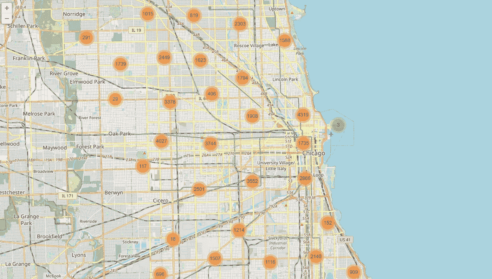
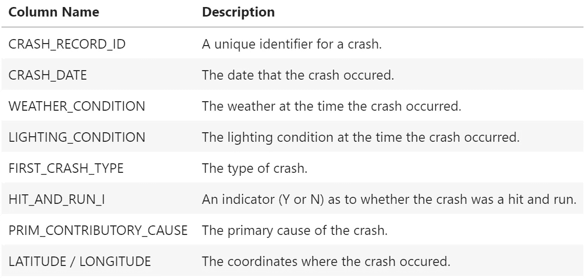
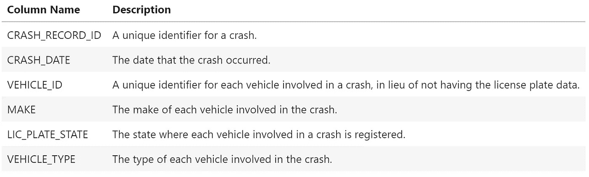
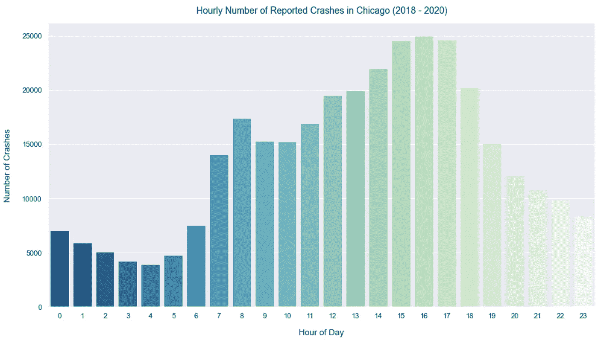
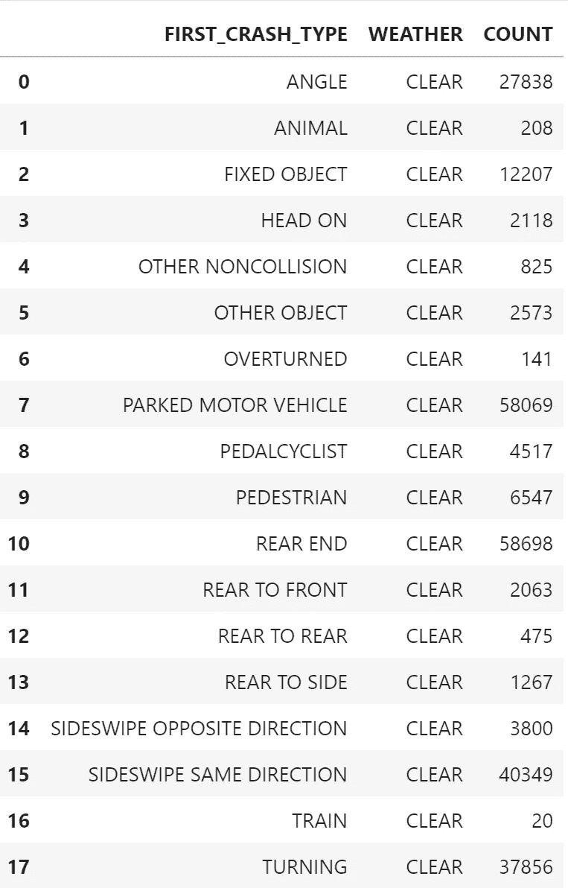
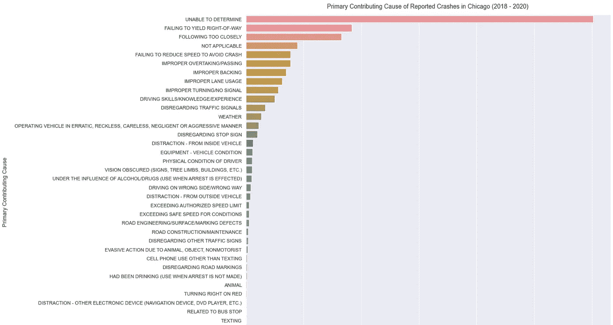
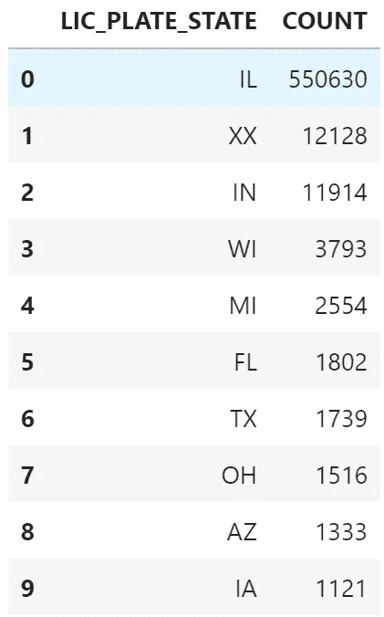
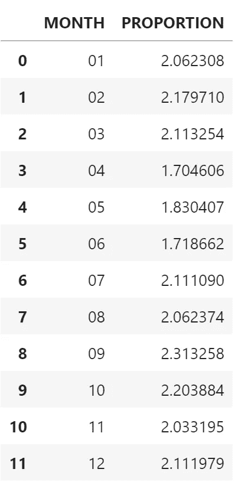
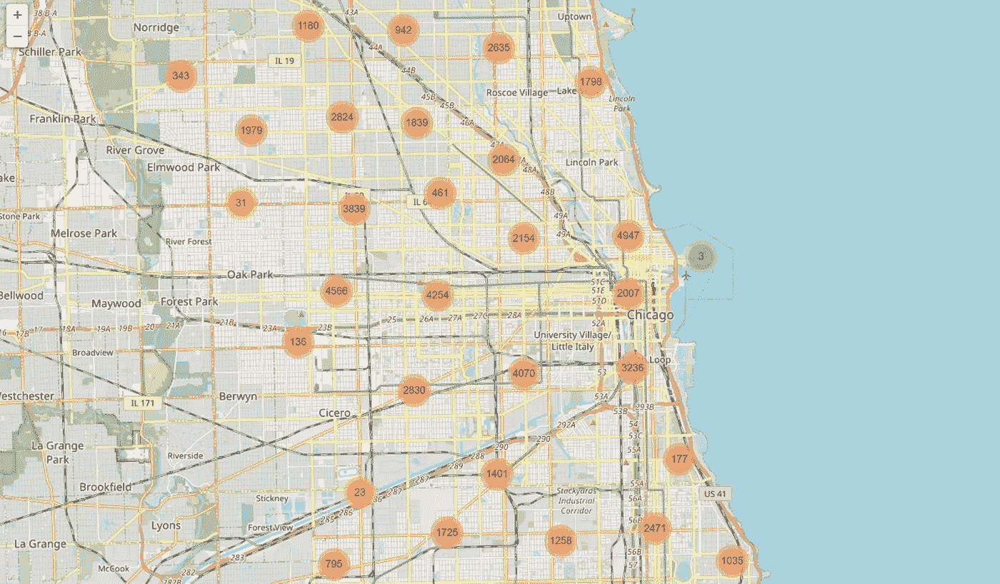

# 通过示例了解 Python 数据分析—芝加哥交通事故

> 原文：<https://towardsdatascience.com/learn-python-data-analytics-by-example-chicago-traffic-crashes-4840f6f15ed?source=collection_archive---------22----------------------->

## 一个有趣的项目和详细的数据分析步骤演练，帮助您学习 Python、pandas、matplotlib、seaborn 和 Folium



# 介绍

在攻读商业分析硕士学位期间，我发现通过实例学习是我学习 Python 数据分析的最佳方式。获得一个数据集和一组编码任务比阅读教科书或听教授讲课要有益得多。

我想把这种学习方法分享给其他人，他们也会受益。你所需要的只是一个 Python 开发环境(我推荐 [Jupyter Notebook](https://jupyter.org/) )和乐于学习的意愿。

本文包括一个数据分析任务列表，后面是如何完成这些任务的详细演练。在通读演练之前，请尝试自己完成这些任务，这样您会获得更多的收获。请记住，有很多方法可以解决编码问题，所以你的代码可能不会和我的一字不差，这没关系。

另请查看:[通过示例学习 Python 数据分析:纽约市违章停车](/learn-python-data-analytics-by-example-ny-parking-violations-e1ce1847fa2)和[通过示例学习 Python 数据分析:航班到达延误](/learn-python-data-analytics-by-example-airline-arrival-delays-e26356e8ae6b)。

# 项目描述

对于这个项目，我们将使用一个包含近 150 万条记录的数据集，这些记录代表了 2013 年至 2021 年芝加哥报告的交通事故以及其中涉及的车辆。该数据集创建于 2021 年 2 月，包含来自芝加哥市的数据。

如果你还没有 [pandas](https://pandas.pydata.org/) 、 [matplotlib](https://matplotlib.org/) 、 [seaborn](https://seaborn.pydata.org/index.html) 和[leave](https://python-visualization.github.io/folium/)库，你需要安装它们。

# 数据分析任务

请使用此[驱动器](https://1drv.ms/u/s!AoQYKisAOe1libRT6GTcLP6n_B75hA?e=yTTaEr)中可用的 *crashes.csv* 和 *crashes_vehicles.csv* 数据集在 Python 中执行以下任务。也可以参考这个 [GitHub repo](https://github.com/nickdcox/learn-traffic-crashes) 。

1.  阅读包含芝加哥交通事故数据的 CSV 文件。确定两个文件共有的列，并在该列上将它们合并在一起。然后显示报告的崩溃总数。
2.  将“崩溃日期”列更改为日期格式。2018 年、2019 年或 2020 年未发生的跌落观测(其他年份数据不完整)。
3.  显示一个图表，显示一天中每小时发生的崩溃次数。
4.  说出 2018 年 8 月白天撞车最多的车辆品牌。请记住，车祸可能涉及多辆车。
5.  确定每种事故最常见的天气条件。
6.  按照从高到低的顺序，画出报告事故的主要原因。
7.  显示发生车祸最多的 10 个州的车牌。请记住，车祸可能涉及多辆车。
8.  显示 2019 年每个月车祸的比例，其中酒精被确定为主要原因。
9.  确定是雪上汽车还是休闲越野车卷入了更多的车祸。
10.  显示一个聚类图，显示涉及肇事逃逸的车祸地点。

# 数据字典

**crashes.csv:** 数据集中的每一行都代表芝加哥报道的一起交通事故。



**crashes_vehicles.csv:** 数据集中的每一行都代表一辆发生在芝加哥的车祸。



照片由[安特·哈默斯特](https://unsplash.com/@ante_kante?utm_source=medium&utm_medium=referral)在 [Unsplash](https://unsplash.com?utm_source=medium&utm_medium=referral) 上拍摄

# 步骤 1:读取包含芝加哥交通事故数据的 CSV 文件。确定两个文件共有的列，并在该列上将它们合并在一起。然后显示报告的崩溃总数。我们将需要在整个项目中使用合并数据帧和崩溃数据帧。

```
Total Number of Reported Crashes: 474262
```

## 代码解释:

我们首先将熊猫模块的内容提供给我们的程序。pandas 是一个易于使用的开源数据分析和操作工具，构建于 Python 编程语言之上。我们将在整个项目中广泛使用它。

```
import pandas as pd
```

我们通过调用 read_csv()方法导入 *crashes.csv* 文件的内容，并将其存储在一个名为 *df_crashes* 的数据帧中。DataFrame 是一个带有标记轴的二维数据结构，由数据、行和列组成。可以把它想象成在 Microsoft Excel 或 Microsoft Access 中构建的表。然后，我们对*崩溃 _ 车辆. csv* 文件重复相同的操作，将其命名为*df _ 车辆*。对于 *crashes_vehicles.csv* 文件，我们删除了“CRASH_DATE”列，因为它也包含在另一个文件中。

```
df_crashes = pd.read_csv('crashes.csv', low_memory=False)
df_vehicles = pd.read_csv('crashes_vehicles.csv', low_memory=False).drop('CRASH_DATE', axis=1)
```

为了将两个数据帧组合成一个数据帧，我们调用 pandas 的 merge()方法。我们传递三个参数:前两个是我们要合并的两个数据帧的名称，第三个指定两个数据帧共有的列。最后，通过调用 reset_index()函数，我们重置了数据帧索引。

```
df = pd.merge(df_crashes, df_vehicles, on='CRASH_RECORD_ID').reset_index()
```

我们使用 print()函数打印字符串“报告的崩溃总数:”后跟数据帧中的崩溃数。我们传递给 print()函数的参数由两部分组成。第一个是用单引号括起来的字符串“报告的崩溃总数”，表示它是一个字符串。参数的第二部分是计算 *df* 中的崩溃次数。我们使用 nunique()方法来计算 *df* 中唯一的 CRASH_RECORD_ID 的数量，因为一个值可以重复。

```
print('Total Number of Reported Crashes:', df['CRASH_RECORD_ID'].nunique())
```

# 第 2 步:将“崩溃日期”列更改为日期格式。2018 年、2019 年或 2020 年未发生的跌落观测(其他年份数据不完整)。对合并的和崩溃的数据帧都这样做。

## 代码解释:

为了将 CRASH_DATE 列转换为日期类型，我们使用 pandas 函数 to_datetime()，将要更改的列作为参数传递。

```
df['CRASH_DATE'] = pd.to_datetime(df['CRASH_DATE'])
df_crashes['CRASH_DATE'] = pd.to_datetime(df_crashes['CRASH_DATE'])
```

我们需要子集 *df* 和 *df_crashes* 来过滤 2017 年、2018 年和 2019 年发生的崩溃。我们用> =表示大于等于，< =表示小于等于。日期格式为 YYYY-MM-DD。

```
df = df[(df['CRASH_DATE'] >= '2018-01-01') & (df['CRASH_DATE'] <= '2020-12-31')]
df_crashes = df_crashes[(df_crashes['CRASH_DATE'] >= '2018-01-01') & (df_crashes['CRASH_DATE'] <= '2020-12-31')]
```

# 第三步。显示一个图表，显示一天中每小时发生的崩溃次数。



## 代码解释:

我们让 matplotlib 和 seaborn 库的内容对我们的程序可用。matplotlib 和 seaborn 一起在 Python 中创建可视化。我对我的情节有一个风格偏好，并通过调用 seaborn 的 set_theme()方法将 seaborn 主题风格设置为 darkgrid。我们还提供了 numpy 库来帮助标记绘图轴。

```
import matplotlib.pyplot as plt
import seaborn as sns
sns.set_theme(style='darkgrid')
import numpy as np
```

为了使绘图更容易和更具视觉吸引力，我们在数据帧中创建了一个新的列来表示每次撞车发生的时间。0 代表 12am 到 1am，1 代表 1am 到 2am，一直到代表 11pm 到 12am 的 23。为此，我们在 CRASH_DATE 列上使用. dt.hour 来获取小时，并将其放入新列 hour 中。

```
df['Hour'] = df['CRASH_DATE'].dt.hour
```

现在是我们策划的时候了。我们指定 15 x 8 作为绘图的大小，然后调用 seaborn 的 barplot()方法。我们传递给它 5 个参数，每个参数我们将依次接受。第一个参数是我们希望绘制的数据:我们按照新的 Hour 列对记录进行分组，然后使用 nunique()方法计算每组中唯一的 CRASH_RECORD_ID 的数量。第二个和第三个参数是绘图的 x 和 y，分别是撞车的小时数和次数。第四个参数是选择的调色板，第五个参数指定条形周围没有线条，这是一种风格偏好。

剩余的代码行设置绘图的标题和轴标签。

```
plt.figure(figsize=(15,8))
s = sns.barplot(data=df.groupby('Hour')['CRASH_RECORD_ID'].nunique().reset_index(), x='Hour', y='CRASH_RECORD_ID', palette='GnBu_r', linewidth=0)
s.set_title('Hourly Number of Reported Crashes in Chicago (2018 - 2020)', y=1.02, fontsize=14)
s.set_xlabel('Hour of Day', fontsize=13, labelpad=15)
s.set_ylabel('Number of Crashes', fontsize=13, labelpad=15)
plt.show()
```

# 第四步。说出 2018 年 8 月白天撞车最多的车辆品牌。请记住，车祸可能涉及多辆车。

```
CHEVROLET    49779
Name: MAKE, dtype: int64
```

## 代码解释:

我们需要执行的第一项任务是创建一个数据帧，其中只包含在日光照明条件下发生的崩溃。我们从 *df* 开始，而不是从 *df_crashes* 开始，因为我们想考虑碰撞中涉及的所有车辆。我们只需在 LIGHTING_CONDITION 列中为带有日光的记录设置 *df* ，并将结果存储在 *df_daylight* 中。

```
df_daylight = df[df['LIGHTING_CONDITION'] == 'DAYLIGHT']
```

现在我们已经准备好了源数据，我们对数据帧中的 MAKE 列调用 value_counts()方法来计算每个 MAKE 出现的次数。因为我们只想知道发生最多碰撞的车辆的品牌，所以我们使用 nlargest(1)来显示我们需要的数据。

```
df_daylight['MAKE'].value_counts().nlargest(1)
```

# 第五步。确定每种事故最常见的天气条件。



## 代码解释:

对于这一步，我们可以使用一行代码。因为这是一个很长的代码行，我将把它分成几个部分来解释。

我们首先按照 FIRST_CRASH_TYPE 对 *df_crashes* 中的崩溃记录进行分组。

```
df_crashes.groupby('FIRST_CRASH_TYPE')['WEATHER_CONDITION']
```

接下来，我们要确定哪种天气条件下每种坠机类型的坠机次数最多。为此，我们需要沿着分组数据的轴应用一个函数。因为我们没有指定轴，所以默认为 0，这是索引。

lambda 函数对每个组(崩溃类型)调用 value_counts()方法，并按降序对每个组中每个天气条件的实例数进行计数。然后，对 head()方法的调用为我们提供了每个崩溃类型组的最佳天气状况。

```
.apply(lambda x: x.value_counts().head(1))
```

我们使用 reset_index()方法将数据帧索引重置为原始索引。我们在这里使用它以更优雅的方式呈现结果。我们传递“COUNT”的 name 参数来命名包含计数值的列。

```
.reset_index(name='COUNT')
```

最后，我们调用 rename()方法将 level_1 列重命名为 WEATHER，以使输出更具可读性。

```
.rename(columns={'level_1': 'WEATHER'})
```

# 第六步。按照从高到低的顺序，画出报告事故的主要原因。



## 代码解释:

我们在这里使用的大部分代码类似于我们在步骤 3 中创建的图。

我们指定 15 x 15 作为绘图的大小，然后调用 seaborn 的 countplot()方法。我们给它传递 3 个参数。第一个是我们的 *df_crashes* 数据帧。第二个选项指定我们希望对每个主要原因的撞车次数进行计数，通过指定 *y* ，条形图将在图上水平显示。因为 seaborn 没有一个简单的方法来按大小排序条，对于第三个参数 *order* ，我们告诉 seaborn 使用*df _ crashes[' PRIM _ contributive _ CAUSE ']的结果。value_counts()。索引*以订购棒材。这给出了我们正在寻找的降序。

剩余的代码行设置绘图的标题和轴标签。

```
plt.figure(figsize=(15, 15))
sns.countplot(data=df_crashes,  y='PRIM_CONTRIBUTORY_CAUSE', order = df_crashes['PRIM_CONTRIBUTORY_CAUSE'].value_counts().index)
plt.title('Primary Contributing Cause of Reported Crashes in Chicago (2018 - 2020) ', y=1.01, fontsize=14)
plt.xlabel('Number of Crashes', fontsize=13, labelpad=15)
plt.ylabel('Primary Contributing Cause', fontsize=13, labelpad=15)
plt.show();
```

# 第七步。显示发生车祸最多的 10 个州的车牌。请记住，车祸可能涉及多辆车。



## 代码解释:

我们从 *df* 而不是 *df_crashes* 开始，因为我们想考虑碰撞中涉及的所有车辆。我们按照 LIC 车牌州对记录进行分组，然后计算每组的车辆标识号。我们使用这个字段，因为它是每辆车的唯一标识符，而不是没有实际的牌照数据。因为我们想要前 10 名，所以我们调用。nlargest(10)方法。最后，我们调用 reset_index()并将计数列命名为 count。

```
df.groupby('LIC_PLATE_STATE')['VEHICLE_ID'].count().nlargest(10).reset_index(name='COUNT')
```

# 第八步。显示 2019 年每个月车祸的比例，其中酒精被确定为主要原因。



## 代码解释:

因为我们只对 2019 年的崩溃感兴趣，所以我们使用数据过滤器对 *df_crashes* 进行子集化，从而得到 *df_alcohol* 。在第二行代码中，我们按月份对崩溃进行分组，然后通过调用 nunique()方法计算每月的崩溃次数，将结果存储为 *df_total* —这将是我们计算每月比例时的分母。

```
df_alcohol = df_crashes[(df_crashes['CRASH_DATE'] >= '2019-01-01') & (df_crashes['CRASH_DATE'] <= '2019-12-31')]
df_total = df_alcohol.groupby(df_alcohol['CRASH_DATE'].dt.strftime('%m'))['CRASH_RECORD_ID'].nunique()
```

现在我们需要分子，即每月与酒精相关的车祸数量。首先，我们根据主要原因对车祸进行分类，但前提是它们包含酒精或饮酒。调用 contains()方法，将单词作为参数传递给我们需要的东西。我们使用|字符来分隔这两个单词。接下来，我们按月份对结果记录进行分组，然后通过再次调用 nunique()方法计算每月的崩溃次数，将结果存储回 *df_alcohol* 。

```
df_alcohol = df_crashes[df_crashes['PRIM_CONTRIBUTORY_CAUSE'].str.contains('ALCOHOL|DRINKING')]
df_alcohol = df_alcohol.groupby(df_alcohol['CRASH_DATE'].dt.strftime('%m'))['CRASH_RECORD_ID'].nunique()
```

既然我们有了分子和分母，我们就可以计算出酒精被记录为主要原因的每月车祸比例。然后，我们像在其他步骤中一样调用 reset_index()，并使用 rename()来重命名列，以便显示。

```
df_proportion = df_alcohol / df_total * 100
df_proportion.reset_index().rename(columns={'CRASH_DATE': 'MONTH', 'CRASH_RECORD_ID': 'PROPORTION'})
```

# 第九步。确定是雪上汽车还是休闲越野车卷入了更多的车祸。

```
Number of snowmobiles: 4
```

```
Number of recreational off-highway vehicles: 6
```

## 代码解释:

对于这一步，我们使用相同的代码两次，第一次寻找雪地车，第二次寻找休闲越野车。我们为每种车辆类型设置子集 *df* ,并使用 len()函数来计算各个子集中的记录数。

```
print('Number of snowmobiles:', str(len(df[df['VEHICLE_TYPE'] == 'SNOWMOBILE'])))
print('Number of recreational off-highway vehicles:', str(len(df[df['VEHICLE_TYPE'] == 'RECREATIONAL OFF-HIGHWAY VEHICLE (ROV)'])))
```

# 第十步。显示一个聚类图，显示涉及肇事逃逸的车祸地点。



## 代码解释:

我们只希望显示涉及肇事逃逸的碰撞位置，所以我们从子集化 *df_crashes* 开始，以获得我们希望绘制的数据，将结果存储为 *df_hitrun* 。DataFrame 中有一些没有坐标的记录，所以我们使用 notna()方法删除它们。

```
df_hitrun = df_crashes[df_crashes['HIT_AND_RUN_I'] == 'Y']
df_hitrun = df_hitrun[df_hitrun['LONGITUDE'].notna()]
```

为了显示我们的地图，我们将使用叶和一个相关的标记集群插件。我们首先让程序可以使用 follow 模块的内容，并导入插件。Folium 非常强大，只需要很少的代码就可以创建一个非常详细的交互式地图。

```
import folium
from folium import plugins
```

我们需要通过传递芝加哥的 GPS 坐标和缩放级别(我们将缩放级别设置为 12)来实例化一个叶子地图。我们将使用的纬度是 41.8781，经度是-87.6798(我通过快速的谷歌搜索找到了这些)。

```
m = folium.Map(location=[41.8781, -87.6798], zoom_start=12)
```

我们正在创建一个集群映射，所以使用 MarkerCluster 插件，通过调用 add_to()方法将它添加到我们的映射中，并将我们的叶子映射 *m* 作为参数传递。

然后，对于 *df_hitrun* 中的每个崩溃，我们创建一个标记。我们使用 for 循环遍历 *df_hitrun* 。zip()函数为每个崩溃创建一个纬度和经度元组，为每个崩溃创建一个标记。最后，我们显示地图 *m* 。当您放大和缩小地图时，聚类会以交互方式调整大小。

```
hitrun = plugins.MarkerCluster().add_to(m)for lat, lng in zip(df_hitrun['LATITUDE'], df_hitrun['LONGITUDE']):
    folium.Marker(
        location=[lat, lng],
           icon=None,
    ).add_to(hitrun)
m
```

我希望你已经发现这个项目是学习 Python 数据分析的一个有用的方法。请在评论区分享您的反馈。

另请查看:[通过示例学习 Python 数据分析:NYC 停车违规](/learn-python-data-analytics-by-example-ny-parking-violations-e1ce1847fa2)和[通过示例学习 Python 数据分析:航班到达延误](/learn-python-data-analytics-by-example-airline-arrival-delays-e26356e8ae6b)。