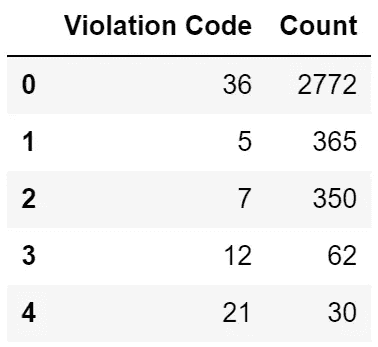
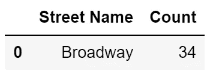
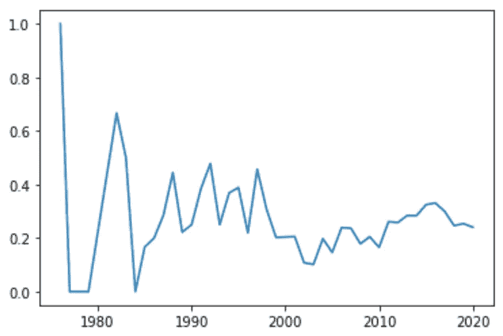
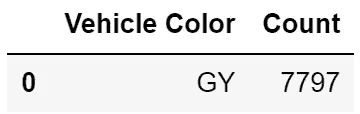
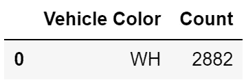
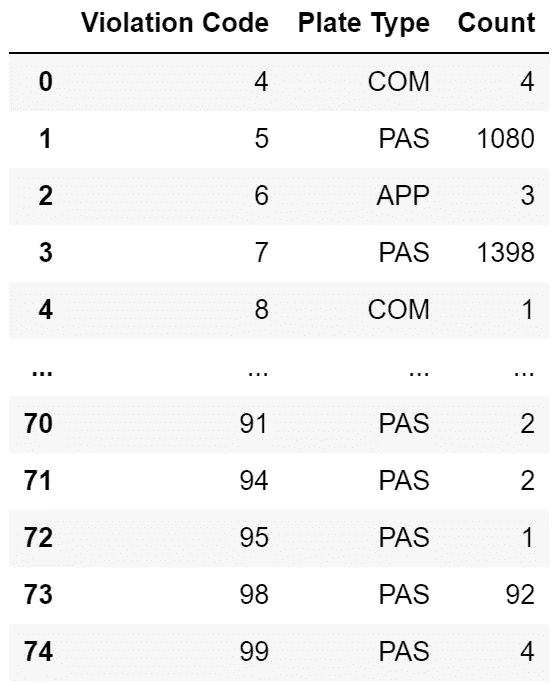
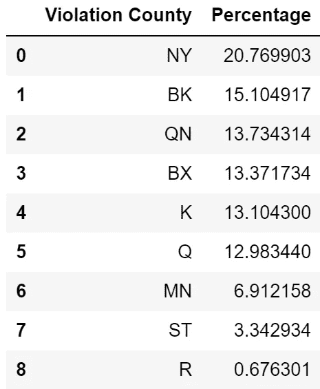

# 通过示例了解 Python 数据分析:纽约市停车违规

> 原文：<https://towardsdatascience.com/learn-python-data-analytics-by-example-ny-parking-violations-e1ce1847fa2?source=collection_archive---------19----------------------->

## 一个有趣的项目和详细的数据分析步骤，以帮助您学习 Python，pandas 和 matplotlib。


乔希·牛顿在 [Unsplash](https://unsplash.com?utm_source=medium&utm_medium=referral) 上的照片

# 介绍

在攻读商业分析硕士学位的过程中，我发现通过实例学习是我学习 Python 数据分析的最佳方式。获得一个数据集和一组编码任务比阅读教科书或听教授讲课要有益得多。

我想把这种学习方法分享给其他人，他们也会受益。你需要的只是一个 Python 开发环境(我推荐 [Jupyter Notebook](https://jupyter.org/) )和乐于学习的意愿。

本文包括一个数据分析任务列表，后面是如何完成这些任务的详细演练。在通读演练之前，请尝试自己完成这些任务，这样您会获得更多的收获。请记住，有很多方法可以解决编码问题，所以你的代码可能不会和我的一字不差。

# 项目描述

对于这个项目，我们将使用 2021 财年期间纽约市发布的 50，000 次停车违规的数据集。该数据集创建于 2021 年 1 月，包含 2020 年 4 月 1 日至 11 月 30 日的数据，数据来源于 [NYC Open Data](https://data.cityofnewyork.us/City-Government/Parking-Violations-Issued-Fiscal-Year-2021/pvqr-7yc4) 。

如果你还没有的话，你需要安装 [pandas](https://pandas.pydata.org/) 和 [matplotlib](https://matplotlib.org/) 库。

# 数据分析任务

请使用 [GitHub repo](https://github.com/nickdcox/learn-nyc-parking-violations) 中可用的 *violations.csv* 数据集在 Python 中执行以下任务。

1.  阅读包含纽约市停车违规数据的 CSV 文件。将“发布日期”列更改为日期格式。然后打印出导入的行数。
2.  对导入的数据集执行探索性数据分析，以识别无效数据。编写代码以删除受影响的行。然后打印出数据集中剩余的行数。
3.  显示一个简单的图表，显示每辆车每年违规停车的次数。
4.  列出在纽约州以外的州注册的车辆的前 5 个违章代码。
5.  说出本田收到最多违规停车罚单的街道。
6.  对于仅来自纽约的车辆，创建一个图表，逐月显示非乘客牌照类型的比率。
7.  确定违规次数最多的客车牌照车辆的颜色是否与违规次数最多的商用牌照车辆的颜色相同。
8.  显示数据中表示的登记州数以及每个登记州的平均违章停车数。
9.  显示每个违章代码中违章停车次数最多的车牌类型。
10.  计算每个县违规停车的百分比，并按降序显示。


尼克·卡沃尼斯在 [Unsplash](https://unsplash.com?utm_source=medium&utm_medium=referral) 上的照片

# 步骤 1:读取包含纽约市停车违规数据的 CSV 文件。将“发布日期”列更改为日期格式。然后打印出导入的行数。

```
Number of Rows: 50000
```

## 代码解释:

我们首先将熊猫模块的内容提供给我们的程序。pandas 是一个易于使用的开源数据分析和操作工具，构建于 Python 编程语言之上。我们将在整个项目中广泛使用它。

```
import pandas as pd
```

我们通过调用 read_csv()方法导入 *violations.csv* 文件的内容，并将其存储在名为 *df* 的数据帧中。DataFrame 是一个带有标记轴的二维数据结构，由数据、行和列组成。可以把它想象成在 Microsoft Excel 或 Microsoft Access 中构建的表。

```
df = pd.read_csv('violations.csv')
```

我们使用 print()函数打印字符串‘Number of Rows:'后跟 DataFrame 中的行数。我们传递给 print()函数的参数由两部分组成。第一个是用单引号括起来的字符串“Number of Rows:”表示它是一个字符串。

争论的第二部分是计算 *df* 中的行数。我们使用 len()函数告诉我们 *df* 中的行数，然后将其封装在对 str()方法的调用中，将长度转换为字符串。最后，+将两个字符串部分连接在一起。传递给 print()函数的参数的所有部分都必须是字符串类型。

```
print('Number of Rows: ' + str(len(df)))
```

# 步骤 2:对导入的数据集执行探索性数据分析，以识别无效数据。编写代码以删除受影响的行。然后打印出数据集中剩余的行数。

以下数据被视为无效:

*   注册州:不是两个字母的州或省标识符的值。
*   孔板类型:不是三个字母标识符([注册类别代码](https://dmv.ny.gov/registration/registration-class-codes))的值
*   发布日期:不在财政年度内的日期(使用 2020–11–30 作为财政年度的结束日期)
*   违章代码:1 到 99 之间的代码([违章代码](https://www1.nyc.gov/site/finance/vehicles/services-violation-codes.page))
*   车辆制造商:空白值
*   违规时间:空白值
*   车辆年份:日期在未来的车辆(使用 2020 年作为当前年份)

```
Number of Rows: 38937
```

## 代码解释:

我们需要子集 *df* 来过滤掉无效数据的记录。我们可以一次应用多个参数，方法是将每个参数用括号括起来，并在它们之间使用&字符。我们用！=表示不等于，> =表示大于等于，< =表示小于等于。对于车辆制造和违规时间列，我们需要通过调用 notnull()方法来检查空值。

```
df = df[(df['Registration State'] != "99") 
    & (df['Plate Type'] != "999") 
    & (df['Issue Date'] >= '2020-04-01') 
    & (df['Issue Date'] <= '2020-11-30') 
    & (df['Violation Code'] != 0) 
    & (df['Vehicle Make'].notnull()) 
    & (df['Violation Time'].notnull()) 
    & (df['Vehicle Year'] != 0) 
    & (df['Vehicle Year'] <= 2020)]
```

我们使用 print()函数的方式与上面的步骤 1 完全相同。

```
print('Number of Rows: ' + str(len(df)))
```

# 步骤 3:显示一个简单的图表，显示每辆车每年的违章停车次数。


## 代码解释:

我们让 matplotlib 库的内容对我们的程序可用。matplotlib 是一个用于在 Python 中创建可视化的综合库。

```
import matplotlib.pyplot as plt
```

我们需要为该图创建一个数据集，其中包含车辆年份以及这些年份中每一年的违规停车数量。为此，我们将 *df* 中的记录按车辆年份分组，并统计每年的违章停车次数。每一次违章停车都有一个独特的传票号码。

```
df_vehicle_year = df.groupby('Vehicle Year')['Summons Number'].count()
```

我们使用 matplotlib 的 plot()函数来创建绘图。作为一个参数，我们简单地传递我们创建的新数据集。然后，我们使用 show()函数来显示该图。

```
plt.plot(df_vehicle_year)
plt.show()
```

# 步骤 4:列出在除纽约以外的州注册的车辆的前 5 个违章代码。



## 代码解释:

在这一行代码中有很多元素需要解包，所以我们将一步一步来。请慢慢理解这一行，因为在接下来的步骤中，我们将会多次使用这一结构。

在语句的第一部分，我们将 *df* 过滤为那些注册州不是 NY 的记录。

```
df[df['Registration State'] != 'NY']
```

接下来，我们按违章代码对结果记录进行分组，并计算每个违章代码的违章停车次数。

```
.groupby('Violation Code')['Summons Number'].count()
```

我们通过使用 nlargest()方法并向其传递参数 5 来显示具有 5 个最高计数的违规代码。将按降序显示 count 列中具有最大值的前 n 行。

```
.nlargest(5)
```

最后，我们使用 reset_index()方法将数据帧索引重置为原始索引。我们在这里使用它以更优雅的方式呈现结果。我们传递“Count”的名称参数来命名包含计数值的列。

```
.reset_index(name='Count')
```

# 第五步:说出本田收到最多违规停车罚单的街道。



## 代码解释:

这一行代码严格遵循我们在上面第 4 步中使用的结构。在这种情况下，我们将 *df* 过滤为那些车辆品牌为本田的记录，按街道名称对结果记录进行分组，计算每条街道的违规停车数量，并仅显示违规停车最多的街道。

```
df[df['Vehicle Make'] == 'HONDA'].groupby('Street Name')['Summons Number'].count().nlargest(1).reset_index(name='Count')
```

# 步骤 6:对于仅来自纽约的车辆，创建一个图表，逐月显示非乘客牌照类型的比率。



## 代码解释:

我们通过只选择那些注册状态为 NY 的记录来对 *df* 进行子集化，并将其存储为 *df_ny* 。

```
df_ny = df[df['Registration State'] == 'NY']
```

为了计算请求的比率，我们需要创建一个数据集来表示分子(按车辆年份划分的所有非客运车辆的违规停车次数)和另一个数据集来表示分母(按车辆年份划分的所有车辆的违规停车次数)。

对于分子，我们过滤 *df_ny* 以仅过滤那些牌照类型不等于“乘客”的记录，按车辆年份对结果记录进行分组，并计算每年的违章停车次数。我们将其存储为 *df_ny_notpas* 。

```
df_ny_notpas = df_ny[df_ny['Plate Type'] != 'PAS'].groupby('Vehicle Year')['Summons Number'].count()
```

对于分母，我们不需要过滤 *df_ny* ，因为我们需要所有记录。相反，我们只是按车辆年份对记录进行分组，并计算每年违规停车的次数。我们将其存储为 *df_ny_all* 。

```
df_ny_all = df_ny.groupby('Vehicle Year')['Summons Number'].count()
```

要计算每年的比率，我们只需用分子除以分母。这是 pandas 的神奇之处之一，它将除法函数应用于数据帧中的每一个计数对，一年一年。当车辆年份仅出现在一个数据框中时，结果为 NaN。

```
ratio = df_ny_notpas / df_ny_all
```

我们无法绘制 NaN 值，因此我们在*比率*数据帧上使用 fillna()方法将它们替换为 0。inplace=True 参数直接更新*比率*中的值。

```
ratio.fillna(0, inplace = True)
```

我们使用 matplotlib 的 plot()函数来创建绘图。作为一个参数，我们简单地传递我们创建的新数据集。然后，我们使用 show()函数来显示该图。

```
plt.plot(ratio)
plt.show()
```

# 第 7 步:确定违规次数最多的客车牌照车辆的颜色是否与违规次数最多的商用牌照车辆的颜色相同。



## 代码解释:

我们将 *df* 过滤为仅具有乘客车牌类型的记录，按照车辆颜色对结果记录进行分组，计算每种颜色的违规停车次数，并使用 nlargest()显示违规停车次数最多的颜色。

```
df[df['Plate Type'] == 'PAS'].groupby('Vehicle Color')['Summons Number'].count().nlargest(1).reset_index(name='Count')
```



## 代码解释:

我们将 *df* 过滤为那些车牌类型为“商业”的记录，将结果记录按车辆颜色分组，计算每种颜色的违章停车次数，并使用 nlargest()显示违章停车次数最多的颜色。

```
df[df['Plate Type'] == 'COM'].groupby('Vehicle Color')['Summons Number'].count().nlargest(1).reset_index(name='Count')
```

# 第 8 步:显示数据中表示的登记州数和每个登记州的平均违章停车数。

```
Number of Registration States: 45
Average Number of Parking Violations per Registration State: 865.2666666666667
```

## 代码解释:

我们在 *df* 中打印字符串“注册状态数”和注册状态数。为了确定注册状态的数量，我们在 *df* 中的注册状态列上调用 nunique()方法，该方法返回不同观察的计数，即列中列出的唯一状态的数量。和前面一样，我们使用 str()将数值转换成字符串。

```
print('Number of Registration States: ' + str(df['Registration State'].nunique()))
```

我们打印字符串“每个注册州的平均违章停车次数”和平均违章停车次数。为了计算后者，我们按照注册州对 *df* 中的行进行分组，计算每个州的违规停车数量，然后通过调用 mean()方法对这些数量进行平均。

```
print('Average Number of Parking Violations per Registration State: ' +  str(df.groupby('Registration State')['Summons Number'].count().mean()))
```

# 步骤 9:显示每个违章代码中违章停车次数最多的车牌类型。



## 代码解释:

在这一步中，我们将使用更高级的功能。我们将把这段代码分解成片段来解释。

我们首先通过违规代码对 *df* 中的记录进行分组。

```
df.groupby('Violation Code')['Plate Type']
```

接下来，我们要确定对于每个违章代码，哪种车牌类型的违章停车次数最多。为此，我们需要沿着分组数据的轴应用一个函数。因为我们没有指定轴，所以默认为 0，这是索引。

lambda 函数对每个组(违规代码)调用 value_counts()方法，并按降序计算每个组中每个孔板类型的实例数。然后，对 head()方法的调用为我们提供了每个违例代码组的顶板类型。

```
.apply(lambda x: x.value_counts().head(1))
```

我们使用 reset_index()方法将数据帧索引重置为原始索引。我们在这里使用它以更优雅的方式呈现结果。我们传递“Count”的名称参数来命名包含计数值的列。

```
.reset_index(name='Count')
```

最后，我们调用 rename()方法将 level_1 列重命名为 Plate Type，以使输出更具可读性。

```
.rename(columns={'level_1': 'Plate Type'})
```

# 第十步:计算每个县违规停车的百分比，并按降序显示。



## 代码解释:

我们按照违规县对 *df* 中的行进行分组，统计每个违规县的停车违规次数，然后将其存储为 *df_county* 。我们调用 reset_index()方法来重置索引，并将结果列重命名为 Percentage。

```
df_county = df.groupby('Violation County')['Summons Number'].count().reset_index(name='Percentage')
```

我们通过将百分比列中先前计算的值除以违规总数来计算每个违规的百分比，从而替换这些值。

```
df_county['Percentage'] = df_county['Percentage'] / df_county['Percentage'].sum() * 100
```

最后，我们在 *df_county* 上调用 sort_values 方法，以降序对百分比进行排序。

```
df_county.sort_values(by='Percentage', ascending=False).reset_index(drop=True)
```

我希望你已经发现这个项目是学习 Python 数据分析的一个有用的方法。请在评论区分享您的反馈。