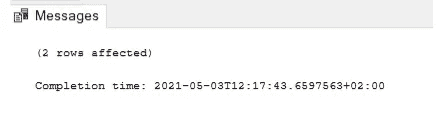

# 了解 SQL Server Management Studio —第 10 部分:通过电子邮件导出查询数据。战斗支援车

> 原文：<https://towardsdatascience.com/learn-sql-server-management-studio-part-10-export-tables-by-email-as-csv-29bf2d990656?source=collection_archive---------27----------------------->

## 让你在派对上开心的技能！循序渐进。


迈克尔·泽兹奇在 [Unsplash](https://unsplash.com/?utm_source=medium&utm_medium=referral) 上的照片

# 在最后几集里…

你好。欢迎来到 SQL 和 SQL Server Studio 系列教程的第 10 期。有一个简单的目标:让你熟悉和适应这个工具和语言。“这有什么关系？”我知道你在问。事实证明，好奇心和副业往往是被新项目选中甚至获得新工作的关键。事实上，您已经使用了一个重要的工具，比如 SQL Server Studio，并且编写了一些 SQL 查询，这将会给您一个清晰的开端。

*   **在第 1 集**中，我将向您展示**如何设置我们的环境和本地服务器** — [第 1 部分逐步设置 SQL Server Studio](/getting-started-with-sql-server-management-studio-part-1-step-by-step-setup-63428650a1e0)
*   **在第 2 集**中，我们将讲述**如何创建自己的数据库、表**、**和**关于**命名约定的重要注释—** 、[第二部分数据库、表&命名约定](/getting-started-with-sql-server-management-studio-5cd24bb1a87c)
*   **在第三集**中，我们介绍了 **CRUD 操作**和**主键和外键** — [第三部分 CRUD 操作，主键&外键](/learn-sql-server-management-studio-part-3-crud-operations-primary-foreign-keys-9d884b32ad70)
*   **在第 4 集**中，我们讨论了**模式&的主要规范化步骤** — [第 4 部分模式&规范化](/learn-sql-server-management-studio-part-4-schemas-normalization-80bcd6a5258)
*   **在第 5 集**中，我们覆盖了**存储过程&调度**，这是一个真正的野兽。我怎么强调这将如何促进和自动化你的日常(数据)生活都不为过。[第五部分存储过程&调度](/learn-sql-server-management-studio-part-5-stored-procedures-scheduling-88fd9788d314)
*   **在第 6 集**中，我们介绍了用于 ETL 的 **SSIS 包，并回顾了如何在两个数据库之间以及一个数据库与 Excel 之间导入和导出数据。[第六部 SSIS 套餐简介](/learn-sql-server-management-studio-part-6-ssis-packages-9438dbc90437)**
*   在第 7 集中，我们**将 SQL Studio 连接到 PowerBI** 并构建我们的第一个视觉效果。[第 7 部分连接到 PowerBI &第一视觉效果](http://part%207%20connect%20to%20powerbi%20%26%20first%20visuals/)。
*   **在第 8 集**中，我们**利用 SQL 视图**的强大功能，这是一个简单的轻量级工具，用于组合和检索复杂的表。你不会相信没有他们你怎么活下去。[第 8 部分利用观点](/learn-sql-server-management-studio-part-8-leverage-the-views-206fbcef3957)
*   在第 9 集中，我们利用临时表，在存储过程中临时存储和检索数据。找出中间结果并以表格形式缓存数据以备后用是非常有用的。在[第九部分临时表格](/learn-sql-server-management-studio-part-9-temporary-tables-f69aee616833)中了解更多信息

别忘了回来😉。

# 期待什么？

在查看了视图和临时表之后，是时候深入了解一个特性了，这个特性不会引起太多的关注，但会被证明非常有用。在本教程结束时，您将会感到能够在 SQL 过程中利用报表生成的强大功能。让我们直接跳进来吧！

# 介绍

有时，尽管您的数据显示在精美的 PowerBI 报告上，但用户仍然需要访问原始数据。生的意思是。例如 csv。虽然在那个*著名的“什么都有”表*上写一个快速查询是很有礼貌的(剧透:根本没有这回事)，但是如果用户频繁地请求，这可能会变得令人不知所措。一种解决方案是安排一个作业，并在其上附加一个包含所需信息的. csv 文档。

幸运的是，有一个有用的函数，可以通过调整一组参数来获得该报告。解决方案不是现成的，它需要一点创造力，但是你会发现实现起来很简单。

# 通过电子邮件将 SQL 数据导出为 CSV 格式

我们假设您的 SQL Studio 环境已经启动并正在运行。如果您需要帮助，这里有一个分步指南:[第 1 部分 SQL Server Studio 的分步设置](/getting-started-with-sql-server-management-studio-part-1-step-by-step-setup-63428650a1e0)。

对于本教程，我们将利用存储过程和 SSMS 调度功能，有些部分可能会很仓促，您可以在这里找到更多信息:[第 5 部分存储过程&调度](/learn-sql-server-management-studio-part-5-stored-procedures-scheduling-88fd9788d314)

我们将利用的表非常简单，由“名字”和“姓氏”组成

1.  让我们创建一个过程。SSMS 提供的典型骨架是:

```
CREATE PROCEDURE <Procedure_Name, sysname, ProcedureName>
AS
BEGIN
SELECT <@Param1, sysname, @p1>, <@Param2, sysname, @p2>
END
GO
```

我们的案例中不需要的一些样板代码已经被删除。

2.我们从声明一个参数< *@query* >开始，并把它的类型指定为 NVARCHAR(MAX)

```
CREATE PROCEDURE <Procedure_Name, sysname, ProcedureName>
AS
BEGIN
**DECLARE @query NVARCHAR(MAX)**
```

3.然后我们开始定义参数<*@查询* >:

```
SET @query = N'....'
```

N 将下面的字符串定义为 NVARCHAR，

4.然后，我们设置下面的语句，防止消息通知我们受查询影响的行数。

```
SET @query = N'
SET NOCOUNT ON
```

由于上述原因，我们不会在 CSV 摘录中看到这些内容:



5.后来出现了众所周知的 SELECT 语句，为了尊重字符串格式，使用了一组双单引号。对于我们虚构的包含[FirstName]和[LastName]列的表，这会给出:

```
SET @query = N'
SET NOCOUNT ON
SELECT 
''FirstName'' as FirstName,
''LastName'' as LastName
```

请注意，在这种情况下，我们没有引用表，我们只是准备 CSV 导出的标题。

6.然后，我们将上述语句的结果与第二个语句产生的数据(即表中的数据)结合起来:

```
UNIONSELECT
[FirstName] AS [FirstName],
[LastName] AS [LastName]
FROM [myDatabase].[dbo].[Users]
```

7.然后，我们通过关闭 NOCOUNT 语句来关闭这个字符串

```
SET NOCOUNT OFF'
```

8.因此，第一部分看起来像这样:

```
CREATE PROCEDURE <Procedure_Name, sysname, ProcedureName>
AS
BEGINDECLARE @query NVARCHAR(MAX)SET @query = N'
SET NOCOUNT ON**SELECT 
''FirstName'' as FirstName,
''LastName'' as LastName****UNION****SELECT
[FirstName] AS [FirstName],
[LastName] AS [LastName]
FROM [myDatabase].[dbo].[Users]
SET NOCOUNT OFF'**
```

9.在这个阶段，尝试运行从“DECLARE”开始并以“SET NOCOUNT OFF”语句结束的代码是一个很好的做法。因为它是字符串变量的一部分，任何打字错误、多余或丢失的逗号都不会被 SSMS IDE 高亮显示。

要测试它，复制以粗体突出显示的部分，并将其粘贴到一个新屏幕上。对于第一个 select 语句，从列名的每一端删除一个单引号。然后运行该语句。它应该会返回表。

10.然后，我们将利用 SSMS 函数发送一封电子邮件，并提供参数信息，将这些数据添加为 CSV 附件。

```
EXEC msdb.dbo.sp_send_dbmail@profile_name= 'Reporting Team',@recipients= 'max@medium.org',@subject= 'Names CSV export',@body= 'Hello, <br><br> Please find attached your CSV export <br><br> Reporting Team',@body_format = 'HTML',
```

第一部分很简单，我们提供了概要文件名称、收件人、主题、正文……如果需要的话，大部分参数都可以添加变量。在我们的例子中，我们提供了一些硬编码的虚拟值。添加您的电子邮件地址，以确保您将获得该文件。

接下来是有趣的部分:

```
@query = @query,@attach_query_result_as_file = 1,@query_attachment_filename = 'ExportResults.csv',@query_result_separator = ',',@exclude_query_output = 1,@query_result_header = 1,@query_no_truncate = 1,@query_result_no_padding = 0,@query_result_width = 8192END
```

在上面，我们首先向查询参数提供 NVARCHAR 字符串，并定义将附加一个文件及其名称。然后我们可以定义分隔符。其他参数确保导出的 CSV 精简、干净，具有最大宽度且没有填充。

因此，概括地说，我们在这个过程中的整个代码是:

```
CREATE PROCEDURE <Procedure_Name, sysname, ProcedureName>
AS
BEGINDECLARE @query NVARCHAR(MAX)SET @query = N'
SET NOCOUNT ON**SELECT 
''FirstName'' as FirstName,
''LastName'' as LastName****UNION****SELECT
[FirstName] AS [FirstName],
[LastName] AS [LastName]
FROM [myDatabase].[dbo].[Users]
SET NOCOUNT OFF'**EXEC msdb.dbo.sp_send_dbmail
@profile_name= 'Reporting Team',
@recipients= 'max@medium.org',
@subject= 'Names CSV export',@body= 'Hello, <br><br> Please find attached your CSV export <br><br> Reporting Team',@body_format = 'HTML',
@query = @query,
@attach_query_result_as_file = 1,
@query_attachment_filename = 'ExportResults.csv',
@query_result_separator = ',',
@exclude_query_output = 1,
@query_result_header = 1,
@query_no_truncate = 1,
@query_result_no_padding = 0,
@query_result_width = 8192END
```

让我们从头到尾选择代码并运行它…一封附有文件的电子邮件应该正在进行中！

## 公地臭虫

上面的内容可能非常强大，但实现起来需要一些耐心，因为错误可能隐藏在我们开始时声明的查询字符串中，而这些通常不会被 SSMS IDE 发现。

*   单引号太少或太多，例如

```
''FirstName' as FirstName,
```

*   逗号太多或缺失(尤其是在 UNION 语句之前复制粘贴了大量并调整了行的情况下)，例如

```
''FirstName' as FirstName,
''LastName'' as LastName,
UNION
```

*   应该转换为 VARCHAR 的日期时间格式，例如

```
**-- REPLACE THIS**...
[BirthDate],
...**-- BY THIS**...
CAST([BirthDate] AS VARCHAR),
...
```

*   确保 SELECT 语句两边的列数相同，
*   再三检查所有提到的列是否确实是您正在查询的表的一部分——这很明显，但仍有可能发生。

如果你还是卡住了:

*   深呼吸，也许休息一下，
*   从一两列开始，把它做好，然后向上移动到更多列
*   不停地测试，测试，测试😉。

一旦得到控制，您就可以将这个过程包含在一个预定的作业中，并通过电子邮件通知您的用户他们很快就会收到该报告🎉。

# 最后的话和接下来会发生什么

暂时就这样吧！我希望您更有信心创建和利用 SQL 过程来基于底层查询生成和导出 CSV 文件，然后通过电子邮件将它们发送给用户。

*   它可以很好地替代或补充您现有的数据可视化报告，
*   它可以用作审计工具或证据，每周导出数据库中任何给定时间点的内容，
*   如果连接到无代码或低代码工具，它也可以被利用，触发器将启动这个 SQL 过程并向用户提供数据。

感谢您的阅读，请告诉我您的想法，或者是否有我应该涉及的话题。与此同时，请随时订阅并关注我。下次见！

# 快乐编码🎉！

感谢阅读！喜欢这个故事吗？ [**加入媒介**](https://medium.com/@maximegodfroid/membership) 可完整访问我的所有故事。