# 了解 SQL Server Management Studio —第 11 部分云中的 SQL 数据库和服务器介绍(Azure)

> 原文：<https://towardsdatascience.com/learn-sql-server-management-studio-part-11-intro-to-sql-database-server-in-the-cloud-azure-b59b9855ba2c?source=collection_archive---------44----------------------->

## 让你在派对上开心的技能！循序渐进。

迈克尔·泽兹奇在 [Unsplash](https://unsplash.com/?utm_source=medium&utm_medium=referral) 上的照片

# 在最后几集里…

你好。欢迎来到 SQL 和 SQL Server Studio 系列教程的第 11 期。有一个简单的目标:让你熟悉和适应这个工具和语言。“这有什么关系？”我知道你在问。事实证明，好奇心和副业往往是被新项目选中甚至获得新工作的关键。事实上，您已经使用了一个重要的工具，比如 SQL Server Studio，并且编写了一些 SQL 查询，这将会给您一个清晰的开端。

*   **在第 1 集**中，我将向您展示**如何设置我们的环境和本地服务器** — [第 1 部分逐步设置 SQL Server Studio](/getting-started-with-sql-server-management-studio-part-1-step-by-step-setup-63428650a1e0)
*   **在第 2 集**中，我们将讲述**如何创建自己的数据库、表**、**和**关于**命名约定的重要注释—** 、[第二部分数据库、表&命名约定](/getting-started-with-sql-server-management-studio-5cd24bb1a87c)
*   **在第三集**中，我们介绍了 **CRUD 操作**和**主键和外键** — [第三部分 CRUD 操作，主键&外键](/learn-sql-server-management-studio-part-3-crud-operations-primary-foreign-keys-9d884b32ad70)
*   **在第 4 集**中，我们讨论了**模式&的主要规范化步骤** — [第 4 部分模式&规范化](/learn-sql-server-management-studio-part-4-schemas-normalization-80bcd6a5258)
*   **在第 5 集**中，我们覆盖了**存储过程&调度**，这是一个真正的野兽。我怎么强调这将如何促进和自动化你的日常(数据)生活都不为过。[第五部分存储过程&调度](/learn-sql-server-management-studio-part-5-stored-procedures-scheduling-88fd9788d314)
*   **在第 6 集**中，我们介绍了用于 ETL 的 **SSIS 包，并回顾了如何在两个数据库之间以及一个数据库与 Excel 之间导入和导出数据。[第六部 SSIS 套餐简介](/learn-sql-server-management-studio-part-6-ssis-packages-9438dbc90437)**
*   在第 7 集中，我们**将 SQL Studio 连接到 PowerBI** 并构建我们的第一个视觉效果。[第 7 部分连接到 PowerBI &第一视觉效果](http://part%207%20connect%20to%20powerbi%20%26%20first%20visuals/)。
*   **在第 8 集**中，我们**利用 SQL 视图**的强大功能，这是一个简单的轻量级工具，用于组合和检索复杂的表。你不会相信没有他们你怎么活下去。[第 8 部分利用观点](/learn-sql-server-management-studio-part-8-leverage-the-views-206fbcef3957)
*   在第 9 集中，我们利用临时表，在存储过程中临时存储和检索数据。找出中间结果并以表格形式缓存数据以备后用是非常有用的。在[第九部分临时表格](/learn-sql-server-management-studio-part-9-temporary-tables-f69aee616833)中了解更多信息
*   第 10 集探讨了如何使用存储过程和调度任务将 SQL 数据导出为 CSV 文件并通过电子邮件发送。[第 10 部分通过电子邮件以 CSV 格式导出 SQL 查询数据](/learn-sql-server-management-studio-part-10-export-tables-by-email-as-csv-29bf2d990656)

别忘了回来😉。

# 期待什么？

有了在本地服务器上创建数据库、存储过程和时间表的良好基础，理解如何在云中处理对等的东西是很自然的下一步。云的使用正在增加，随之而来的是对能够利用它的熟练人员的需求。即使是对云以及如何建立一些环境的远程理解，也可以决定你是否会参与一个项目或获得一份工作。好奇心是关键。

在本教程中，我们将介绍如何在云中创建服务器和数据库。然后，我们将把云服务器连接到 SQL Management studio 桌面应用程序。在本教程结束时，您会觉得自己有能力利用云计算的力量，并有望深入其中。让我们直接跳进来吧！

# 介绍

云计算领域充满了常见的嫌疑人，一些你可能会想到的知名企业:Azure(微软)、GCP(谷歌)、AWS(亚马逊)、阿里巴巴(Alibaba)、IBM Cloud。当然还有其他玩家。前面提到的云平台提供类似的服务，例如计算、存储、备份、AI/ML、数据库等。

对于本教程，我们将使用 Azure 门户。事不宜迟，我们开始吧。

1.  登录 [Azure 门户](https://portal.azure.com/#home)
2.  在顶部搜索栏中，键入 SQL Server。你可能有资格以 200 美元的信用开始免费试用。

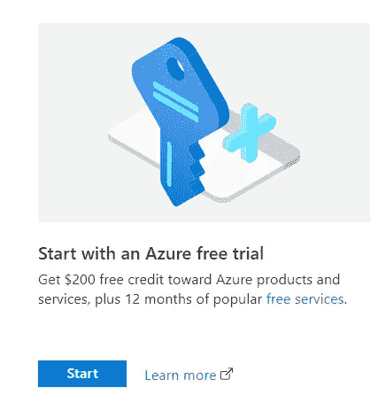

选择+创建，然后你会进入一个新的屏幕

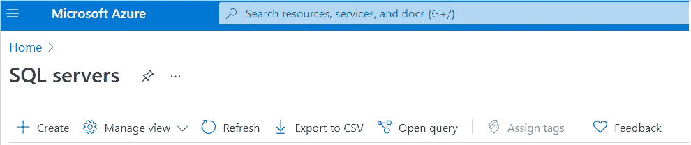

4.选择您的订阅名称、资源组(或创建一个)，输入服务器名称和位置，然后定义服务器管理员登录 ID 和密码。

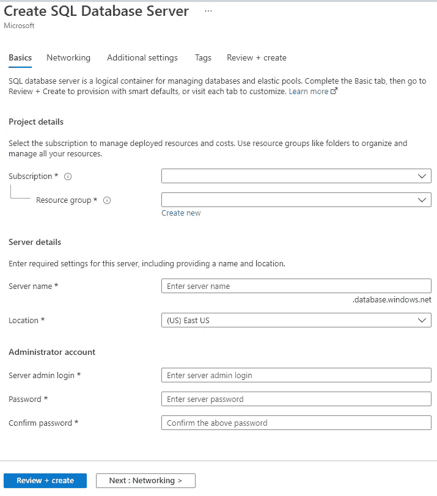

为了我们的教程，其他选项卡(网络；附加设置；标签)可以被跳过。我们可以点击“查看+创建”。然后大约需要一分钟的时间进行部署。您可以安全地浏览门户的其他页面。

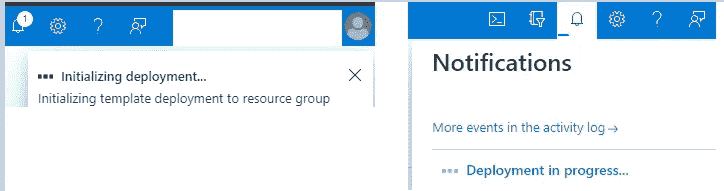

5.现在我们有了服务器，我们可以创建一个数据库。搜索 SQL 数据库并选择服务，然后单击+创建。

6.我们看到了一个类似的屏幕。定义数据库名称并选择我们刚刚创建的服务器。

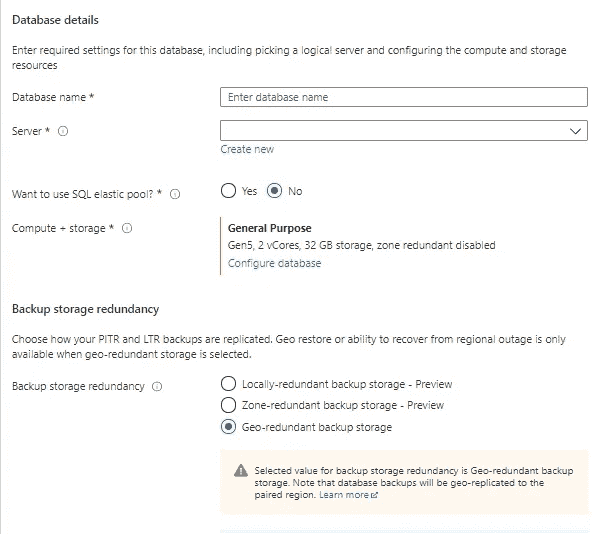

7.接下来，我们将定义我们对计算+存储的要求。单击“配置数据库”。它被配置为“通用”，默认情况下计算机层设置为“已调配”。

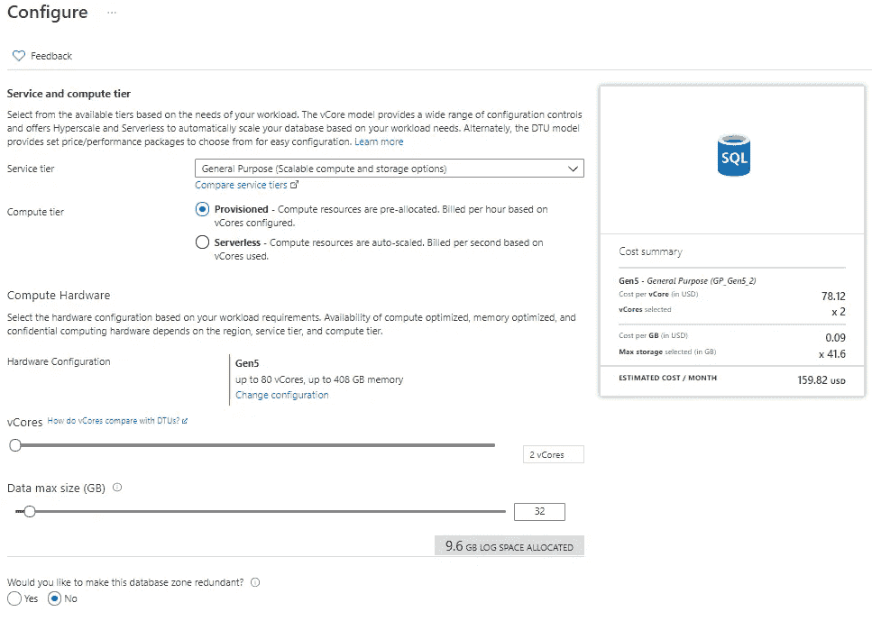

这种设置的每月预计账单将为 159.82 美元。根据您的需要，也可以选择“无服务器”。这些选项之间的区别在于，对于“无服务器”方法，计算资源是自动扩展的，而对于调配的方法，计算资源是预先分配的。

有了无服务器设置，我们每月的预计账单将大幅减少至几美分:

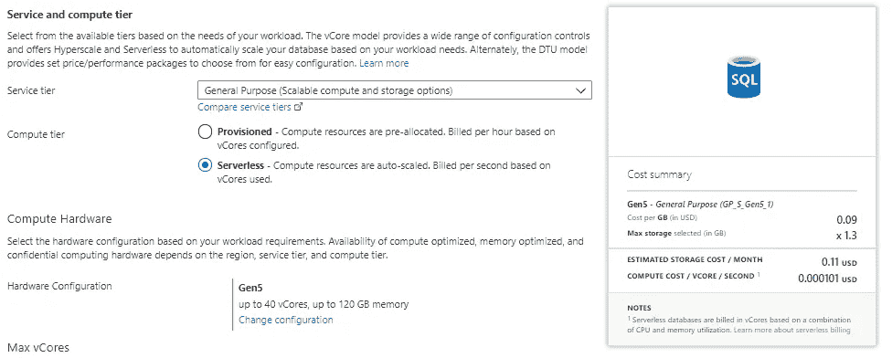

8.您可以通过启用自动暂停来进一步降低成本，尽管这可能意味着如果您过一段时间后查询数据库，服务会变慢，因为它需要被“唤醒”。如果几秒钟的事情不能改变游戏规则，那么这个选择是有意义的。

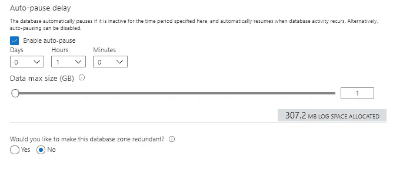

9.然后，我们可以点击“查看+创建”。至于我们的服务器的设置，大约需要一分钟来部署。现在我们有了服务器和数据库，让我们连接到我们的 SQL Server Studio。

# **将 Azure 云服务器连接到 SSMS**

1.  我们可以在主屏幕上找到我们最近的资源。让我们选择我们的数据库。

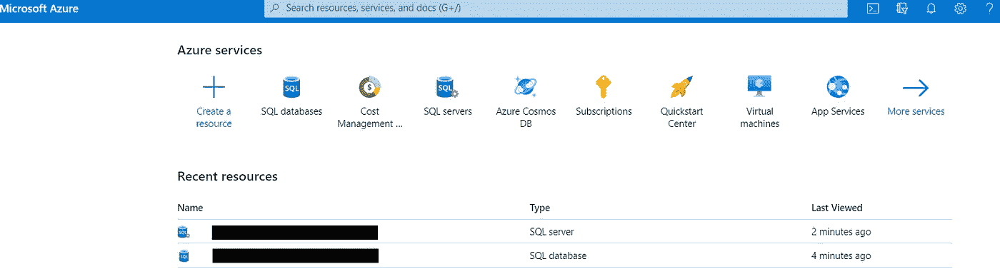

2.我们得到了这个数据库的要素列表。在右侧，将鼠标悬停在以“. database.windows.net”结尾的服务器名称上，然后复制它。

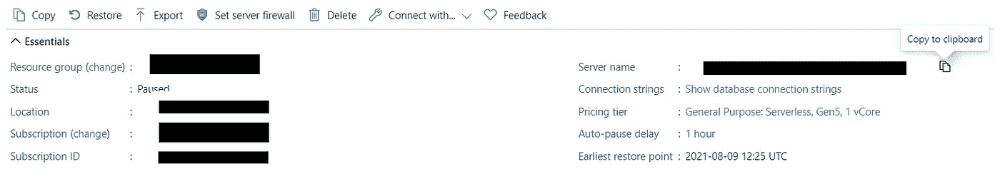

3.打开 SSMS。在“连接到服务器”窗口中，粘贴我们刚刚复制的服务器。然后输入创建服务器时提供的管理员 ID 和密码。从“身份验证”下拉列表中，选择“SQL Server 身份验证”。

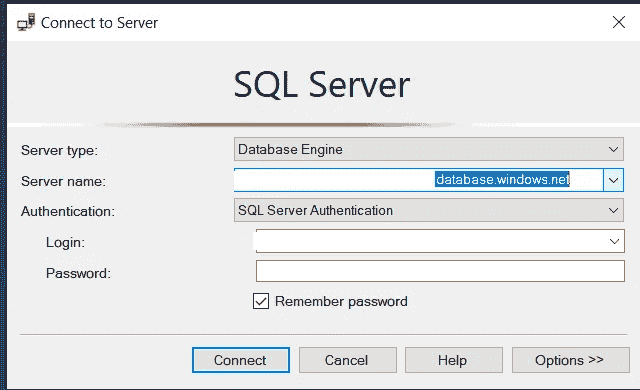

4.Azure 服务器将出现在右边，我们创建的数据库在它下面。

5.在这个数据库中，我们可以像在[第二部分数据库中一样创建一个表，表&命名约定](/getting-started-with-sql-server-management-studio-5cd24bb1a87c)。

6.我们在这个新表上所做的操作在我们的 Azure 门户数据库仪表板中是可见的。

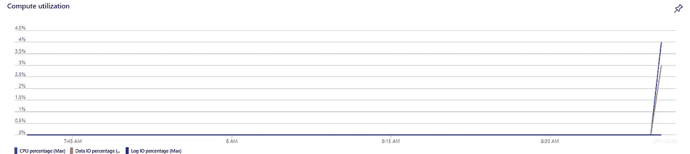

# 最后的话和接下来会发生什么

暂时就这样吧！我希望您现在对在 SSMS 创建和利用云资源(如 SQL 数据库和服务器)更有信心了。云为本地服务提供了一个有趣的替代方案。一些好处是:

*   维护成本(硬件和软件，包括更新)由云提供商承担。
*   安全，
*   可用性符合 SLA，
*   资源和计算能力可以放大和缩小，
*   按使用量付费选项，
*   备份(灾难恢复/业务连续性、损失预防)

我承认，开始时可能还是会有一些与账单相关的焦虑。自动暂停资源的选项有助于缓解这种压力。客户服务通常是有帮助的，我曾经从其他云提供商那里获得退款，这些服务仍然在运行，但没有被使用(我的错😅).

感谢您的阅读，请告诉我您的想法，或者是否有我应该涉及的话题。与此同时，请随时订阅并关注我。下次见！

# 快乐编码🎉！

感谢阅读！喜欢这个故事吗？ [**加入媒介**](https://medium.com/@maximegodfroid/membership) 可完整访问我的所有故事。