# 了解 SQL Server Management Studio —第 3 部分 CRUD 操作、主键和外键

> 原文：<https://towardsdatascience.com/learn-sql-server-management-studio-part-3-crud-operations-primary-foreign-keys-9d884b32ad70?source=collection_archive---------10----------------------->

## 让你在派对上开心的技能！循序渐进。


迈克尔·泽兹奇在 [Unsplash](https://unsplash.com?utm_source=medium&utm_medium=referral) 上的照片

# 在最后几集里…

大家好，欢迎来到 SQL 和 SQL Server Studio 系列教程的第三部分。目标？让你熟悉和适应这个工具和语言。“这有什么关系？”我知道你在问。事实证明，好奇心和副业往往是被新项目选中的关键，甚至是获得新工作的关键。您已经使用了一个重要的工具，比如 SQL Server Studio，并且编写了一些 SQL 查询，这一事实可以并且将会给您一个清晰的开端。

如果您错过了关于如何设置我们的环境和本地服务器的第 1 集，请阅读本文:

[](/getting-started-with-sql-server-management-studio-part-1-step-by-step-setup-63428650a1e0) [## 了解 SQL Server Management Studio —第 1 部分分步安装

### 这是一个免费且强大的工具，可以利用数据、提高技能并在面试中脱颖而出

towardsdatascience.com](/getting-started-with-sql-server-management-studio-part-1-step-by-step-setup-63428650a1e0) 

如果您错过了第 2 集，关于使用设计工具或通过编写查询来创建数据库和表，以及关于命名约定的重要性，请继续阅读本文😉。

[](/getting-started-with-sql-server-management-studio-5cd24bb1a87c) [## 了解 SQL Server Management Studio —第 2 部分数据库、表和命名约定

### 让你在派对上开心的技能！

towardsdatascience.com](/getting-started-with-sql-server-management-studio-5cd24bb1a87c) 

# 期待什么？

今天我们将看看 CRUD 操作、公共表表达式、主键和外键，以及如何构建我们的第一个简单表关系。我们将介绍两种删除记录的方法，使用常见的表表达式和 delete 语句。也会有具体的例子，一些有用的捷径，和一个迷因。让我们直接跳进来吧！

# 创作你的第一张唱片

一开始，什么都没有。然后出现了光，第一张唱片。创建或添加新记录是 **CRUD** 操作的 **C** 。

1.  我们假设已经启动了 SQL Server Studio，并连接到本地服务器的实例。
2.  让我们打开一个查询窗口，这可以通过以下任一方式完成:

*   CTRL + N
*   右键单击数据库名或表名，然后单击“新建查询”

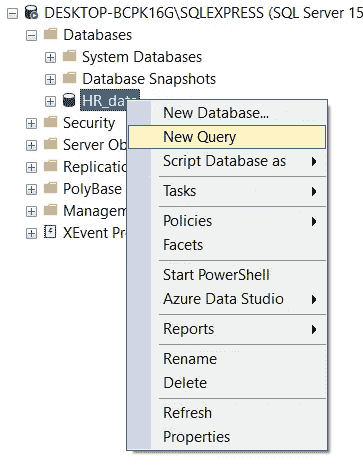

3.在表中创建新记录的结构是:

```
INSERT INTO *table_name* (*column1*, *column2*, ...)
VALUES (*value1*, *value2*, ...);
```

这些值需要与我们设计表时定义的数据类型相匹配。提醒一下，我们使用这种结构:

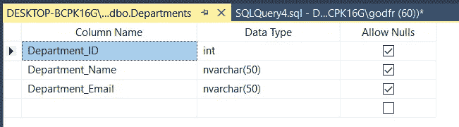

例如，尝试对 Department_ID 使用字符串值将会返回错误。自己看:

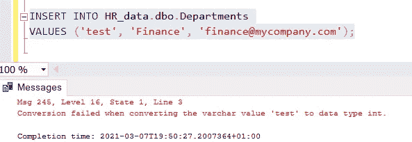

所以我们会写这个，建议你自己写，而不是复制粘贴，用手指记忆😉

```
INSERT INTO HR_data.dbo.DepartmentsVALUES (1, 'Finance', 'finance@mycompany.com');
```

由于 *Department_Name* 和 *Department_Email* 是字符串，我们将该信息放在单引号中。

4.让我们通过运行来验证结果

```
SELECT * FROM HR_data.dbo.Departments
```

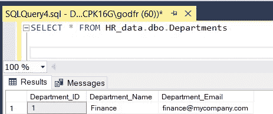

成功了。我们“读取”或查询我们的表，R 来自 CRUD 的缩写。还剩两个。再加几条记录吧。

5.我们可以连续运行几个:

```
INSERT INTO HR_data.dbo.DepartmentsVALUES 
(2, 'HR', 'HR@mycompany.com'),
(3, 'IT', 'IT@mycompany.com'),
(4, 'Sales', 'Sales@mycompany.com');
```

6.让我们看看这是怎么回事:

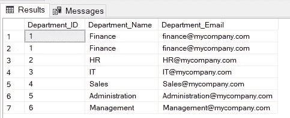

如您所见，我继续添加了比提到的还要多的几个。在我仓促的热情中，我错误地加了两次金融。现在怎么办？让我们借此机会从 CRUD 中学习另一种操作。删除。

# 删除记录

俗话说得好，给猫剥皮的方法不止一种。删除记录也是如此。这要看你的情况和需求。我们来讨论两种方式。

## 删除给定行中的记录

这里我们想删除给定行中的一条记录。该查询比我们之前编写的更进了一步。我们将一行一行地浏览这个片段。

```
with cte(rownum) as (select row_number () over(partition by Department_ID order by Department_ID) from HR_data.dbo.Departments)delete from cte where rownum = 2
```

**第 1 行**

*   使用‘WITH’意味着我们将使用‘公共表表达式’(CTE)。这允许我们定义一个临时命名的结果，以便以后引用。语法是:

```
**WITH** expression_name[(column_name [,...])] **AS** (CTE_definition) SQL_statement;
```

在我们的例子中，我们将 expression_name 命名为“cte”，将 column_name 命名为“rownum”。

**二号线**

*   我们选择“row_number”，其中 row_number 是一个 SQL 系统函数，这解释了它为什么会变成粉红色/洋红色。
*   我们使用上的**和**分区 BY** 子句来指定我们需要执行聚合的列。在我们的例子中，我们将关注 Department_ID 和按** Department_ID 排序的**。请注意,“ORDER BY”是必需的，明确命名它可以防止在使用 row_numbers 时出现任何误解。**

**第 3 行&第 4 行**

我们精确我们的源表，并关闭我们的 **OVER** 子句。

**第 5 行**

上面语法中的 *SQL_statement* 就是在这里编写的。SQL 的美妙之处在于它通常是不言自明的。作为提醒，我们有:

```
delete from cte where rownum = 2
```

我们将从' cte '表达式中删除，其中 rownum(ber)是 2，因为我们要删除的记录在第二行。

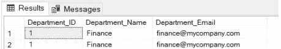

## 使用删除删除记录

以上内容可能看起来很乏味。如果记录可以通过主键(PK)唯一标识，事情就简单多了。关于 PK 和外键(FK)的一句话。在这种情况下，我们可以通过写入以下内容来删除记录:

```
DELETE FROM HR_data.dbo.Departments
WHERE Department_ID = 6
```

而且我们的‘管理’记录也没了；抱歉，各位😁。像往常一样，让我们运行下面的查询来检查是否一切正常。

```
SELECT * FROM HR_data.dbo.Departments
```

# 更新记录

既然我们已经介绍了 CRUD 首字母缩写词的创建、读取和删除部分，那么让我们处理最后一个部分，并“更新”一个记录。

1.  假设 IT 部门更改了电子邮件地址。我们希望确保这一点在我们的表格中得到正确反映。
2.  要遵循的语法是

```
UPDATE *table_name*
SET *column1* = *value1*, *column2* = *value2*, ...
WHERE *condition*;
```

3.我们的查询应该是这样的，因为我们将把 Department_Email 从它设置为“information _ technology @ my company . com”

```
UPDATE HR_data.dbo.Departments
SET Department_Email = 'information_technology@mycompany.com'
WHERE Department_Name = 'IT'
```

4.再次，让我们重复我们的好习惯来检查我们的结果

```
SELECT * FROM HR_data.dbo.Departments
```

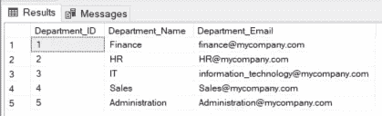

# 主键和外键

键对于定义唯一记录和建立表之间的关系很有用。

## 设置主键

主键(PK)创建一个约束，它唯一地标识表中的每条记录。

1.  我们将 Department_ID 定义为我们的主键。虽然你可能认为会有一个简单明了的方法，但 MS Server 将会进行一些斗争。所以最简单的方法是删除 Department_ID 列，然后重新创建它。

```
ALTER TABLE Departments DROP COLUMN Department_ID
```

2.然后我们重新创建它，我们使用 IDENTITY(1，1)。

```
ALTER TABLE Departments ADD Department_ID INT IDENTITY(1, 1)
```

这将授予 Department_ID 自动递增功能。每个新记录都将有其唯一的标识符，并且 ID 将自动增加 1。

3.让我们插入一个虚拟记录来检查一下。您可能还记得如何:

```
INSERT INTO DepartmentsVALUES ('test', 'test')
```

在这里，如您所见，我们没有定义任何“Department_ID ”,这与我们之前所做的不同:

```
INSERT INTO HR_data.dbo.DepartmentsVALUES (1, 'Finance', 'finance@mycompany.com');
```

这要归功于我们的表的自动递增功能，以及它的主键。

4.我们运行一个快速的“SELECT * FROM Departments”检查，我们的虚拟记录就在那里。

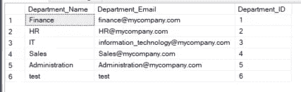

5.让我们自己收拾吧

```
DELETE FROM Departmentswhere Department_ID = 6
```

## 一开始就设定一个 PK

我们删除了一个列，然后重新创建了一个列作为 PK。但事后看来，我们本可以做得不同。在创建表的初始步骤，我们可以编写以下内容:

```
CREATE TABLE Departments (
    Department_id int NOT NULL IDENTITY(1,1),
    Department_Name nvarchar(50),
    Department_Email nvarchar(50),
    PRIMARY KEY (Department_Id)
);
```

正如我们在[第 2 部分](/getting-started-with-sql-server-management-studio-5cd24bb1a87c)中看到的，这创建了一个表“*部门*，然后定义列名和数据类型。您会注意到，我们设置了所需的设置，使 Department_id 支持“主键”，不为空，并通过 Identity(1，1)自动递增。

## 创建外键(FK)

我们使用外键将两个表链接在一起。它是一个表中与另一个表中的主键相关的字段。让我们用一个例子来说明:

1.  想象第二张桌子，雇员。它包含名，姓，工作电子邮件的数据。此外，每个员工都是一个数字(哎呀，迷因来了)。


[来源](https://imgflip.com/tag/patrick+mcgoohan+prisoner)

我的意思是每个雇员都有一个编号 ID，Employee_ID。而且每个员工也是一个部门的一部分。这就是 Department_ID 派上用场的地方。

2.我们的桌子看起来像这样

```
CREATE TABLE Employees (Employee_ID int NOT NULL IDENTITY(1,1),Employee_Name nvarchar(MAX),Employee_Email nvarchar(MAX),PRIMARY KEY (Employee_ID),Department_ID int);
```

3.让我们验证我们的表是否存在，这可能需要刷新，然后打开设计面板—右键单击表名，然后单击 Design

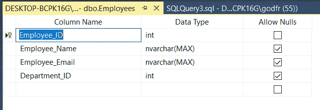

结构就是这样。如您所见，Employee_ID 是一个主键。

4.让我们向该表添加一条记录:

```
INSERT INTO [HR_data].[dbo].[Employees]VALUES ('Max', 'Max@mycompany.com', 1)
```

由于 Employee_ID 具有设置 IDENTITY(1，1 ),所以它是自动创建的，并随着新记录的增加而增加。这解释了为什么我们在值括号中没有提到任何 Employee_ID。现在让我们看看如何将 Department_ID 设置为外键。这样做的方法不止一种。

5.首先让我们使用一个查询:

```
ALTER TABLE [dbo].[Employees]ADD FOREIGN KEY ([Department_ID]) 
REFERENCES Departments([Department_ID])
```

上面发生了什么？

第 1 行——我们精确地指出要修改哪个表

第 2 行——我们指出我们想要添加一个外键，并明确它是如何被调用的

第 3 行—在我们的例子中，我们提供这个外键也将与我们的 Departments 表相关的引用。

让我们看看创建外键的第二种方法。

6.使用数据库图表。右键单击数据库图表。

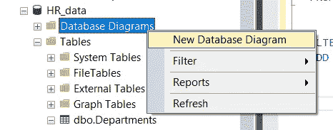

7.选择这两个表，然后添加，并关闭窗口。

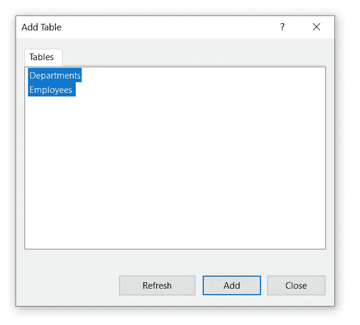

8.他们出现在我们的操场上，我们可以拖拽他们。

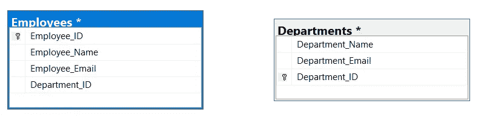

9.现在，我们将通过将主键 Department_ID (Departments 表)链接到未来的外键 Department_ID (Employees 表)来创建它们之间的关系。

10.选择一个表中的 Department_ID 行，以及出现的小箭头。

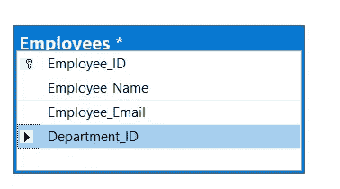

11.选择并拖动到另一个表格。出现一条虚线。释放，出现一个新窗口。它将连接部门和雇员表的主键和 FK。让我们点击确定。

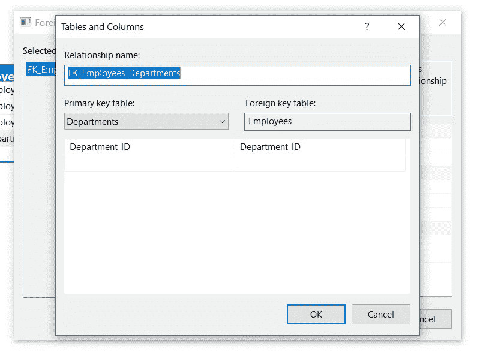

12.出现第二个窗口。它允许我们定制外键以及与 PK 表的关系。

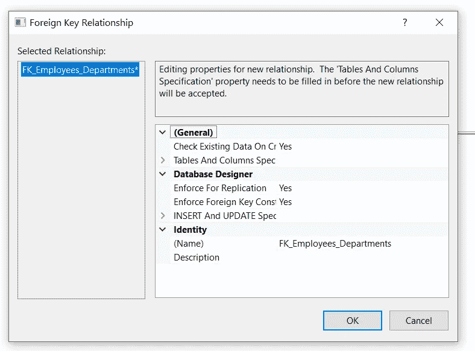

我们现在跳过它，接下来讨论它。

13.图表随表之间的连接而更新。

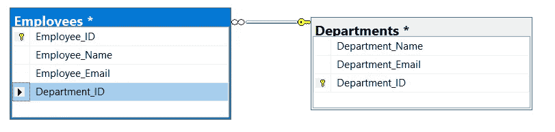

14.让我们在继续之前保存我们的图表，通过选择


然后“是”，并给我们的图表命名。

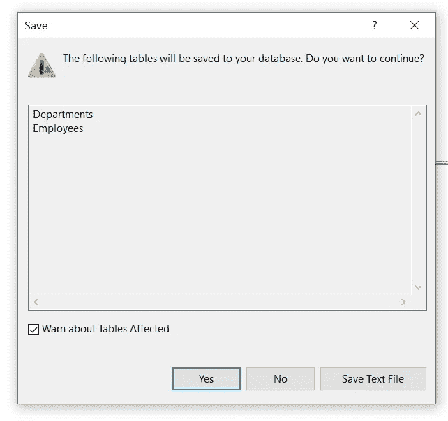

## 更改关系的设置(PK-FK)

1.  右键单击两个表之间的关系。我们可以决定删除关系，或者访问它的属性。

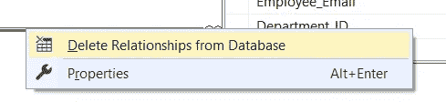

2.“删除”选项很简单。属性打开了一组我们在前一部分中已经看到的选项。

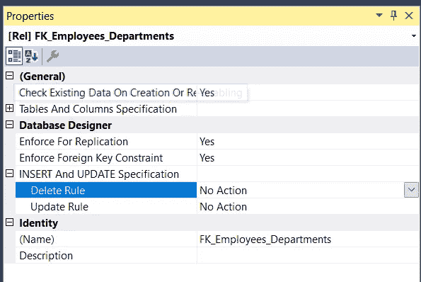

3.上半部分告诉我们这个关系的连接细节:

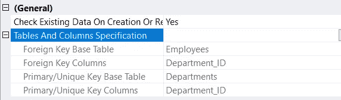

4.在数据库设计器下，我们可以调整四个设置:

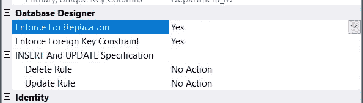

*   **强制复制&强制外键约束**

默认情况下，它们被设置为“是”，建议保持这种状态。何时应将它们设置为“否”？下面是来自 StackOverflow 的[的简要说明。](https://stackoverflow.com/questions/4602270/sql-server-what-is-the-benefit-of-using-enforce-foreign-key-constraint-when-i)

> *(…)当你在开发或重构一个数据库时，或者当你需要“净化”(清理)大量数据时，关闭外键约束以允许将“无效”数据加载到表中是有意义的。(…)*

*   **删除&更新规则**

这两个设置很有趣，可以确保模式中的不同表“一起移动”。选项范围包括:

*   不
*   串联
*   设置默认值
*   设置为空

如果选择的设置是 Cascade 或 Set Default/Null，并且对我们的 Departments 表应用了更改，则连接的表 Employees 将受到影响。

5.让我们来看一个例子。让我们将删除/更新规则设置为“级联”。然后添加一名新员工，来自行政部门的 Bob。

```
INSERT INTO [dbo].[Employees]VALUES ('Bob', 'Bob@mycompany.com', 5)
```

运行此查询以验证 Bob 是我们员工列表的一部分。

```
SELECT * FROM [dbo].[Employees]
```

6.我们现在是两年后的未来。公司管理层决定将行政部门外包出去。因此，该部门将被删除。不幸的是，这个部门的员工不能留下来。这对鲍勃来说是个坏消息。

7.我们删除行政部门

```
DELETE FROM Departments WHERE Department_Name = 'Administration'
```

8.如果您还记得，我们为删除和更新设置了“级联”。你认为会发生什么？让我们看看 Employees 表对删除“管理”部门的反应。

```
SELECT * FROM [HR_data].[dbo].[Employees]
```

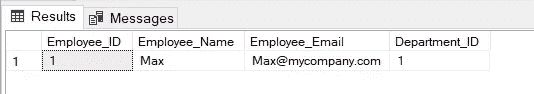

鲍勃走了。虽然这很可悲，但它帮助我们了解了“级联”规则以及表之间的连接是如何工作的。如果连接设置得很好，这允许我们在一个动作中处理其他表中的相关记录。如果我们需要从我们的记录中删除一个用户，它会很有用。

# 最后的话和接下来会发生什么

暂时就这样吧！我希望您现在对使用 SQL Server 和以下方面更有信心:

*   使用 CRUD 操作，创建-读取-更新-删除记录，
*   设置主键，并知道它们为什么重要(欺骗代码:它们有助于使记录唯一，通过创建逻辑标识符为连接表提供第一个基础)。您已经看到了查询和设计方法。
*   通过查询或使用图表定义外键，以及
*   理解关系表的有用属性，例如如何跨表级联更改。

感谢您的阅读，请告诉我您的想法，或者是否有我应该涉及的话题。下次见！

## 编码快乐！

感谢阅读！喜欢这个故事吗？ [**加入媒介**](https://medium.com/@maximegodfroid/membership) 可完整访问我的所有故事。

# 从关于模式和规范化的第 4 集开始继续这一旅程！

[](/learn-sql-server-management-studio-part-4-schemas-normalization-80bcd6a5258) [## 了解 SQL Server Management Studio —第 4 部分架构和规范化

### 让你在派对上开心的技能！

towardsdatascience.com](/learn-sql-server-management-studio-part-4-schemas-normalization-80bcd6a5258) 

## 或者选择你喜欢的另一集

**在第 5 集**，我们覆盖存储过程&调度，这是一个真正的野兽。我怎么强调这将如何促进和自动化你的日常(数据)生活都不为过。[第五部分存储过程&调度](/learn-sql-server-management-studio-part-5-stored-procedures-scheduling-88fd9788d314)

**在第 6 集**中，我们介绍了用于 ETL 的 SSIS 包，并回顾了如何在两个数据库之间以及一个数据库和 Excel 之间导入和导出数据。[第六部 SSIS 套餐简介](/learn-sql-server-management-studio-part-6-ssis-packages-9438dbc90437)

**在第 7 集**中，我们将 SQL Studio 连接到 PowerBI，并构建了我们的第一批视觉效果。[第 7 部分连接到 PowerBI &第一视觉效果](http://Part 7 Connect to PowerBI & First Visuals)