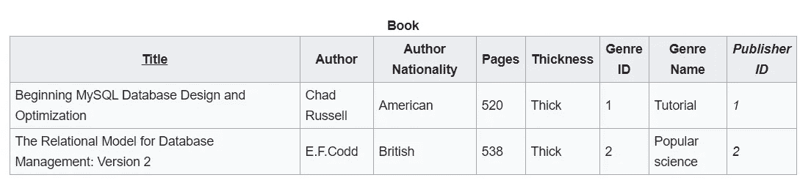

# SQL 模式和规范化简介

> 原文：<https://towardsdatascience.com/learn-sql-server-management-studio-part-4-schemas-normalization-80bcd6a5258?source=collection_archive---------19----------------------->

## 让你在派对上开心的技能！逐步地


迈克尔·泽兹奇在 [Unsplash](https://unsplash.com?utm_source=medium&utm_medium=referral) 上的照片

# 在最后几集里…

你好。欢迎学习 SQL 和 SQL Server Studio 系列教程的第 4 部分。有一个简单的目标:让你熟悉和适应这个工具和语言。“这有什么关系？”我知道你在问。事实证明，好奇心和副业往往是被新项目选中的关键，甚至是获得新工作的关键。您已经使用了一个重要的工具，比如 SQL Server Studio，并且编写了一些 SQL 查询，这一事实可以并且将会给您一个清晰的开端。

如果您错过了关于如何设置我们的环境和本地服务器的第 1 集，请阅读本文:

[](/getting-started-with-sql-server-management-studio-part-1-step-by-step-setup-63428650a1e0) [## 了解 SQL Server Management Studio —第 1 部分分步安装

### 这是一个免费且强大的工具，可以利用数据、提高技能并在面试中脱颖而出

towardsdatascience.com](/getting-started-with-sql-server-management-studio-part-1-step-by-step-setup-63428650a1e0) 

在第 2 集，我们重点介绍了使用设计工具或通过编写查询来创建数据库和表，以及命名约定对本文的重要性:

[](/getting-started-with-sql-server-management-studio-5cd24bb1a87c) [## 了解 SQL Server Management Studio —第 2 部分数据库、表和命名约定

### 让你在派对上开心的技能！

towardsdatascience.com](/getting-started-with-sql-server-management-studio-5cd24bb1a87c) 

在第 3 集，我们讨论了 CRUD 操作，它给你极大的权力来决定记录的可信度，以及主键和外键的主题。

[](/learn-sql-server-management-studio-part-3-crud-operations-primary-foreign-keys-9d884b32ad70) [## 了解 SQL Server Management Studio —第 3 部分 CRUD 操作、主键和外键

### 让你在派对上开心的技能！

towardsdatascience.com](/learn-sql-server-management-studio-part-3-crud-operations-primary-foreign-keys-9d884b32ad70) 

别忘了回来😉。

# 期待什么？

今天我们来看看模式。桌子可以被看作是积木，而你可以是建筑师，把它们组合在一起。我们将讨论不同的模式类型，它们的优缺点，并给出具体的例子。让我们直接跳进来吧！

# 什么是模式？

> 图式，来自希腊语σχῆμα (skhēma)，意为形状、计划。

好的，模式是一种组织事物的方式。在我们的例子中，组织我们的表。我们*可以*不严格地使用“图表”、“结构”或“建筑”作为同义词。

# 模式的类型

我们可以把它们分成三类。第一个可能会让一些人有点畏缩，但这是为了演示。

## **平面表模式——也就是普通模式**

将用于解决方案的复杂平面表称为“模式”可能有点牵强。然而，当考虑到*模式*意味着*形状*时，一个复杂的平面表可以被认为是一个简单的模式。

“复杂平板”到底是什么？在这种情况下，所有列或与数据相关的特性都收集在同一个表中。想象一下，将所有人力资源数据存储在一个表中:

*   员工姓名、职业和私人电子邮件、职业和私人电话号码、入职和离职(如有)日期，
*   职称，级别，部门，
*   薪资、上次绩效、绩效趋势、…

如上所述的平面表具有易于理解和排序以快速获得结果的优点。这可能非常方便。但这并不是因为它可以，而是因为 T2 应该。如果你在浏览了上述专栏后至少皱过一次眉头，我同意你的观点，原因有二:

1.  **不同级别的数据隐私**

上面提到的数据元素有不同的隐私级别。作为一名员工，公司内的所有人都可能知道同事的姓名或工作电子邮件。

但是私人邮箱和电话号码呢？那是禁止的。SQL 表中数据的可用性也是如此:

*   对员工列表具有 SQL 访问权限的用户应该只能看到公司内部所有人都可以看到的内容，
*   被认为更机密的信息应该存在于其他地方，在另一个表或系统中，并且应该只由负责员工数据的核心人力资源团队中的一小部分用户查询。
*   这同样适用于工资和绩效指标，除了人力资源工资团队，任何人都不能使用这些指标。

**2。拆分结构可以提供更清晰、更快速的查询和更小的表格**

这张看似平平无奇的桌子，却能迅速长成乳齿象。还存在冗余的风险，因为我们使用的是平面表，而不是利用关系数据库。如果我们要跟踪一段时间内的绩效趋势，我们将为每个新的绩效评估提供多行 Maxime，其余的是关于等级、工资的冗余数据重复。

在性能方面，也有一些问题:

*   有更多的数据要读取，所以查询可能会很慢，
*   表的大小正在快速增长，由于重复的数据，使得它们在操作上不是最佳的。

我们已经讨论了平面表结构的优缺点。由于所有列都是单个表的一部分，我们可以说这是一个集中式结构。现在让我们来看看分散模式或规范化模式。

## 规范化的方式

每当数据结构被拆分到不同的表中时，我们就说模式是*规范化的*。如果我们要将前面提到的平面表格可视化，我们可以用类似的方式呈现它:


在这种关系模式下，每个雇员都连接到:

*   部门，
*   薪水，
*   员工私人联系信息，
*   资产，资产与资产类型相关联

这种模式允许我们跨不同的表隔离我们的信息，此外，它还允许更简单的数据保护方法，因为我们需要在表或数据库级别而不是行级别进行处理。然而，规范化数据库的问题是，要从数据中获得洞察力，需要许多连接。

普通表的规范化遵循一定的步骤。

*   **UNF:** 那是一个非规格化的形式，作为一个普通的表。
*   **1NF:** 为了满足这个要求，每一列应该只包含一个值，并且是唯一的。拥有两项资产的员工最初会有

```
#PLAIN TABLE
**Employee_Name       Assets**
'Maxime'        'Laptop, Monitor'
```

为了满足 1NF，它可以分成两列，成为 Asset_1，Asset_2。

```
#Employee PLAIN TABLE
**Employee_Name       Asset_1      Asset_2   (... other columns ...)**
'Maxime'           'Laptop'     'Monitor'
**(... other rows...)**
```

但是如果一个员工有三项资产会怎么样呢？该员工的记录不适合，因为我们只有两个资产列。类似地，对于一个图书仓库，假设我们只有两个图书类别。一本分为四类的书，如“生活、健康、幸福、自助”不适合。

更好的方法是有一个新表，只用于资产。正如前面在第 3 部分中以雇员表和部门表之间的关系为例所讨论的，这在主键和外键的帮助下成为可能。

*   **2NF:** 要达到 2NF 这一步，我们需要先完成 1NF。在这个阶段，我们也要去除表里不一。主键和外键会派上用场，我们来看看为什么。正如在我们想象的普通员工表中提到的，我们有员工的历史绩效评估列表。

```
#Employee PLAIN TABLE
**Employee_Name       Performance_Date   Performance_Rating**
'Maxime'               'June 2020'               5
'Maxime'             'December 2020'             4
'Jane'                 'June 2020'               5
'Jane'               'December 2020'             5
```

相反，我们将把绩效日期和评级移到另一个表中。这将把我们的雇员表变成:

```
#Employee table
**Employee_ID (PK)      Employee_Name       (... other columns ...)**
     1                 'Maxime'                    
     2                  'Jane'
**(... other rows...)   ** 
```

我们的性能表:

```
#Performance
**Perf_ID Performance_Date   Performance_Rating      Employee_ID (FK)**
   1     'June 2020'               5                   1
   2     'June 2020'               5                   2  
   3     'December 2020'           4                   1
   4     'December 2020'           5                   2
```

我们的 Employee_ID 是 Employee 表中的主键(PK)和 Performance 表中的外键(FK)。它可以让我们了解每个员工的表现。但是，在性能表中不是有些表里不一吗？你说得对，我们也可以想象将其规范化，用 Performance_Rating 来获取评级，用 Performance_Cycles 来获取日期。

*   3NF: 我们需要遵循 2NF，我们想要解决任何传递函数依赖。这具体意味着什么？对于这个规范化步骤，以及下一步，我们将使用另一个例子来传达这些概念。

想象这张桌子:



[来源](https://en.wikipedia.org/wiki/Database_normalization#cite_note-:0-11)

我们有传递函数依赖，因为作者国籍依赖于作者，而作者又依赖于书[标题]。我们还有一个带[流派名称]的，依赖于[流派 ID]，反过来又依赖于书[书名]。

我们想要的是[作者国籍]和[流派名称]在它们自己的表中。

```
#Author table
 **Author        Author Nationality**
Chad Russel       American
 EF Codd           British
```

和[流派]表:

```
#Genre table
 **Genre ID       Genre Name**
    1             Tutorial
    2          Popular Science
```

这是正常化的步骤吗？不会。但大多数情况下，归一化发生在 3NF 以内。我们上面回顾的已经是标准化和组织数据并限制异常的一个强有力的开始。查看下一节以获得更多资源。

# 更进一步

*   BCNF:它代表 Boyce-Codd 范式，通常被称为 3.5NF，因为它专注于 3NF 未涵盖的异常。博伊斯·科德因其发明而受到称赞。Boyce 共同发明了 SQL，而 Codd 发明了数据库管理的关系模型，是我们一直在讨论的标准化步骤的幕后推手。

BCNF 是 defined⁴作为:

> 一个关系模式 *R* 在 BCNF 当且仅当对于它的每一个依赖关系 *X → Y* ，至少有一个下列条件成立:
> 
> ***x*→*y*是平凡的函数依赖(Y ⊆ X)，(y 是 x 的子集)**
> 
> *****X*是模式 *R* 的超级键。****

****3NF 覆盖的大多数关系在 BCNF，但不是全部。这里有一个例子。****

*   ******4NF，5NF 和 6NF**T22【这个环节】或者[这个](https://www.tutorialspoint.com/Fourth-Normal-Form-4NF)可能有帮助****

# ****最后的话****

****暂时就这样吧！本文更侧重于模式和规范化的理论概念，而不是 SQL Server 的使用。然而，在以前文章的支持下，您现在可以按照规范化步骤来尝试规范化一个表。****

****感谢您的阅读，请告诉我您的想法，或者是否有我应该涉及的话题。下次见！****

## ****编码快乐！****

****感谢阅读！喜欢这个故事吗？ [**加入媒介**](https://medium.com/@maximegodfroid/membership) 获取完整的我的所有故事。****

# ****继续第五集的旅程！****

****通过第 5 集学习如何使用 SQL 作业代理编写 SQL 存储过程和调度作业。****

****[](/learn-sql-server-management-studio-part-5-stored-procedures-scheduling-88fd9788d314) [## 了解 SQL Server Management Studio —第 5 部分存储过程和调度

### 让你在派对上开心的技能！循序渐进。

towardsdatascience.com](/learn-sql-server-management-studio-part-5-stored-procedures-scheduling-88fd9788d314) 

## 或者选择你喜欢的另一集

**在第 6 集**中，我们介绍了用于 ETL 的 SSIS 包，并回顾了如何在两个数据库之间以及一个数据库和 Excel 之间导入和导出数据。[第六部 SSIS 套餐简介](/learn-sql-server-management-studio-part-6-ssis-packages-9438dbc90437)

**在第 7 集**中，我们将 SQL Studio 连接到 PowerBI，并构建了我们的第一个视觉效果。[第七部分连接到 PowerBI &第一视觉效果](http://Part 7 Connect to PowerBI & First Visuals)**** 

# ******参考文献******

1.  ****Schema-Wikipedia，[https://en . Wikipedia . org/wiki/Schema #:~:text = The % 20 word % 20 Schema % 20 comes % 20 from，is % 20 used % 20 as % 20 plural % 20 forms](https://en.wikipedia.org/wiki/Schema#:~:text=The%20word%20schema%20comes%20from,are%20used%20as%20plural%20forms)。****
2.  ****博伊斯——维基百科，[https://en.wikipedia.org/wiki/Raymond_F._Boyce](https://en.wikipedia.org/wiki/Raymond_F._Boyce)****
3.  ****Codd —维基百科，[https://en.wikipedia.org/wiki/Edgar_F._Codd](https://en.wikipedia.org/wiki/Edgar_F._Codd)****
4.  ****亚伯拉罕·西尔伯沙茨(2006 年)。 [*数据库系统概念*](https://archive.org/details/databasesystemco00silb_973) (第 6 版。).麦格劳-希尔。第 [333 页](https://archive.org/details/databasesystemco00silb_973/page/n359)。国际标准书号 978–0–07–352332–3。****