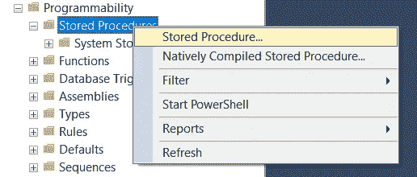

# 了解 SQL Server Management Studio —第 5 部分存储过程和调度

> 原文：<https://towardsdatascience.com/learn-sql-server-management-studio-part-5-stored-procedures-scheduling-88fd9788d314?source=collection_archive---------12----------------------->

## 让你在派对上开心的技能！循序渐进。


迈克尔·泽兹奇在 [Unsplash](https://unsplash.com?utm_source=medium&utm_medium=referral) 上的照片

# 在最后几集里…

你好。欢迎学习 SQL 和 SQL Server Studio 系列教程的第 5 部分。有一个简单的目标:让你熟悉和适应这个工具和语言。“这有什么关系？”我知道你在问。事实证明，好奇心和副业往往是被新项目选中的关键，甚至是获得新工作的关键。事实上，您已经使用了一个重要的工具，比如 SQL Server Studio，并且编写了一些 SQL 查询，这将会给您一个清晰的开端。

如果您错过了关于如何设置我们的环境和本地服务器的第 1 集，请阅读本文:

[](/getting-started-with-sql-server-management-studio-part-1-step-by-step-setup-63428650a1e0) [## 了解 SQL Server Management Studio —第 1 部分分步安装

### 这是一个免费且强大的工具，可以利用数据、提高技能并在面试中脱颖而出

towardsdatascience.com](/getting-started-with-sql-server-management-studio-part-1-step-by-step-setup-63428650a1e0) 

第二集将教你如何创建自己的数据库、表格，以及关于命名约定的重要注释:

[](/getting-started-with-sql-server-management-studio-5cd24bb1a87c) [## 了解 SQL Server Management Studio —第 2 部分数据库、表和命名约定

### 让你在派对上开心的技能！

towardsdatascience.com](/getting-started-with-sql-server-management-studio-5cd24bb1a87c) 

在第 3 集，我们介绍了 CRUD 操作以及主键和外键:

[](/learn-sql-server-management-studio-part-3-crud-operations-primary-foreign-keys-9d884b32ad70) [## 了解 SQL Server Management Studio —第 3 部分 CRUD 操作、主键和外键

### 让你在派对上开心的技能！

towardsdatascience.com](/learn-sql-server-management-studio-part-3-crud-operations-primary-foreign-keys-9d884b32ad70) 

在第 4 集，我们讨论了模式&主要的规范化步骤:

[](/learn-sql-server-management-studio-part-4-schemas-normalization-80bcd6a5258) [## 了解 SQL Server Management Studio —第 4 部分架构和规范化

### 让你在派对上开心的技能！

towardsdatascience.com](/learn-sql-server-management-studio-part-4-schemas-normalization-80bcd6a5258) 

别忘了回来😉。

# 期待什么？

今天我们将看看存储过程和作业调度。本教程结束时，您将创建自己的过程，并安排它们在方便的时候运行。这看起来并不多，但它是一项强大而简单的自动化技能，可以添加到您的工具箱中。让我们直接跳进来吧！

# 存储过程、奇妙的工具以及在哪里可以找到它们

存储过程是奇妙的工具。它们允许您保存和存储查询。虽然这对于诸如“SELECT * FROM Departments”之类的简单查询似乎并不重要，但对于涉及多个表的复杂查询，或者利用*系统存储过程*，这将节省大量时间。“系统存储过程”？这些是 SQL Studio 中存在的过程，例如，可以使用*sp _ send _ dbmail*向使用 SQL Studio 的电子邮件收件人发送邮件。

现在，让我们回顾一下上面的内容，希望你会接受这个想法…

*   将脚本存储为过程，
*   使用系统过程，如 sp_send_dbmail，
*   安排程序

我希望上面提到的潜在用例能让你头脑发热😉让我们看看如何开始。

1.  在 SQL Server Studio 中，存储过程(或简称为过程)驻留在任何数据库中的 programmability 子目录下。请看下面的内容:


起初，没有，然后出现了第一个。让我们看看这是如何发生的。

2.右键单击存储过程，然后单击存储过程



3.将出现典型的查询窗口，其中填充了一个过程模板


任何以双破折号“- -”开头的内容都会自动变成绿色，这些是注释。它们将被 SQL 查询编辑器忽略(我可以说编译器吗？🤔)当我们运行脚本时。你可以随意删除绿色的评论，但是部分内容需要调整，以提供作者、创作日期和描述等信息。

然后是“创建过程<procedure_name>”。CREATE 过程后面的名称将定义该过程的名称。没有必要保留符号< >。</procedure_name>

对于这个例子，我们将其命名为*通货膨胀 _ 调整*

4.现在，为了保存和检查我们新创建的过程，我们将编写一个占位符查询。在开始和结束之间，添加以下内容。“部门”是我们在前面的练习中创建的表格。我们假设您已经学习了前面的教程，如果没有，请继续创建您自己的表或调整查询以匹配您的环境。

```
SELECT * FROM HR_data.dbo.Departments
```

这是我有的


5.我们可以突出显示该查询并运行它(F5 或执行绿色箭头)

6.现在让我们运行整个脚本，这将创建并保存过程。


使用蓝色箭头刷新，出现该过程。


7.要修改它，请右键单击，然后单击“修改”。将出现查询编辑器。


现在可以调整脚本，然后点击“执行”。这将保存和更新程序。在此之前，我们将在我们的薪金表中添加一条新记录，然后我们将返回到该过程并创建一个将自动运行的脚本。

8.让我们打开工资表。提醒一下，创建表的一种方法是右键单击 Tables > New > Table，然后输入不同的列名和数据类型。


9.我们现在将向该表添加一条记录

```
INSERT INTO SalariesVALUES (1, 2500, 1)
```

这样，雇员#1 的薪金为 2500。

10.回到我们的过程屏幕，我们将编写一个脚本来根据通货膨胀率调整工资。代替我们原来的占位符代码 *SELECT * FROM Departments，*，我们将编写以下代码:

```
UPDATE SalariesSET Salary_USD = Salary_USD * 1.03
```

该查询更新了 Salary 表，并将 Salary_USD 的值设置为 Salary_USD 乘以 1.03，这意味着我们增加了 3%的通货膨胀率。

11.让我们选择这两行，并运行它们(F5 或 Execute)


快速检查一下我们的原始表，我们看到 2500 现在是 2575，增加了 3%。


12.现在，如果您已经学习了以前的教程，这仅仅是对一个专栏进行更新，并不是什么新鲜事。这种加薪每年都要进行，如果我们能安排这样的事情，不是很好吗？进入日程安排。

# 计划作业

这里我们将讨论如何安排一个任务，例如如何运行我们的通货膨胀调整程序。但首先，有些坏消息。允许您从 SQL Studio 中运行和计划作业的 SQL Server 代理在 SQL Express 中不可用，这是因为 SQL Express 是免费软件。

但是，我将向您展示环境是什么样子的，如何安排作业，这样您就可以了解这个特性，或者如果您有付费版本的话，也可以继续学习。或者，可以使用 Windows 任务计划程序运行脚本。这超出了 SQL Studio 文章系列的范围，将在附录文章中讨论。

## SQL Server 代理

该部分位于服务器功能列表的末尾。


1.  右键单击作业，然后单击新建作业，将出现一个新窗口


在这里你可以命名一个工作，精确的分类并提供描述。大多数时候只会填写*姓名*。

2.在“步骤”下，用户可以设置作业应该遵循的不同步骤。


如果一个作业有多个步骤，可以使用“移动步骤”下的上下箭头重新排列其运行顺序。

3.点击“新建”，出现一个新窗口。我们为该步骤定义了一个名称，我们精确了数据库，这里应该是 *HR_data* 和一个命令。该命令将执行我们的存储过程，因此是 *EXEC [dbo]。【通货膨胀 _ 调整】*


4.在新步骤窗口的“高级”选项卡下，我们可以定义下一个操作，无论我们的步骤是成功还是失败。


以下是我们在成功情况下的行动范围:


如果失败:


它们不言自明。然后，我们可以验证步骤的创建，并点击 OK。

5.该步骤出现在我们的列表中


6.现在让我们安排一下


如您所见，除了调度功能，还有一个功能是在作业运行或失败时得到通知。

类似的简单屏幕和一组选项:


7.设置新时间表的窗口如下所示


频率可以设置为每天、每周或每月。在我们的示例中，我们将选择每月一次，然后调整参数使其每年运行一次。


这意味着每 12 个月一次。正如摘要描述所解释的，该计划将从 2022 年 1 月 1 日开始使用，并在该月的第二天运行。如果这听起来不错，我们为我们的作业计划定义一个名称，然后单击 ok。

8.已经安排好了。如果我们有更复杂的需求，而这些需求不能由单一的计划来处理，我们可以创建新的计划来涵盖所有的情况。


我们确认所有打开的窗口，新作业将出现在我们的作业列表中。

**注意:作业调度程序显示的开始时间与您的服务器相关联。也就是说，如果它位于德国，则基于该时区安排作业。**

# 最后的话和接下来会发生什么

暂时就这样吧！我希望您现在对使用 SQL Server 更有信心，并且:

*   创建和修改 SQL 存储过程，
*   了解 SQL 作业调度程序的工作原理，
*   如果你有 SSMS 付费版，你就知道如何浏览 SQL 作业调度程序

感谢您的阅读，请告诉我您的想法，或者是否有我应该涉及的话题。下次见！

## 编码快乐！

感谢阅读！喜欢这个故事吗？ [**加入媒介**](https://medium.com/@maximegodfroid/membership) 可完整访问我的所有故事。

# 继续第六集的旅程！

通过第 6 集，了解如何创建 SSIS 包来导入和导出数据，以便在两个数据库之间传输或在 excel/CSV 和数据库之间传输。

[](/learn-sql-server-management-studio-part-6-ssis-packages-9438dbc90437) [## 了解 SQL Server Management Studio —第 6 部分 SSIS 软件包

### 让你在派对上开心的技能！循序渐进。

towardsdatascience.com](/learn-sql-server-management-studio-part-6-ssis-packages-9438dbc90437) 

## 或者选择你喜欢的另一集

**在第 7 集**中，我们将 SQL Studio 连接到 PowerBI，并构建了我们的第一个视觉效果。[第 7 部分连接到 PowerBI &第一视觉效果](http://Part 7 Connect to PowerBI & First Visuals)