# 了解 SQL Server Management Studio —第 6 部分 SSIS 软件包

> 原文：<https://towardsdatascience.com/learn-sql-server-management-studio-part-6-ssis-packages-9438dbc90437?source=collection_archive---------12----------------------->

## 让你在派对上变得有趣的技巧——一步一步来

迈克尔·泽兹奇在 [Unsplash](https://unsplash.com?utm_source=medium&utm_medium=referral) 上的照片

# 在最后几集里…

你好。欢迎学习 SQL 和 SQL Server Studio 系列教程的第 6 部分。有一个简单的目标:让你熟悉和适应这个工具和语言。“这有什么关系？”我知道你在问。事实证明，好奇心和副业往往是被新项目选中的关键，甚至是获得新工作的关键。事实上，您已经使用了一个重要的工具，比如 SQL Server Studio，并且编写了一些 SQL 查询，这将会给您一个清晰的开端。

如果您错过了关于如何设置我们的环境和本地服务器的第 1 集，请阅读本文:

 [## 了解 SQL Server Management Studio —第 1 部分分步安装

### 这是一个免费且强大的工具，可以利用数据、提高技能并在面试中脱颖而出

towardsdatascience.com](/getting-started-with-sql-server-management-studio-part-1-step-by-step-setup-63428650a1e0) 

第二集将教你如何创建自己的数据库、表格，以及关于命名约定的重要注释:

 [## 了解 SQL Server Management Studio —第 2 部分数据库、表和命名约定

### 让你在派对上开心的技能！

towardsdatascience.com](/getting-started-with-sql-server-management-studio-5cd24bb1a87c) 

在第 3 集，我们介绍了 CRUD 操作以及主键和外键:

 [## 了解 SQL Server Management Studio —第 3 部分 CRUD 操作、主键和外键

### 让你在派对上开心的技能！

towardsdatascience.com](/learn-sql-server-management-studio-part-3-crud-operations-primary-foreign-keys-9d884b32ad70) 

在第 4 集，我们讨论了模式&主要的规范化步骤:

 [## 了解 SQL Server Management Studio —第 4 部分架构和规范化

### 让你在派对上开心的技能！

towardsdatascience.com](/learn-sql-server-management-studio-part-4-schemas-normalization-80bcd6a5258) 

在第 5 集，我们讨论了存储过程和调度，这是一个真正的野兽。我怎么强调这将如何促进和自动化你的日常(数据)生活都不为过。

 [## 了解 SQL Server Management Studio —第 5 部分存储过程和调度

### 让你在派对上开心的技能！循序渐进。

towardsdatascience.com](/learn-sql-server-management-studio-part-5-stored-procedures-scheduling-88fd9788d314) 

别忘了回来😉。

# 期待什么？

今天我们来看看 SSIS 套餐。在本教程结束时，您将创建自己的包，并且通过利用时间表，您将能够自动化诸如数据导入和导出之类的任务。让我们直接跳进来吧！

# 快速定义

**SQL Server Integration Services(SSIS)**是 SQL Server Studio 的一个组件，可以执行数据迁移任务。它有一个用于 ETL 步骤(数据提取、转换和加载)的数据仓库工具。一个 **SSIS 包**用微软的话说就是:

> 连接、控制流元素、数据流元素、事件处理程序、变量、参数和配置的有组织集合，您可以使用 SQL Server Integration Services 提供的图形设计工具进行组装，也可以通过编程方式进行构建

图形窗口使执行这些任务变得很容易，所有人需要做的就是提供所需的信息或从下拉列表中选择选项。我们将关注的特性是导入/导出。

# 开始工作

我假设您已经安装了 SQL Studio 环境，并且已经连接。下一步是:

1.  右键单击数据库，选择任务，然后选择导入数据

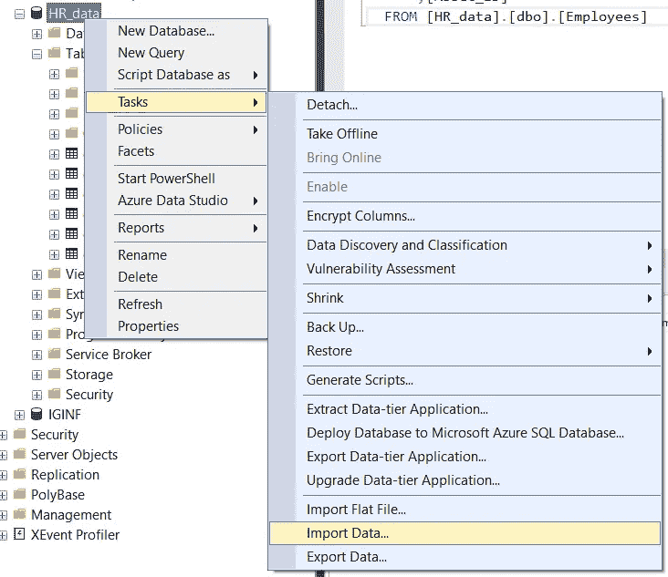

2.你会看到一个典型的微软向导窗口，让我们继续

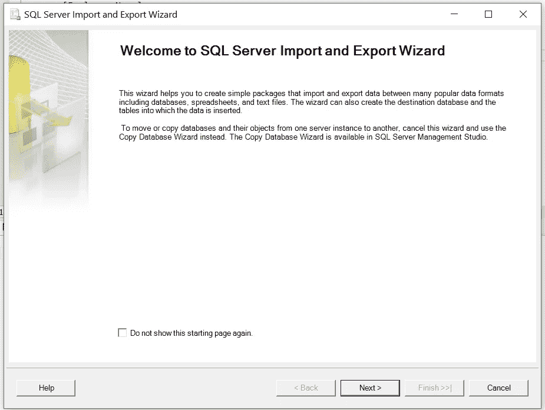

3.我们被要求选择复制数据的来源。在可用选项中，我们找到了 Microsoft Excel 和 SQL Server Native Client 11.0

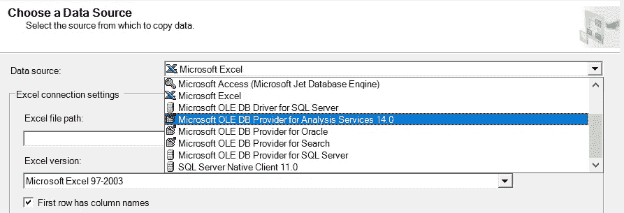

## SQL 数据库之间的导入/导出

要在 SQL 数据库或表之间导入，我们需要执行以下操作:

1.  我们的来源将是 SQL Server Native Client 11.0

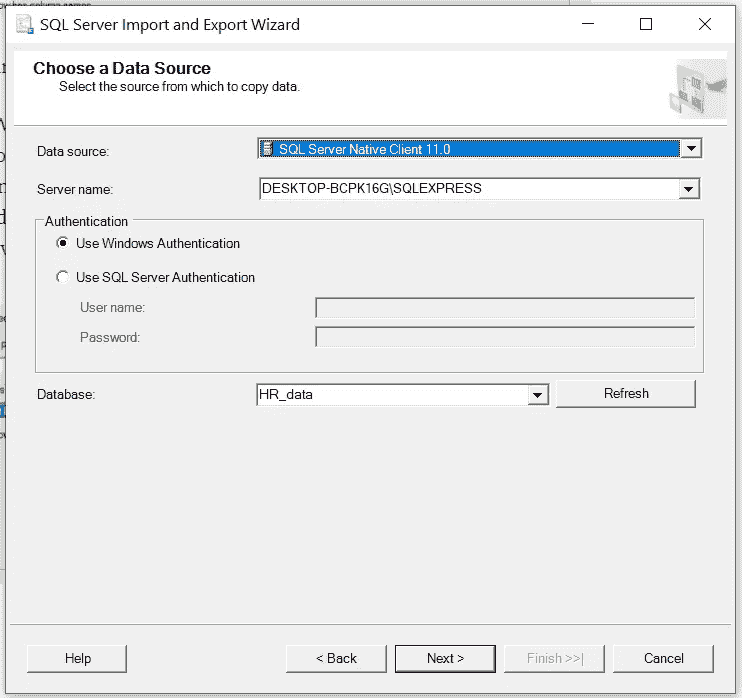

2.然后，我们选择将数据导出到哪里，并决定从一个或多个表或视图中复制数据

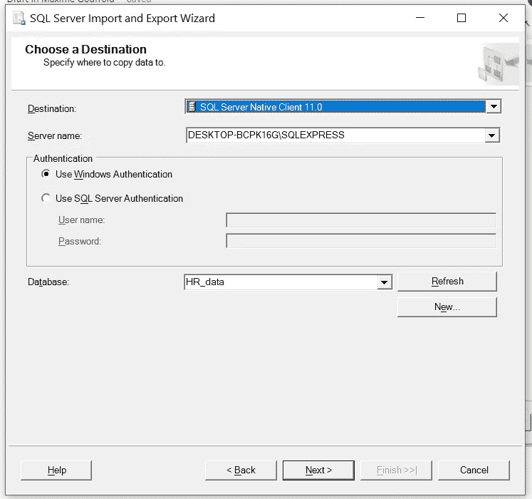

3.6.接下来，我们可以决定复制数据或编写查询来指定要传输的内容。我们会选择第一个选项。

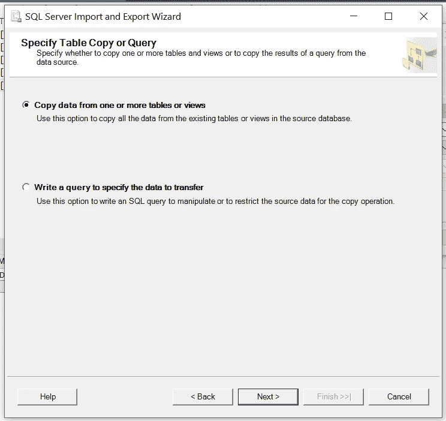

4.然后，向导让我们选择要复制的表，并定义名称或选择一个现有的表。在这个例子中，我们将“雇员”复制到的表将被命名为“雇员 _ 副本”。

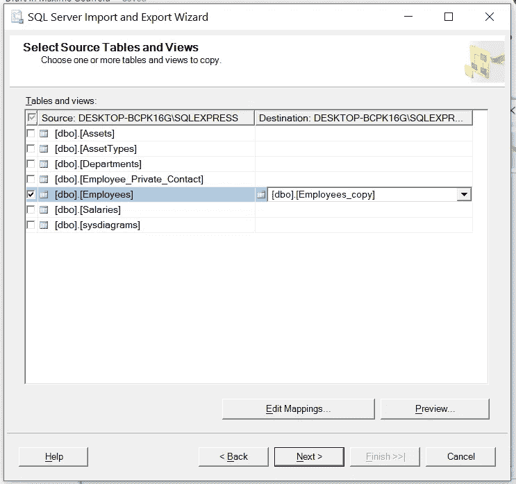

5.在编辑映射下，我们有几个选项。在我们的例子中，当我们创建一个新表时，Employees_copy 还不存在，一些选项是灰色的。如果我们要复制到一个现有的表，我们可以决定“删除目标表中的行”或“向目标表追加行”。

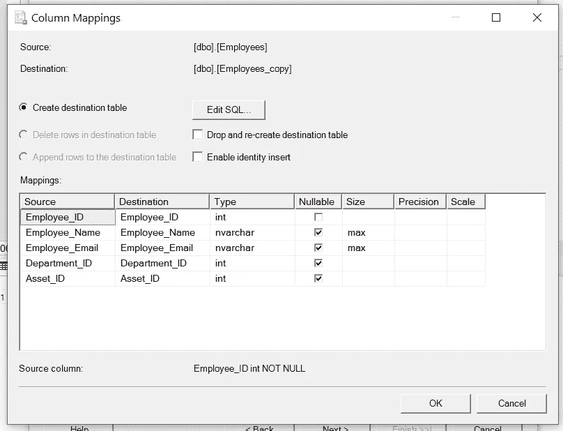

6.然后，我们可以决定立即运行包，并将包保存在 SQL Server 上或本地(文件系统)。我们会把它保存在本地。

7.我们可以定义名称和目标路径

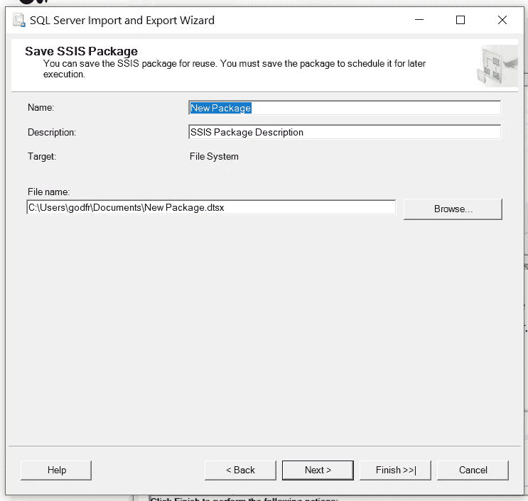

7.在下一页，SQL Studio 提供了一个摘要

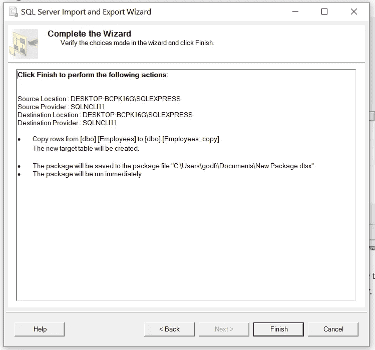

8.然后，流程运行并提供逐步反馈。

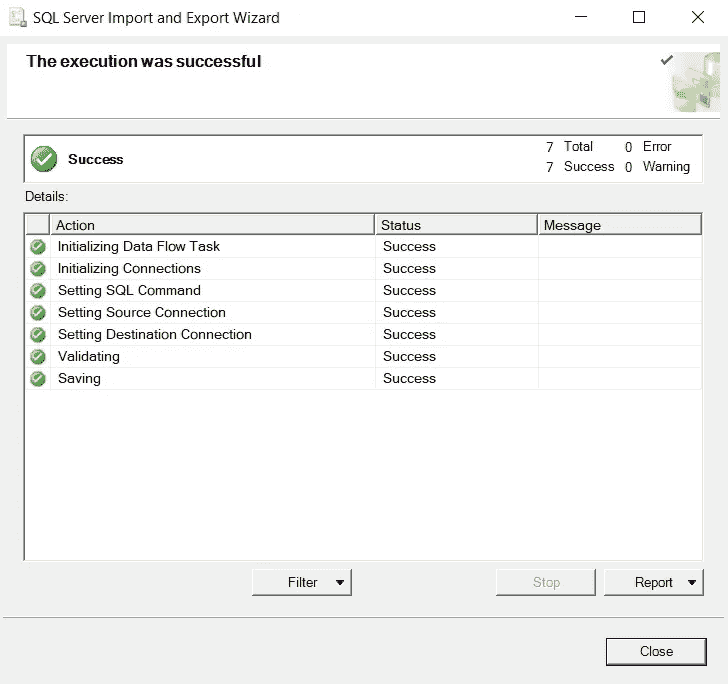

逐步流程和相关状态的示例(此处:Excel 到 SQL)

9.用户可以使用 Microsoft Visual Studio 或 NotePad++打开. dtsx 文件。该脚本详细说明了来源、目的地等。如果流程中的某个步骤发生了变化，而不是重新创建一个包，那么调整脚本是有意义的。

## 让我们用 Microsoft Excel 来介绍导入。

1.  重新启动该过程，右键单击数据库，然后选择任务>导入数据

2.选择 Microsoft excel，向导窗口会更新，并要求我们提供导入数据的 Excel 路径以及 Excel 版本。从经验来看，Excel 版本已经导致了一些意想不到的结果。如果您的导入无法正常工作，请尝试将扩展名更改为。xls 或者。xlsx，这有时会起作用。单击下一步。

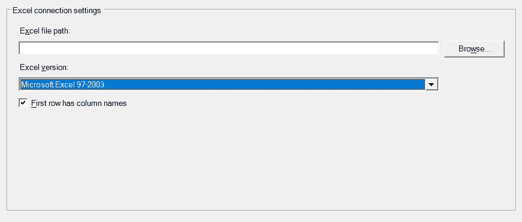

3.然后，我们可以选择将这些数据拷贝到哪里。我们选择 SQL Server Native Client 11.0。但是**不要点击“服务器名称”旁边的箭头。这个向导有一个特点，当你点击它时，它会冻结。它开始搜索实例，并且在提供任何东西时都很慢。让我们来看一个快速的技巧。**

4.在 SQL Studio 主窗口中，单击连接>数据库引擎

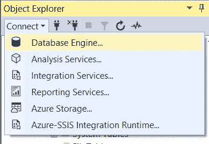

然后复制粘贴您的服务器实例的名称。

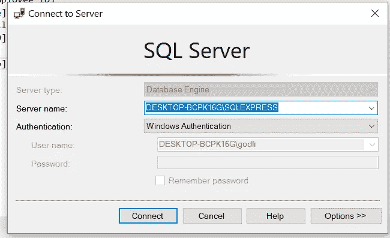

回到我们的向导窗口，让我们将其粘贴到“服务器名称”字段。就是这样，这花了 2-3 秒，而下拉列表会冻结…我从来没有发现，它太慢了。

5.下一步是挑选我们的数据库。为此，我们可以安全地单击下拉菜单，可用选项将来自我们上面的服务器名称。

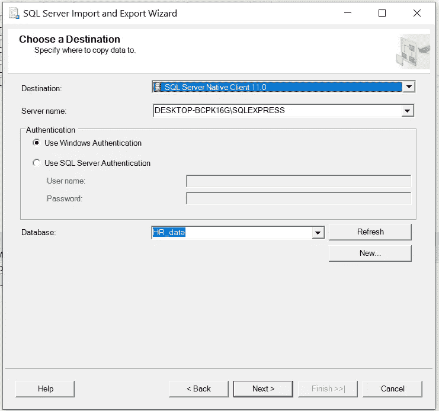

6.以下步骤与数据库到数据库拷贝的步骤相同。SQL 将 Excel 源文件视为一个数据库，其中的每一张表都是一个表。用户可以定义目标表的名称，从而创建一个表，或者选择一个现有的表。

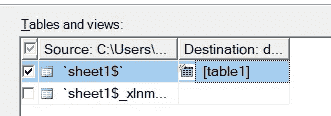

# 最后的话和接下来会发生什么

暂时就这样吧！我希望您现在对使用 SQL Server 更有信心，并且:

*   创建您自己的 SSIS 软件包，
*   使用 Excel 或其他数据库将数据从数据库中导出或导入到数据库中，

**接下来会发生什么？**在接下来的文章中，我们将结合 SSIS 包和作业调度的力量，来自动化一些 ETL 任务。

感谢您的阅读，请告诉我您的想法，或者是否有我应该涉及的话题。下次见！

# 编码快乐！

感谢阅读！喜欢这个故事吗？ [**加入媒介**](https://medium.com/@maximegodfroid/membership) 完整访问我的所有故事。

# 继续第七集的旅程！

了解如何将 SQL Server 连接到 Power BI，这是一款功能强大的可视化工具，也是通过创建您的第一批视觉效果首次介绍这款商业智能工具。

 [## 了解 SQL Server Management Studio —第 7 部分连接到 PowerBI 和 First Visuals

### 让你在派对上变得有趣的技巧——一步一步来

towardsdatascience.com](/learn-sql-server-management-studio-part-7-connect-to-powerbi-first-visuals-b13df9d78ccc)