# 如何将 SQL 连接到 PowerBI & First Visuals

> 原文：<https://towardsdatascience.com/learn-sql-server-management-studio-part-7-connect-to-powerbi-first-visuals-b13df9d78ccc?source=collection_archive---------33----------------------->

## 让你在派对上变得有趣的技巧——一步一步来

迈克尔·泽兹奇在 [Unsplash](https://unsplash.com?utm_source=medium&utm_medium=referral) 上的照片

# 在最后几集里…

你好。欢迎学习 SQL 和 SQL Server Studio 系列教程的第 7 部分。有一个简单的目标:让你熟悉和适应这个工具和语言。“这有什么关系？”我知道你在问。事实证明，好奇心和副业往往是被新项目选中甚至获得新工作的关键。事实上，您已经使用了一个重要的工具，比如 SQL Server Studio，并且编写了一些 SQL 查询，这将会给您一个清晰的开端。

如果您错过了关于如何设置我们的环境和本地服务器的第 1 集，请阅读本文:

</getting-started-with-sql-server-management-studio-part-1-step-by-step-setup-63428650a1e0>  

第二集将教你如何创建自己的数据库、表格，以及关于命名约定的重要注释:

</getting-started-with-sql-server-management-studio-5cd24bb1a87c>  

在第 3 集，我们介绍了 CRUD 操作以及主键和外键:

</learn-sql-server-management-studio-part-3-crud-operations-primary-foreign-keys-9d884b32ad70>  

在第 4 集，我们讨论了模式&主要的规范化步骤:

</learn-sql-server-management-studio-part-4-schemas-normalization-80bcd6a5258>  

在第 5 集，我们讨论了存储过程和调度，这是一个真正的野兽。我怎么强调这将如何促进和自动化你的日常(数据)生活都不为过。

</learn-sql-server-management-studio-part-5-stored-procedures-scheduling-88fd9788d314>  

在第 6 集，我们介绍了用于 ETL 的 SSIS 包，并回顾了在两个数据库之间以及数据库和 Excel 之间导入和导出数据。

</learn-sql-server-management-studio-part-6-ssis-packages-9438dbc90437>  

别忘了回来😉。

# 期待什么？

今天，我们将看看如何将数据连接到可视化工具。我们这次旅行的伙伴将是 PowerBI。在本教程结束时，您将有信心将数据库连接到 PowerBI，并开始构建可视化效果。让我们直接跳进来吧！

# 快速介绍

PowerBI 或 PBI 是一个可视化工具，或者在封闭的圈子里被称为 T2 商业智能工具。它是由微软创建的，这个工具已经存在了几年了。它在不断发展，不断添加新功能，并通过 [PBI 博客进行交流。](https://powerbi.microsoft.com/en-us/blog/)为什么这是好消息？有两个原因:

*   一个正在被积极开发的工具是一个紧跟当前趋势的工具(希望如此),并且是所有者承诺的标志，
*   它是微软 PowerPlatform 的一部分，该平台还包括 PowerAutomate 和 PowerApps 等工具。在一家顶级科技公司的支持下，PowerPlatform 似乎是一个重要的焦点，好消息是它不会很快消失。

**为什么要关心 PowerBI？**

*   在广泛使用所有这些工具后，他们为许多项目提供了流畅而强大的端到端体验。
*   PowerBI 也是一项受欢迎的技能，它带有常见的微软环境和界面。它背后有一个强大且不断发展的社区，可以在线回答问题。

# 入门指南

PowerBI 可以免费下载，尽管存在不同的定价方案来提供额外的功能。

## 要求

根据官方文档报告，运行 PowerBI Desktop 有以下最低要求:

*   自 2021 年 1 月 31 日起，Windows 7 不再支持 Power BI Desktop 需要 Windows 8.1 / Windows Server 2012 R2 版或更高版本
*   内存(RAM):至少 2 GB 可用，建议 4 GB 或更多。
*   显示器:至少需要 1440x900 或 1600x900 (16:9)的分辨率。不支持较低的分辨率，如 1024x768 或 1280x800，因为某些控制(如关闭启动屏幕)会超出这些分辨率。
*   Windows 显示设置:如果您将显示设置设置为将文本、应用程序和其他项目的大小更改为 100%以上，您可能看不到某些必须与之交互才能继续使用 Power BI Desktop 的对话。如果您遇到此问题，请转到“设置”>“系统”>“显示”,在 Windows 中检查您的显示设置，并使用滑块将显示设置恢复到 100%。
*   CPU:建议使用 1 千兆赫(GHz) 64 位(x64)处理器或更好的处理器。

## **导入数据**

在第 6 集，我们已经看到了如何导入数据。让我们用示例销售数据来做这件事。

1.  为此创建一个新的数据库 AW2019。为了做到这一点，作为一个提醒:右键单击您的服务器名称，然后创建一个数据库。
2.  从 MS AdventureWorks 下载[这个数据集](https://github.com/mcsime92/AW2019Data/blob/main/SalesQuotaAW.xlsx?raw=true)，它是一个专注于销售数据的子样本。
3.  在您的 SQL 环境中导入它。提醒一下，首先右击数据库>任务>导入> Excel
4.  给它一个名称，在我们的例子中，它将是[SalesQuota]。结果看起来像这样:

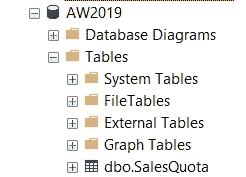

## 下载 PowerBI 并设置环境

1.  要下载 PowerBI，请访问

[https://powerbi.microsoft.com/en-us/downloads/](https://powerbi.microsoft.com/en-us/downloads/)并选择“下载”

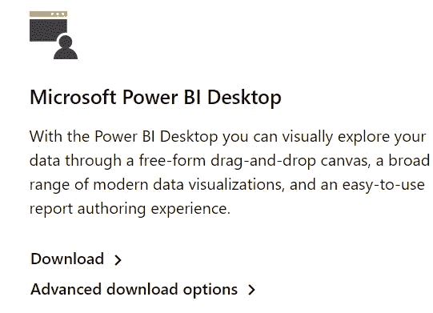

2.你被重定向到微软商店，在那里你可以下载该程序(我不清楚为什么会有这个额外的重定向，但我们不要开始咆哮😀)

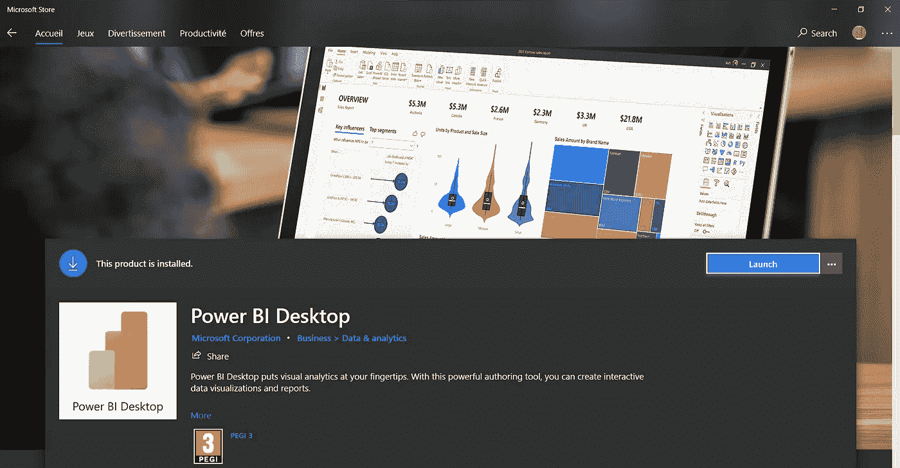

正如你从 3 PEGI 的标签上可以看出的，这是一个安全的地方。欢迎每个人都来玩 PowerBI —万岁！

3.让我们启动 PowerBI。顶部色带与其他 MS 产品相似。单击 SQL Server

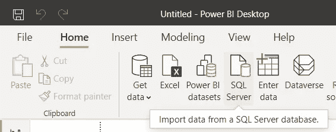

4.我们会看到一个新窗口，提示我们提供服务器名称

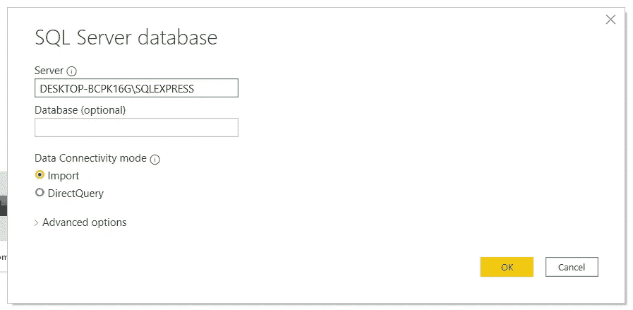

我们还有两种数据连接模式:Import 和 DirectQuery。有什么区别？

*   导入—将数据副本导入 Power BI 桌面环境。PBI 使用导入的数据进行任何创建或与数据的交互。
*   DirectQuery —没有数据导入或复制到 Power BI Desktop 中。对于每个可视化，Power BI 向数据源发送一个查询并返回结果。

**你应该用哪一个？视情况而定……我们来回顾一下优点和局限性。**

**优势**

*   DirectQuery 允许在非常大的数据集上创建可视化效果，这在常规导入中是不可能的，
*   更方便地处理数据更改。每当有更新的数据时，只需要刷新，而不是重新导入整个数据集。
*   1gb 数据集限制不适用于 DirectQuery。

**限制**

*   如果查询编辑器查询过于复杂，就会发生错误。建议的解决方案是删除该步骤或导入数据。微软文档还告诉我们没有像 SAP Business Warehouse 这样的多维数据源的查询编辑器。
*   Power BI 服务(即浏览器)不支持从具有 SSO 身份验证的数据源引用 DirectQuery 表的计算表和列。
*   DirectQuery 中不支持自动日期/时间，也就是说，DirectQuery 模式不支持日期列的处理(按年、季度、月或日向下钻取)。
*   云数据源有 100 万行的限制，本地数据源的有效负载限制为每行 4 MB(取决于专有的压缩算法)或整个视觉的 16MB 数据大小。使用高级容量时，可能会提高某些限制。该限制不影响用于创建使用 DirectQuery 返回的数据集的聚合或计算。它只影响返回的行。

在我们的例子中，我们将从一个简单的导入开始

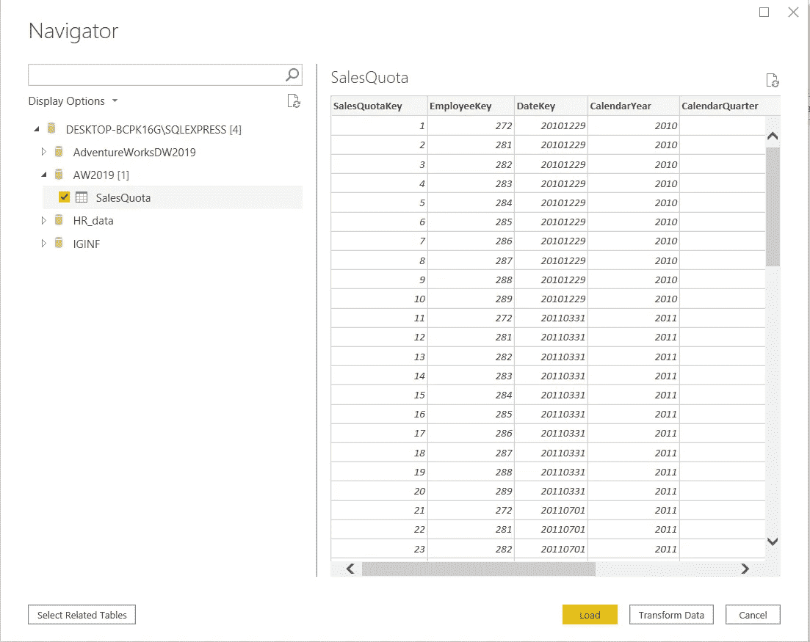

数据现在被导入到我们的环境中:

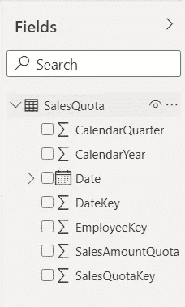

PowerBI 提供了四个主要面板，从左边开始:包含可视化效果的面板、过滤器、用于调整可视化效果参数的可视化窗格，以及数据集/字段

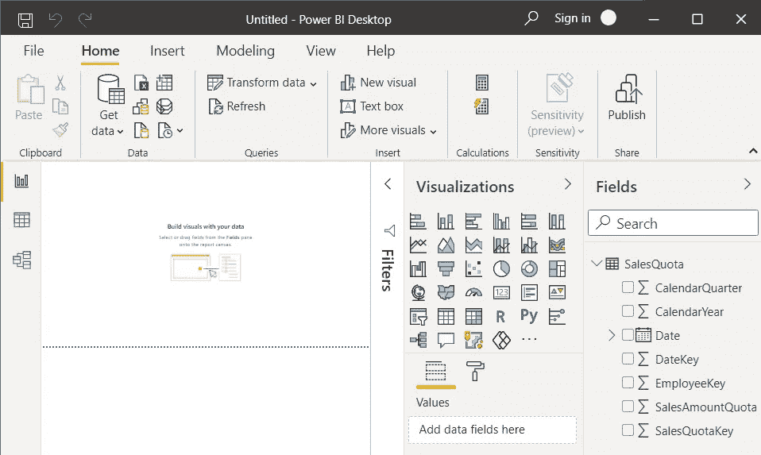

# 第一组图像

1.  我们首先选择 SalesAmountQuota，然后选择 Employee Key。EmployeeKey 是对个人的引用。
2.  PowerBI 将这些数据变成了现实，选择了集群柱形图。

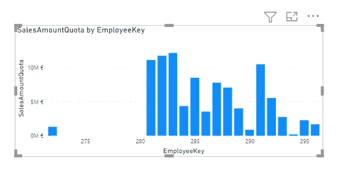

通过选择它,“可视化”窗格会在“值”下显示 SalesAmountQuota，在“轴”下显示 EmployeeKey。

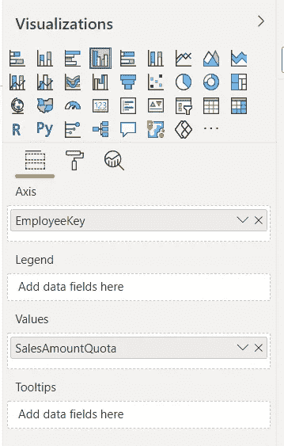

3.好的开始，但是让我们重新安排一下…员工键被认为是连续的，这解释了我们视觉中的空白。但是我们的员工数据是绝对的。让我们调整一下。在可视化下，转到 x 轴，然后交换分类。

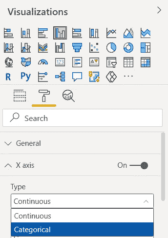

我们的图像更新了。看起来已经好多了。

为了澄清这一点，我们将再次使用 EmployeeKey 添加一个图例。将其拖放到图例字段。

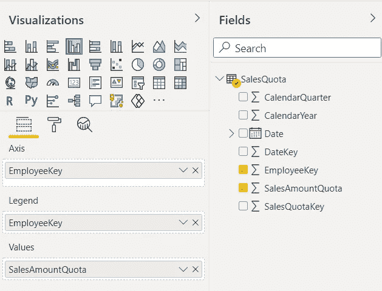

我们得到:

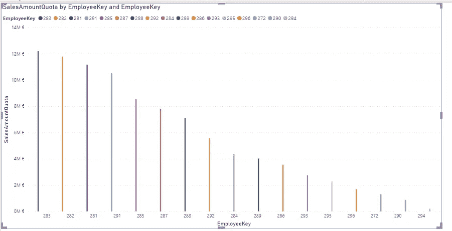

很好。这可能是保存我们仪表板的好时机。

4.最后，我们将重点关注前 5 名卖家。为此，在“筛选器”下，对于 EmployeeKey，我们将选择筛选器类型“前 N 名”，将其设置为 5，并精确地将其设置为 SalesAmountQuota。然后，我们按下应用过滤器。

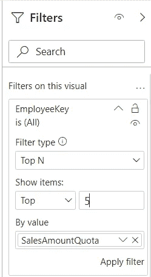

我们看到了前五名的销售情况。显然还有很多可以做的来增强这个图表，但是我们有第一个。

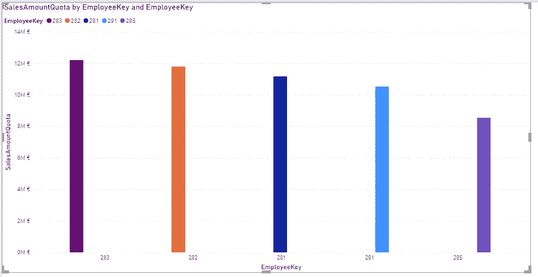

5.现在，让我们为公司和我们的前三名销售人员总结一些销售趋势。我们从折线图开始，将 CalendarYear 设置为轴，将 SalesAmountQuota 设置为值。很简单。我们的销售停滞不前，甚至略有下降。我们的畅销书表现如何？

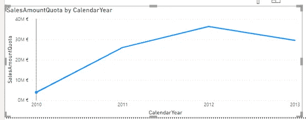

6.选择视觉效果，复制并粘贴它，然后将它移到一边。我们将选出过去 3 年的前 3 名销售人员。

7.使用我们的上述视觉新副本，我们将添加一个图例。随着时间的推移，我们的销售突然出现了明显的分化。我们现在需要

*   选择我们的前 3 名员工

如前所示，除了我们限制为 3 个而不是 5 个。

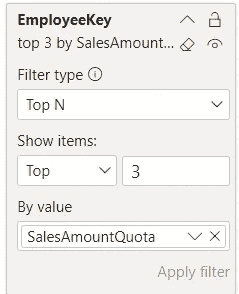

*   定义 3 年时间窗口

我们将设置 CalendarYear 过滤器来关注 2011 年及以后发生的事情。

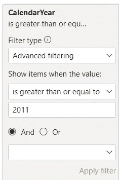

这是我们的结果:

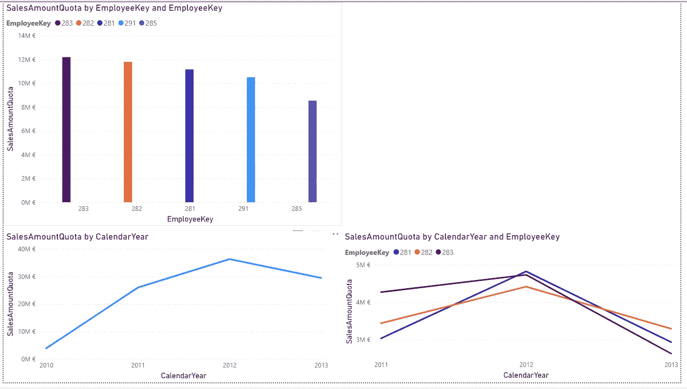

这仍然很粗糙，但是一个好的开始。

# 一个教训的旁注

关于所学课程的一个简短的题外话。当我最近查看我的任务管理器时，我决定终止一个与 SQL 相关的进程。当时我没有使用这个程序，想清空一些内存。所以我摆脱了:

这是一个错误的举动。那天晚些时候，当我试图启动 PowerBI 并连接到服务器时，我就是做不到。我在 SQL Studio 和 PowerBI 上都一直收到这个错误消息。

> 找不到服务器或服务器不可访问。SQL 网络接口，错误 26 —定位指定的服务器/实例时出错

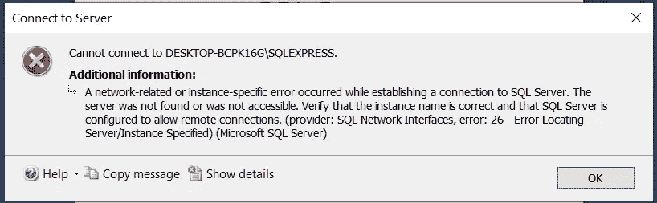

## 如何解决错误-26 SQL 网络接口

我们需要的是重新启动正确的 SQL 服务。

1.  打开 Windows 菜单并键入服务

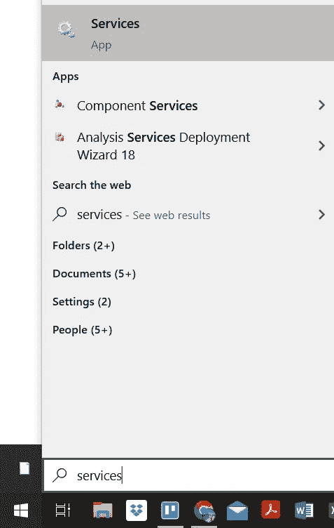

2.在新窗口中，查找 SQL Server (SQL Express)

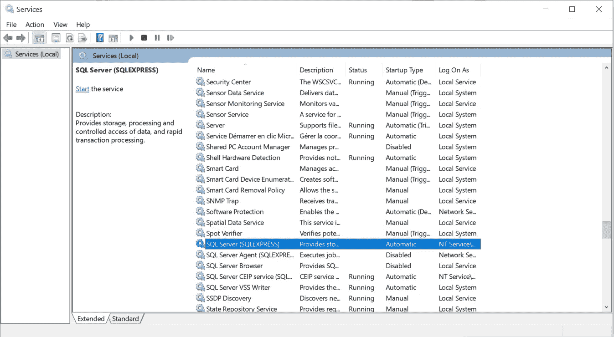

3.点击绿色箭头“开始服务”。

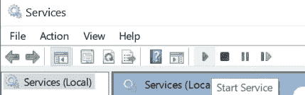

4.Windows 将启动该服务并显示它正在运行

5.让我们再次尝试连接到服务器…它现在工作了🎈。

# 最后的话和接下来会发生什么

暂时就这样吧！我希望您现在对使用 SQL Server 更有信心，并且:

*   将 SQL Studio 连接到 Power BI，
*   理解处理数据的两个选项:导入数据或使用 DirectQuery，
*   创造你的第一个视觉效果，

感谢您的阅读，请告诉我您的想法，或者是否有我应该涉及的话题。下次见！

## 编码快乐！

感谢阅读！喜欢这个故事吗？ [**加入媒介**](https://medium.com/@maximegodfroid/membership) 可完整访问我的所有故事。

# 继续第八集的旅程！

了解如何利用 SQL 视图。这是一个非常简单而强大的工具。在本教程结束时，您将会感到有能力利用视图的力量。

</learn-sql-server-management-studio-part-8-leverage-the-views-206fbcef3957>  

# 资源

1.  [https://docs . Microsoft . com/en-us/power-bi/fundamentals/desktop-get-the-desktop](https://docs.microsoft.com/en-us/power-bi/fundamentals/desktop-get-the-desktop)
2.  [https://docs . Microsoft . com/en-us/power-bi/connect-data/desktop-use-direct query](https://docs.microsoft.com/en-us/power-bi/connect-data/desktop-use-directquery)