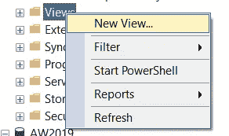
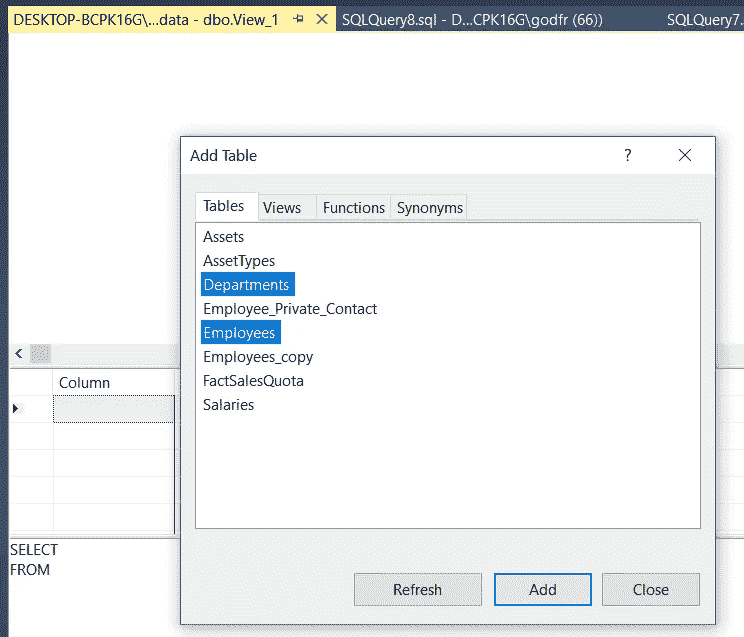
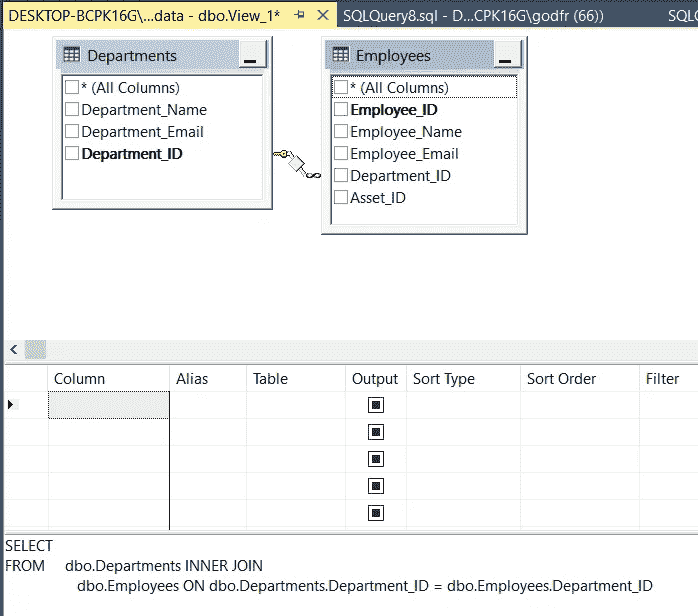
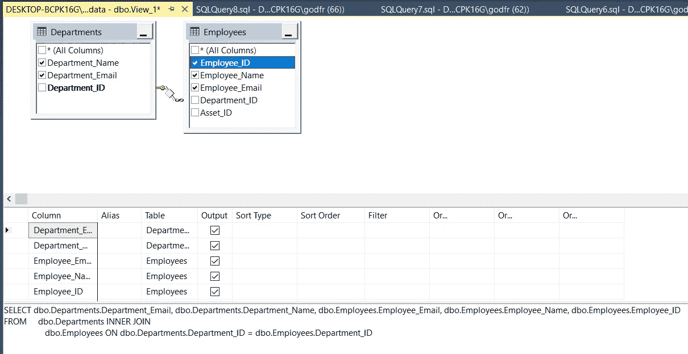
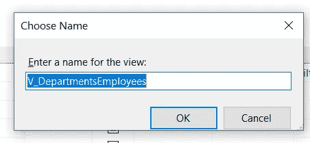
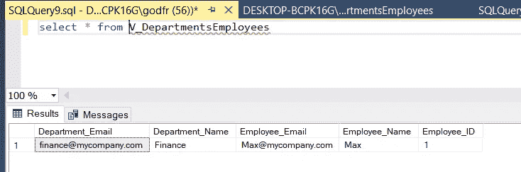
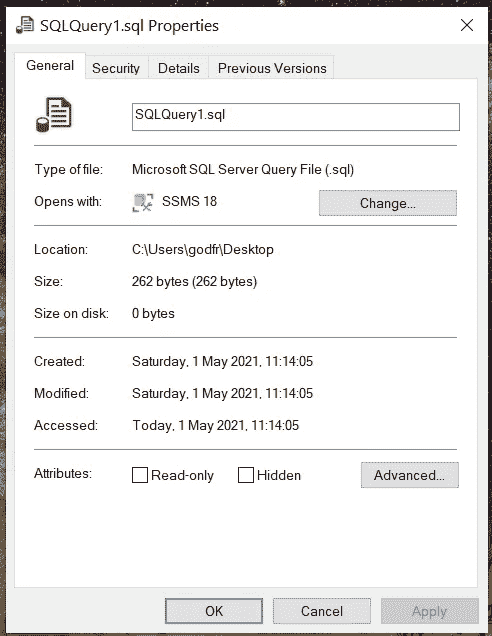
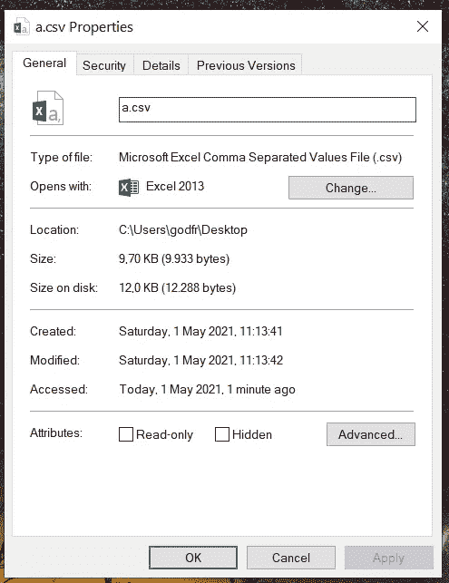
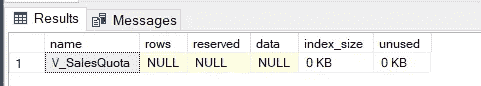

# 了解 SQL Server Management Studio —第 8 部分利用视图

> 原文：<https://towardsdatascience.com/learn-sql-server-management-studio-part-8-leverage-the-views-206fbcef3957?source=collection_archive---------18----------------------->

## 让你在派对上开心的技能！循序渐进。


迈克尔·泽兹奇在 [Unsplash](https://unsplash.com?utm_source=medium&utm_medium=referral) 上的照片

# 在最后几集里…

你好。欢迎来到 SQL 和 SQL Server Studio 系列教程的第 8 期。有一个简单的目标:让你熟悉和适应这个工具和语言。“这有什么关系？”我知道你在问。事实证明，好奇心和副业往往是被新项目选中的关键，甚至是获得新工作的关键。事实上，您已经使用了一个重要的工具，比如 SQL Server Studio，并且编写了一些 SQL 查询，这将会给您一个清晰的开端。

*   **在第 1 集**中，我将向您展示**如何设置我们的环境和本地服务器** — [第 1 部分逐步设置 SQL Server Studio](/getting-started-with-sql-server-management-studio-part-1-step-by-step-setup-63428650a1e0)
*   **在第 2 集**中，我们将讲述**如何创建自己的数据库、表**、**和**关于**命名约定的重要注释—** 、[第二部分数据库、表&命名约定](/getting-started-with-sql-server-management-studio-5cd24bb1a87c)
*   **在第三集**中，我们介绍了 **CRUD 操作**和**主键和外键** — [第三部分 CRUD 操作，主键&外键](/learn-sql-server-management-studio-part-3-crud-operations-primary-foreign-keys-9d884b32ad70)
*   **在第 4 集**中，我们讨论了**模式&的主要规范化步骤** — [第 4 部分模式&规范化](/learn-sql-server-management-studio-part-4-schemas-normalization-80bcd6a5258)
*   **在第 5 集**中，我们覆盖了**存储过程&调度**，这是一个真正的野兽。我怎么强调这将如何促进和自动化你的日常(数据)生活都不为过。[第五部分存储过程&调度](/learn-sql-server-management-studio-part-5-stored-procedures-scheduling-88fd9788d314)
*   **在第 6 集**中，我们介绍了用于 ETL 的 **SSIS 包，并回顾了如何在两个数据库之间以及一个数据库与 Excel 之间导入和导出数据。[第六部 SSIS 套餐简介](/learn-sql-server-management-studio-part-6-ssis-packages-9438dbc90437)**
*   在第 7 集中，我们**将 SQL Studio 连接到 PowerBI** 并构建我们的第一个视觉效果。[第 7 部分连接到 PowerBI &第一视觉效果](http://part%207%20connect%20to%20powerbi%20%26%20first%20visuals/)。

别忘了回来😉。

# 期待什么？

直到第 7 集，我们有一个线性的渐进的学习曲线。它从 SQL Studio 的设置开始，然后我们继续创建数据库、CRUD 操作、对话模式、SSIS 包、调度和自动化以及连接到 PowerBI。现在我们有了一个坚实的基础，让我们看看另一个有趣的特性，视图。这是一个非常简单而强大的工具。在本教程结束时，您将会感到有能力利用视图的力量。让我们直接跳进来吧！

# 什么是 SQL 视图？

视图是存储在我们环境中的 SQL 查询。由于视图是一个 SQL 查询… * *drumrolls* *…它可以被查询。让我们看一个假设的例子:

假设您有一组表，并构建一个复杂的连接。留着以后用不是很好吗？我希望你会同意。虽然我们可以将这个连接的结果保存为一个新表，但这可能不是最佳方法。为什么不呢？

*   **维护新表** —需要维护连接产生的新表，以保持相关性。当然，我们可以在重新创建新表之前，通过调度一个作业来删除或截断新表。但是这对服务器来说是更多的工作。
*   **空间是稀缺的，存储是黄金** —作为连接结果的新表的创建也意味着存储现在将被该表占用。应该没问题吧？嗯，如果只是一次性的事情，那也没什么，虽然在野外，没有这样的事情，而且事情可能会很快升级。在一个月或六个月内，您可能会从类似的连接操作中得到 10 个以上的表。所有这些空间现在都已被占用，需要保持更新。

相反，如果我们能够利用观点的力量，我们就可以摆脱上述担忧。为什么？

*   视图只是一个查询。每当更新底层表时，查询视图会自动为我们提供新数据。也就是说，视图提供一致的数据。
*   一个视图本质上是轻量级的，因为它只有几行代码。也就是说，它们是高效的。

# 如何构建视图

假设您已经安装并启动了 SQL Studio。

1.  在数据库结构中，指向“表”下的“视图”。
2.  右键单击并选择“新建视图”



3.新窗口显示了视图环境，其中有一个弹出窗口提供表的初始选择。这些是我们在前几集创建的表。



4.在这个例子中，我们将重点构建一个视图来收集包含部门和雇员的表。选择两者，然后添加，然后关闭。

5.因为那些表有主键和外键，我们在[第 3 部分](/learn-sql-server-management-studio-part-3-crud-operations-primary-foreign-keys-9d884b32ad70)中讨论过，我们可以使用这些关系将它们匹配在一起。



6.然后，我们可以从表中手工选择感兴趣的列，下面的查询会自动更新。



该查询使用两个表中的 Department_ID 作为匹配键来构建内部连接。

7.然后我们可以保存视图，并给它一个有意义的名字。下面是一个简短的题外话。

## 如何命名视图

如果您将 SQL Server 连接到另一个系统，该系统可以显示您存储的所有基础表、视图和存储过程，清楚地区分表和视图的命名约定可能会很有用。一种方法是以大写的 V 开始命名所有的视图，后面跟着一个下划线 _。如果您需要一个视图来匹配用户和他们的购买，我们可以使用 V_userspurchases，它与表 Users 和 Purchases 明显不同。

我们将选择 V _ DepartmentsEmployees 员工。



8.接下来，让我们通过查询视图来检查它的外观。

```
select * from V_DepartmentsEmployees
```



这将返回一个表，这是我们的视图的结果，它连接了两个表。如前所述，这个视图是轻量级的，让我们来看看到底有多轻。

# 视图与表格比较

我们之前讨论过，视图的优势在于只是查询，并不存储数据*本身*。下面是我们的数据表和 SQL 脚本的大小之间的一个快速的&比较。对于这个例子，表的大小是 7 行 x 163 列。该查询是一行代码:

```
select * from v_SalesQuota
```

在我们的快速和脏比较之后的 SQL 查询重约 262 字节。



现在对于底层数据(7 行 x 163 列，没有空值也没有空白)，导出为。CSV，我们的快速和肮脏的方法显示约 9933 字节。



我们可以采用另一种方法，找出 SQL Server 中某个元素占用的空间。为此:

1.  通过 CTRL+N 打开一个新的查询窗口
2.  键入以下命令

```
sp_spaceused '[TableName]'
```

这将返回关于我们的表的一些信息:


我们可以对我们的视图做同样的事情:

```
sp_spaceused '[AW2019].[dbo].[v_SalesQuota]'
```



正如我们所见，视图不是表，它不包含任何数据，它只是一段轻量级代码。

# 最后的话和接下来会发生什么

暂时就这样吧！我希望您现在对在 SQL Server 中创建和利用视图更有信心了。

*   视图是轻量级的，它们是存储在 SQL Server 上的查询，可以被查询。因此，它们不保存任何数据。
*   与通过连接创建表相比，它们是更好的选择，
*   它们不需要像连接产生的表那样被“维护”。无论何时查询，视图都会从基础表中提取数据。请注意，如果基础表发生变化，视图使用的列被删除，视图将会中断。

下一步是什么？我们将讨论临时表的主题。

感谢您的阅读，请告诉我您的想法，或者是否有我应该涉及的话题。下次见！

# 编码快乐！

感谢阅读！喜欢这个故事吗？ [**加入媒介**](https://medium.com/@maximegodfroid/membership) 获取完整的我的所有故事。