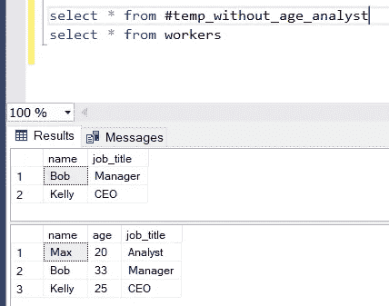

# 了解 SQL Server Management Studio —第 9 部分临时表

> 原文：<https://towardsdatascience.com/learn-sql-server-management-studio-part-9-temporary-tables-f69aee616833?source=collection_archive---------18----------------------->

## 让你在派对上开心的技能！循序渐进。


迈克尔·泽兹奇在 [Unsplash](https://unsplash.com?utm_source=medium&utm_medium=referral) 上的照片

# 在最后几集里…

你好。欢迎学习 SQL 和 SQL Server Studio 系列教程的第 9 部分。有一个简单的目标:让你熟悉和适应这个工具和语言。“这有什么关系？”我知道你在问。事实证明，好奇心和副业往往是被新项目选中甚至获得新工作的关键。事实上，您已经使用了一个重要的工具，比如 SQL Server Studio，并且编写了一些 SQL 查询，这将会给您一个清晰的开端。

*   **在第 1 集**中，我将向您展示**如何设置我们的环境和本地服务器** — [第 1 部分逐步设置 SQL Server Studio](/getting-started-with-sql-server-management-studio-part-1-step-by-step-setup-63428650a1e0)
*   **在第 2 集**中，我们将讲述**如何创建自己的数据库、表**、**和**关于**命名约定的重要注释—** 、[第二部分数据库、表&命名约定](/getting-started-with-sql-server-management-studio-5cd24bb1a87c)
*   **在第三集**中，我们介绍了 **CRUD 操作**和**主键和外键** — [第三部分 CRUD 操作，主键&外键](/learn-sql-server-management-studio-part-3-crud-operations-primary-foreign-keys-9d884b32ad70)
*   **在第 4 集**中，我们讨论了**模式&的主要规范化步骤** — [第 4 部分模式&规范化](/learn-sql-server-management-studio-part-4-schemas-normalization-80bcd6a5258)
*   **在第 5 集**中，我们覆盖了**存储过程&调度**，这是一个真正的野兽。我怎么强调这将如何促进和自动化你的日常(数据)生活都不为过。[第五部分存储过程&调度](/learn-sql-server-management-studio-part-5-stored-procedures-scheduling-88fd9788d314)
*   **在第 6 集**中，我们介绍了用于 ETL 的 **SSIS 包，并回顾了如何在两个数据库之间以及一个数据库与 Excel 之间导入和导出数据。[第六部 SSIS 套餐简介](/learn-sql-server-management-studio-part-6-ssis-packages-9438dbc90437)**
*   在第 7 集中，我们**将 SQL Studio 连接到 PowerBI** 并构建我们的第一个视觉效果。[第 7 部分连接到 PowerBI &第一视觉效果](http://part%207%20connect%20to%20powerbi%20%26%20first%20visuals/)。
*   **在第 8 集**中，我们**利用 SQL 视图**的强大功能，这是一个简单的轻量级工具，用于组合和检索复杂的表。你不会相信没有他们你怎么活下去。[第 8 部分利用观点](/learn-sql-server-management-studio-part-8-leverage-the-views-206fbcef3957)

别忘了回来😉。

# 期待什么？

在建立了坚实的基础直到第 6 集之后，我们转而连接到 PowerBI，然后最近发现了视图。现在我们将介绍和使用临时表。至于视图，这是一个非常简单，但是非常强大的工具。它允许您即时检查您的结果，或临时保存数据以供以后在程序中使用。在本教程结束时，您会觉得有能力利用临时表的力量。让我们直接跳进来吧！

# 介绍

临时表，酷孩子们称之为' *temp tables* '，正如他们的绰号所暗示的，是只暂时存在于数据库服务器上的表。这种表只是暂时存储常规表中的数据。

当需要使用大型表时，临时表非常方便，但只需要其中的记录或列的子集。当您发现自己需要反复使用同一个子集时，您可以构建一个临时表来存储相关的数据子集并加以利用，而不是进行过滤。临时表驻留在系统数据库 *tempdb* 中。

临时表可以是本地的，也可以是全局的。临时表是局部的还是全局的将影响它的寿命。正如微软所说:

*   *本地临时表仅对用户的当前连接可见，当用户断开与 SQL Server 实例的连接时，它们将被删除。*
*   *全局临时表在创建后对任何用户都是可见的，当引用该表的所有用户从 SQL Server 实例断开连接时，它们将被删除。*

一旦创建了临时表，就可以对它执行查询。事不宜迟，让我们看看如何建立一个临时表。

# 创建临时表

我们假设您的 SQL Studio 环境已经启动并正在运行。如果您需要帮助，这里有一个分步指南:[第 1 部分 SQL Server Studio 的分步安装](/getting-started-with-sql-server-management-studio-part-1-step-by-step-setup-63428650a1e0)

1.  让我们创建一个简单的表

```
CREATE TABLE workers(name VARCHAR(50),age INT,job_title VARCHAR(50))INSERT INTO workersVALUES ('Max', 20, 'Analyst'),('Bob', 33, 'Manager'),('Kelly', 25, 'CEO');
```

我们创建具有三个属性(姓名-年龄-职位)的表 *workers，*，并为 Max、Bob & Kelly 插入三个条目。让我们运行它(F5 或绿色箭头)，查询运行成功。


现在让我们验证我们的表的状态:

```
select * from workers
```


一切都好！

2.现在这张桌子又短又甜。但是想象一下它有 100，000 行和 50 列。这可能发生在野外。如果您要编写一个过程或任何查询来处理这个问题，可能会很麻烦。让我们用它做一个临时表格。

在我们的例子中，我们将决定排除年龄列和“分析师”职位的子集。

3.让我们从简单的开始，从我们的查询中排除年龄列:

```
select name, job_titlefrom workers
```

这给了我们:


4.现在，我们将过滤掉“分析师”的职称

```
select name, job_titlefrom workerswhere job_title not like '%Analyst%'
```

这给了我们:


5.所有这些小步骤都完成了，现在让我们将这个结果保存在一个**本地**临时表中。

```
select name, job_titleinto #temp_without_age_analystfrom workerswhere job_title not like '%Analyst%'
```

我们成功运行了查询:


就语法而言，临时表和常规表之间到底有什么区别？关键是数字标签，或者 hash #(我个人总是走一条错误的捷径，把它们叫做 *hashtags* ，我的错)。这告诉 SQL server 该表将是临时的。

6.我们现在将查询这个临时表来检查它的外观。当输入时，自动补全已经提供了线索，表明它是一个临时表。


查询结果显示了我们想要的表，没有年龄，过滤掉了“分析师”职务。


还有我们原来的*工*表怎么了？希望它没有受伤。让我们检查一下。



它很安全&完好无损🎉。

如前所述，这个临时表是短暂的，它只在查询窗口内存在短暂而有意义的生命。检查它的一种方法是打开一个新的查询窗口(CTRL+N)并查询那个临时表。


## 全局临时表

要构建一个全局临时表，需要使用两个散列而不是一个，即##而不是#:

```
select name, job_titleinto ##temp_without_age_analystfrom workerswhere job_title not like '%Analyst%'
```

成功运行查询后，让我们检查表是否在当前窗口之外:


在全局临时表的情况下，我们看到它在查询窗口之外仍然存在。我还断开-重新连接到 SQL server，它似乎也活了下来。关闭 SQL Studio，然后重新启动它，导致了全局临时表的消失。但是显然有一个更好的方法，就像你可以删除一个表，你可以删除一个临时表。

## 删除临时表

1.  让我们在下面输入:

```
IF OBJECT_ID(N'tempdb..#temp_without_age_analyst') IS NOT NULLDROP TABLE #temp_without_age_analyst
```

2.现在，让我们查询临时表#temp_without_age_analyst 以进行验证

```
select * from #temp_without_age_analyst
```


它不见了，我们成功了！

# 最后的话和接下来会发生什么

暂时就这样吧！我希望您现在更有信心在 SQL Server 中创建和利用临时表，无论它们是本地的还是全局的。

*   临时表是创建数据子集的简单而灵活的工具，
*   它们可以是本地的或全局的，
*   他们的生命短暂，
*   然而，一个好的经验法则是，一旦你完成了，就把它们扔掉。

感谢您的阅读，请告诉我您的想法，或者是否有我应该涉及的话题。下次见！

# 编码快乐！

感谢阅读！喜欢这个故事吗？ [**加入媒介**](https://medium.com/@maximegodfroid/membership) 可完整访问我的所有故事。

# 参考

1.  [https://docs . Microsoft . com/en-us/previous-versions/SQL/SQL-server-2008-R2/ms 177399(v = SQL . 105)？redirectedfrom=MSDN](https://docs.microsoft.com/en-us/previous-versions/sql/sql-server-2008-r2/ms177399(v=sql.105)?redirectedfrom=MSDN)