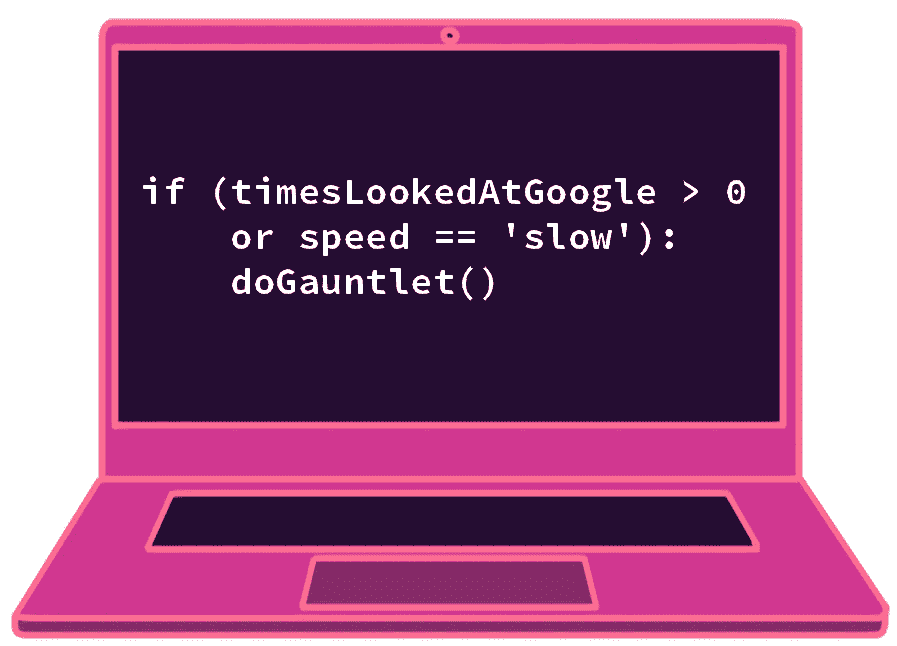

# 通过手套快速学习编码，无需参考

> 原文：<https://towardsdatascience.com/learn-to-code-quickly-and-without-reference-through-gauntlets-3a32f79bf7db?source=collection_archive---------32----------------------->

## 你需要知道的 10 件事，用 Python 和 R

作者图片

## 两个书呆子的故事

想象两个数据科学家。你给他们每个人一个数据集，给他们一个问题。第一个人听你说，做笔记，并说他们会“继续做这件事，回头再和你联系”。

第二位数据科学家拿出他们的笔记本电脑，坐在你旁边(或分享他们的屏幕)，说“让我们现在就解决这个问题”。只要你们两个能尽快地交流想法，他们就能实时编码并绘制出结果。20 分钟内，你就有了答案、图表和对数据的新理解。

你想和哪个书呆子一起工作？你想雇佣哪个书呆子？你想让哪个书呆子*成为*？

## 为什么学习如何在没有参考的情况下快速编码很重要。

你为什么要学习如何快速编码？因为速度往往胜过质量。现在有一个像样的答案通常比下周有一个很好的答案要好。

速度也需要一定水平的能力。在谷歌上搜索“如何在 Pandas 中选择一列”的每一行代码后停下来，是打断你思路的一个绝妙方法。如果您可以立即将您的想法转化为代码，您就可以快速迭代并开发解决问题的更好方法。

当然，你也可以很容易地写出快速、糟糕的代码，产生不准确的结果。但是让我们现实一点，如果你要失败，最好也快点！更快的失败意味着你有更多的时间去成功！

事实上，失败正是导致人们害怕在他人面前编码的原因。我们都讨厌我们的同行看到我们的缺点，我们手指上的代码看起来像是你的想法的小代表。如果代码失败了，感觉就像是我们智慧的失败。

我来这里是为了宣传让你尽快从自我中解脱出来，在其他人面前编码的想法。你的代码不是你。就像你现在正在阅读的文字一样，你的代码只是屏幕上的文字。我有一个大秘密要和你分享！数据科学的编码很容易。

## 数据科学的编码很简单

嘘…

无论你做什么，不要让人力资源部的人知道我们的秘密！目前数据科学的薪水很高，我不想破坏大家的兴致。

但是，数据科学的编码真的没有那么难。

是不是神经网络或者支持向量机模型某某只是做复杂了？当然可以。但是有时实际的模型只有 3-10 行代码。让我们不要忘记模型上面的 700 行代码！这是以原始格式获取数据，然后进行清理、编码、组合、聚合等操作的代码。

这是数据科学中 99%的工作。每花一分钟建立一个模型并感觉自己很聪明，你就有两个小时的时间来获取丑陋的数据并将其转化为稍微不那么丑陋的数据。

## 那么我们需要知道的 10 件事是什么呢？

这 10 件事会帮你度过大多数情况。即使是看起来非常复杂的数据科学脚本，通常也可以通过以下项目的组合来实现:

*   基本选择(选择和重命名列，不同)
*   过滤数据
*   用运算符(and、or 等)过滤。)或通过其他方式(顶、头等。)
*   通过串联(如名字+姓氏)和聚合(如价格*数量)来组合列
*   连接和追加数据
*   汇总数据(总和、平均值、中间值、标准偏差等。)
*   分组和聚合数据
*   在不同的分组级别聚合(例如，解组或窗口类型功能)
*   if 语句在数据中设置标志或布尔值
*   制作一些简单的图表(条形图、折线图、散点图)

没有谷歌，你如何快速学会做这 10 件事？

## 解决方案:手套！

护手是我多年来一直在做的小练习，现在我将与你分享它们。下面是它们的工作原理。

您从您选择的编程语言/ IDE 开始，有一个类似如下的空白模板:

这个模板涵盖了我之前列出的 10 件事情中的大部分。你需要做的就是:

*   引入数据集，我们将使用来自 R 的免费和流行的 MPG 数据集(对于 Python 和 R 模板)
*   就在模板中每个注释行的下面，凭记忆试一试。试着一路穿过铁手套。
*   如果你能想出一个，看一看你的语言的填充模板。然后输入它。

就是这样。

周一到周五，当你第一次开始工作的时候，你就这样做。你在查看邮件或参加会议之前做这件事。

第一次做这些的时候，你可能需要查看每个部分的填写模板，这就可以了！但我向你保证，两周内你会记住每一部分。如果你能凭记忆做这 10 件事，那么你可以把它们结合起来做任何事。

## 代码

这里是用 python 和 r 填写的模板。对于 Python，您需要在这里下载 mpg 数据集[。对于 R，数据集内置在 Tidyverse 包中，所以不需要下载它。](https://github.com/KendonDarlington/GauntletDataset/blob/main/mpg.csv)

**Python 代码**

**R 代码**

## 包装它

不要让我的挑战模板阻碍你！一旦你确定了这 10 件事，你就可以继续扩大你每天要做的事情的清单。

即使你不是为数据科学编程，而是做传统编程，你也可以设计类似的手套。我可以很容易地想象出任何一个程序员在学习一门新语言时可能想要添加的东西。一些例子:

*   运算符-与、或、等于、赋值、迭代
*   循环- for，while，do while
*   开关
*   功能
*   类——创建一个类，覆盖参数，获取/设置实例中的值，等等。
*   基本递归(调用自身的函数)

祝你在挑战中幸存！顺便说一句，你知道你可以为一篇文章点击 50 次鼓掌按钮吗？说到你手指的护手！！