# 从头开始学习实现编辑距离

> 原文：<https://towardsdatascience.com/learn-to-implement-edit-distance-from-scratch-7a6f34412d07?source=collection_archive---------13----------------------->


[简·侯伯](https://unsplash.com/@jan_huber?utm_source=medium&utm_medium=referral)在 [Unsplash](https://unsplash.com?utm_source=medium&utm_medium=referral) 上的照片

我最近在 Coursera 上完成了 **deeplearning.ai** 的**使用概率模型进行自然语言处理的课程。本课程涵盖了广泛的主题，包括*拼写纠正*、*词性标注*、*语言建模*和*单词到向量*。所有主题都进行了深入探讨，并附有详细的实践练习。**

但是，我们都知道，如果我们不练习所学的概念，我们肯定会很快忘记它们。因此，我想到写这篇博客，内容是关于课程中涉及的一个非常重要的指标——“编辑距离或 Levenshtein 距离”。

**本文将涵盖以下主题:**

*   编辑距离简介
*   使用递归实现它
*   理解动态编程并实现它
*   利用学到的技能解决问题

# 什么是编辑距离，如何实现？

编辑距离或 Levenstein 距离(最常见)是计算一对序列之间相似性的度量。两个序列之间的距离以将一个序列转换为另一个序列所需的编辑次数(插入、删除或替换)来衡量。

在本节中，我们将学习如何实现编辑距离。

## 距离度量

Levenstein 距离的计算公式如下:

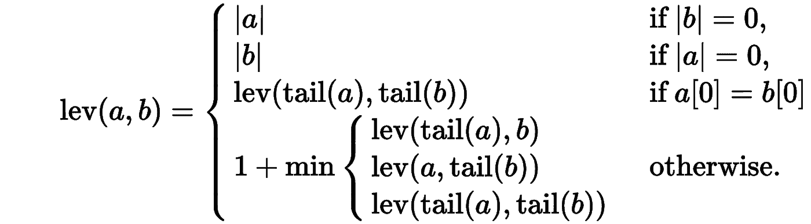

图片来自 Wikipedia.com

其中 tail 表示序列中除第一个字符之外的其余部分，在 Python 行话中是`a[1:]`。

对这些条件的解释如下:

*   如果 b 是一个空序列(`|b|=0`)，那么 cost 就是 a 的长度(`|a|`)。
*   如果 a 是一个空序列(`|a|=0`，那么 cost 就是 b 的长度(`|b|`)。
*   如果 a 和 b 的第一个字符相同(`a[0] = b[0]`)，那么代价就是子序列尾(a) ( `a[1:]`)和尾(b) ( `b[1:]`)的代价。
*   最后，成本是插入、删除或替换操作的最小值，定义如下:
*   `lev(tail(a), b)`表示从中删除一个字符
*   `lev(a, tail(b)`表示一个字符被插入到
*   `lev(tail(a), tail(b))`表示替代

**注意:在上面的公式中，插入、删除或替换的成本保持不变，即** `**1**` **。但是，替换成本通常被认为是** `**2**` **，我们将在实现中使用。**

# 使用递归编辑距离

我们可以直接将上述公式转换成递归函数来计算两个序列之间的编辑距离，但这种解决方案的时间复杂度是𝑂(3(𝑚+𝑛)).

因此，一旦我们弄清楚了编辑距离是如何工作的，我们将使用时间复杂度为𝑂(𝑚∗𝑛).的动态规划来编写一个更优化的解决方案

**下面是递归函数。我还将添加一些叙述，即打印出它正在执行的操作(插入、删除或替换)的功能。**

```
*# Below are the costs of different operations.*
ins_cost = 1
del_cost = 1
sub_cost = 2# Below function will take the two sequence and will return the distance between them.def edit_distance_recurse(seq1, seq2, operations=[]):
    *"""Returns the Edit Distance between the provided two sequences."""*

    if len(seq2) == 0:
        operations = operations + ([f"Delete `**{**seq1**}**` from sequence1."] if len(seq1) else [])
        return len(seq1), operations

    if len(seq1) == 0:
        operations = operations + ([f"Insert `**{**seq2**}**` into sequence1."] if len(seq2) else [])
        return len(seq2), operations

    if seq1[0] == seq2[0]:
        operations = operations + [f"Make no change for character `**{**seq1[0]**}**`."]
        return edit_distance_recurse(seq1[1: ], seq2[1: ], operations)

    *# calculate cost if insertion was made*
    ins_operations = operations + [f"Insert `**{**seq2[0]**}**` in sequence1."]
    insertion, ins_operations = edit_distance_recurse(seq1, seq2[1: ], ins_operations)

    *# calculate cost if deletion was done*
    del_operations = operations + [f"Delete `**{**seq1[0]**}**` from sequence1."]
    deletion, del_operations = edit_distance_recurse(seq1[1: ], seq2, del_operations)

    *# calculate cost if substitution was done*
    sub_operations = operations + [f"Replace `**{**seq1[0]**}**` in sequence1 with `**{**seq2[0]**}**`."]
    substitution, sub_operations = edit_distance_recurse(seq1[1: ], seq2[1: ], sub_operations)

    *# calculate minimum cost*
    min_cost = min(insertion + ins_cost, deletion + del_cost, substitution + sub_cost)

    if min_cost == (substitution + sub_cost):
        return min_cost, sub_operations
    elif min_cost == deletion + del_cost:
        return min_cost, del_operations
    else:
        return min_cost, ins_operations
```

**让我们举几个例子来测试这个函数**

```
seq1 = "numpy"
seq2 = "numexpr"score, operations = edit_distance_recurse(seq1, seq2)
print(f"Edit Distance between `**{**seq1**}**` & `**{**seq2**}**` is: **{**score**}**")
print("**\n**Operations performed are:**\n**")
for operation **in** operations:
    print(operation)
```

**输出:**

```
Edit Distance between `numpy` & `numexpr` is: 4Operations performed are:Make no change for character `n`.
Make no change for character `u`.
Make no change for character `m`.
Insert `e` in sequence1.
Insert `x` in sequence1.
Make no change for character `p`.
Replace `y` in sequence1 with `r`.
```

**编辑距离为** `**4**` **的原因是:**字符`n,u,m`保持不变(因此 **0** 成本)，然后插入`e & x`导致到目前为止`2`的总成本。然后，`p`没有变化，所以成本没有变化，最后，`y is replaced with r`，导致额外成本为 2。

因此，总成本为`4`。

# 使用动态编程编辑距离

对于有 ***重叠子问题*** 的问题，可以应用动态规划。就像在我们的例子中，为了得到`numpy` & `numexpr`之间的编辑距离，我们首先对子序列`nump` & `nume`进行相同的计算，然后对`numpy` & `numex`进行计算，以此类推...

一旦我们解决了一个特定的子问题，我们就存储它的结果，以后用它来解决整个问题。

***想了解更多关于动态编程的知识可以参考我的短教程—*** [***动态编程入门***](https://www.hackerearth.com/practice/notes/introduction-to-dynamic-programming/) ***。***

现在让我们了解如何将问题分解成子问题，存储结果，然后解决整体问题。

在下图中——跨行的是我们想要以最小的转换成本转换成`sequence2`(跨列)的`sequence1`。

两个序列前的字符`#`表示空字符串或字符串的开头。

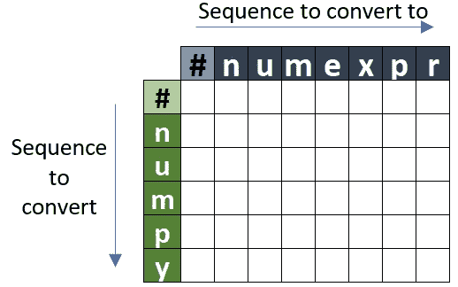

现在，我们将用不同子序列的成本填充这个矩阵，以获得整体解决方案。但是，首先，让我们看看基本情况:

*   当`sequence1`为空时，那么获得`sequence2`的成本就是添加`sequence2`中出现的角色的成本。矩阵中的第一行表示`sequence1`为空。

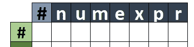

*   如果两个序列都是空的，那么代价就是`0`。

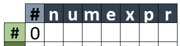

*   如果我们将字符`n`添加到`sequence1`中，我们将得到`1`的成本。

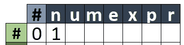

*   同样，我们将填充我们的第一行，其中每一列中的值是`1 + previous column value`，即添加多 1 个字符的成本。

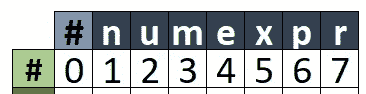

*   **注意:**最后一列的值 7 表示如果`sequence1`为空，那么将`sequence1`转换为`sequence2`的成本为`7`。同样，将空序列转换为子序列`'num'`的成本是`3`。
*   与此相反，我们有一种情况，当`sequence2`为空，但`sequence1`不为空。然后，跨行的值表示删除字符以获得空序列的成本。

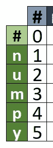

*   **注:**此处成本`5`代表删除`sequence1`所有角色获得一个空`sequence2`的总成本。

***现在填充了基础案例成本的矩阵如下:***

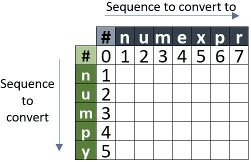

**求解子问题并填充矩阵。**

*   *(' n '，' n ')下的值是* `***0***` *，因为这两个字符是相同的，因此没有转换成本。*

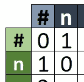

*   下面的矩阵显示了将`#n`转换为`#nu`的成本是`1`，由于子串`#n` & `#n`的成本是`0`，我们只将`u`加到`sub-sequence1`的成本相加。

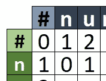

*   与上面类似，将`#nu`转换为`#n`的成本是`1`，由于子字符串`#n` & `#n`的成本是`0`，我们只增加从`sub-sequence1`中删除`u`的成本。

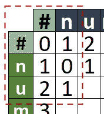

*   经过几次迭代后，矩阵将如下所示。**注:**成本用户子序列`#num` & `#num`是`0`，因为它们是相同的。

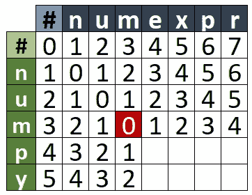

*   到目前为止，我们只看了插入和删除操作，但是现在我们也将考虑一个替换的例子。为了求解子序列`**#nump**`**&**`**#nume**`**，我们将首先计算子序列**`**#num**`**&**`**#num**`**(也就是我们上面提到的** `**0**` **)，因此总成本为** 0+2=20+2=2 **，这是将** `**p**` **代入**`**e**`的成本

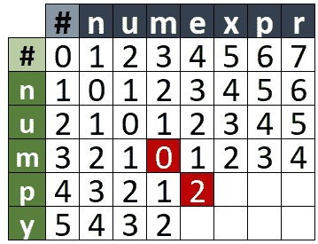

*   **完整的矩阵如下，总成本列在最后一行的最后一列，即** `**4**` **。**

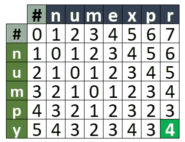

**此外，通过从最后一行的最后一列到第一行的第一列追踪最小成本，我们可以得到为达到该最小成本而执行的操作。**

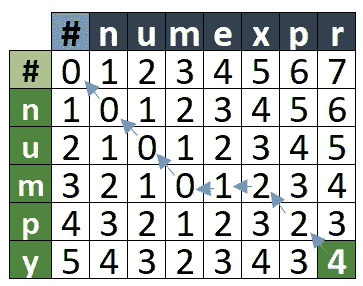

**下面的函数获取为获得最小成本而执行的操作。**

```
def min_cost_path(cost, operations):

    *# operation at the last cell*
    path = [operations[cost.shape[0]-1][cost.shape[1]-1]]

    *# cost at the last cell*
    min_cost = cost[cost.shape[0]-1][cost.shape[1]-1]

    row = cost.shape[0]-1
    col = cost.shape[1]-1

    while row >0 **and** col > 0:

        if cost[row-1][col-1] <= cost[row-1][col] **and** cost[row-1][col-1] <= cost[row][col-1]:
            path.append(operations[row-1][col-1])
            row -= 1
            col -= 1 elif cost[row-1][col] <= cost[row-1][col-1] **and** cost[row-1][col] <= cost[row][col-1]:
            path.append(operations[row-1][col])
            row -= 1 else:
            path.append(operations[row][col-1])
            col -= 1

    return "".join(path[::-1][1:])
```

**下面的函数使用动态编程计算编辑距离**

```
def edit_distance_dp(seq1, seq2):

    *# create an empty 2D matrix to store cost*
    cost = np.zeros((len(seq1)+1, len(seq2)+1))

    *# fill the first row*
    cost[0] = [i for i **in** range(len(seq2)+1)]

    *# fill the first column*
    cost[:, 0] = [i for i **in** range(len(seq1)+1)]

    *# to store the operations made*
    operations = np.asarray([['-' for j **in** range(len(seq2)+1)] \
                                 for i **in** range(len(seq1)+1)])

    *# fill the first row by insertion* 
    operations[0] = ['I' for i **in** range(len(seq2)+1)]

    *# fill the first column by insertion operation (D)*
    operations[:, 0] = ['D' for i **in** range(len(seq1)+1)]

    operations[0, 0] = '-'

    *# now, iterate over earch row and column*
    for row **in** range(1, len(seq1)+1):

        for col **in** range(1, len(seq2)+1):

            *# if both the characters are same then the cost will be same as* 
            *# the cost of the previous sub-sequence*
            if seq1[row-1] == seq2[col-1]:
                cost[row][col] = cost[row-1][col-1]
            else:

                insertion_cost = cost[row][col-1] + ins_cost
                deletion_cost = cost[row-1][col] + del_cost
                substitution_cost = cost[row-1][col-1] + sub_cost

                *# calculate the minimum cost*
                cost[row][col] = min(insertion_cost, deletion_cost, substitution_cost)

                *# get the operation*
                if cost[row][col] == substitution_cost:
                    operations[row][col] = 'S'

                elif cost[row][col] == ins_cost:
                    operations[row][col] = 'I'
                else:
                    operations[row][col] = 'D'

    return cost[len(seq1), len(seq2)], min_cost_path(cost, operations)
```

**对样本序列执行上述功能。**

```
seq1 = "numpy"
seq2 = "numexpr"score, operations = edit_distance_dp("numpy", "numexpr")print(f"Edit Distance between `**{**seq1**}**` & `**{**seq2**}**` is: **{**score**}**")
print("**\n**Operations performed are:**\n**")
for operation **in** operations:
    if operation == '-':
        print('No Change.')
    elif operation == 'I':
        print('Insertion')
    elif operation == 'D':
        print('Deletion')
    else:
        print('Substitution')
```

**输出:**

```
Edit Distance between `numpy` & `numexpr` is: 4.0Operations performed are:No Change.
No Change.
No Change.
Insertion
Deletion
No Change.
Substitution
```

# **用编辑距离解决问题。**

我们将要使用的数据集包含一些文件，这些文件包含为 Python 语言的两个版本(3.6 和 3.9)安装的包及其版本的列表。

两个档案中关于熊猫套餐的记录是:

*   `pandas`
*   `pandas==1.2.1`

在这个练习中，对于一个文件中提到的每个包，我们将从第二个文件中找到最合适的一个。适用性将基于 Levenstein 距离或编辑距离度量。

## 加载数据

```
def preprocessor(package):
    *"""*
 *This takes a input package and applies preprocessing steps like converting to lowercase,*
 *strip the `\n` and `space` from the ends.*
 *"""*
    return package.lower().strip()
```

**加载 Python 3.6 的需求**

```
*# Open the file and read the list of packages*
with open('/kaggle/input/pip-requirement-files/Python_ver36.txt', 'r') as f:
    py36 = f.readlines()

*# clean the data*
py36 = list(map(preprocessor, py36))

print("Number of packages for Python 3.6 are: ", len(py36))
print(f"**\n**Few of the records are:**\n{**py36[:5]**}**")
```

**输出:**

```
Number of packages for Python 3.6 are:  276

Few of the records are:
['absl-py==0.11.0', 'alabaster==0.7.12', 'anaconda-client==1.7.2', 'anaconda-project==0.8.3', 'appdirs']
```

**加载 Python 3.9 的需求**

```
with open('/kaggle/input/pip-requirement-files/Python_ver39.txt', 'r') as f:
    py39 = f.readlines()

*# clean the data*
py39 = list(map(preprocessor, py39))

print("Number of packages for Python 3.9 are: ", len(py39))
print(f"**\n**Few of the records are:**\n{**py39[:5]**}**")
```

**输出:**

```
Number of packages for Python 3.9 are:  146

Few of the records are:
['alabaster==0.7.12', 'anyio==2.0.2', 'appdirs==1.4.4', 'argon2-cffi==20.1.0', 'astroid==2.4.2']
```

## **获取需求文件之间的成对距离**

现在，我们已经构建了一个函数来计算两个序列之间的编辑距离，我们将使用它来计算来自两个不同需求文件的两个包之间的得分。

然后，对于 Python 3.6 版本的需求文件中提到的每个包，我们都会从 Python 3.9 版本文件中找到最匹配的包。

```
*# to store the best matching package for py36 found in py39*
p36_best_match = {}*# for each package in py36 get the score*
for pack36 **in** py36:

    best_score = float('inf')
    best_package = None

    *# match with each package in py39*
    for pack39 **in** py39:

        *# get the edit distance between pack36 and pack39*
        score, _ = edit_distance_dp(pack36, pack39)

        *# if the score is less than best score so far*
        *# store the new score and package name*
        if score < best_score:
            best_score = score
            best_package = pack39

    *# append the details of best package found for pack36*
    p36_best_match[pack36] = (best_package, best_score)*# print the results*
for pack36, (pack39, score) **in** p36_best_match.items():
    print(f"Best matching package for `**{**pack36**}**` with distance of **{**score**}** is `**{**pack39**}**`")
```

**部分输出记录:**

```
Best matching package for `absl-py==0.11.0` with distance of 9.0 is `py==1.10.0`Best matching package for `alabaster==0.7.12` with distance of 0.0 is `alabaster==0.7.12`Best matching package for `anaconda-client==1.7.2` with distance of 15.0 is `nbclient==0.5.1`Best matching package for `anaconda-project==0.8.3` with distance of 17.0 is `odo==0.5.0`Best matching package for `appdirs` with distance of 7.0 is `appdirs==1.4.4`Best matching package for `argh` with distance of 10.0 is `rsa==4.7`
```

# 检查上述解决方案的准确性

为此，我们将简单地从 py36 和 py39 中去掉包名`==x.x.x`的版本部分，然后检查它们是否相同。

```
*# this function will trim the versions and return of they are same or not*
def is_same(pack1, pack2):
    return pack1.split('==')[0] == pack2.split('==')[0]print(f"Are packages `pandas` and `pandas==1.1.1` same? **{**is_same('pandas', 'pandas==1.1.1')**}**") **Are packages `pandas` and `pandas==1.1.1` same? True**
```

## 获得准确性

```
*# get total number of packages in py36*
total_packs_in_py36 = len(py36)*# get the count of records where match was found*
total_matched_records = sum([is_same(pack36, pack39) for pack36, (pack39, _) **in** p36_best_match.items()])*# get the accuracy*
accuracy = total_matched_records * 1.0 / total_packs_in_py36print(f"The total number of correct matches are: **{**total_matched_records**}** out of **{**total_packs_in_py36**}** and the accuracy is: **{**accuracy**:**.2f**}**")
```

**输出:**

```
The total number of correct matches are: 138 out of 276 and the accuracy is: 0.50
```

让我们看看下面的例子，了解为什么我们的准确度如此之低。

> *距离为 10.0 的* `*xlrd*` *最佳匹配包是* `*rsa==4.7*`

```
*# find the actual corresponding record of 'xlrd' in py39 list*
for pack39 **in** py39:
    if pack39.startswith('xlrd'):
        print(pack39)
        break
```

**输出:**

py39 列表中没有匹配的“xlrd”记录，因为 Python 3.9 版本中从未安装过它。

py36 中的记录数是 **276** ，而 py39 中只有 **146** ，因此我们只能找到 py36 列表中记录的 **53%** ( **146/276** )的匹配名称。

此外，所使用的数据被上传到 Kaggle 上，可以使用[**https://www . ka ggle . com/pikkupr/implement-edit-distance-from-sratch**](https://www.kaggle.com/pikkupr/implement-edit-distance-from-sratch)访问工作笔记本

希望解释清楚了，你从这个笔记本中学到了什么，如果你有任何问题，请在评论中告诉我。