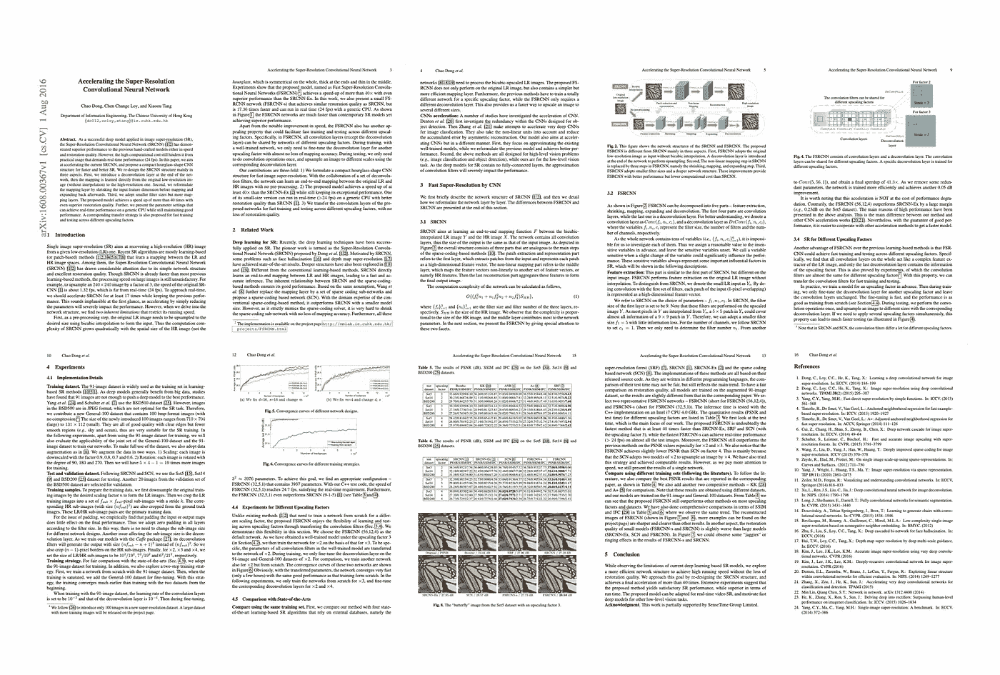
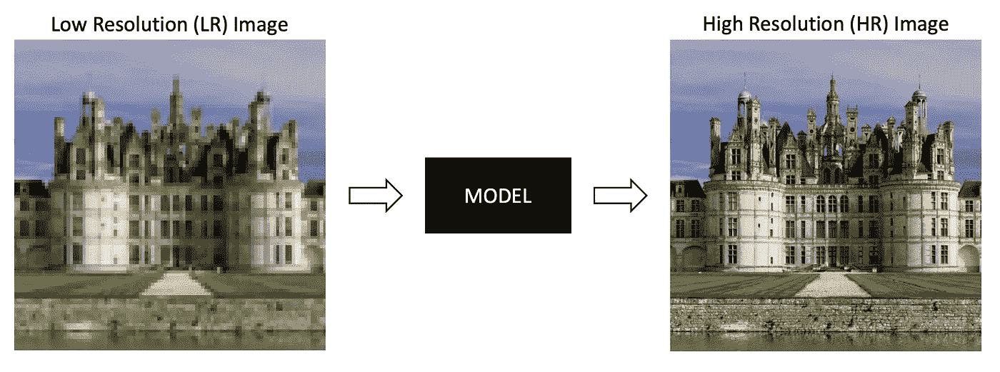
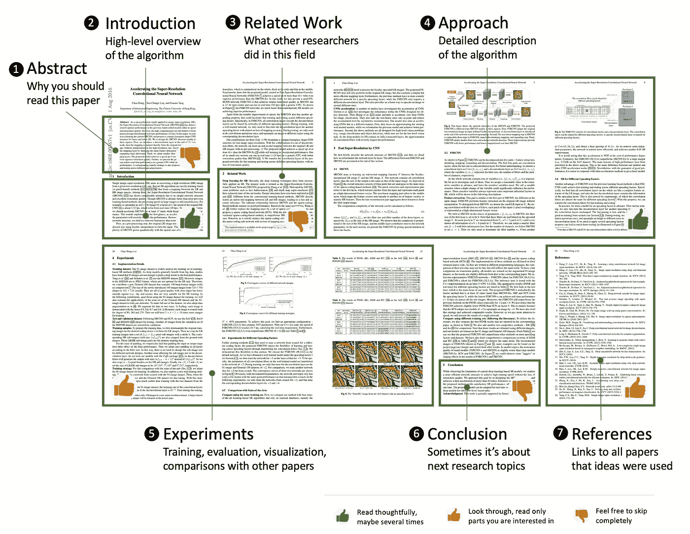
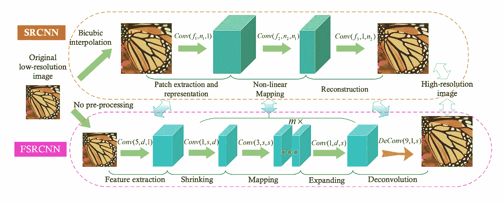
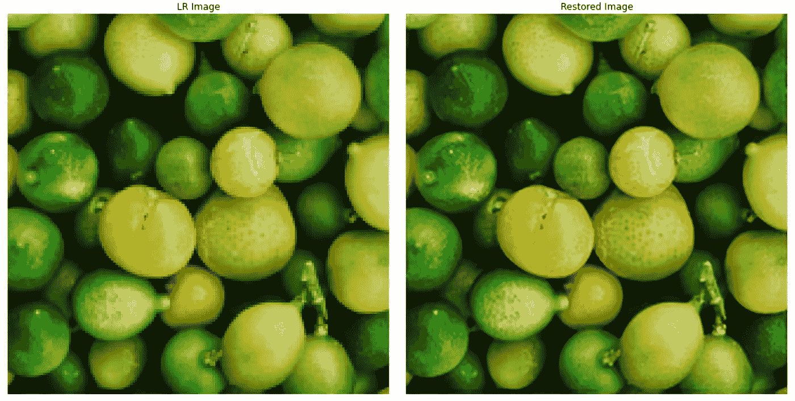
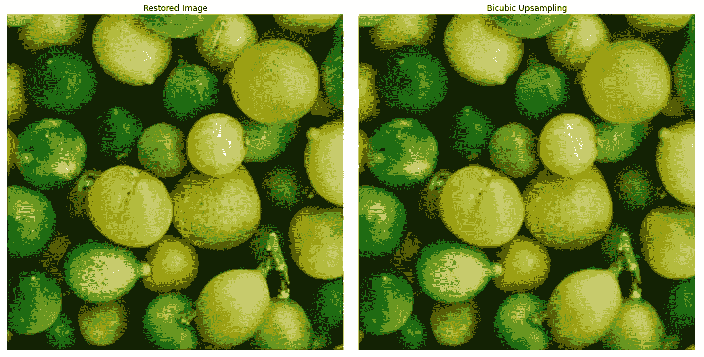

# 学习复制论文:初学者指南

> 原文：<https://towardsdatascience.com/learn-to-reproduce-papers-beginners-guide-2b4bff8fcca0?source=collection_archive---------8----------------------->

## [思想和理论](https://towardsdatascience.com/tagged/thoughts-and-theory)

## *如何理解深度学习论文并实现所描述的方法的分步指导。举个例子:今天我们要复制一篇关于图像超分辨率的基础论文。*

来源:https://arxiv.org/abs/1608.00367

对于数据科学家来说，能够复制最新的科学论文是一项极具竞争力的技能。因为没多少人能做到。

如果你想成为一名思想家，了解黑匣子里正在发生的事情，激发你的创造力，或者成为第一个将最新科学研究引入商业的开发者——这篇文章就是为你准备的。

今天我们将讨论如何选择一篇“好”的论文，这对初学者来说相对容易；我们将概述典型的论文结构和重要信息的位置；我会给你一步一步的指导，告诉你如何实现纸质实现，并分享一些链接，当你遇到困难时，这些链接会对你有所帮助。

这个帖子也有一个“实践部分”，所以今天我们要复制一篇关于图像超分辨率的基础论文。我不指望你有超分辨率的经验，但我假设你已经与卷积神经网络。这次的深度学习框架是 Tensorflow 2。

**内容**
—从哪里开始？
—论文结构:跳过什么，读什么
—举例。理解论文
—哪里可以找到帮助？
—举例。我们来编码一下
—祝你好运！

# 从哪里开始？

如果你希望你的学习顺利，没有压力，你应该找到一个“好”的论文。作为一个起点，我真的推荐你选择 ***一篇老的高被引论文*** 来描述你所熟悉的概念。

*   老的高被引论文通常解释非常基本的概念，成为最近研究的基础。你知道基本原理——你也会更好地理解最近的论文。对于深度学习来说，2016 年之前的论文被认为已经很老了。
*   高被引论文可复制。这意味着许多其他科学家能够理解和实施这种方法。要想知道某篇论文被引用的次数，在谷歌学术谷歌一下。引用次数超过 1000 次的论文被认为是高被引论文。
*   通常，较老的论文描述的是较简单的概念，这对于初学的你来说是一大加分。

这几周我一直在看关于超分辨率的论文，所以我选择了这个 2016 年的研究来和你一起重现——[加速超分辨率卷积神经网络](https://arxiv.org/abs/1608.00367)。它描述了用于超分辨率任务的第一个基于 CNN 的模型之一——fsr CNN(快速超分辨率 CNN)。

超分辨率任务非常简单:取一张低分辨率(小，质量差)的图像，然后把它变成高分辨率(大，质量好)。正如我所说的，你不需要任何超分辨率的经验就能理解这篇论文，然而，CNN 是一个你必须熟悉的概念。

*超分辨率任务:高级可视化。作者图片*

# 论文结构:跳过什么，阅读什么

典型的深度学习论文具有以下结构:

1.摘要
2。简介
3。相关工作
4。详细介绍
5。实验
6。结论
7。参考

*典型深度学习论文的结构。作者图片*

**1。摘要**是“营销”的总结。它很短，重点是为什么这种方法比以前的方法更好，以及它的新颖之处。摘要发表在会议日程和在线档案中(如 [Arxiv](https://arxiv.org/) )，它们唯一的目标就是说服你阅读这篇特定的论文。你已经选择了一篇要阅读(和复制)的论文，所以可以随意跳过摘要。

**2。简介**是一个重要的章节，也是必读的。它给出了该方法的高级概述。通常情况下，它并不太专业，而且非常“人性化”，所以先阅读介绍部分，在深入研究算法细节之前，先预热一下大脑。

**3。相关工作**。所有科学论文(以及深度学习)都是相关的:每一项发现都是建立在数十名研究人员之前的工作基础上的。相关工作概述是每篇论文的必修部分。作者必须确保他们的工作是相关的，解决重要的问题，并且不重复其他研究人员以前做过的工作。这对于科学界来说是一个重要的部分——但对于我们(从业者)来说不是，所以跳过它！

(好吧。有时你可能需要它——但只是在你寻找该领域其他基本论文/概念的情况下。)

**4。走近细节**。有趣的事情开始了。这是论文中最复杂和最具挑战性的部分，也是最重要的部分(一定要读！).不要期望太高，也不要期望从一次阅读中理解所有的东西。这是你在编码时会一次又一次回来的部分。

不要害怕复杂的公式，大多数情况下，它们解释的是基本概念。我相信研究人员就是这样开玩笑的。过一会儿，你会习惯的。

在阅读论文时，捕捉你可能需要的所有信息——数据预处理技术、详细的神经网络架构、损失函数、训练技巧和后处理。尽你所能去得到它。如果你试了几次还是不明白，没关系，以后我会告诉你怎么做。

**5。实验**。这个部分充满了图表、表格和图像。通常，它包含有关数据集、训练和评估的详细信息，以及对该模型在各种超参数下的表现以及与其他论文中最先进方法的比较的综述。如果论文是关于计算机视觉的，也会有模型预测的可视化。我会说这一部分是你唯一感兴趣的部分。

**6。结论**是论文的总结，有时包含作者对未来研究的想法。你应该跳过它。

**7。参考文献**。科学界(不仅仅是科学界)有一条严格的规则:如果研究人员使用了属于他人的观点，他/她需要添加对原始作品的引用(引用)。当这些参考文献中的概念已经在论文中解释过，或者不重要时，你可能会跳过大部分这样的参考文献。然而，有时作者可能会说:“我们使用了论文[2]中描述的模型架构，只修改了最终层中的激活”。在这种情况下，你需要找到并阅读文章[2]来完全理解这种方法。

现在——该读报了。关掉音乐，把手机调到飞行模式，喝杯茶。在接下来的 30 分钟里，你应该高度集中注意力，因为你正在潜入一个新的世界——令人兴奋，但相当具有挑战性。

在这一点上，我建议您暂停阅读论文[加速超分辨率卷积神经网络](https://arxiv.org/abs/1608.00367)，我们接下来将复制该论文。注意数据预处理、模型架构、损失函数和训练细节。

# 举例。理解论文

完成了吗？太好了。现在，让我们回顾一下我们从论文中获得的所有重要细节，以再现快速超分辨率 CNN (FSRCNN)。

**FSRCNN:一般信息**

*   所提出的方法是一种卷积神经网络，它采用低分辨率(LR)图像，“巧妙地”以某种因子放大它，并返回高分辨率(HR)图像。所以输出图像比输入大 N 倍。
*   放大因子 N 由用户定义，并且是像 2、3、4 等这样的数字。放大因子越大，恢复质量越差。
*   特定的放大因子需要单独的神经网络来训练。这些网络仅在最后(去卷积)层不同，并且可以共享所有其他层的权重。

**FSRCNN:模型架构**

*   模型由几个连续的卷积层和一个最终的反卷积层组成。下面是一个详细的流程:
    —内核大小= 5×5、滤波器个数= d
    的卷积层—参数化 ReLU 激活
    —内核大小= 1×1、滤波器个数= s 的卷积层
    —参数化 ReLU 激活
    —内核大小= 3×3、滤波器个数= s
    的 m 个卷积层—参数化 ReLU 激活(不清楚这 m 个卷积层之间是否使用了激活函数。可能，他们是。)
    —卷积层，内核大小= 1×1，滤波器数量= d
    —参数 ReLU 激活
    —去卷积层，内核大小= 9×9，步幅=放大因子，滤波器数量=图像中的通道数量(由于某种原因，作者使用 1 作为通道数量，但对于彩色图像，它应该是 3。还是我错过了什么？)
    —最后一层无激活功能
*   零填充用于所有层。
*   d、s、m 是超参数。作者推荐使用 d=32，s=5，m=1 进行实时预测，使用 d=56，s=12，m=4 获得更好的恢复质量。

*FSRCNN 架构。来源:* [*加速超分辨率卷积神经网络*](https://arxiv.org/abs/1608.00367)

**FSRCNN:数据**

*   模型在 [T91](https://www.kaggle.com/ll01dm/t91-image-dataset) 数据集上进行训练，并在 [General-100](http://mmlab.ie.cuhk.edu.hk/projects/FSRCNN.html) 上进行微调。
*   这些数据集只有高分辨率图像。低分辨率图像是通过缩小高分辨率图像来创建的。
*   数据扩充是 90 度旋转和作物。每张图像都以各种可能的方式旋转了 90 度，并通过滑动窗口裁剪成小块。看起来这些扩充是在训练之前完成的(但不是随机进行的)，所以最终的训练集是预定义和固定的。

**FSRCNN:培训详情**

*   损失是 MSE(均方误差)。
*   优化器是随机梯度下降。
*   卷积层训练期间的学习率是 0.001，去卷积层是 0.0001；微调学习率低两倍。
*   去卷积层的权重通过从具有零均值和标准偏差= 0.001 的高斯分布中随机抽取来初始化。
*   卷积层的权重用[23]中为 PReLU 设计的方法初始化。这是对另一篇论文的引用，那篇论文解释了正规的初始化式。

我们现在对 FSRCNN 有了相当多的了解，可以转到编码和训练。

# 去哪里寻求帮助？

对许多人来说，“复制论文”意味着“快速阅读论文，然后在互联网上寻找现成的实现”。这是最简单的方法，但不是有益的方法。我真的建议你从头开始，不要马上寻找现成的解决方案。至少自己做些事情——那是你学习的时候。

即使你完全是复印纸张的初学者，你也总有办法做到:

*   下载数据集，探索它，编写一个数据加载器。

简单易行的任务，但一旦完成，它会给你信心并帮助你继续前进:

*   开始写模型架构，简化或者跳过不理解的部分。有一个奇怪的权重初始值设定项——现在跳过它，使用默认的。您以前从未使用过 PReLU 激活，请改用 ReLU。你现在的目标是创建一个可训练的模型，不是纸上谈兵的模型或者性能好的模型，只是可训练的。它有输入，有输出，所以你可以运行培训。
*   论文中有一个自定义丢失——用深度学习库中实现的类似的替换掉。
*   对优化器、数据扩充、后处理做同样的事情——简化或跳过。

你最终会被征召入伍。你甚至可以训练一下草稿，看看效果如何——也许结果不会那么糟糕🙂

然后填补空白，修复工作不佳的部分。首先，自己进行实验——测试你在写草稿时想到的想法，再读一遍论文，希望能抓住你之前漏掉的概念。如果你很快就卡住了，不要沮丧。你写了一份草稿，这是一个很大的进步，你已经学到了很多。所以下一次，下一篇论文你会写得更好。这是一个学习的过程。

感觉完全卡住了？搜索的最佳时机。

记住，我建议你选择一篇高被引论文。现在你会感受到好处。流行的报纸在互联网和博客上有许多描述复杂部分的实现。尽情享受吧！

第一个要检查的地方是代码为的[论文，这是一个很大的库，可能包含了所有流行论文的代码实现。这些实现要么是官方的，要么来自像你我这样的研究人员。例如，在 PyTorch 和 Tensorflow 中，FSRCNN 在代码为](https://paperswithcode.com/)的论文上实现了 [7。(好了，现在是 8，我也添加了我的实现。)](https://paperswithcode.com/paper/accelerating-the-super-resolution)

你可以复制粘贴，但是要花时间去理解这些代码。这是最后一条建议。

# 举例。我们来编码吧！

现在我将向您展示如何用代码实现 FSRCNN。深度学习库这次是 Tensorflow 2。

当你在实现论文中的方法时，没有必要 100%准确地复制它。所以关掉完美主义模式，开心就好！使用不同的数据集，试验模型架构，添加数据扩充，改变损失函数，…

**数据**

*   让我们使用 [DIV2K](https://data.vision.ee.ethz.ch/cvl/DIV2K/) 来代替 T91 和 General-100 数据集。这是一个更新、更大的数据集，是专门为超分辨率任务创建的。
*   我们只从 DIV2K 获取高分辨率(HR)图像，包括训练和验证部分，总共 900 张图像。然后将训练和验证部分合并到一个文件夹中，并根据图像 id 创建自定义的训练-验证-测试分割:训练的 id 为 1–700，验证的 id 为 701–800，测试的 id 为 801–900。低分辨率(LR)图像是通过双三次下采样从高分辨率图像生成的。
*   对于训练和验证数据扩充，让我们使用随机裁剪成 648×648 小块、水平翻转以及亮度、对比度、饱和度和色调的轻微变化。对于测试集，我们只对 648×648 的小块进行随机裁剪。在 HR 图像上执行数据增强，并且从增强的 HR 图像创建 LR 图像。
*   选择这种随机裁剪大小，以便它甚至可以应用于 DIV2K 数据集中最小的图像。648 可以被 4 整除，这是我们模型中的比例因子。
*   因此，这里是我们得到的 [Tensorflow 数据加载器](https://github.com/OlgaChernytska/Super-Resolution-with-FSRCNN/blob/main/utils/dataset.py)。

*数据准备流程。作者图片*

**型号**

*   我们创建一个上采样因子为 4 的模型，因此输入是大小为 162×162 的 LR 图像(因为 648/4 = 162)，输出是大小为 648×648 的 HR 图像。
*   模型层、过滤器大小和数量、激活、填充和初始化器与论文中描述的相同。
*   PReLU 激活有点棘手，因为它有一个可学习的参数— alpha。当在 Tensorflow 中使用默认参数初始化 PReLU 时，每次激活都有数千个这样的 alphas。然而，根据论文，这个数字应该很小。我在 [Tensorflow PReLU 文档](https://keras.io/api/layers/activation_layers/prelu/)中找到一个建议，像这样跨维度共享 alpha】，我也这么做了。它大大减少了激活中的参数数量。
*   这里是完整的 [Tensorflow 模型代码](https://github.com/OlgaChernytska/Super-Resolution-with-FSRCNN/blob/main/utils/model.py)。超参数 d、s、m 是在模型初始化期间指定的。我们使用 d=56、s=12 和 m=4，这应该给出最佳的恢复质量。

**训练详情**

*   初始学习率为 0.001。对所有层使用相同的学习速率更简单，并且该模型也训练得相当好。让我们使用 [ReduceLROnPlateau](https://keras.io/api/callbacks/reduce_lr_on_plateau/) 回调来降低每次列车损失停止下降时的学习率。
*   RMSprop 被用来代替 SGD，因为它可以确保更快更流畅的训练。
*   我用 batch_size=30 和 steps_per_epoch=20 进行训练。使用 batch_size=20，steps_per_epoch=4 进行验证。您可以更改这些数字，但是请注意，batch_size*steps_per_epoch 不能超过数据集大小。
*   最大历元数为 500。当验证损失停止下降时，我们使用[提前停止](https://keras.io/api/callbacks/early_stopping/)回调来完成训练。当我训练模型时，它在大约 300 个时期内完成。
*   我在单个 GPU 上花了大约 5 个小时来训练这个模型。
*   这里是用于训练的[代码和带有训练配置](https://github.com/OlgaChernytska/Super-Resolution-with-FSRCNN/blob/main/train.py)的[文件。](https://github.com/OlgaChernytska/Super-Resolution-with-FSRCNN/blob/main/config.yaml)

**评估**

*   超分辨率模型用度量— [峰值信噪比](https://en.wikipedia.org/wiki/Peak_signal-to-noise_ratio) (PSNR)进行评估。这里是[它的 Tensorflow 实现](https://www.tensorflow.org/api_docs/python/tf/image/psnr)。我们的模型 PSNR 在 DIV2K 测试集上是 26.625。
*   更有意思的是看结果是什么样的。通常，模型恢复质量是根据双三次上采样进行视觉评估的。
*   虽然用双三次插值上采样的图像看起来有点模糊，但用 FSRCNN 上采样的图像具有更好的纹理。
*   如果你想看更多的模型预测，这里有一个[笔记本](https://github.com/OlgaChernytska/Super-Resolution-with-FSRCNN/blob/main/notebooks/Inference.ipynb)供你参考。

*FSRCNN 在 DIV2K 测试集上的性能。左—输入图像，右 FSRCNN 的输出。*

由 FSRCNN 恢复的图像比向上采样的图像具有更多的纹理。

*FRCNN 恢复质量仍然远非完美，即使它是在 2K 分辨率图像上训练的* s。

# 祝你好运！

再一次:

1.  选择一篇旧的高被引论文。
2.  通读一遍，尽量抓住——数据准备、模型架构、损失函数、训练细节。
3.  什么都不懂也不要难过。
4.  通过跳过和简化您不理解的概念来创建一个实现草案。如果你的草稿与论文中的方法相差甚远，也没关系。
5.  试着自己去完善草稿。
6.  当你遇到困难的时候——在互联网上寻找文章和用纸实现的代码。复制粘贴，但要阅读理解。
7.  把你的工作包装成 Github 项目(为什么不呢？).看，[我是怎么做到的](https://github.com/OlgaChernytska/Super-Resolution-with-FSRCNN)。
8.  用一篇新论文重复。感受一下第二次有多顺利🙂

真正的学习发生在步骤 2-5，所以你在这里花的时间越多，你学得越快。祝你好运！

*原载于 2021 年 8 月 10 日*[*https://notrocketseconomy . blog*](https://notrocketscience.blog/learn-to-reproduce-papers-beginners-guide/)*。
如果你想阅读更多类似的教程，请订阅我的博客“不是火箭科学”——*[*电报*](https://t.me/notrocketscienceblog) *和* [*推特*](https://twitter.com/nRocketScience) *。*