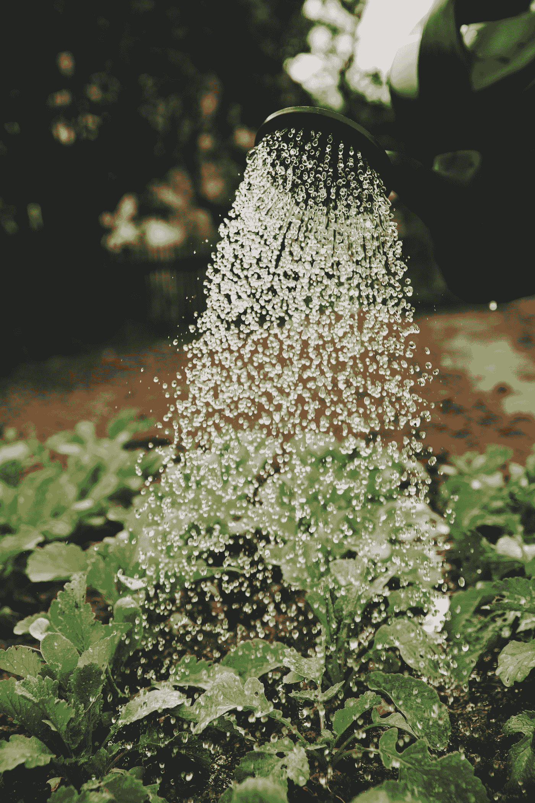

# 学习使用数据科学中最重要的七个 python 库

> 原文：<https://towardsdatascience.com/learn-to-use-the-seven-most-crucial-python-libraries-for-data-science-c5bc8dcffdd4?source=collection_archive---------6----------------------->

## 作为一名数据科学家，这些库将在实现 ML/DL 算法的同时拯救你的生命。

马库斯·斯皮斯克在 [Unsplash](https://unsplash.com?utm_source=medium&utm_medium=referral) 上的照片

嗯，说我作为一名数据科学家在工作中不使用图书馆，就像说我拥有一辆自行车，但只能通过步行从一个地方到另一个地方。这在理论上是可能的，但并不是对所有的情况都切实可行或有效。类似于不同的交通方式，我们在 python 中有多个库，这让我们的工作变得更加简单快捷。了解这些库将帮助您在从头实现算法时节省精力、时间和脑力。

目前，当数据科学蓬勃发展时，有多个用于实现一个算法的库，因为所有这些选项而感到不知所措完全没关系。在本文中，我将列出一些基本的库及其用例，帮助您找到适合您的用例的库。

# NumPy

好吧，我在这里陈述明显的事实。NumPy 是我们社区中最重要和最常用的库之一。它是处理数组、结构化数据、科学计算、统计分析(如均值、中值、线性代数)等的最佳库。NumPy 库在计算速度上是非常高效的。

你可以在这里了解更多关于 NumPy [的信息](/10-quick-numpy-tricks-that-will-make-life-easier-for-a-data-scientist-35a0253c7479)。

尝试一下这种实践体验:

1.  生成两个大小为(10，10)的数组，分别命名为 array1 和 array2，并用随机整数填充。
2.  找出数组 1 中值大于 10 的位置，并将它们设为 0
3.  找出数组 2 中值小于 5 的位置，并将它们设为 10
4.  将这两个数组按元素相乘
5.  将结果数组保存在一个。npy”文件

试着用尽可能少的代码行来实现这些，以体验 NumPy 的效率。

# 熊猫

Pandas 主要用于读取、分析、操作和保存表格数据。Pandas 本质上提供了两种数据结构。

*   系列——熊猫系列是一维数据结构，由一个键值对组成。它类似于 python 字典。
*   数据框-熊猫数据框是一种二维数据结构。它是两个或两个以上熊猫系列的组合。

每当我得到 CSV 文件中的数据时，我想到的第一件事就是用熊猫来分析。这是一个用于数据分析、操作和填充缺失值等的基本库。

你可以在这里了解更多关于熊猫的信息。

尝试一下这种实践体验:

1.  从[这里](https://www.kaggle.com/harlfoxem/housesalesprediction)下载 csv，并用于所有实验。
2.  读取 csv 文件并删除重复的行
3.  对于具有整数/浮点值的列，获取统计参数，如平均值、中值、方差等。
4.  将数据帧写入 csv 文件

# Matplotlib

Matplotlib 是一个数据可视化的常用库。从为了我们的理解而可视化数据到为演示文稿制作漂亮的可视化效果，matplotlib 全都做了。我想你可以理解 matplotlib 的作用在一个数据科学家的生活中是多么重要。

你可以在这里了解更多关于 matplotlib [的信息。](/understanding-matplotlib-in-6-code-snippets-63e5b8be2c8)

尝试这些方法来获得实践经验:

1.  使用两个系列数据绘制标准图表。
2.  向图表、x 轴和 y 轴添加标题
3.  为图表添加图例
4.  保存图表

# sci kit-学习

Scikit learn 是一个有价值的库，用于实现各种传统的机器学习算法，包括监督和非监督算法。您可以实现各种算法，如决策树、随机森林、KNN、K-means 等。，可在 Scikit 中获得。该库还提供了各种数据预处理和后处理算法的实现，如标准化、将标签转换为一键编码等。您会发现这个库出现在许多课程和书籍中，因为它的实现范围很广。因此，每当您必须实现任何基本的机器学习算法时，您应该首先尝试看看 scikit learn 是否可以使用。

你可以在这里了解更多关于 Scikit 的知识。

尝试这些方法来获得实践经验:

1.  从[这里](https://www.kaggle.com/harlfoxem/housesalesprediction)下载住房数据，并阅读使用熊猫
2.  使用 pandas 填充缺少的值，使用 matplotlib 可视化数据
3.  使用 sklearn 的 scaler 模块归一化数据，然后使用 sklearn 拟合线性回归模型。

上面的练习展示了如何使用多个库来解决一个基本的机器学习问题。

# OpenCV

如果您正在处理图像或视频，几乎不可能找到可以与 OpenCV 的功能范围相匹配的库。它提供了广泛的传统图像处理算法，如 canny 边缘检测，SIFT，SURF，hough 变换等。它还提供了基于深度学习的算法的实现，用于图像分类、对象检测、分割、图像中的文本检测等。我在图像和视频方面做了很多工作，我可以告诉你，对于任何任务，我都必须至少使用一次 OpenCV。

你可以在这里了解更多关于 OpenCV [的信息。](https://docs.opencv.org/4.x/d6/d00/tutorial_py_root.html)

尝试一下这种实践体验:

1.  下载任何图像，然后使用 OpenCV 读取图像
2.  将图像转换为灰度
3.  使用双边滤波器减少图像中的噪声，然后应用腐蚀和膨胀滤波器。
4.  使用 canny 边缘检测器在图像中查找边缘
5.  保存新图像。

# NLTK

就像 OpenCV 是图像和视频的基本库一样，NLTK 是文本的必要库。对于所有任务，如词干化、词汇化、生成嵌入、标记化、可视化等。，可以使用 NLTK 库。NLTK 库中也实现了一些必要的深度学习算法。

你可以在这里了解更多关于 NLTK [的信息。](https://www.analyticsvidhya.com/blog/2021/07/nltk-a-beginners-hands-on-guide-to-natural-language-processing/)

尝试一下这种实践体验:

1.  使用[本](https://justpaste.it/76in4)文集。将整个语料库转换为小写
2.  对语料库进行分词，然后对给定数据进行词干提取。

# PyTorch

虽然我是最后写这篇文章，但我对 PyTorch 的开发者感激不尽。这是我实现任何自定义神经网络或基于深度学习的方法的首选库。无论是音频、文本、图像、文本还是表格数据，都可以使用 PyTorch 编写一个神经网络，在给定的数据上训练一个模型。PyTorch 还在 GPU 上部署基于深度学习的方法方面发挥了重要作用，通过使用并行化减少了推理时间。

你可以在这里了解更多关于 PyTorch [的信息。](https://pytorch.org/tutorials/)

尝试一下这种实践体验:

1.  下载 MNIST 数据集
2.  为数据和优化器编写数据加载器
3.  编写自定义的全连接神经网络
4.  为 MNIST 数据集训练神经网络
5.  评估验证数据集上的模型
6.  保存模型。

# 结论

我已经包含了我在数据科学例程中使用的所有库。并不是只有这些库。这里提到的每个库都有一个可供选择的库。但总的来说，我认为这七个库提供的功能范围是竞争对手中最好的。如果你觉得更多的库需要包含在这个列表中，请在评论中告诉我。

关注我们的 [medium](https://medium.com/@AnveeNaik) 了解更多此类内容。

*成为* [*媒介会员*](https://medium.com/@AnveeNaik/membership) *解锁阅读媒介上的无尽故事。*