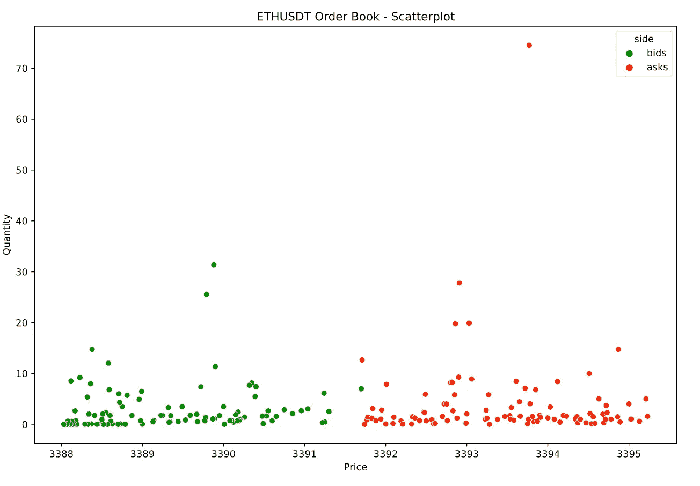

# 了解什么是深度图以及如何用 Python 创建深度图

> 原文：<https://towardsdatascience.com/learn-what-a-depth-chart-is-and-how-to-create-it-in-python-323d065e6f86?source=collection_archive---------16----------------------->


由[奥斯汀·迪斯特尔](https://unsplash.com/@austindistel?utm_source=unsplash&utm_medium=referral&utm_content=creditCopyText)在 [Unsplash](https://unsplash.com/s/photos/crypto?utm_source=unsplash&utm_medium=referral&utm_content=creditCopyText) 上拍摄的照片

## 使用币安的 API 获取订单数据

如果你曾经冒险进入任何一个加密货币交易所，我敢肯定你已经看到了一个深度图，就像上图中的那个。在本文中，我想快速讨论深度图实际上是什么，我们可以从中推断出什么样的信息，然后展示如何使用 Python 创建深度图。

请记住，这是一篇专注于获取订单簿数据和创建适当的可视化的文章。这不是一条投资建议！

# 深度图——是什么？

**深度图**是一种可视化，它告诉我们特定资产(股票、商品、密码等)的需求和供给。)价格不同。它基于订单簿数据，即未结买卖订单的数量，包括资产的数量。此类订单的数量越大，该资产的市场流动性就越强。

交易员利用实时供求来评估资产价格的可能走向。此外，它还用于估计在不导致价格上涨的情况下可以购买的资产单位数量。举个例子，一个流动性很强的资产(有大量买家和卖家)的价格在一个大订单完成后不太可能有太大变化。缺乏流动性的资产就不一样了。

# Python 中的示例

和往常一样，我们从导入所需的库开始。

为了创建深度图，我们需要访问订单簿数据。我们从[币安](https://accounts.binance.com/en/register?ref=13670520) ( *免责声明*:附属链接)获得数据，这是最受欢迎的加密交易所之一。我们可以通过多种方式访问数据:

*   通过 Python 的`requests`库使用币安的 API，
*   使用非官方的`python-binance`库，
*   使用`binance-connector`图书馆。

我们将采用最后一种选择。我们从实例化币安客户端开始。对于这个特定的端点，我们不需要帐户和 API 密钥。然而，如果你计划更广泛地使用他们的 API，你可能想要[设置它](https://www.binance.com/en-NG/support/faq/360002502072)。然后，我们使用`depth`方法为`ETHUSDT`对下载订单簿数据。

返回的数据存储在一个带有以下关键字的字典中:`[‘lastUpdateId’, ‘bids’, ‘asks’]`。出价和要价被存储为列表的列表，所以我们需要使用下一个代码片段将它们转换成一个`pandas`数据帧。

数据帧如下所示:


作者图片

我们也可以使用`describe`方法来检查数据。

```
df.groupby("side").price.describe()
```


作者图片

我们可以看到每边包含 100 个观察值。我们可以要求每边多达 5000 次观察。更多详情，请参见[文档](https://binance-docs.github.io/apidocs/spot/en/#order-book)。

作为探索订单簿数据的第一步，我们可以使用散点图将其可视化。



作者图片

虽然我们已经可以看到更多的数据细节，但很难根据图表做出任何决定。这就是为什么我们需要更多的聚合。作为探索这些数据的第二步，让我们绘制一个直方图。


作者图片

直方图显示了具体价格的出价和要价数量，但是它掩盖了交易量。这意味着价格为 3300 美元、数量为 0.1 个硬币的数据点实际上与价格为 3301 美元、数量为 100 个硬币的数据点价值相同。

该图中所有条形的总和将是 200，因为我们有那么多数据点。

我们可以通过创建一个加权直方图将关于数量的信息合并到分析中，这只需要对代码做一点修改。


作者图片

这个情节已经传达了一个更准确的关于供求的故事。但很难据此做出决定。假设您想要购买 50 个 ETH。使用加权直方图，您无法判断您需要以什么价格出价来确保您的购买订单将被匹配引擎满足。这就是深度图发挥作用的地方。

为了回答上面的问题，我们需要以升序排列的数量和价格信息的累积和。同样，对于与上面相同的问题，但重点是要价，我们需要降序排列的类比信息。

我们可以通过使用**经验累积分布函数** ( **ECDF** )得到上述信息。`seaborn`附带了一个方便的函数(`sns.ecdfplot`)，我们可以用它来获取图表。为了得到我们确切需要的，我们必须指定一些参数:

*   `*weights*=”quantity”` —确保 ECDF 按数量加权，就像我们对加权直方图所做的那样，
*   `*stat*=”count”` —因此我们使用计数，并且该图没有标准化到范围[0，1]，
*   `*complementary*=True`—当我们想要颠倒累计和的顺序时。我们只在出价的情况下使用这个。


作者图片

利用这个图，我们可以回答前面提出的问题。为了相对确定我们 50 ETH 的订单将被完成，我们应该提供大约 3392.5 美元每 ETH。

# 外卖食品

*   深度图是一种显示特定资产在不同价格下的需求和供给的可视化形式。
*   我们可以基于订单簿数据构建深度图表，即特定价格的买卖订单列表。
*   查看深度图，我们可以估计购买/出售一定数量资产的目标价格，以确保交易所的匹配引擎将履行订单。

您可以在我的 [GitHub](https://github.com/erykml/medium_articles/blob/master/Quantitative%20Finance/depth_chart.ipynb) 上找到本文使用的代码。此外，欢迎任何建设性的反馈。你可以在推特上或者评论里联系我。

喜欢这篇文章吗？成为一个媒介成员，通过无限制的阅读继续学习。如果你使用[这个链接](https://eryk-lewinson.medium.com/membership)成为会员，你将支持我，不需要你额外付费。提前感谢，再见！

您可能还会对以下内容感兴趣:

</mplfinance-matplolibs-relatively-unknown-library-for-plotting-financial-data-62c1c23177fd>  </stockstats-a-handy-stocks-oriented-pandas-dataframe-wrapper-a879a06d9c3f>  </the-simplest-way-to-create-an-interactive-candlestick-chart-in-python-ee9c1cde50d8> [## 用 Python 创建交互式烛台图表的最简单方法

towardsdatascience.com](/the-simplest-way-to-create-an-interactive-candlestick-chart-in-python-ee9c1cde50d8) 

# 参考

*   [https://github.com/binance/binance-connector-python](https://github.com/binance/binance-connector-python)