# 跟我学:图像字幕

> 原文：<https://towardsdatascience.com/learn-with-me-image-captioning-48f22c168912?source=collection_archive---------32----------------------->

## 让我们一起学习并创建一个神经网络模型，它以一幅图像作为输入，并返回一个描述性文本作为输出。

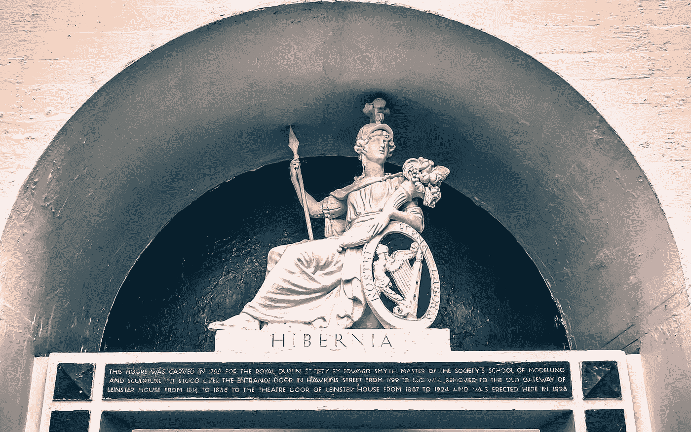

k .米奇·霍奇在 [Unsplash](https://unsplash.com?utm_source=medium&utm_medium=referral) 上拍摄的照片

## 介绍

不久前，我开始尝试“图像字幕”的问题。这里，目的是为给定的图像生成文本描述。类似于一个人如何向他的同伴描述一幅画。正如在实验中经常发生的那样，你不会直接得到最佳解决方案——你会尝试、犯错、改进自己，然后最终得到一个不错的解决方案。这正是我对这个项目的探索。在本文中，我想介绍我是如何开始解决这个问题的，偶然发现一个不太好的解决方案，但最终达到了“足够好”的状态。所以，让我们开始吧！

## 问题定义

如前所述，任务是为图像生成自然语言描述或标题。这个问题非常有趣，因为它是两个领域的结合——计算机视觉(CV)和自然语言处理(NLP)。因此，要想出一个手写的高级解决方案，我们需要这样做——将图像作为输入，用 CV 做一些魔术，用一个做一些 NLP 魔术的块修补它，并期望文本描述作为输出。听起来很简单，对吗？让我们试试这个。😃

## 资料组

在深入研究技术细节之前，让我们花一些时间来理解我们的数据集——“Flickr 8k”。它由 8091 个图像(大小不同)组成，每个图像有 5 个不同的标题，因此标题总数为 8091*5=40455。我们有一个图像文件夹(包含所有的图像)，和一个标题文本文件(CSV 格式)，将每张图像映射到它的 5 个标题。首先，让我们看看字幕文件是什么样子的，

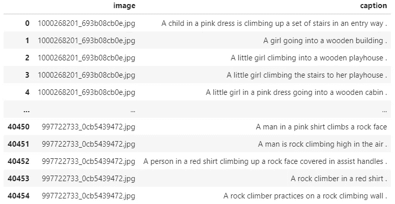

标题 CSV(按作者)

让我们也来看一些图片和它们各自的标题，

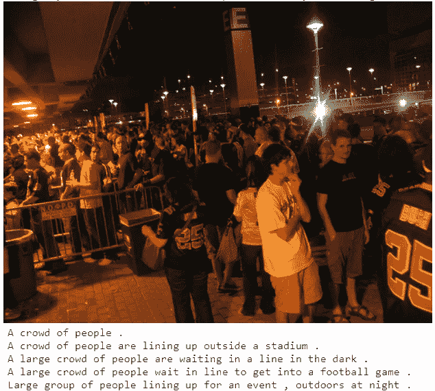

带标题的示例图像(由作者提供)

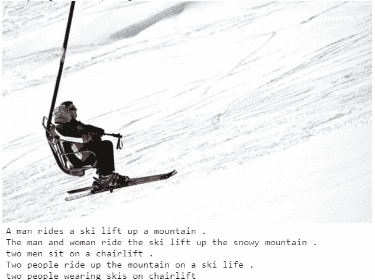

带标题的示例图像(由作者提供)

## 模型架构——第一次尝试

拐弯抹角说够了，让我们来形式化我们将用来解决这个问题的神经网络模型的架构。正如我们已经讨论过的，整个流程看起来会像这样，

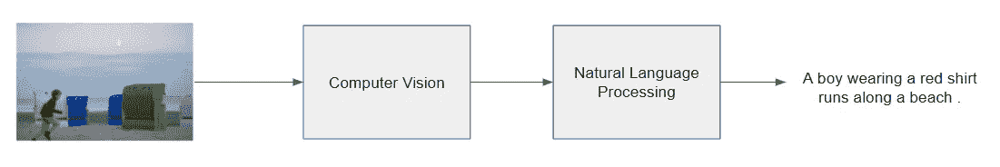

我们将在本文中创建的解决方案的高级流程(按作者)

现在选择第一部分，也就是说，首先，我们要用计算机视觉来处理图像。这种“处理”通俗的解释就是把一个图像作为输入，转换成矢量表示。在这样做的同时，希望网络将学习到字幕所需的重要信息，而忘记不相关的信息。所以我们希望图像作为输入，向量作为输出。在 CV 中最常见的方法是使用卷积神经网络。详细讨论 CNN 超出了本文的范围，但是为了简单的细节，我将建议[这个](https://stanford.edu/~shervine/teaching/cs-230/cheatsheet-convolutional-neural-networks)。首先，为了测试 waters，我们可以创建简单的 CNN 图层。代码如下所示，

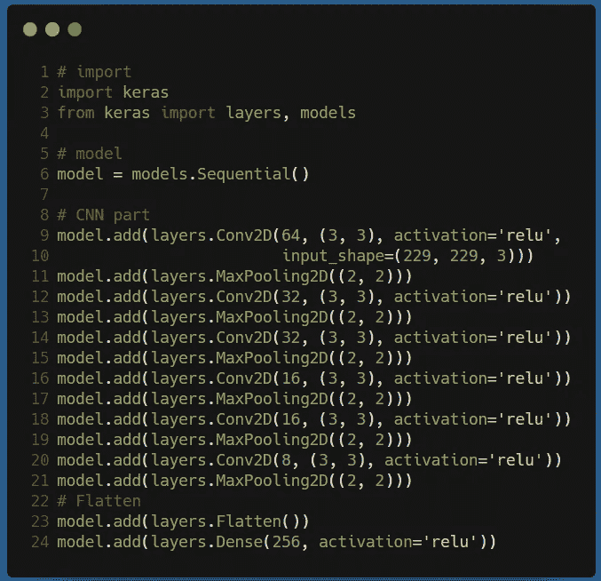

CNN 部分的代码(按作者)

理解代码，

*   **第 6 行:**初始化顺序 Keras 模型
*   **第 9–21 行:**你可以看到一对多次使用的`Conv2D`和`MaxPooling2D`层。这是定义 CNN 模型最常见的方式之一。
*   第 23 行:我们展平最后一层，创建一个矢量作为图像表示。
*   **第 24 行:**这是最终的 CNN 图层，我们已经将图像表示缩减为 256D 大小的矢量。

接下来，我们希望将这个向量表示输入到 NLP 模块中，该模块将生成输出文本描述。为此，我们可以使用 LSTM，这是一个递归层类型的神经网络。它可以很好地处理任何序列数据，其中它处理序列的每个元素并生成各自的向量表示。更多细节，我会建议[这篇](https://stanford.edu/~shervine/teaching/cs-230/cheatsheet-recurrent-neural-networks#architecture)和[这篇](/a-practical-guide-to-rnn-and-lstm-in-keras-980f176271bc)文章。所以如果你看到，我们的描述，也就是文本，遵循连续的顺序，因此非常适合递归型 NN。所以我们需要文本作为输出，因此 LSTM 将图像向量作为输入，并给出向量表示，我们将使用 softmax 函数将其转换为单词。这将使字幕写作模型成为一个分类模型，在每一步中，我们将预测每个单词的概率，并选择具有最高值的一个。这将在所有步骤中重复(LSTM 模型的大小，通常是固定文本描述的大小)。NLP 解码器模块可以被编码为，

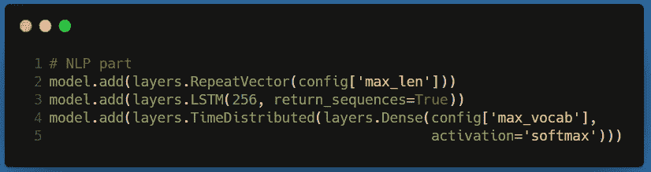

NLP 部分的代码(按作者)

理解代码，

*   **第 2 行:**由于 LSTM 层需要输入到它的所有步骤，我们将重复图像向量并将其传递到 LSTM 的所有步骤作为输入。这里的步长是`config['max_len']` (=39)。
*   **第三行:**LSTM 层。`return_sequence`为真，因为我们希望返回所有步骤的输出。
*   **第 4–5 行:**对于每一步，我们将把向量表示传递给一个密集层，该层充当分类器部分，并挑选一个`config['max_vocab']` (=10k)单词。在所有的步骤中这样做，我们将得到我们的标题！

如果你对`max_vocab`和`max_len`感到困惑，不要担心，在下一节中它会变得清晰。

## 数据准备和数据生成器

现在我们已经修复了我们的架构，让我们看看如何处理数据加载并使用它来训练模型。首先要做的是转换文本数据。代码如下所示，

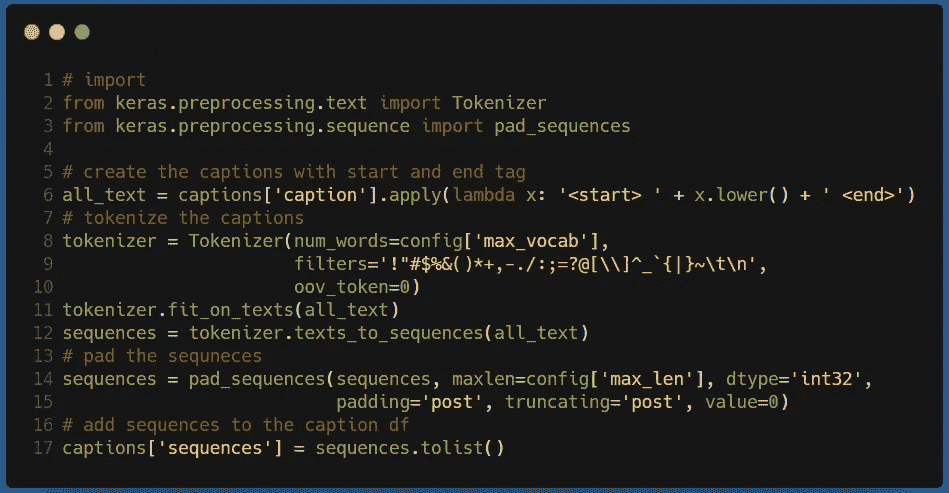

清理、标记和填充标题文本(按作者)

理解代码，

*   **第 6 行:**为我们的每个标题添加前缀<开始>和后缀<结束>。这将使我们的递归模块更容易了解标题的边界。
*   **第 8–12 行:**我们在这里做了很多事情。总的来说，我们希望将文本从单词序列转换为数字序列，因为数字是神经网络所能理解的。在此之前，我们还(1)删除非字母字符，(2)仅考虑`config['max_vocab']` (=10k)唯一的单词，以及(3)将任何其他单词表示为 0。
*   **第 14–15 行:**我们想让每个序列(标题用数字符号表示)长度相同，为此我们填充较小的序列来匹配最大的序列`config['max_len']` (=39)。这会用 0 填充较小序列的右侧。

预处理完成后，我们就可以创建数据生成器了，它将加载数据并将其传递给模型进行训练。

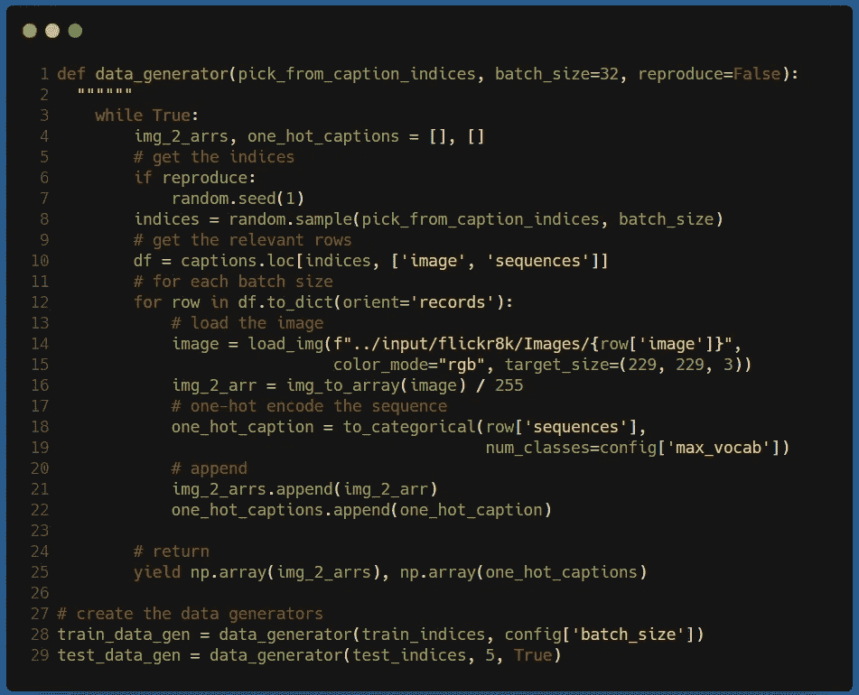

数据生成器(按作者)

理解代码，

*   **第 1 行:**我们的函数接受以下输入，(1) `pick_from_caption_indices`:我们可以从中随机采样的标题的索引，(2) `batch_size`:一次返回的(图像，标题)对的数量，以及(3) `reproduce`:设置随机种子的标志，以便我们返回相同顺序的(图像，标题)对。
*   **第 2 行:**因为这是一个数据生成器，所以函数会不断迭代。因此这里出现了无限循环。另外，请注意第 25 行的`yield`使这成为可能。
*   **第 8–10 行:**从字幕 CSV 中随机抽取字幕及其相应图像的路径。
*   **第 12 行:**我们重复下面的过程，直到(图像，标题)对等于`batch_size` (=32)。
*   **第 14–16 行:**从驱动器加载图像，并将其调整为(229，229，3)形状。这将确保每个图像的大小相同。此外，我们通过保留所有 3 个通道来保留颜色信息。接下来，我们还将图像像素值归一化到 0 和 1 之间。
*   **第 18–19 行:**将序列数据(来自预处理)转换为一键编码，以便进行分类。它接受一个长度为 39 的数字序列，并返回一个大小为(39，10000)的矩阵。这是因为我们的最大词汇大小是 10k，所以对于序列的每一步，我们创建一个 10k 大小的向量，除了该步的数字之外，其他地方都是 0。
*   **第 28–29 行:**创建两个数据生成器，一个用于训练，另一个用于测试。注:对于测试，我们有`reproduce=True`,因为无论是模型还是试验，我们都希望测试相同的数据。此外，`train_indices`和`test_indices`可以通过从标题 CSV 中抽取 80%的索引来轻松创建(更多细节见[代码](https://www.kaggle.com/evilmage93/image-captioning-on-flickr8k)

## 培训和结果— v1

现在我们已经准备好了模型和数据生成器，让我们来训练模型。在这里，我们所要做的就是定义一些回调函数并编写训练程序。代码如下所示，

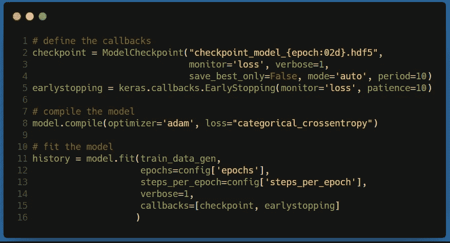

培训脚本(作者)

理解代码，

*   **第 2–4 行:**检查点回调，保存过去 10 个时期的最佳模型。
*   **第 5 行:**提前停止回调，如果我们在 10 个时期内没有看到任何显著的进步，则停止训练。
*   **第 8 行:**通过定义优化器和损失函数来编译模型。
*   **第 11–16 行:**使用`fit`功能训练模型。它接受以下输入，(1)训练数据生成器，(2)要训练的最大时期(这里是 100)，(3)每个时期的步骤(这里是 1000)，(4)进度详细级别，以及(5)定义的回调。

训练会花一些时间，但是对于支持 GPU 的系统来说，会快很多。对我来说，训练过程在 25 个纪元后停止，损失约为 1.65。这个完整的过程大约需要 2 小时 30 分钟。

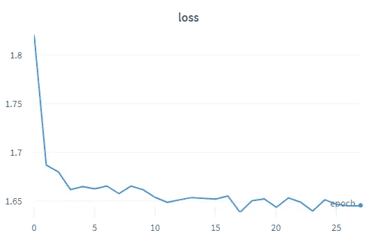

v2(按作者)的历元(x 轴)上的训练损失(y 轴)

现在我的期望很低，但我仍然很好奇，想看看结果。退一步说，结果并不太好😅。

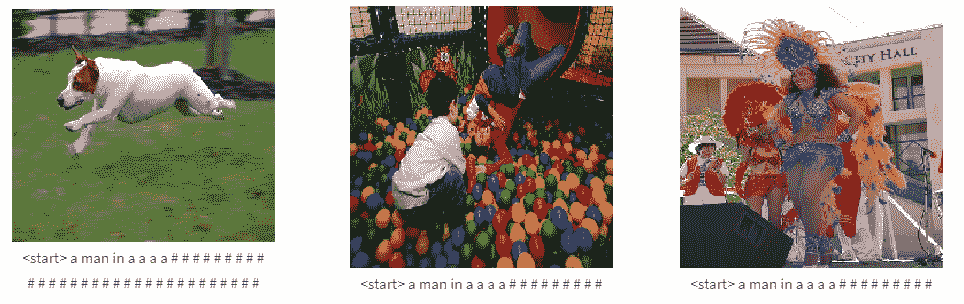

v1 的样本测试图像结果(由作者提供)

似乎我们的模型学习的只是一个单一的模式，所有的图像都预测到了同样的模式。这很糟糕，但是你注意到描述总是以一个<start>标记开始吗！至少模型那东西没错。😃</start>

## 丰富

现在的问题是——为了改善结果，我们接下来应该修改什么，CV 部分还是 NLP 部分？经过一番阅读，我得出了这个结论——为什么不两者都要呢？这是我接下来做的，

*   **计算机视觉** — **使用已经在大型图像数据集上训练过的预训练模型**。这种将在一项任务中训练的模型用于另一项任务的过程被称为“迁移学习”。这里的主要思想是，预先训练的模型为新任务提供了推动力，因为它已经学会了从图像中提取重要的特征。把这想象成创建一个网络，而不是用随机数初始化权重，我们使用以前工作过的预训练权重。Keras 包在其应用部分提供了几个这样的预训练模型。我们使用“**exception**”预训练模型，它很小，但具有相当好的准确性。

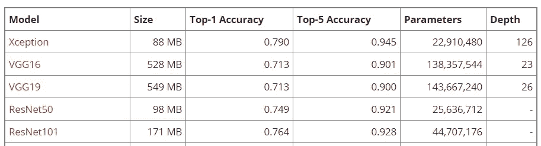

来自 [Keras 应用网站](https://keras.io/api/applications/)的前 5 个预培训应用。(作者)

*   **自然语言处理** — **使用双向 LSTM** 被证明可以改善序列数据编码。双向 LSTM(或 biLSTM)基本上是一个堆叠在另一个之上的 LSTM，但有一个扭曲。一个 LSTM 从左到右处理序列，而另一个以相反的方向处理。因此，我们得到了一个方向不可知的嵌入。我会建议[这篇](/guide-to-custom-recurrent-modeling-in-keras-29027e3f8465)文章(自私的自我推销😃)，它比较了一个简单分类任务的不同重现图层。

在 Keras 中执行这些修改非常容易，新的模型定义脚本如下所示(适用于 CV 和 NLP)

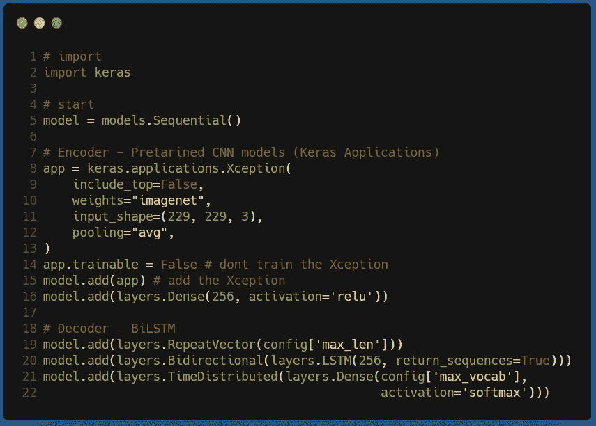

修改后的型号代码(作者)

理解代码，

*   **第 8–16 行:**我们加载**异常**应用程序，并将其附加到模型上。我也使这一层不可训练。最后，我添加了一个 256D 的密集层，以获得最终的翻译图像。
*   **第 19–21 行:**一切都和以前一样，除了第 20 行，我在那里添加了双向 LSTM。

## 培训和结果— v2

训练代码和以前一样。这次模型训练了超过 75 个纪元，用了~7 个小时！损失值也突破了 1 大关。

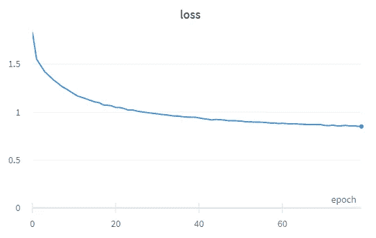

v2(按作者)的历元(x 轴)上的训练损失(y 轴)

这一次我真的支持这个模型，让我们看看同样的测试图片的标题是什么样子的。

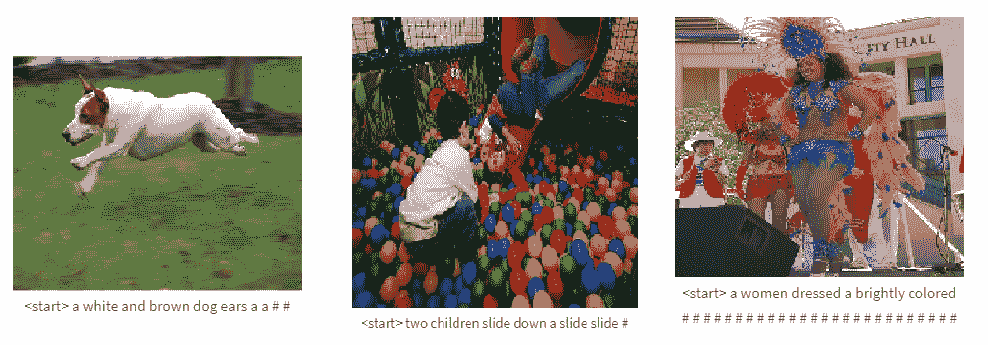

v2 的样本测试图像结果(由作者提供)

这个比上一个好多了！想想我们的模型只有 15 行代码！我认为我们可以在这里停止，至少现在。

## 下一步是什么？

即使结果很好，也不是完美的。如果你仔细观察，标题不是以<end>符号结束的。此外，虽然字幕的开头很好，但在字幕的过程中，它变得有点没有意义。因此，有很大的改进空间。我有以下想法，我想接下来尝试一下，</end>

*   **CV:** (1)从 Keras 应用列表中尝试更好的预训练模型。(2)使预训练的模型可训练(将增加参数和时间，但是也应该增加精度)，(3)在应用层之后添加更多可训练的 FC 层，等等。
*   **NLP:** (1)使用多个 biLSTM 栈，(2)使用 attention 或 transformers 或 BERT

## 结论

学习是一个持续的过程，只有当你真的生病了，或者像我一样，周末即将结束时，你才应该停下来😅。这篇文章背后的想法不是展示最好的图像字幕解决方案，而是通过人工智能/人工智能解决问题的过程。目的是向读者介绍实验的想法，并推动他们不只是复制解决方案，而是尝试创造自己的解决方案。对我来说也是如此，因为我认为试图在一个系统的流程中处理问题确实有助于人们将问题内在化。

无论如何，我选择了这个问题，因为它是两个不同领域的结合——CV 和 NLP。因此，它有可能帮助我同时应用这两个领域的知识。这就像是一石二鸟。希望这有所帮助！

本文中使用的代码可从[这里](https://www.kaggle.com/evilmage93/image-captioning-on-flickr8k)获得。随意发挥，随意修改。

你可以在 [LinkedIn](https://www.linkedin.com/in/imohitmayank/) 上和我联系。

干杯。