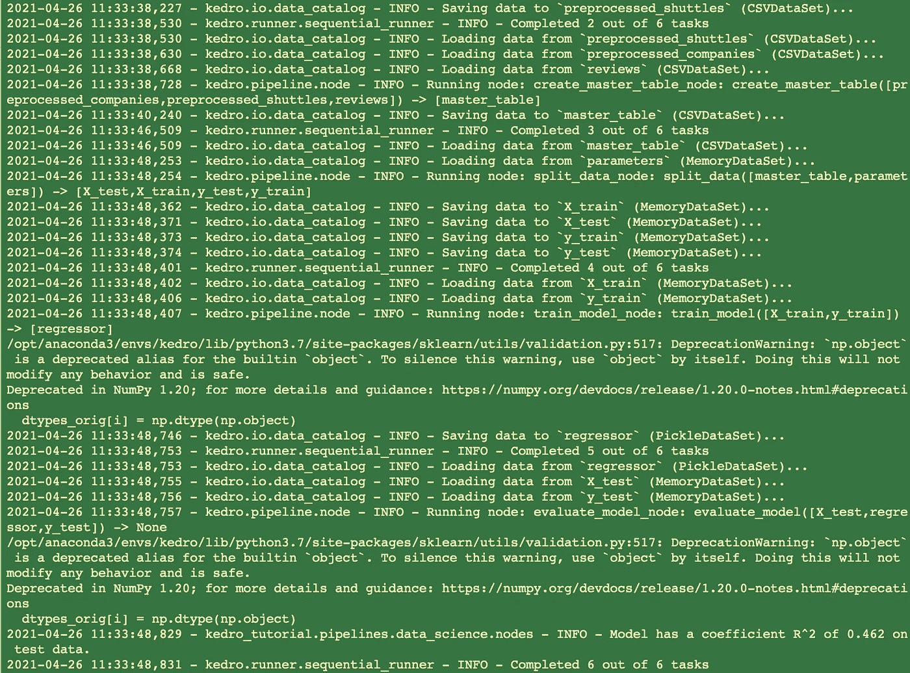

# 学你一个凯卓*

> 原文：<https://towardsdatascience.com/learn-you-some-kedro-be67d4fc0ce7?source=collection_archive---------6----------------------->

## 编写可复制、可维护和模块化的数据科学代码

**向* [*致敬，学你一个哈斯克尔好了！*](http://learnyouahaskell.com/chapters)

*拿杯咖啡坐下。这是一个很长的帖子！*

**

*https://flic.kr/p/d9KiHk，段丽阳·本田在 Flickr 上的拿铁艺术(CC BY-SA 2.0)*

*在本文中，我将介绍 Kedro，这是一个开源的 Python 框架，用于创建可复制、可维护和模块化的数据科学代码。在简要描述了它是什么以及为什么它可能成为每个数据科学家工具链的标准部分之后，我描述了一些技术性的 Kedro 概念，并通过一个教程说明了如何使用它们。*

> *总的来说，你应该能够在 30 分钟内阅读并消化这篇文章。但是使用 Kedro 的好处将会持续你的职业生涯。*

*假设你是一名数据科学家，为一名为公司做出关键财务决策的高管工作。她请你提供一个特别的分析，当你这样做时，她感谢你为她的计划提供了有用的见解。太好了！*

*三个月后，新晋升的主管，现在是你的首席执行官，要求你在下一次计划会议上重新运行分析…而你不能。代码被破坏是因为您覆盖了文件的一些关键部分，并且您不记得当时使用的确切环境。或者，代码可能是好的，但它在一个大的 Jupyter 笔记本中，所有文件路径都是硬编码的，这意味着您必须费力地检查和更改每一个新数据输入。哎呀！那不太好！*

*它发生了。可能比应该的更频繁。当它发生时，通常的说法是最初的项目没有被规划到一个高标准，因为它不是为生产系统设计的。*

*但是……任何支持业务决策过程的代码都应该被认为是生产代码！*

*当然，如果你是一名数据科学家，你可能不认为你工作的主要产出是代码。但是你的项目仍然使用代码，为什么不利用软件工程师来之不易的经验呢？希望您的项目至少具备以下特征:*

*   ***它应该被版本化**——使用 [git](http://rogerdudler.github.io/git-guide/) 或类似的工具定期保存您的更改，无论您是独自工作还是在团队中工作。*
*   ***它应该是可复制的**——你应该能够将一个项目转移到另一台计算机上，然后毫不费力地运行它。*
*   ***它应该遵循标准**——坚持通用的项目结构、标准的编码约定和工具，以便未来的协作和更好的团队合作。*
*   ***它应该被记录** —使用自动化文档来保持你的文档与你的代码保持同步。*
*   ***它应该是模块化的**——代码可以很容易地执行和测试。*

*关于这些原则的更多细节，请看 Thomas Huijskens 的一篇有用的博客文章。*

# *介绍 Kedro*

*Kedro 帮助您创建可复制、可维护和模块化的数据科学代码。它从软件工程中借用概念，并将它们应用到机器学习代码中；应用的概念包括模块化、关注点分离和版本控制。*

# ***Kedro 概念***

*首先，让我们用一个传统的“Hello World”例子来研究 Kedro 的最基本的元素，这个例子被分成几个部分。你可以在 Kedro 词汇表中找到更多关于这些概念的信息。*

## ***节点***

*节点是 Python 函数的包装器，用于命名该函数的输入和输出。节点是管道的构建块，您可以链接它们，这样一个节点的输出就是另一个节点的输入。*

*这里，一个名为`return_greeting_node`的节点没有输入，只有一个输出(`my_salutation`)。它封装了函数(`return_greeting`):*

```
*# Prepare first node
def return_greeting():
    return “Hello”return_greeting_node = node(func=return_greeting, inputs=None, outputs=”my_salutation”)*
```

*这里，名为`join_statements_node`的第二个节点命名为单输入(`my_salutation`)和单输出(`my_message`)。它封装了函数(`join_statements`):*

```
*# Prepare second node
def join_statements(greeting):
    return f”{greeting} Kedro!”join_statements_node = node(join_statements, inputs=”my_salutation”, outputs=”my_message”)*
```

*注意`my_salutation`是`return_greeting_node`的 ***输出*** ，也是`join_statements_node`的 ***输入*** 。*

## ***管道***

*Kedro 管道组织了一组节点的依赖关系和执行顺序。在这个例子中，流水线在执行`join_statements_node`之前执行`return_greeting_node`:*

```
*# Assemble nodes into a pipeline
pipeline = Pipeline([return_greeting_node, join_statements_node])*
```

## ***数据目录***

*Kedro `DataCatalog`是项目可以使用的所有数据源的注册表。它将节点输入和输出的名称映射为一个`DataSet`中的键，这是一个 Kedro 类，可以专门用于不同类型的数据存储。Kedro 为简单存储在内存中的数据使用了一个`MemoryDataSet`,它还为不同的文件类型和文件系统提供了[不同的内置数据集](https://kedro.readthedocs.io/en/stable/kedro.extras.datasets.html#data-sets),因此您不必编写读/写数据的逻辑:*

```
*# Prepare a data catalog
data_catalog = DataCatalog({“my_salutation”: MemoryDataSet()})*
```

## ***转轮***

*Runner 是运行管道的对象。Kedro 解析执行节点的顺序:*

1.  *Kedro 首先执行`return_greeting_node`。这将运行`return_greeting`，它不接受任何输入，但输出字符串“Hello”。*
2.  *Kedro 将输出字符串存储在名为`my_salutation`的`MemoryDataSet`中。*
3.  *Kedro 然后执行第二个节点`join_statements_node`。这会加载`my_salutation`数据集并将其注入到`join_statements`函数中。*
4.  *该函数用“Kedro！”加入输入的问候语以形成输出字符串“Hello Kedro！”*
5.  *Kedro 在字典中返回管道的输出，关键字为`my_message`。*

## *你好，凯卓！*

*现在是时候把所有东西缝合在一起了。以下是完整的示例:*

*如果您将这个示例放入一个文件，例如`hello_kedro.py`，并在终端(`python hello_kedro.py`)中运行它，您应该看到`{‘my_message’: ‘Hello Kedro!’}`被打印到控制台。*

# ***开始吧！***

*现在你对这些概念有了一个基本的理解，为什么不安装 Kedro 并试用一下呢？大多数人从 Kedro spaceflights 教程开始，你可以在文档中找到，但为了简化它，我在下面创建了一个简短的版本。*

*参考 Kedro 文档中的[安装先决条件。准备好之后，运行以下命令从 Python 包索引(PyPI)安装:`pip install kedro`](https://kedro.readthedocs.io/en/stable/02_get_started/01_prerequisites.html)*

*检查是否安装了 Kedro:`kedro info`*

*您应该会看到一个 ASCII 艺术图形和 Kedro 版本号。*

**

*如果您没有看到显示的图形，或者您的安装有任何问题，请参见常见问题或 [Kedro 社区对 Discord 的支持](https://discord.com/invite/zBTyPeRN5R)。更多信息，请查看关于安装 Kedro 的[文档。](https://kedro.readthedocs.io/en/stable/02_get_started/02_install.html)*

# ***Kedro spaceflights 教程***

*在本教程中，您将通过一个示例了解 Kedro 项目开发工作流的每个步骤，该示例为以下价格预测场景构建节点和管道:*

*现在是 2160 年，太空旅游业正在蓬勃发展。在全球范围内，有数千家航天飞机公司将游客送上月球并返回。你已经能够找到每架航天飞机提供的便利设施、顾客评论和公司信息。*

**您想要构建一个模型来预测每次登月旅行以及相应的返程航班的价格。**

> *Y 您将需要大约 20 分钟来完成本教程，它使用 Kedro starter 为您创建 spaceflights 项目，然后遍历最重要的代码部分，将它们与您在上面学到的概念联系起来。*

## ***设置项目***

*我们假设您已经安装了 Kedro，如上所述。首先，使用[Kedro starter for the space flights 教程](https://github.com/quantumblacklabs/kedro-starters/tree/master/spaceflights) : `kedro new --starter=spaceflights`在您喜欢的工作目录中创建您的项目*

*当您使用它时，您将拥有一个完整的工作项目，所有的代码和数据都已设置好并准备好运行。*

*你可以随意命名你的项目，但是这里我们假设它叫做 **Kedro 教程**。*

*出现提示时，保留 repo_name ( `kedro-tutorial`)和 python_package ( `kedro_tutorial`)的默认名称。*

*接下来，使用 Kedro 安装特定于项目的依赖项。导航到项目的根目录并运行:`kedro install`*

*Kedro 管理您的项目的依赖项，使其他人更容易运行该项目。它避免了版本冲突:Kedro 确保你们都使用相同的 Python 包和版本。你可以在 Kedro 文档中找到更多关于[如何处理项目依赖关系的信息。](https://kedro.readthedocs.io/en/stable/04_kedro_project_setup/01_dependencies.html)*

> **此时，您可以运行项目，看看会发生什么。因此，如果您想向前跳，请向下滚动到“测试管道”部分。**

## ***设置数据***

*spaceflights 教程使用了公司的虚拟数据集，将客户往返于月球。您将使用这些数据训练一个模型来预测班车租赁的价格。但是，在开始训练模型之前，您需要为模型构建准备数据。*

*航天教程有三个文件，使用两种数据格式:`.csv`和`.xlsx`。你会在你的项目目录的`data/01_raw/`文件夹中找到原始数据:*

*   *`[reviews.csv](https://quantumblacklabs.github.io/kedro/reviews.csv)`*
*   *`[companies.csv](https://quantumblacklabs.github.io/kedro/companies.csv)`*
*   *`[shuttles.xlsx](https://quantumblacklabs.github.io/kedro/shuttles.xlsx)`*

*数据集需要注册，以便 Kedro 可以加载它们。所有 Kedro 项目都有一个`conf/base/catalog.yml`文件，在示例中，您将看到 starter 在该文件中添加的每个数据集:*

*   *文件位置(路径)*
*   *给定数据集的参数*
*   *数据类型*
*   *版本控制*

*对于`csv`数据集:*

```
*companies:
type: pandas.CSVDataSet
filepath: data/01_raw/companies.csvreviews:
type: pandas.CSVDataSet
filepath: data/01_raw/reviews.csv*
```

*对于 xlsx 数据集:*

```
*shuttles:
type: pandas.ExcelDataSet
filepath: data/01_raw/shuttles.xlsx*
```

*要确认 Kedro 可以正确加载数据，请打开一个 Kedro iPython 会话(`kedro ipython`)并运行以下命令:*

```
*companies = catalog.load(“companies”)
companies.head()
shuttles = catalog.load(“shuttles”)
shuttles.head()*
```

*该命令加载每个数据集。pandas 的 head 方法显示数据帧的前五行。*

*完成后，关闭 iPython 会话:`exit()`*

*接下来，我们将为项目设置两条模块化管道:*

*   *`data_processing_pipeline`预处理数据*
*   *`data_science_pipeline`创建特征，训练和评估模型。*

## ***数据处理模块流水线***

*让我们看一下用于预处理三个输入数据集以创建主表并为建模准备数据的示例节点。*

*在`src/kedro_tutorial/pipelines/data_processing/nodes.py`中，您将看到两个函数:(`preprocess_companies`和`preprocess_shuttles`)，每个函数输入一个原始数据帧并输出一个包含预处理数据的数据帧:*

*您将在`src/kedro_tutorial/pipelines/data_processing/pipeline.py`内的`create_pipeline()`中找到两种功能的节点，以及用于数据处理的模块化管道:*

*注:公司和班车指的是`conf/base/catalog.yml`中定义的数据集。这些是`preprocess_companies`和`preprocess_shuttles`功能的输入。Kedro 管道使用命名的节点输入(和输出)来确定节点之间的相互依赖关系，从而确定它们的执行顺序。*

*每个节点输出一个新的数据集(`preprocessed_companies`和`preprocessed_shuttles`)。Kedro 的`DataCatalog`将自动保存数据集(在本例中为`csv`数据)。*

*在上面的管道中，您将看到另一个节点`create_master_table()`，它在`src/kedro_tutorial/pipelines/data_processing/nodes.py`中将三个数据帧连接成一个主表:*

*Kedro 使用从数据集`preprocessed_shuttles`、`preprocessed_companies`和`reviews`加载的数据调用`create_master_table()`，并将输出保存到`dataset master_table`。*

## ***面向数据科学的模块化管道***

*现在让我们看看用于价格预测的数据科学管道，它使用来自 [scikit-learn](https://scikit-learn.org/stable/) 库的 [LinearRegression](https://scikit-learn.org/stable/modules/generated/sklearn.linear_model.LinearRegression.html) 实现。*

*您将在`src/kedro_tutorial/pipelines/data_science/nodes.py`中看到三个数据科学功能:*

*输入参数在配置文件`conf/base/parameters.yml`中:*

```
*test_size: 0.2
random_state: 3
features:
- engines
- passenger_capacity
- crew
- d_check_complete
- moon_clearance_complete
- iata_approved
- company_rating
- review_scores_rating*
```

*这些是管道执行时输入到`DataCatalog`的参数。参数`test_size`和`random_state`被用作训练测试分割的一部分，而 features 给出了主表中用作特性的列的名称。*

*训练好的模型被保存为数据集(见`conf/base/catalog.yml`):*

```
*regressor:
type: pickle.PickleDataSet
filepath: data/06_models/regressor.pickle
versioned: true*
```

*数据科学的模块化管道在`src/kedro_tutorial/pipelines/data_science/pipeline.py`中创建:*

***合并管道***

*数据处理和数据科学管道被添加到`register_pipelines within src/kedro_tutorial/pipeline_registry`的项目中:*

*在`“__default__”: data_processing_pipeline + data_science_pipeline`中使用的`__default__ key`将两个模块化管道合并成一个项目默认管道。*

**注意:*将管道添加在一起的顺序并不重要，并且`data_science_pipeline + data_processing_pipeline`将产生相同的管道，因为 Kedro 自动检测结果管道中所有节点的正确执行顺序。*

# ***测试管道***

*运行管道:`kedro run`*

*您应该会看到类似下面的输出(可能会有一些警告):*

**

# ***总结***

*在本教程中，我们展示了一个标准的 Kedro 开发工作流程:*

***1。** [**项目模板**](https://kedro.readthedocs.io/en/stable/03_tutorial/02_tutorial_template.html)*

*我们用 kedro new 创建了一个新项目，用`kedro install`安装了项目依赖项(完整教程也谈到了配置)*

***2。** [**数据**](https://kedro.readthedocs.io/en/stable/03_tutorial/03_set_up_data.html)*

*我们将数据添加到`data/`文件夹，并在`conf/base/catalog.yml`中引用项目的输入数据集*

***3。** [**管道**](https://kedro.readthedocs.io/en/stable/03_tutorial/04_create_pipelines.html)*

*我们将数据转换步骤创建为 Python 函数(节点)，构建模块化管道并将它们合并到一个项目管道中。为了简洁起见，我们没有介绍如何[可视化你的管道](https://kedro.readthedocs.io/en/stable/03_tutorial/06_visualise_pipeline.html)。*

# *哇，那是一些长的教程！*

*抱歉，是的，就是它！在 Kedro 文档中有更多的细节，如果你想更深入地了解正在发生的事情，或者如果你在运行这个例子时有任何问题，你会发现它很有用:*

*   *[Kedro 简介](https://kedro.readthedocs.io/en/stable/01_introduction/01_introduction.html)*
*   *[本教程加长版](https://kedro.readthedocs.io/en/stable/03_tutorial/01_spaceflights_tutorial.html)*
*   *[API 参考](https://kedro.readthedocs.io/en/stable/kedro.html)*
*   *[Kedro Github 回购](https://github.com/quantumblacklabs/kedro)*
*   *[Kedro 社区更新](https://medium.com/quantumblack/the-latest-and-greatest-in-kedro-were-growing-our-community-c868825b0cb4)*

# *承认*

*Spaceflights 的例子是基于 2019 年 QuantumBlack Labs 的 Kedro 团队编写的教程。没有他们我什么都做不了。非常感谢 QB 实验室的 [Yetunde Dada](https://github.com/yetudada) 、 [Ivan Danov](https://github.com/idanov) 、 [Dmitrii Deriabin](https://github.com/dmder) 、 [Lorena Balan](https://github.com/lorenabalan) 、 [Kiyohito Kunii](https://github.com/921kiyo) 、 [Merel Theisen](https://github.com/MerelTheisenQB) 以及其他加入团队的人。*