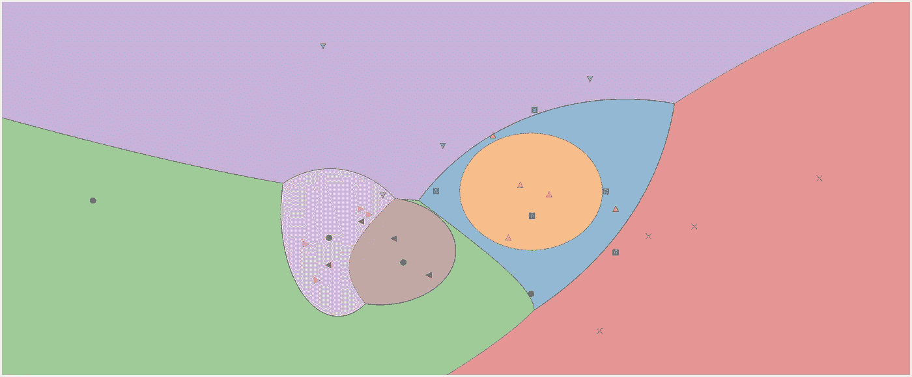
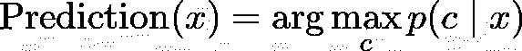
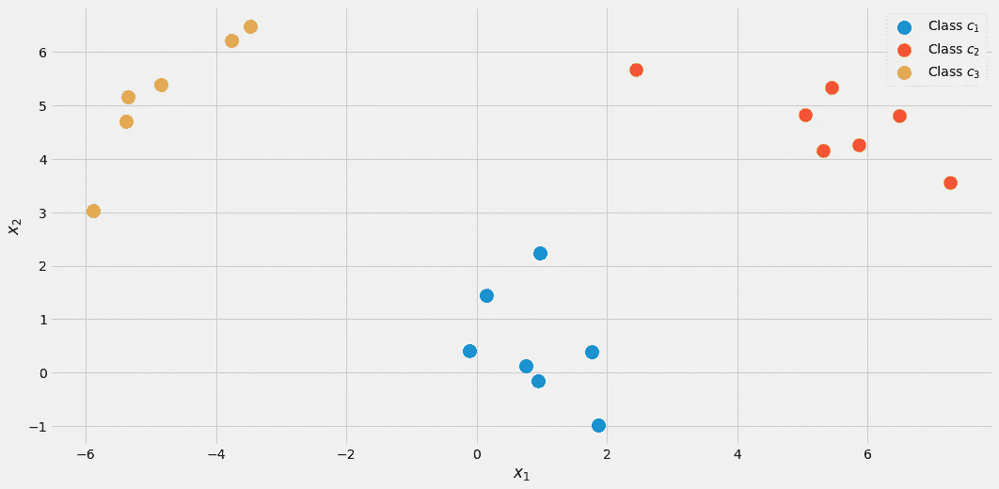
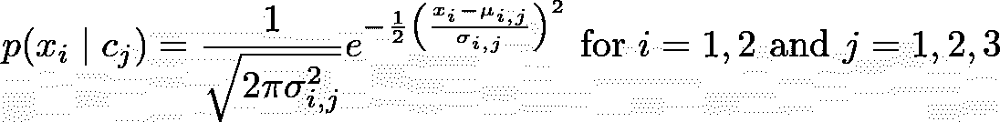
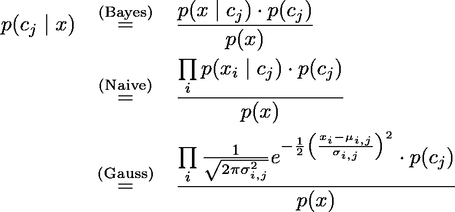
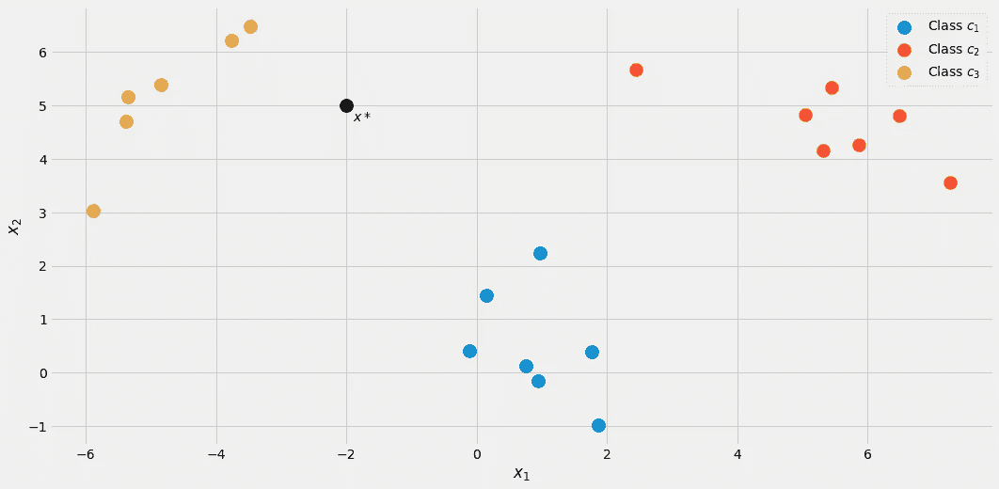
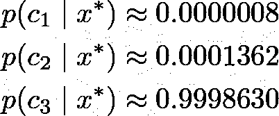
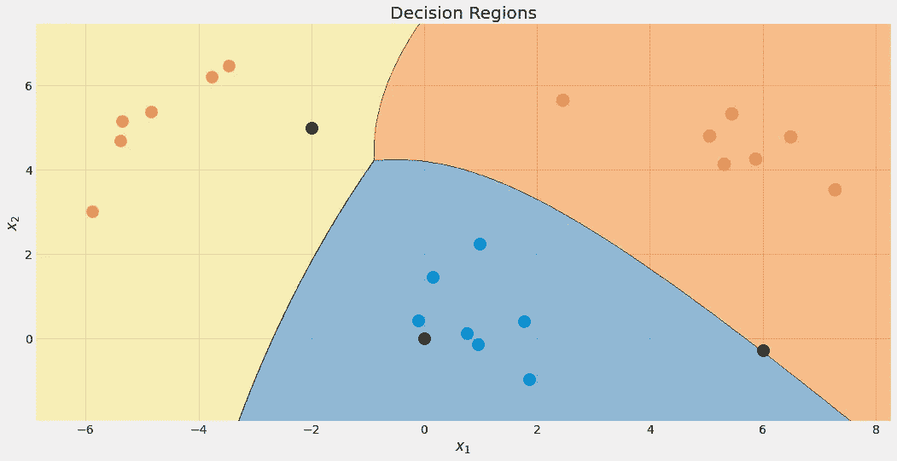

# 通过实现来理解:高斯朴素贝叶斯

> 原文：<https://towardsdatascience.com/learning-by-implementing-gaussian-naive-bayes-3f0e3d2c01b2?source=collection_archive---------8----------------------->

## 建立你自己的模型

## 了解高斯朴素贝叶斯的工作原理，并在 Python 中实现它



高斯朴素贝叶斯分类器的决策区域。图片由作者提供。

我认为这是每个数据科学职业生涯开始时的经典之作:*朴素贝叶斯分类器*。或者我应该说是朴素贝叶斯分类器的*家族*，因为它们有很多种风格。例如，有一个多项式朴素贝叶斯，一个伯努利朴素贝叶斯，还有一个高斯朴素贝叶斯分类器，每个分类器只有一个小细节不同，我们会发现。朴素贝叶斯算法在设计上非常简单，但在许多复杂的现实情况中证明是有用的。

在本文中，您可以了解到

*   朴素贝叶斯分类器如何工作，
*   为什么以他们的方式定义他们是有意义的
*   如何使用 NumPy 在 Python 中实现它们。

> 你可以在 [my Github](https://github.com/Garve/TDS/blob/main/TDS%20-%20Gaussian%20Naive%20Bayes.ipynb) 上找到代码。

检查一下我的贝叶斯统计初级读本[可能会有所帮助，这是对贝叶斯推理的温和介绍](/a-gentle-introduction-to-bayesian-inference-6a7552e313cb)以习惯贝叶斯公式。因为我们将以 scikit learn-conform 的方式实现分类器，所以也值得看看我的文章[构建您自己的定制 scikit-learn 回归](/build-your-own-custom-scikit-learn-regression-5d0d718f289)。然而，scikit-learn 的开销很小，无论如何您都应该能够跟上。

我们将开始探索朴素贝叶斯分类的惊人简单的理论，然后转向实现。

# 该理论

分类时我们真正感兴趣的是什么？我们实际上在做什么，输入和输出是什么？答案很简单:

> 给定一个数据点 x，x 属于某类 c 的概率是多少？

这就是我们想要用**任何**分类来回答的所有问题。你可以直接把这个语句建模成条件概率:*p*(*c*|*x*)。

例如，如果有

*   3 班 *c* ₁、 *c* ₂、 *c* ₃，以及
*   *x* 由两个特征组成 *x* ₁， *x* ₂，

分类器的结果可能类似于 *p* ( *c* ₁| *x* ₁， *x* ₂)=0.3，
p(*c*₂|*x*₁， *x* ₂)=0.5 和*p*(*c*₃|*x*₁，*x*如果我们关心单个标签作为输出，我们将选择概率最高的一个，即 *c* ₂，这里概率为 50%。**

> 朴素贝叶斯分类器试图直接计算这些概率。

## 朴素贝叶斯

好，那么给定一个数据点 *x* ，我们要计算所有类 *c* 的*p*(*c*|*x*)，然后输出概率最高的 *c* 。在公式中，您通常会看到这种情况



图片由作者提供。

**注:**max*p*(*c*|*x*)返回最大概率，arg max*p*(*c*|*x*)返回概率最大的 *c* 。

但是在我们能够优化*p*(*c*|*x*)之前，我们必须能够计算它。为此，我们使用[贝叶斯定理](https://en.wikipedia.org/wiki/Bayes%27_theorem):


贝叶斯定理。图片由作者提供。

这是朴素贝叶斯的贝叶斯部分。但是现在，我们有了以下问题:什么是*p*(*x*|*c*)和 *p* ( *c* )？

> 这就是朴素贝叶斯分类器的训练。

## 培训

为了说明一切，下面让我们用一个有**两个真实特征** *x* ₁、 *x* ₂、**三个类** *c* ₁、 *c* ₂、 *c* ₃的玩具数据集。



可视化的数据。图片由作者提供。

您可以通过以下方式创建精确的数据集

```
from sklearn.datasets import make_blobs

X, y = make_blobs(n_samples=20, centers=[(0,0), (5,5), (-5, 5)], random_state=0)
```

让我们从**类概率** *p* ( *c* )开始，在标记的数据集中观察到某个类 *c* 的概率。估计这一点的最简单的方法是只计算类的相对频率，并使用它们作为概率。我们可以用我们的数据集来看看这到底意味着什么。

在数据集中，20 个点中有 7 个被标记为类别 *c* ₁(蓝色)，因此我们称之为*p*(*c*₁)=7/20.我们也有 7 点给职业 *c* ₂(红色)，因此我们设定*p*(*c*₂)=7/20.最后一班 *c* ₃(黄)只有 6 分，于是*p*(*c*₃)=6/20.

这种简单的类别概率计算类似于最大似然法。但是，如果您愿意，也可以使用另一个*previous*分布。例如，如果您知道这个数据集不代表真实的总体，因为类 *c* ₃应该出现在 50%的情况下，那么您设置 *p* ( *c* ₁)=0.25， *p* ( *c* ₂)=0.25 和 *p* ( *c* ₃)=0.5.任何有助于提高测试集性能的东西。

我们现在转向**可能性***p*(*x*|*c*)=*p*(*x*₁， *x* ₂| *c* )。计算这种可能性的一种方法是过滤标签为 *c* 的样本的数据集，然后尝试找到捕获特征 *x* ₁、 *x* ₂.的分布(例如，二维高斯分布)

> 不幸的是，通常情况下，我们没有足够的样本对每一类进行适当的可能性估计。

为了能够建立一个更健壮的模型，我们做了一个**天真的假设**假设特征 *x* ₁， *x* ₂是*随机独立的*，给定 *c* 。这只是通过一种奇特的方式使数学变得简单


图片由作者提供。

**为每一类*c*。这就是朴素贝叶斯的**朴素**部分的来源，因为这个等式一般不成立。尽管如此，即便如此，朴素贝叶斯理论在实践中也能产生良好的、有时是杰出的结果。特别是对于具有词袋特征的 NLP 问题，多项式朴素贝叶斯大放异彩。**

上面给出的参数对于你能找到的任何朴素贝叶斯分类器都是一样的。现在就看你怎么造型了*p*(*x*₁|*c*₁】，*p*(*x*₂|*c*₁】，*p*(*x*₁|*c*₂】，*p*()

如果你的特征只有 0 和 1，你可以使用一个[伯努利分布](https://en.wikipedia.org/wiki/Bernoulli_distribution)。如果它们是整数，一个[多项式分布](https://en.wikipedia.org/wiki/Multinomial_distribution)。然而，我们有真实的特征值，并决定为一个**高斯**分布，因此得名高斯朴素贝叶斯。我们假设以下形式



图片由作者提供。

其中， *μᵢ,ⱼ* 是平均值， *σᵢ,ⱼ* 是我们必须从数据中估计的标准偏差。这意味着我们为每个特征得到一个平均值 *i* 和一个类 *c* ⱼ *，*在我们的例子中是 2*3=6 个平均值。标准差也是如此。**这需要一个例子。**

让我们试着估计一下*₂,₁和* ₂,₁.因为 *j* =1，我们只对类别 *c* ₁感兴趣，让我们只保留带有这个标签的样品。以下样本仍然存在:

```
# samples with label = c_1
array([[ 0.14404357,  1.45427351],
       [ 0.97873798,  2.2408932 ],
       [ 1.86755799, -0.97727788],
       [ 1.76405235,  0.40015721],
       [ 0.76103773,  0.12167502],
       [-0.10321885,  0.4105985 ],
       [ 0.95008842, -0.15135721]])
```

现在，因为 *i* =2，我们只需要考虑第二列。 *μ* ₂,₁是该列的平均值， *σ* ₂,₁是该列的标准差，即 *μ* ₂,₁ = 0.49985176， *σ* ₂,₁ = 0.9789976。

如果你再次从上面看散点图，这些数字是有意义的。从图片中可以看到，₁*c*级样品的特征 *x* ₂在 0.5 左右。

我们现在为其他五个组合计算这个，我们完成了！😃

在 Python 中，可以这样做:

```
from sklearn.datasets import make_blobs
import numpy as np

# Create the data. The classes are c_1=0, c_2=1 and c_3=2.
X, y = make_blobs(n_samples=20, centers=[(0,0), (5,5), (-5, 5)], random_state=0)

# The class probabilities.
# np.bincounts counts the occurence of each label.
prior = np.bincount(y) / len(y)

# np.where(y==i) returns all indices where the y==i.
# This is the filtering step.
means = np.array([X[np.where(y==i)].mean(axis=0) for i in range(3)])
stds = np.array([X[np.where(y==i)].std(axis=0) for i in range(3)])
```

我们收到

```
# priors
array([0.35, 0.35, 0.3 ])# means 
array([[ 0.90889988,  0.49985176],
       [ 5.4111385 ,  4.6491892 ],
       [-4.7841679 ,  5.15385848]])# stds
array([[0.6853714 , 0.9789976 ],
       [1.40218915, 0.67078568],
       [0.88192625, 1.12879666]])
```

这是高斯朴素贝叶斯分类器的训练结果。

## 做预测

完整的预测公式是



图片由作者提供。

让我们假设一个新的数据点 *x*=* (-2，5)进来。



图片由作者提供。

为了查看它属于哪个类，让我们计算所有类的*p*(*c*|*x **)。从图片上看，它应该属于类 *c* ₃ = 2，但让我们看看。让我们暂且忽略分母 *p* ( *x* )。使用以下循环计算出 *j* = 1，2，3 的命名数。

```
x_new = np.array([-2, 5])

for j in range(3):
    print(f'Probability for class {j}: {(1/np.sqrt(2*np.pi*stds[j]**2)*np.exp(-0.5*((x_new-means[j])/stds[j])**2)).prod()*p[j]:.12f}')
```

我们收到

```
Probability for class 0: 0.000000000263
Probability for class 1: 0.000000044359
Probability for class 2: 0.000325643718
```

当然，这些*概率*(我们不应该这样称呼它们)并不等于 1，因为我们忽略了分母。然而，这没什么问题，因为我们可以把这些未标准化的概率除以它们的和，然后它们会加起来等于 1。因此，将这三个值除以它们的总和约为 0.00032569，我们得到



图片由作者提供。

正如我们所预料的，一个明显的赢家。现在，让我们实施它吧！

# 完整的实现

这种实现方式效率很低，在数值上也不稳定，它只用于教育目的。我们已经讨论了大部分事情，所以现在应该很容易理解了。你可以忽略所有的`check`函数，或者阅读我的文章[构建你自己的定制 scikit-learn](/build-your-own-custom-scikit-learn-regression-5d0d718f289) ，如果你对它们到底做什么感兴趣的话。

请注意，我首先实现了一个`predict_proba`方法来计算概率。方法`predict`只是调用这个方法，并使用 argmax 函数返回概率最高的索引(=类)(又来了！).该类等待从 0 到 *k* -1 的类，其中 *k* 是类的数量。

```
import numpy as np
from sklearn.base import BaseEstimator, ClassifierMixin
from sklearn.utils.validation import check_X_y, check_array, check_is_fitted

class GaussianNaiveBayesClassifier(BaseEstimator, ClassifierMixin):
    def fit(self, X, y):
        X, y = check_X_y(X, y)
        self.priors_ = np.bincount(y) / len(y)
        self.n_classes_ = np.max(y) + 1

        self.means_ = np.array([X[np.where(y==i)].mean(axis=0) for i in range(self.n_classes_)])
        self.stds_ = np.array([X[np.where(y==i)].std(axis=0) for i in range(self.n_classes_)])

        return self

    def predict_proba(self, X):
        check_is_fitted(self)
        X = check_array(X)

        res = []
        for i in range(len(X)):
            probas = []
            for j in range(self.n_classes_):
                probas.append((1/np.sqrt(2*np.pi*self.stds_[j]**2)*np.exp(-0.5*((X[i]-self.means_[j])/self.stds_[j])**2)).prod()*self.priors_[j])
            probas = np.array(probas)
            res.append(probas / probas.sum())

        return np.array(res)

    def predict(self, X):
        check_is_fitted(self)
        X = check_array(X)

        res = self.predict_proba(X)

        return res.argmax(axis=1)
```

## 测试实现

虽然代码很短，但仍然太长，无法完全确定我们没有犯任何错误。因此，让我们检查一下它与 [scikit-learn GaussianNB 分类器](https://scikit-learn.org/stable/modules/generated/sklearn.naive_bayes.GaussianNB.html)的对比情况。

```
my_gauss = GaussianNaiveBayesClassifier()
my_gauss.fit(X, y)
my_gauss.predict_proba([[-2, 5], [0,0], [6, -0.3]])
```

输出

```
array([[8.06313823e-07, 1.36201957e-04, 9.99862992e-01],
       [1.00000000e+00, 4.23258691e-14, 1.92051255e-11],
       [4.30879705e-01, 5.69120295e-01, 9.66618838e-27]])
```

使用`predict`方法的预测是

```
# my_gauss.predict([[-2, 5], [0,0], [6, -0.3]])
array([2, 0, 1])
```

现在，让我们使用 scikit-learn。扔进一些代码

```
from sklearn.naive_bayes import GaussianNB

gnb = GaussianNB()
gnb.fit(X, y)
gnb.predict_proba([[-2, 5], [0,0], [6, -0.3]])
```

生产

```
array([[8.06314158e-07, 1.36201959e-04, 9.99862992e-01],
       [1.00000000e+00, 4.23259111e-14, 1.92051343e-11],
       [4.30879698e-01, 5.69120302e-01, 9.66619630e-27]])
```

这些数字看起来有点类似于我们的分类器，但它们在最后几个显示的数字中有点偏离。我们做错什么了吗？**否**sci kit-learn 版本只是使用了另一个超参数`var_smoothing=1e-09`。如果我们把这个设为 0，我们就能得到准确的数字。完美！

看看我们的分类器的决策区域。我还标记了我们用于测试的三个点。靠近边界的那个点只有 56.9%的机会属于红色类，正如您从`predict_proba`输出中看到的。另外两点被归类为具有高得多的置信度。



具有 3 个新点的决策区域。图片由作者提供。

# 结论

在本文中，我们已经了解了高斯朴素贝叶斯分类器的工作原理，并直观地解释了为什么要这样设计——这是一种对感兴趣的概率进行建模的直接方法。与逻辑回归比较:在逻辑回归中，概率是用一个线性函数来模拟的，在这个线性函数上应用了一个 sigmoid 函数。这仍然是一个简单的模型，但感觉不如朴素贝叶斯分类器自然。

我们继续计算了一些例子，并收集了一些有用的代码。最后，我们实现了一个完整的高斯朴素贝叶斯分类器，它与 scikit-learn 配合得很好。例如，这意味着您可以在管道或网格搜索中使用它。

最后，我们通过导入 scikit-learn 自己的高斯朴素贝叶斯分类器进行了一个小的健全性检查，并测试我们和 scikit-learn 的分类器是否产生相同的结果。这次测试是成功的。😎

我希望你今天学到了新的、有趣的、有用的东西。感谢阅读！

**作为最后一点，如果你**

1.  **想支持我多写点机器学习和**
2.  **无论如何，计划获得一个中等订阅，**

**为什么不做** [**通过这个环节**](https://dr-robert-kuebler.medium.com/membership) **？这将对我帮助很大！😊**

*说白了，给你的价格不变，但大约一半的订阅费直接归我。*

非常感谢，如果你考虑支持我的话！

> *有问题就在*[*LinkedIn*](https://www.linkedin.com/in/dr-robert-k%C3%BCbler-983859150/)*上写我！*