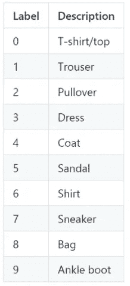
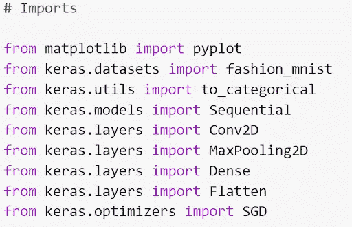
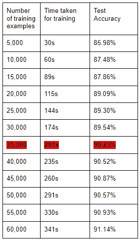

# 学习曲线图第 1 部分:对抗数据需求诅咒

> 原文：<https://towardsdatascience.com/learning-curve-graphs-part-1-countering-the-data-requirement-curse-6bdeb7750edf?source=collection_archive---------25----------------------->

## 为你的下一个 ML 项目避免基于试错的数据集大小估计。

克里斯·利维拉尼在 [Unsplash](https://unsplash.com?utm_source=medium&utm_medium=referral) 上的照片

广义地说，大多数机器学习算法属于两类之一:线性模型或非线性模型。[线性模型](https://uvastatlab.github.io/phdplus/linearmodel.html)易于解释，训练和部署速度更快，并且不需要过多的计算资源。线性模型学习并产生输入的加权和，加上偏差(截距)项，从而将单个输入特征 X 映射到单个目标 f(X)。

作者图片

# 线性与非线性

然而，现实世界的挑战是复杂的，很少有线性的投入产出关系。因此，虽然线性模型简单且易于实现和集成，但它们通常无法充分模拟真实世界的系统。因此，这一缺点要求我们将注意力转向非线性模型。虽然许多非线性机器学习模型用于解决复杂的现实世界问题，但神经网络及其变体在广泛的应用中解决现实世界问题的能力越来越强，并迅速受到欢迎。神经网络(包含非线性激活函数)更具表现力，可以学习数据中的复杂模式和相关性，并且可以比线性模型更好地进行概括，但神经网络的这种高鲁棒性和高性能，像其他非线性模型一样，也有一个代价:数据需求诅咒。

大多数算法，尤其是神经网络及其变体，被设计成对它们被训练的数据集的底层分布进行建模。这些算法有数百万个可训练的参数，一旦学习，将识别训练数据集中的模式和趋势。不管训练数据集本身有多大，它仍然只是所有可能实例的子集——总体。随着总体复杂性和/或算法复杂性的增加，我们需要越来越多的数据点来可靠地估计潜在的分布。考虑两个例子:1 .一个模型被训练来区分生产装配线上的彩色盒子，比如红色、绿色和蓝色盒子。模型被训练来区分人体中的组织以辅助手术。我们可以做出一个有根据的猜测，第二种情况与第一种情况相比，需要更多的数据点来可靠地估计潜在的分布，这仅仅是因为数据中可能的变化和波动。一个小的数据集对于潜在的趋势可能是误导性的或者不具有代表性的。

# **数据集大小**

由于研究社区和对机器学习解决方案日益增长的兴趣，我们看到了高质量基准数据集的数量、数据质量和注释质量的显著增长，但这些基准数据集中的数据点数量从几千到数百万个数据点不等。此外，随着迁移学习和[数据扩充](https://innotescus.io/data-cleaning/stretching-your-dataset-with-data-augmentation/)等强大技术的引入，对巨大数据集的需求正在下降。然而，问题仍然存在:我们需要多少数据来训练一个健壮的机器学习解决方案？

## 你可能会出于多种原因问自己这个问题:

1.  数据收集:你可能还没有收集数据，需要知道收集足够的数据来训练一个高性能的 ML 模型所需的价格和时间。
2.  数据扩充:您可能已经收集了一些数据，并且需要知道需要扩充多少数据集。
3.  历史数据:您可能已经有了一个大型数据集，并且需要知道最佳的数据集大小，以减少您的计算和存储成本。
4.  迁移学习:你可能已经有了一个训练好的模型，并且想把这个模型应用到一个“类似的”问题上，只需要尽可能少的再训练。

在所有这四种情况下，知道所需的数据集大小成为一个瓶颈。从一个问题到下一个问题，所需的数据集大小是变化的，并且与问题的复杂性和所选择的训练算法相关。坏消息是，目前没有办法 100%准确地确定这一点。真实世界的数据有很多噪音和变化，这使得很难完美地对训练数据集进行采样。除此之外，环境的变化、数据收集传感器的波动、日志记录错误、数据损坏和存储错误，都使得了解确切的所需数据集大小变得不可能。这是否意味着我们应该继续增加数据集的大小，希望它能提高模型的性能和健壮性？幸运的是，有更聪明、更简单的方法来处理这个瓶颈。一种这样的方法是使用学习曲线图。

# 学习曲线图

粗略定义的学习曲线图是相对于受控参数的模型性能随经验或时间的曲线图。学习曲线图通常被用作诊断工具，以评估模型在受控参数变化时的增量性能。学习曲线图的应用非常广泛，因为它们也可以用来估计所需的数据集大小。在这种情况下，受控参数将是数据集大小。下图显示了在这样的学习曲线图中，你通常可以期望看到什么。

作者图片

# 模型性能

ML 模型的性能最初通常会随着数据集的大小而增加。换句话说，随着数据集大小的增加，模型会学习并更新其对潜在趋势的估计。在某些时候，模型的性能会达到饱和，添加更多的数据并不会导致性能的显著提高。当模型性能饱和时，我们可以潜在地假设普通人群和训练数据集现在具有非常相似的基础分布。因此，进一步计算和存储的成本回报递减。我们的目标是使用学习曲线图和插值技术来估计目标性能值所需的数据集大小，或者找到最大性能的饱和点。在第 2 部分中，我们将看到这种方法在 MNIST 时装数据集和学习曲线图实验中的应用。

# 学习曲线图第二部分:实验

在第 1 部分中，我们讨论了非线性机器学习模型的数据需求诅咒。我们看到，我们可以使用学习曲线图来估计目标性能的数据集大小。在第 2 部分中，我们将使用一个基准数据集来设计这个实验:Fashion-MNIST。[时尚-MNIST](https://www.kaggle.com/zalando-research/fashionmnist) 数据集包含来自 10 个班级的 60，000 幅时尚和服装项目的训练图像(和 10，000 幅测试图像)。每个图像都是标准化的灰度图像，28×28 像素(总共 784 个像素)。这是一个比 MNIST 数字更具挑战性的分类问题，顶级结果是通过深度学习卷积神经网络实现的，在测试数据集上的分类精度约为 90%至 95%。每个训练和测试示例都被分配到以下标签之一:

作者图片

下图显示了我们将在实验中使用的时尚 MNIST 数据点的一些例子。

作者图片

我们的目标是看看我们是否可以复制一个图表来验证我们的学习曲线假设，并估计可接受的模型性能所需的最小数据集大小(尽可能接近最高结果)。

# 投入到实验中

我们将使用 [Google Colab](https://colab.research.google.com/notebooks/intro.ipynb?utm_source=scs-index#recent=true) (python 3)来设计我们的实验，并使用 [keras](https://keras.io/) API 来访问时尚-MNIST 数据集并定义我们的 CNN 架构。首先，让我们看看这个实验需要的导入。

作者图片

我们使用 matplotlib 库来满足我们的显示需求，使用 keras 来访问时尚 MNIST 数据集和创建我们的 CNN 架构。接下来，让我们定义 3 个函数调用，使我们的代码模块化，让我们的生活更轻松。

1.  **准备用于训练和评估的数据集:**

作者图片

首先，我们改变数据点的形状，使它们具有单一的颜色通道，然后我们将标签转换为用于训练的一键编码。最后，数据集中的每个像素的值都在 0-255 之间。我们需要将这些值从无符号 int 转换成 float32，并将这些值规范化为 0–1。

2 **。创建 CNN 架构:**

作者图片

在这个实验中，我们将使用一个非常简单的序列模型。该模型将具有 32 个 3×3 卷积滤波器，具有 RELU 激活。卷积图层之后是 2x2 maxpooling 图层，其输出将被展平以提供分类器的要素。然后，我们将使用具有 100 个节点的密集层来解释特征。最后，我们将使用另一个具有 10 个节点的密集层来表示 10 个类，并将 softmax 激活作为分类器。

所有层将使用权重初始化方案来播种权重。我们将使用保守学习率为 0.01、动量为 0.9 的随机梯度下降作为优化器，类别交叉熵作为损失函数。请记住，所有这些参数都是可配置的，并且为了有一个好的模型，首先需要这些参数。像自动驾驶和语音识别这样更复杂的问题将需要非常复杂的模型，但因为我们的问题陈述相对简单，所以我们使用的是相对简单的网络。

3.**训练并评估模型:**

作者图片

我们的最后一个功能将训练和评估模型。这一步是旅程中最重要的部分，但也是最容易理解的。我们首先使用模型定义来创建我们的 CNN 架构，然后使用 model.fit 来训练它，最后使用 model.evaluate 来评估训练的模型。在这个实验中，我们选择使用 32 的批量大小，并训练模型 10 个时期。

就是这样。我们有了运行学习曲线图实验的所有构件。让我们首先使用整个 60，000 张图像作为训练数据，以了解模型在最大数据集大小下的基准性能。我们将使用它来对我们的模型进行基准测试，并运行实验来查看在保持可比性能的同时我们可以减少多少数据利用率。

要运行这个实验，我们需要做的就是使用 keras 数据集访问时尚 MNIST 数据集，然后准备我们的数据进行训练，最后训练和评估模型，如下所示。

作者图片

一旦我们完成培训和评估，我们应该会看到类似如下的结果:

作者图片

在我们的运行中，我们观察到每个纪元运行大约需要 34 秒。这意味着我们在 60，000 张图像上训练这个模型的总时间大约是 340 秒。该训练在 10，000 个图像测试集上产生大约 91%的分类准确度。不算太糟吧？现在，让我们看看我们可以消除多少数据来获得相当的性能。让我们从 5000 个训练图像开始，每次迭代再增加 5000 个。虽然有更好的方法来处理这个问题，但为了简单起见，我们将为每次迭代手动更改训练数据集的大小，如下所示。

作者图片

当使用这样的实验设置时，建议交叉检查类别不平衡，但是，我们不会在这个实验中包括这样的策略。当我们从 keras 加载数据集时，它已经被打乱了。在这个实验中，由于数据集的简单性，我们将依赖于初始混洗和使用类别交叉熵损失来处理由采样引起的类别不平衡。

现在，让我们来看看在仅使用 5000 个训练图像的情况下，我们的模型性能是什么样的。

作者图片

我们观察到，在大约 30 秒的训练时间内，分类准确率为 86%——训练时间减少 11 倍，准确率降低 5%。在任何一天，这都将是一个很好的权衡，但是，我们的目标是看看在减少训练数据的情况下，我们可以在多大程度上接近我们模型的最大性能。下表和相应的曲线图显示了训练示例、训练时间和模型性能之间的映射。

作者图片

作者图片

从上表中，我们可以说 35，000 个训练图像是一个很好的价值权衡。对于 0.91%准确度的损失，这提供了训练数据需求的大约 42%的减少和训练时间的 41%的减少。您的用例的适当权衡是主观的，应该基于项目管理目标。

现在，这一切都很棒，但是如果我们一开始就没有 60，000 张图片呢？我们能估计数据集大小和性能之间的映射吗？是啊！这就是推断的由来。假设您只有 30，000 张图像，并且想要了解理论上的权衡，以了解还需要收集或扩充多少数据。这意味着您只有上表中前 6 个条目的数据(您总是可以获得更细粒度的数据，以便更好地播种插值算法)。随着样本数量的增加，从现有值外推学习曲线图将给出模型性能的适当估计。因此，我们可以估计目标性能的近似数据集大小要求。在下面的例子中，使用 scipy 的 interpolate 库，我们可以估计模型在不久的将来的性能，具有相当的准确性(90.16%的估计值对 90.23%的实际值)。

作者图片

那么坏处是什么呢？好吧，有许多外推法。我们假设学习曲线图遵循二次曲线，但我们可能会看到一个放大的快照。此外，你想估计的距离越远，你的预测就越不准确；外推只是一个简单的估计，可以给你一个大概，但不能保证 100%的准确性。

学习曲线图极大地帮助我们根据目标性能、所需资源和项目编译时间来估计所需的数据集大小，但它们仍然只是估计。研究人员还使用类似于[统计学习理论](https://en.wikipedia.org/wiki/Statistical_learning_theory)、幂律函数估计和类比估计的技术来计算目标模型性能所需的粗略数据集大小。然而，学习曲线图仍然是帮助开发人员理解和确定项目范围的一种强大且相对简单的方法，因此他们可以更仔细地研究项目。