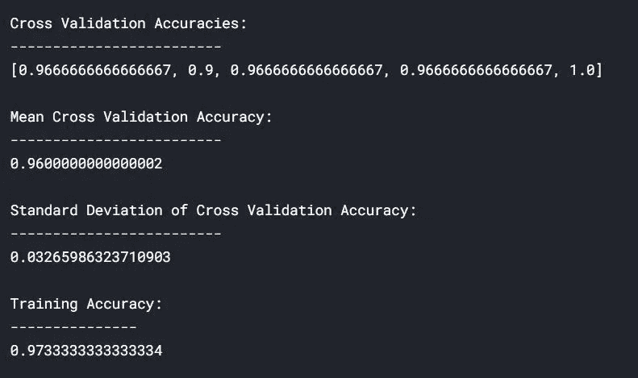
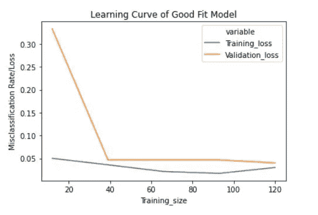
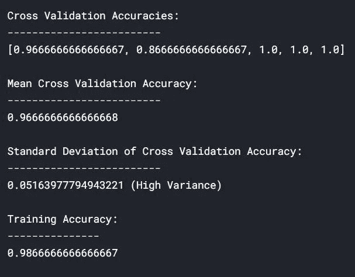
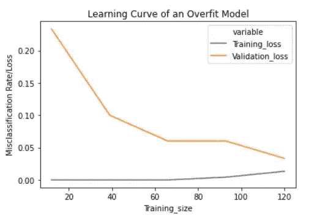
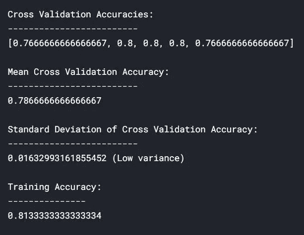
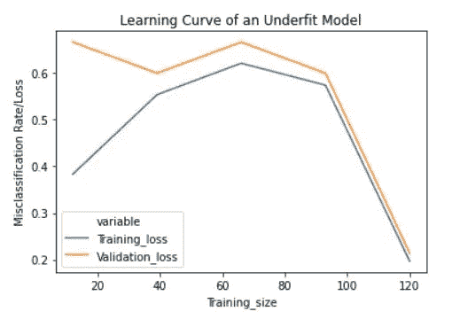
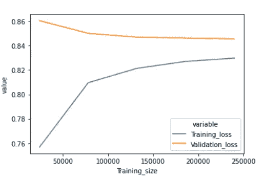

# 识别机器学习中过拟合和欠拟合的学习曲线

> 原文：<https://towardsdatascience.com/learning-curve-to-identify-overfitting-underfitting-problems-133177f38df5?source=collection_archive---------1----------------------->

本文讨论了机器学习中的过拟合和欠拟合，以及使用学习曲线来有效地识别机器学习模型中的过拟合和欠拟合。

图片由[克里斯里德](https://unsplash.com/@cdr6934?utm_source=medium&utm_medium=referral)在 [Unsplash](https://unsplash.com/?utm_source=medium&utm_medium=referral) 上拍摄

# 过度拟合和欠拟合

## 过度拟合(又名方差):

如果一个模型对数据进行了过度训练，以至于它甚至可以从中学习噪声，那么这个模型就被称为过度拟合。过度拟合模型完美地学习了每一个例子，以至于它错误地分类了一个看不见的/新的例子。对于过度拟合的模型，我们有完美/接近完美的训练集分数，而测试/验证分数很差。

## 过度拟合背后的原因:

1.  使用复杂模型解决简单问题，从数据中提取噪音。示例:将神经网络拟合到 Iris 数据集。
2.  小数据集，因为训练集可能不是宇宙的正确表示。

## 欠拟合(又名偏差):

如果一个模型不能正确地学习数据中的模式，那么它就被认为是不合适的。欠拟合模型不会完全了解数据集中的每个示例。在这种情况下，我们看到训练集和测试/验证集的得分都很低。

## 不合身背后的原因:

1.  用一个简单的模型来解决一个复杂的问题，这个模型不需要学习数据中的所有模式。示例:使用逻辑回归进行图像分类
2.  底层数据没有固有的模式。比如，用一个学生父亲的体重来预测他的分数。

# 学习曲线介绍

学习曲线通过递增地添加新的训练样本来绘制训练样本的训练和验证损失。学习曲线有助于我们确定添加额外的训练示例是否会提高验证分数(在看不见的数据上的分数)。如果模型过度拟合，则添加额外的训练示例可能会提高模型在看不见的数据上的性能。类似地，如果一个模型不合适，那么添加训练样本也没有帮助。“learning_curve”方法可以从 Scikit-Learn 的“model_selection”模块导入，如下所示。

在本文中，我们将使用逻辑回归来预测“虹膜数据”的“种类”。我们将创建一个名为“learn _ curve”*的函数，该函数的将逻辑回归模型拟合到 Iris 数据，并返回交叉验证分数、训练分数和学习曲线数据。*

# *良好拟合模型的学习曲线*

*我们将使用“learn_curve”函数，通过将逆正则化变量/参数“c”设置为 1 来获得良好的拟合模型(即，我们不执行任何正则化)。*

**

*作者图片*

*在上述结果中，交叉验证准确率和训练准确率接近。*

**

*作者图片*

## *解读培训损失*

*良好拟合模型的学习曲线在开始时具有适度高的训练损失，随着训练样本的增加，该损失逐渐减少，并且逐渐变平，这表明增加更多的训练样本不会改善模型在训练数据上的性能。*

## *解读验证损失*

*良好拟合模型的学习曲线在开始时具有较高的验证损失，随着训练样本的增加，验证损失逐渐减少，并且逐渐变平，这表明增加更多的训练样本不会提高模型在看不见的数据上的性能。*

*我们还可以看到，在添加了合理数量的训练样本后，训练和验证损失彼此接近。*

## *良好拟合模型的学习曲线的典型特征*

1.  *训练损失和验证损失非常接近，验证损失略大于训练损失。*
2.  *最初减少训练和验证损失，在某个时间点之后直到结束，训练和验证损失相当平稳。*

# *过拟合模型的学习曲线*

*我们将使用“learn_curve”函数，通过将逆正则化变量/参数“c”设置为 10000(高值“c”会导致过度拟合)来获得过度拟合模型。*

**

*作者图片*

*与欠拟合和良好拟合模型相比，交叉验证准确度的标准偏差较高。训练精度高于交叉验证精度，这是过度拟合模型的典型特征，但不会高到检测不到过度拟合。但是过度拟合可以从学习曲线中检测出来。*

**

*作者图片*

## *解读培训损失*

*过拟合模型的学习曲线在开始时具有非常低的训练损失，随着训练样本的增加，训练损失逐渐略微增加，并且不会变平。*

## *解读验证损失*

*过度拟合模型的学习曲线在开始时具有较高的验证损失，随着训练样本的增加，该损失逐渐减少，并且不会变平，这表明增加更多的训练样本可以提高模型在未看到的数据上的性能。*

*我们还可以看到，训练和验证损失彼此远离，在添加额外的训练数据后，它们可能彼此接近。*

## *过拟合模型学习曲线的典型特征*

1.  *训练损失和验证损失相距甚远。*
2.  *在添加训练样本时逐渐减少验证损失(没有拉平)。*
3.  *非常低的培训损失，在添加培训示例后略有增加。*

# *欠拟合模型的学习曲线*

*我们将使用“learn_curve”函数，通过将逆正则化变量/参数“c”设置为 1/10000 来获得一个欠拟合模型(“c”的低值导致欠拟合)。*

**

*作者图片*

*与过度拟合和良好拟合模型相比，交叉验证准确度的标准偏差较低。然而，欠拟合可以从学习曲线中检测出来。*

**

*作者图片*

## *解读培训损失*

*欠拟合模型的学习曲线在开始时具有较低的训练损失，该损失随着训练样本的增加而逐渐增加，并在结束时突然下降到任意的最小点(最小并不意味着零损失)。这种结尾的突然下跌可能不会一直发生。下图也显示了欠拟合。*

**

*作者图片*

## *解读验证损失*

*欠拟合模型的学习曲线在开始时具有较高的验证损失，该损失随着训练样本的增加而逐渐降低，并在结束时突然下降到任意最小值(这种在结束时的突然下降可能不总是发生，但它可能保持平坦)，这表明增加更多的训练样本不能提高模型在看不见的数据上的性能。*

## *欠拟合模型学习曲线的典型特征*

1.  *增加训练样本会增加训练损失。*
2.  *训练损失和验证损失在最后是接近的。*
3.  *培训损失和最终确认损失的突然下降(并非总是如此)。*

*上图清楚地表明，学习曲线是识别过拟合和欠拟合问题的有效方法，即使交叉验证指标可能无法识别它们。*