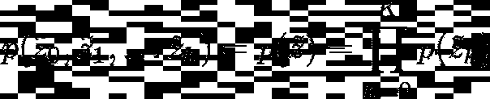
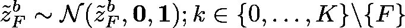

# 用可逆的(基于流的)解释网络学习解纠缠的表示

> 原文：<https://towardsdatascience.com/learning-disentangled-representations-with-invertible-flow-based-interpretation-networks-9954554a28d2?source=collection_archive---------11----------------------->

## 什么是解开的表征？我们如何使用基于流的生成模型来学习任何任意模型的不纠缠的表示？

图 1:IIN 网络可以应用于任意的现有模型。IIN 采用由任意模型学习的表示 z，并将其分解成更小的因子，使得每个因子学习表示一个生成概念。图片来源:[1]。

解开的表示在处理许多下游任务时会很有用，并有助于提高模型的健壮性和通用性。在本帖中，我们将探讨如何从使用基于流的生成模型的任意预训练模型所学习到的表示中学习解开的表示。具体来说，我们将研究埃塞等人在论文《用于解释潜在表征的解开可逆解释网络》中提出的可逆解释网络(IIN)。艾尔。[1].我们将看到 IIN 背后的想法，它们是如何工作的，它们的用途是什么。我们还将简要了解一下该文件所取得的成果。

# 解开的表象

一个不纠缠的表征是这样的，其中单个潜在单位的变化对一个生成因素的变化敏感，而对其他因素的变化保持不变[2]。换句话说，给定一个解开的表征，潜在单位的变化将导致一个生成因素的变化，反之亦然。

解开的表征在多种任务中是有用的，例如新样本生成、新颖性检测、学习压缩的表征等。良好的表示有助于模型的健壮性和通用性。除此之外，在需要知识转移的任务中，在学习的表示可以帮助模型快速收敛的情况下，如转移学习或领域适应，解开的表示也有帮助。

# 基于流程的生成模型

当我们观察 VAEs 和 GAN 这样的生成模型时，他们都没有明确地了解真实的数据分布 p( **x** )，因为 p(**x**)=∫p(|**z**)p(**z**)d**z**通常是难以处理的，因为我们不可能对 **z ~ p(z)** 的所有值进行积分。另一方面，基于流的生成模型能够通过使用标准化流来克服这个问题。

**标准化流程**:标准化流程通过应用一系列双射变换，一个在另一个之上，将简单的分布变换为更复杂的分布。双射函数也有一个反函数，这意味着我们可以计算正向和反向。

基于流的生成模型只是一系列标准化的流，一个堆叠在另一个之上。因为变换函数是可逆的，所以基于流的模型也是可逆的( **x → z** 和 **z →x)** 。

**情商。1: A 流程**

这里，**z0**是初始分布， **x = z_k** 是我们要学习的最终分布而 f_i(。)是一系列双射变换函数。

基于流量的模型允许我们直接优化数据的对数似然性，如下所示:

**情商。2:对数似然计算。**

这里π_ 0(z0)是初始分布。通常，选择变换使得对数行列式易于计算。

要了解更多关于基于流程的生成模型及其工作原理，请查看这篇令人惊叹的博客[帖子](https://lilianweng.github.io/lil-log/2018/10/13/flow-based-deep-generative-models.html)！

# 用于学习非纠缠表示的可逆解释网络

论文[1]背后的主要思想是学习非线性映射，该非线性映射将来自任意预训练模型的学习到的表示转换到一个空间，在该空间中，新的表示可以分解成因子，使得每个因子的表示对应于一个人类可理解的语义概念。为此，作者提出了一种基于流的可逆网络 **T** ，该网络学习从已学习的 larent 空间到新的、不纠缠的空间的映射(**图 1** ，即:

并且由于 **T** 是可逆的，所以反过来也是可能的:

为了获得一个清晰且可解释的空间，作者建议将 **Z~(读作 Z 颚化符)**分解为 **K+1** 个因子，其中每个因子代表一个可解释的概念。

**z ~的因式分解。z~被分解成 k 个因子，其中每个 z ~ k 是 N_k 维的。所有 k 的 N_k 总和为 n。**

这里使用基于流的可逆网络是有意义的，因为我们能够从 T: **z →z~** 以及 **z~ → z** 学习映射。这意味着，可逆模型 **T** 也应该允许我们通过修改解开空间中的单个因素 **z~_k** 来有意义地修改原始潜在表示 **z** 。

实现因子 **z~_k** 的解纠缠意味着对于所有 k，每个 **z~_k** 的分布彼此独立，并且所有 **z~_k** 的联合分布可以写成

情商。2:p(z ~)的因式分解。

每个因子 z ~ k 被模拟为一个单位高斯，因此联合分布成为

情商。3:联合分布 p(z~)

为了有解纠缠的因素，我们需要满足两个条件:
**【I)**每个 z~_k 应该只对一个可解释的概念敏感
**ii)** z~_k 应该对它不代表的所有其他概念不变。

这是通过查看成对的图像( **x** _a， **x_b** )来实现的。每个语义概念 **F ∈ {1，…，K}** 都用 **z~_F** 来表示。使用从 p(**x**a，**x**b | F)中提取的图像对(**x**a，**x**b)来训练每个 **z~_F** 。除了 **F ∈ {1，…，K}，**之外的所有其他语义概念的表示都是通过剩余因子 **z~_0 来学习的。**

给定共享相同概念的一对图像 **F** 和它们的表示 **z~^a** 和 **z~^b** (来自可逆模型的图像的表示)，我们需要确保两个图像的 f 因子的表示是相似的。为此，将图像 b 的 F 因子作为以图像 a 的 F 因子为中心的高斯:

**情商。4**

正相关因子σ_ab ∈ (0，1)控制 **z~^a_F** 和 **z~^b_F** 有多接近/相似。

**ii)** 所有其他因素的表示是不变的(无相关性),并被建模为单位高斯分布:

**情商。5**

为了训练流动模型，我们最大化图像对( **z** _a， **z** _b)的原始表示的可能性。该对的可能性计算如下

**情商。6**

记录日志并应用 Eqs。2、4 和 5 到等式 6，我们得到损失函数:

**情商。7:一个图像对的丢失**

在哪里，

红框中的项对应于 p(z^a 的所有因子的对数似然)，
蓝框中的项对应于除 p(z^b 之外的所有因子的对数似然)，
绿框中的项对应于图像 b 的因子 f 的对数似然，

T( **z** ^j_k) = z~_k

总损失是图像对在所有因子 F 上的损失:

**情商。8:全损耗功能**

## 估计每个因素的维度

在 IIN 模型中，我们将潜在的 **z~** 分解为 K+1 个因子(残差+ K 个因子)，其中 K 个因子中的每一个都可以具有不同的维度，条件是所有维度的总和等于 **z~** 的总和。

通过计算每个因素的分数来估计每个因素的维度。因子 f 的分数被计算为所有图像对之间的原始表示的相关性的总和( **z** ^a， **z** ^b) ~ p( **z** ^a， **z** ^b|F)，即，

**情商。9:每个因素的得分。**

剩余因子被赋予分数 **N** (尺寸 **z** )。那么每个因素的维数估计为:

**情商。10:每个因子的估计维度。**

# 结果

## 交换解开的因素

图 2:将目标图像(最左边一列)的残差( **z~** _0)与目标图像(最上面一行)的动物类别因子( **z~** _1)相结合。图片来源:[1]。

在图 2 中，将目标图像(最左边的列)的残差( **z~** _0)与目标图像(最上面的行)的动物类别因子( **z~** _1)相结合，导致在结果图像中动物类型的转移，同时保持源图像的姿态。

图 3:沿着语义轴 F → F~沿着微笑因子插值。图像来源:[1]

在 CelebA 数据集上沿着微笑的语义轴进行插值时，可以看到该模型能够控制微笑的数量，同时保持其他因素相对恒定。关于如何执行插值的更多信息可以在[1]中找到。

# 密码

论文的代码可以在这里找到[。](https://github.com/CompVis/iin)

# 结论

在本文中，我们讨论了什么是无纠缠表示及其用途，然后简要地研究了基于流的生成模型是如何工作的。我们还深入研究了可逆解释网络。IIN 是一个强大的网络，可以在任何预训练的网络上使用，以学习从原始表示到解开的表示的映射。利用基于流的模型的可逆性，该模型还可以用于任意修改解开的因子 **z~** _k，以实现原始表示中语义上有意义的改变。

页（page 的缩写）s:如果您发现任何错误/问题，请留下评论，我将很乐意修复它们！:)

# 参考

[1] Esser，Patrick，Robin Rombach 和 Bjorn Ommer。"一个用于解释潜在表征的解开的可逆解释网络."IEEE/CVF 计算机视觉和模式识别会议文集。2020.

[2]本吉奥、库维尔和文森特。表征学习:回顾与新观点。在 *IEEE 模式分析汇刊&机器智能*，2013。